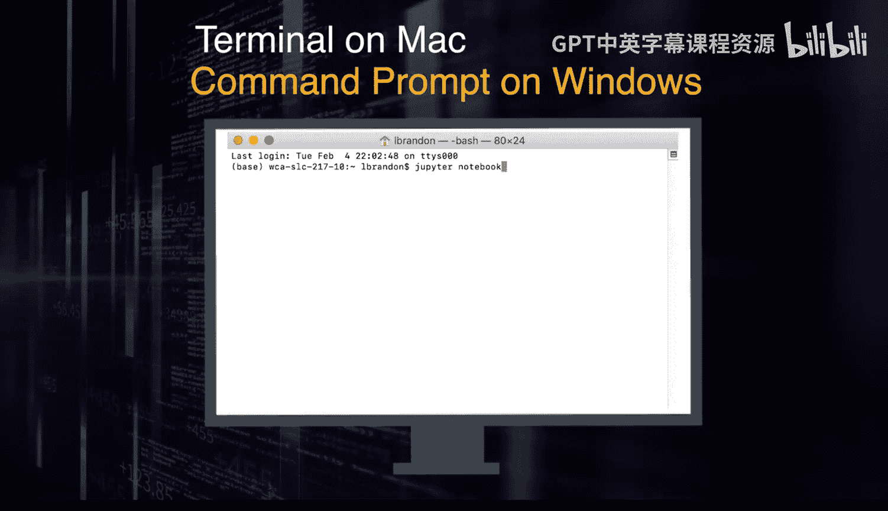

# 宾夕法尼亚大学《Python和Java编程入门1-2｜Introduction to Programming with Python and Java》中英字幕 p109 03_01_01_下载与安装Jupyter-Notebook.zh_en -BV13E421M7FF_p109-

To get started， we'll use Jupiter notebookbook to write and run Python code。

 Jupiter Note runs in a browser on your computer and includes an interactive Python interpreter and script editor。

😡，To install， download Ananaconda， a data science platform。

This will install Python and Jupiter notebook all at once。To run。

 open terminal on a Mac or the command prompt on Windows and run Jupiter notebook。

You can also launch Jupiter notebook from the Anaconda Navigator。

