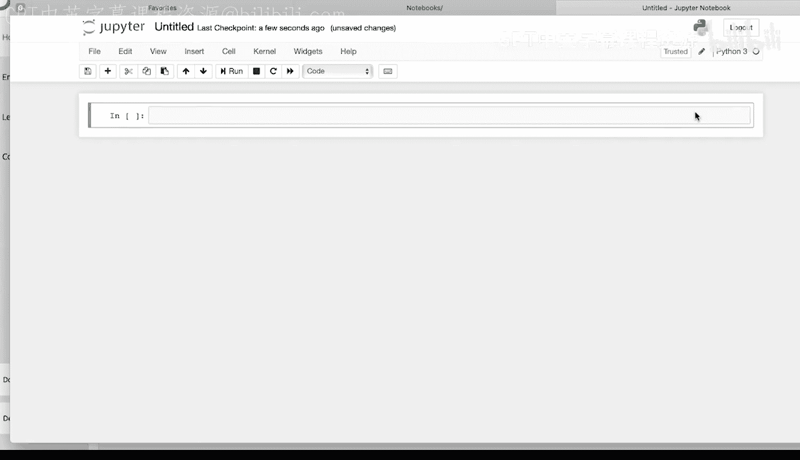
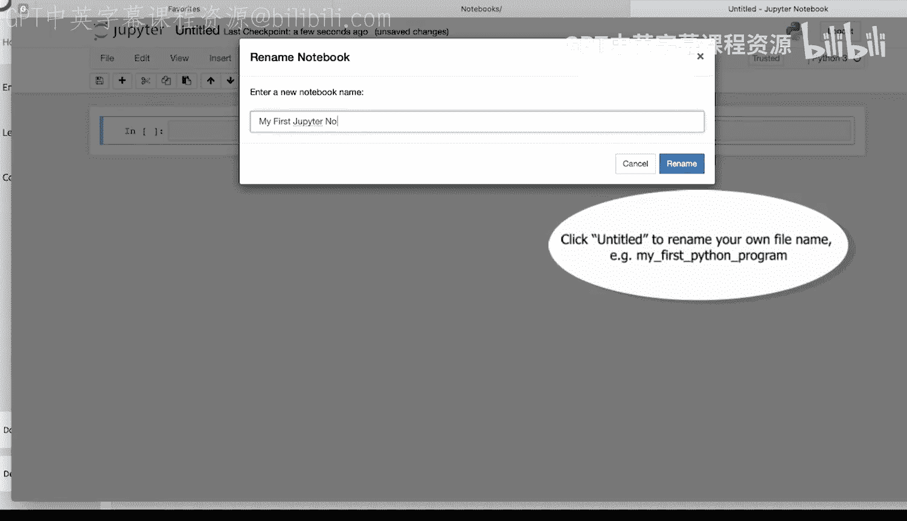
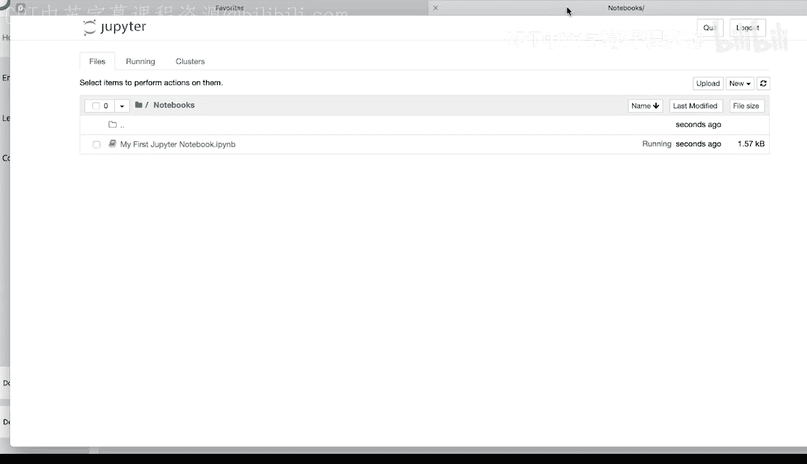
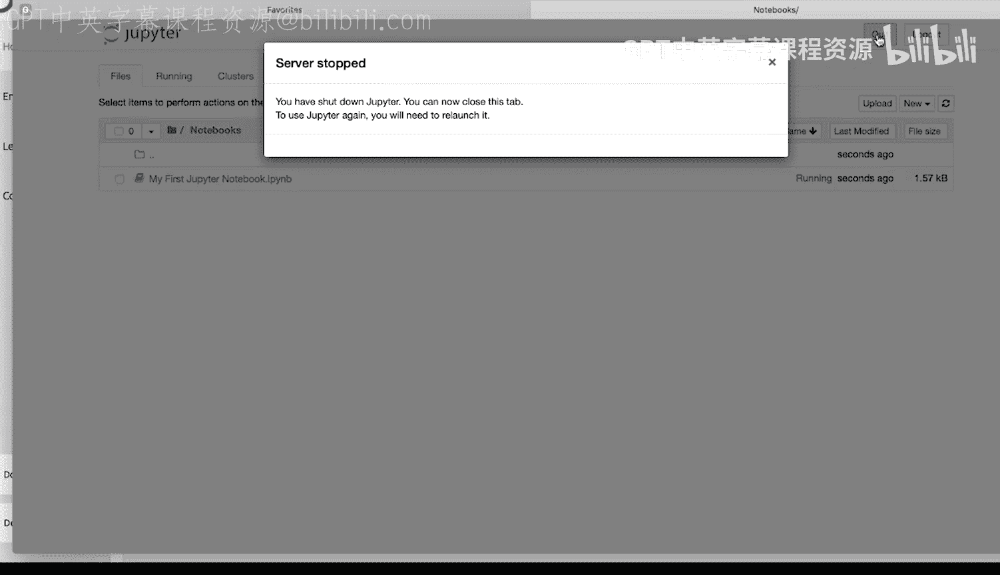

# 宾夕法尼亚大学《Python和Java编程入门1-2｜Introduction to Programming with Python and Java》中英字幕 p110 04_01_02_使用Jupyter-Notebook.zh_en -BV13E421M7FF_p110-

Once you download and install Ananaconda， you can launch Jupiter notebook book in a couple of different ways。

 The easiest way is to open up Anaconda Navigator on your computer。

And then launch Jupiter notebook using the launch button。

This will launch Jupiter notebook in your default browser。You can navigate to a folder。

Where you want to create and save your notebook files。To create a notebook。

Click on the new button in the upper right hand corner。

Select the most recent version of Python should be Python 3。

This will create your first notebook file。To rename it， click on the title at the top。

Type in a name， click Rename。You're going to write and run Python code inside of the cells。

So I'm going to type print。Hello， world。To run my code， I can click。Control， return。

That will run the code in the cell。In this case， it's going to print hello world to the console。

 Or I can click shift return that will run the code in the cell and then create a new cell underneath。

I'm going to hit shift return。Again， it runs the code in that cell。

 printing Hello world again to the console and then creates a new cell below。

If I want to manually create a new cell， I can select a cell by clicking on the left side of it and press the a button on my keyboard。

 A will insert a cell above。And then if I select the cell by clicking on the left side。

 I can press B on my keyboard that will insert a cell below。And run that。If I want to delete a cell。

 I can click on the cell on the left side to select it and press D D to delete a cell。

These notebook files save automatically， but if I want to manually save。

 I can click the save button on the left hand side。To exit Jupyter notebook。

 you can close your notebook file。

And then click the quit button in the upper right hand corner。

This will stop the server and exit Jupyter notebook。

