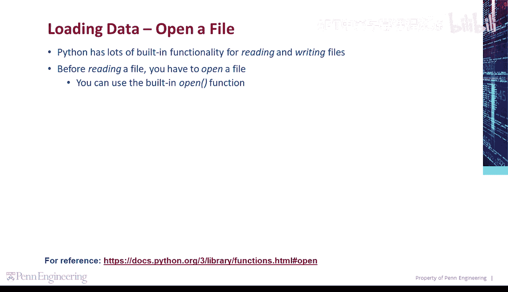
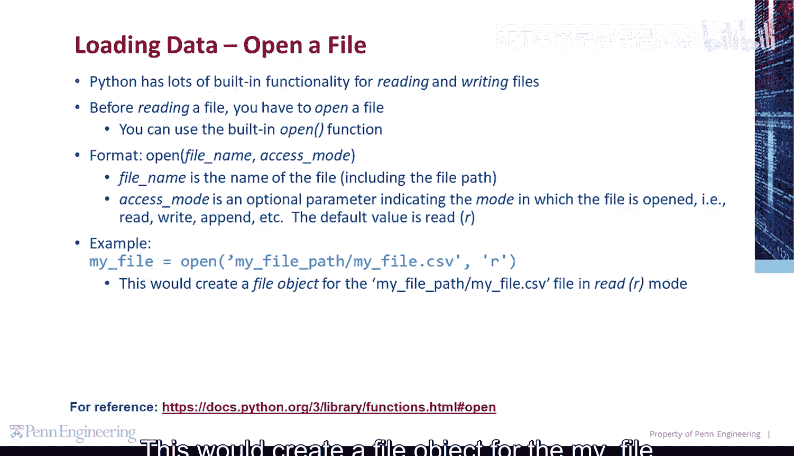
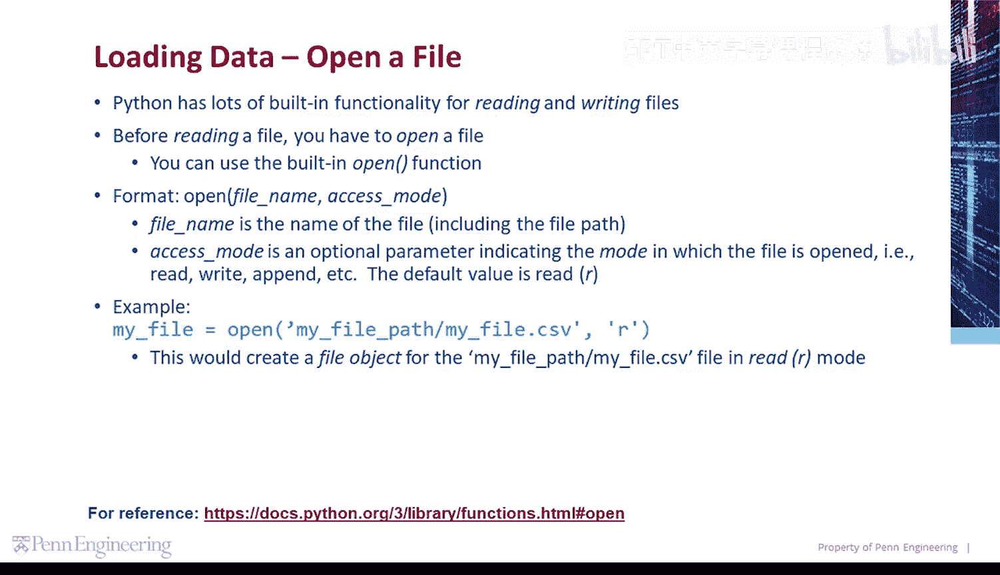
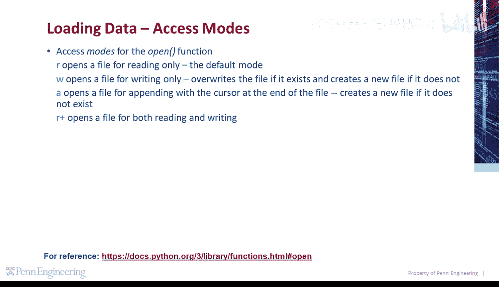
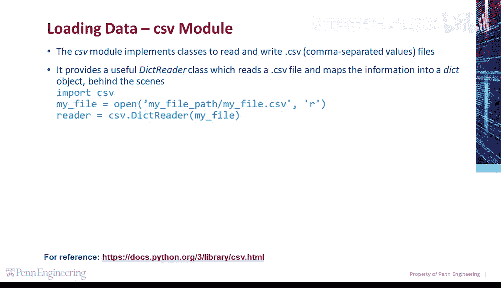
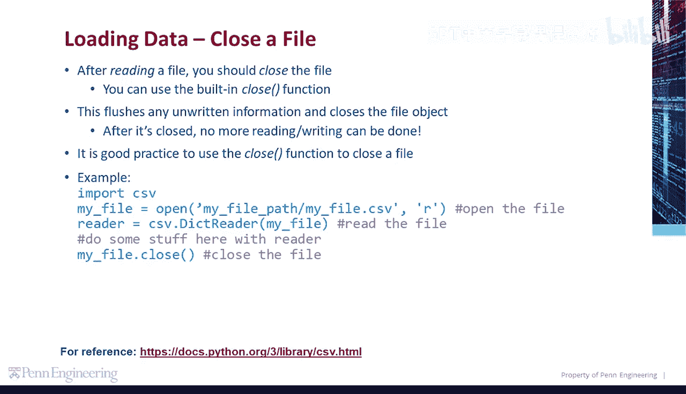
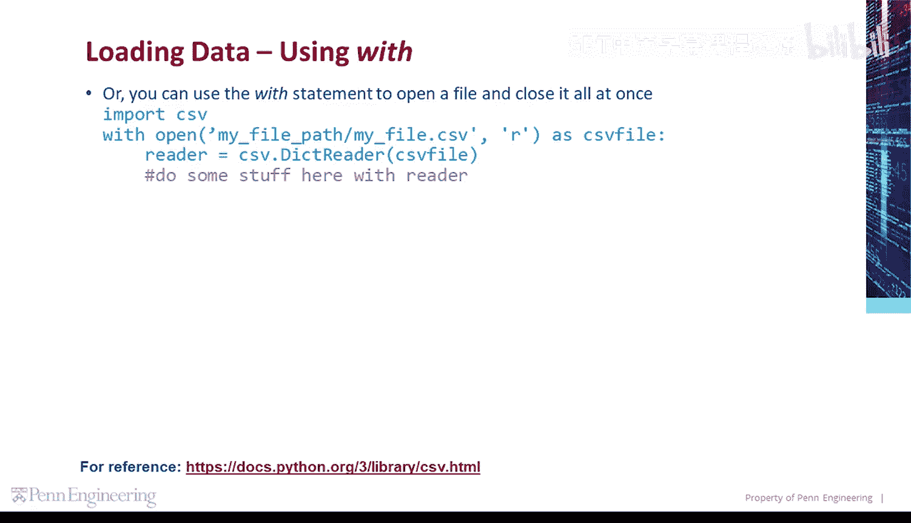
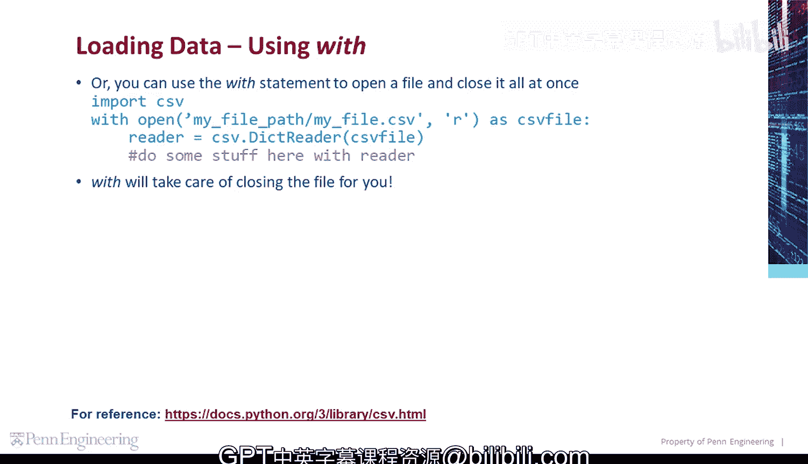

# Python与Java编程入门1-2：05_01_03：导入与读取文件-使用CSV模块 📂



在本节课中，我们将要学习如何使用Python内置的功能来读取和写入文件，特别是如何使用`csv`模块来处理CSV格式的文件。我们将从打开文件的基本操作开始，逐步深入到使用`csv.DictReader`类来读取数据。

## 打开文件

在读取文件之前，必须先打开文件。Python提供了内置的`open()`函数来完成这个操作。

其格式如下：
```python
open(fname, access_mode)
```
其中，`fname`是文件名，包括文件路径。`access_mode`是一个可选参数，用于指定文件的打开模式，例如“只读”或“写入”。默认模式是“只读”（`'r'`）。






例如，以下代码以只读模式打开位于`my_file_path`路径下的一个CSV文件：
```python
file = open('my_file_path/my_file.csv', 'r')
```
这行代码会为`my_file.csv`文件创建一个文件对象，并设置为只读模式。

## 文件访问模式

打开文件时，可以指定以下几种访问模式：
*   `'r'`：以只读模式打开文件。这是默认模式。
*   `'w'`：以只写模式打开文件。如果文件已存在，则覆盖它；如果文件不存在，则创建新文件。
*   `'a'`：以追加模式打开文件。光标位于文件末尾，如果文件不存在则创建新文件。
*   `'r+'`：以读写模式打开文件。



## 使用CSV模块读取文件

`csv`模块提供了用于读写CSV（逗号分隔值）文件的类。其中，`csv.DictReader`类非常有用，它能将CSV文件中的信息读取并映射到一个字典对象中。

以下是使用`csv.DictReader`的基本步骤：
1.  导入`csv`模块。
2.  使用`open()`函数以只读模式打开目标文件。
3.  调用`csv.DictReader()`并传入文件对象，它会返回一个可用于读取文件中数据的reader对象。

示例代码如下：
```python
import csv
file = open('data.csv', 'r')
reader = csv.DictReader(file)
```



## 关闭文件

文件读取完毕后，应当将其关闭。可以使用内置的`close()`函数。这个操作会刷新所有未写入的信息并关闭文件对象。文件关闭后，就无法再进行读取或写入操作。养成使用`close()`函数关闭文件的习惯是良好的编程实践。

例如：
```python
import csv
file = open('data.csv', 'r')
reader = csv.DictReader(file)
# ... 处理数据的其他操作 ...
file.close()  # 关闭文件对象
```



## 使用with语句自动管理文件

为了确保文件总能被正确关闭，可以使用`with`语句。它能在代码块执行完毕后自动关闭文件，无需手动调用`close()`。

以下是使用`with`语句的示例：
```python
import csv
with open('data.csv', 'r') as csv_file:
    reader = csv.DictReader(csv_file)
    # ... 处理数据的其他操作 ...
# 当代码块执行完毕，文件会自动关闭
```



## 总结



本节课中我们一起学习了Python文件操作的基础知识。我们了解了如何使用`open()`函数以不同模式打开文件，重点介绍了如何使用`csv`模块的`DictReader`类来方便地读取CSV文件数据。我们还强调了使用`close()`函数手动关闭文件的重要性，并学习了使用`with`语句来自动管理文件资源，这是一种更安全、更简洁的做法。掌握这些内容是进行数据处理和分析的重要第一步。