# Python和Java编程入门1-2：06：编码演示-分析史上最伟大的500张专辑 🎵

在本节课中，我们将学习如何使用Python的CSV模块来加载和分析一个数据集。我们将以《滚石》杂志评选的“史上最伟大的500张专辑”列表为例，学习如何读取CSV文件、查看数据结构、提取特定信息以及使用列表推导式进行高效的数据筛选。

## 概述数据集

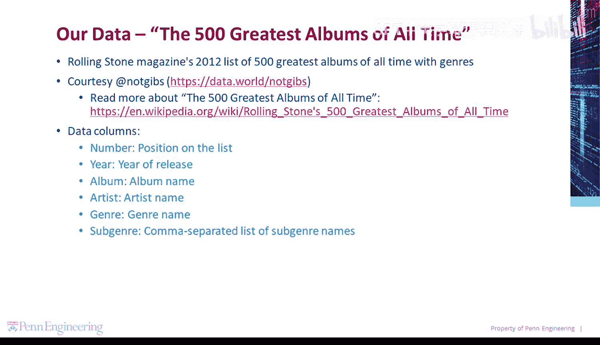

我们将分析的数据集是《滚石》杂志2012年评选的“史上最伟大的500张专辑”列表，其中包含了专辑的流派信息。数据文件包含以下列：
*   `number`：专辑在榜单上的排名。
*   `year`：专辑的发行年份。
*   `album`：专辑的名称。
*   `artist`：艺术家的名称。
*   `genre`：专辑的主要流派名称。
*   `subgenre`：一个由逗号分隔的子流派名称列表。

## 加载和读取CSV文件

首先，我们需要导入`csv`模块并使用它来读取我们的数据文件。

以下是加载和读取CSV文件的基本步骤：
1.  导入`csv`模块。
2.  使用`with`语句和`open()`函数以读取模式打开文件。
3.  使用`csv.DictReader()`将文件内容读取为一个字典阅读器。

```python
import csv

with open(‘album_list.csv‘, ‘r‘) as csv_file:
    reader = csv.DictReader(csv_file)
    print(type(reader))
    print(reader.fieldnames)
```

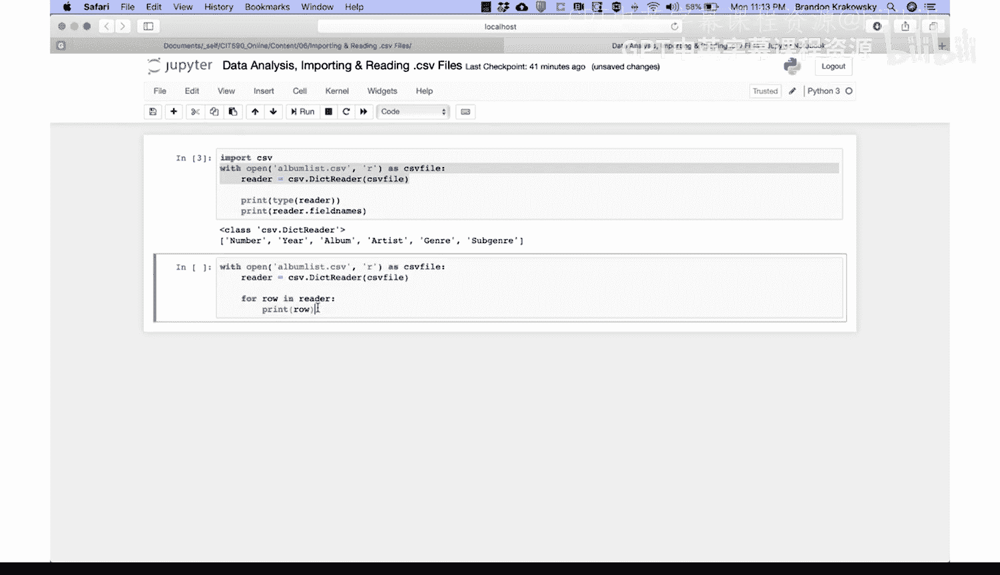

运行这段代码后，我们会看到`reader`的类型是`csv.DictReader`，并且打印出了文件的所有列标题。

## 遍历并打印数据行

上一节我们介绍了如何加载文件，本节中我们来看看如何查看文件中的具体数据。我们可以使用`for`循环来遍历字典阅读器并打印每一行数据。

```python
with open(‘album_list.csv‘, ‘r‘) as csv_file:
    reader = csv.DictReader(csv_file)
    for row in reader:
        print(row)
```

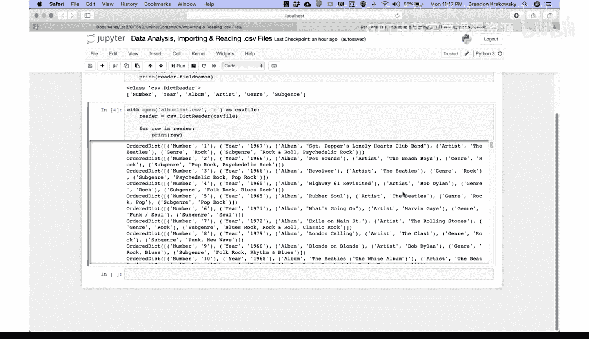

这段代码会打开文件，将其加载到阅读器中，然后遍历并打印文件中的每一行。每一行数据都会以一个有序字典的形式显示，其中包含列名和对应的值。

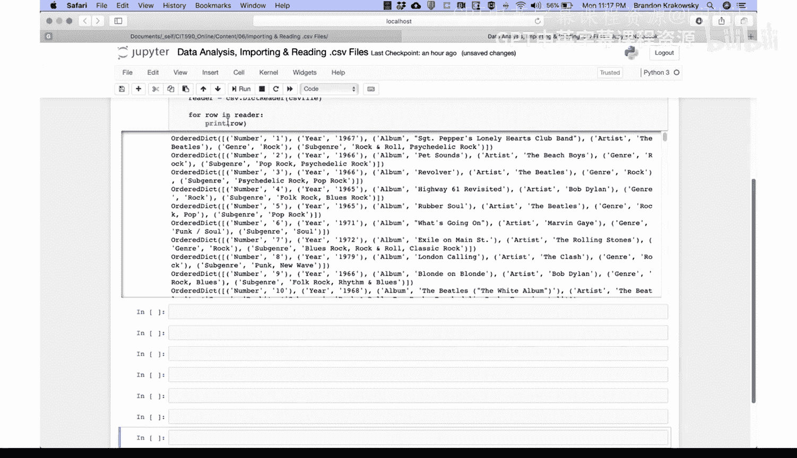

**重要提示**：默认情况下，`csv.DictReader`对象只能被迭代一次。这是因为它是直接从文件流中读取数据，而不是将整个数据集加载到内存中。目前，最简单的解决方案是每次需要使用时都重新加载文件。

## 打印前100行数据

有时我们只需要查看数据集的一部分。以下是如何使用循环和控制语句来打印前100行数据。

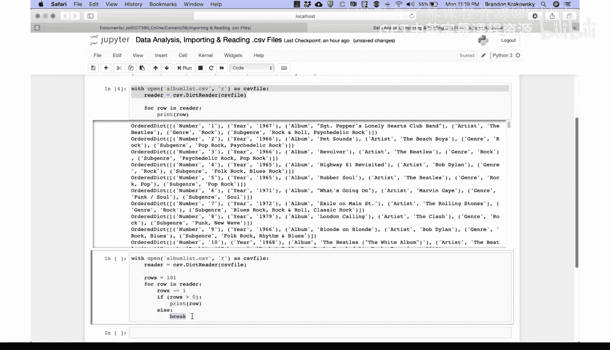

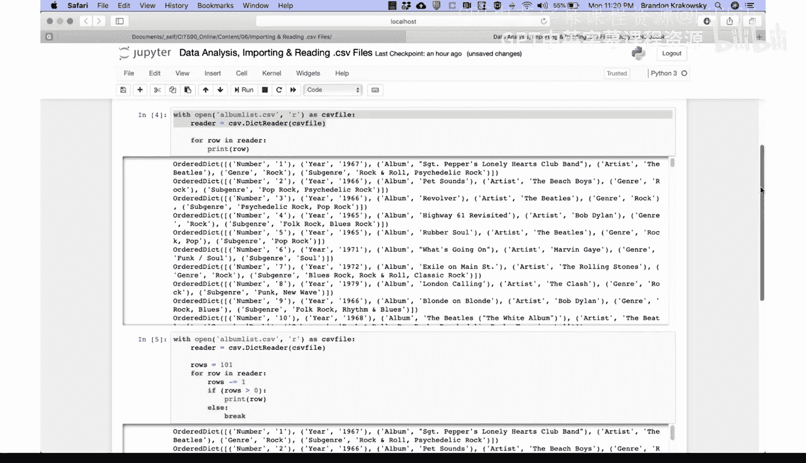

```python
with open(‘album_list.csv‘, ‘r‘) as csv_file:
    reader = csv.DictReader(csv_file)
    rows_to_print = 100
    for row in reader:
        rows_to_print -= 1
        if rows_to_print >= 0:
            print(row)
        else:
            break
```

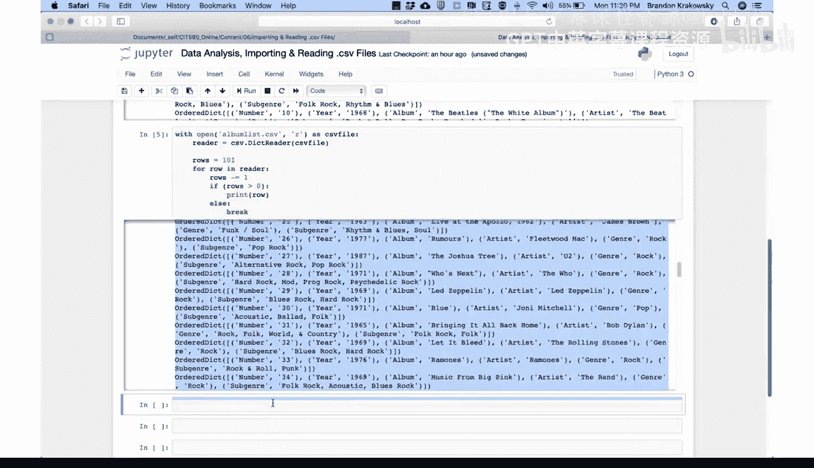

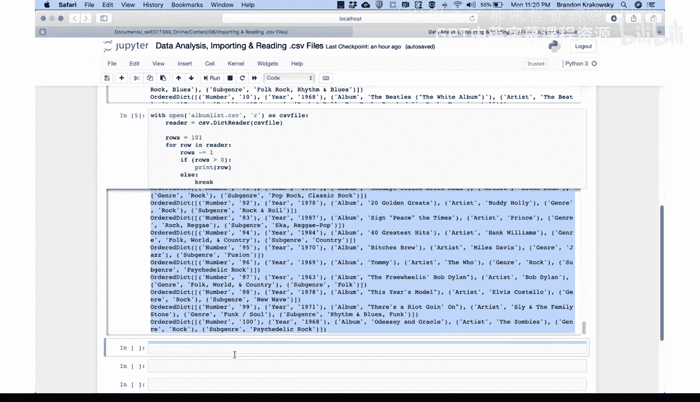

这段代码会重新加载文件，设置一个计数器，然后遍历阅读器。每打印一行，计数器减1。当计数器小于0时，循环终止。这样我们就只看到了前100行数据。

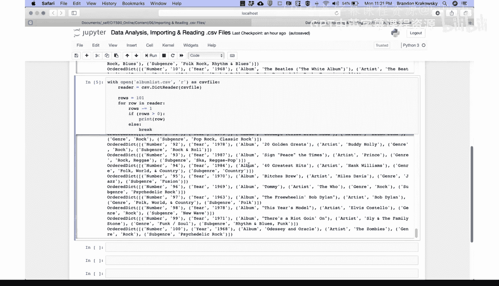

## 将数据复制到列表

为了更方便地进行后续分析，避免反复读取文件，我们可以将数据从字典阅读器复制到一个Python列表中。

以下是具体步骤：
1.  打开文件并加载到阅读器。
2.  创建一个空列表。
3.  遍历阅读器，将每一行数据（字典）添加到列表中。

```python
albums = []
with open(‘album_list.csv‘, ‘r‘) as csv_file:
    reader = csv.DictReader(csv_file)
    for row in reader:
        albums.append(row)

print(f“Number of albums: {len(albums)}“)
```

运行后，我们会看到列表`albums`的长度是500，与文件中的行数一致。现在，我们可以直接使用`albums`列表进行后续的所有分析。

## 使用列表推导式筛选数据

列表推导式是Python中一种优雅且简洁的创建新列表的方法。它由一个表达式和一个`for`循环组成，放在方括号内。其含义是：为循环的每一次迭代执行某个操作，并将结果添加到新列表中。

让我们使用列表推导式来找出所有在1974年发行的专辑。

```python
albums_1974 = [row for row in albums if row[‘year‘] == ‘1974‘]
print(f“Number of albums in 1974: {len(albums_1974)}“)
```

这段代码会遍历`albums`列表中的每一行（`row`），检查其`year`字段是否等于字符串`‘1974‘`，如果是，则将该行添加到新列表`albums_1974`中。最后打印出新列表的长度。

结果显示有14张专辑在1974年发行。我们可以进一步打印这些专辑的详细信息：

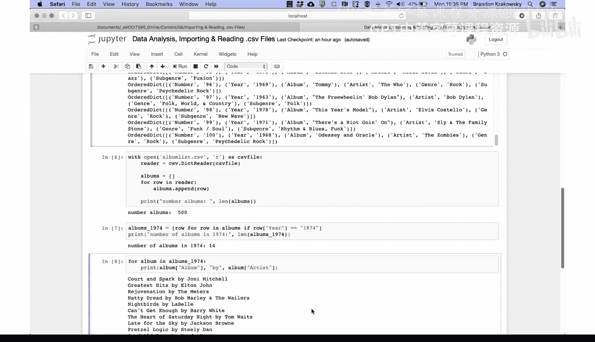

```python
for album in albums_1974:
    print(album[‘album‘], “by“, album[‘artist‘])
```

如果我们只想查看1974年专辑列表中的前10张，可以在列表推导式的结果上使用切片操作：

```python
first_10_1974 = [row for row in albums if row[‘year‘] == ‘1974‘][:10]
print(first_10_1974)
```

## 进行复杂条件筛选

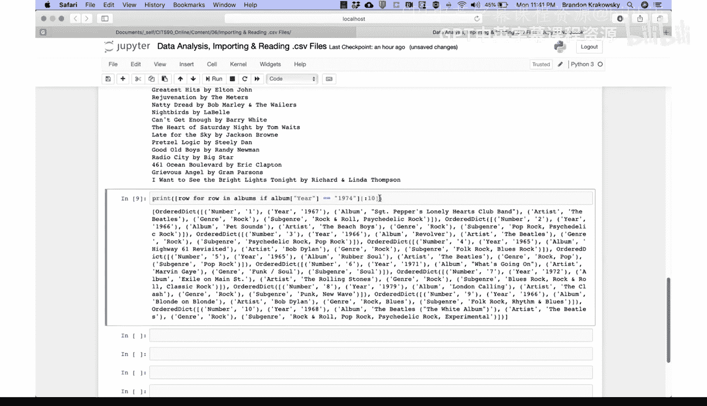

现在，让我们进行一个更复杂的筛选：找出所有主要流派（`genre`）为“Rock”，并且子流派（`subgenre`）列表中包含“Pop Rock”或“Fusion”的专辑。

这需要我们检查列表类型的字段。以下是实现方法：

```python
rock_albums = []
for row in albums:
    if row[‘genre‘] == ‘Rock‘ and (‘Pop Rock‘ in row[‘subgenre‘] or ‘Fusion‘ in row[‘subgenre‘]):
        rock_albums.append(row)

for album in rock_albums:
    print(album[‘album‘], album[‘artist‘], album[‘genre‘], album[‘subgenre‘])
```

这段代码的逻辑是：遍历`albums`列表中的每一行，如果该行的`genre`字段等于`‘Rock‘`，**并且**其`subgenre`字段（一个字符串）中包含子串`‘Pop Rock‘`**或**`‘Fusion‘`，则将该行添加到`rock_albums`列表中。最后，遍历并打印出筛选结果中每张专辑的名称、艺术家、流派和子流派。

**请注意**：原描述中`subgenre`是“逗号分隔的列表”，在CSV文件中通常作为一个字符串读取（例如`“Pop Rock, Blues Rock“`）。因此，代码中使用`in`操作符检查子字符串是否存在于这个字符串中。如果`subgenre`字段在读取时已被正确解析为Python列表，则应使用`‘Pop Rock‘ in row[‘subgenre‘]`的语法。

## 总结

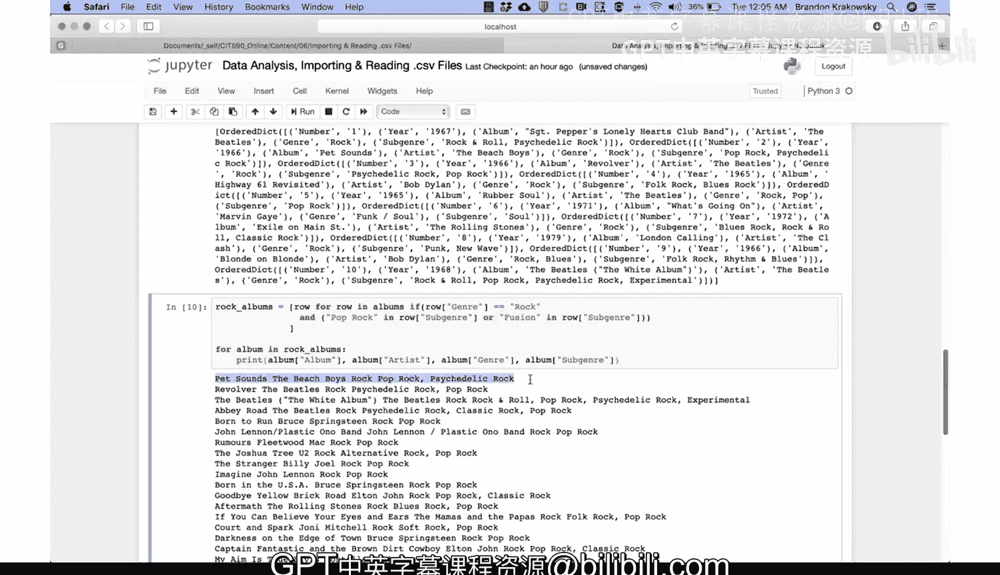

本节课中我们一起学习了使用Python `csv`模块进行数据分析的基础操作。我们掌握了如何加载CSV文件、查看其结构和内容、将数据转换为更易操作的列表形式，以及使用`for`循环和列表推导式根据特定条件（如年份、流派）来筛选数据。这些技能是处理表格数据并进行初步探索性分析的核心。通过分析“史上最伟大的500张专辑”这个有趣的数据集，我们实践了从数据加载到信息提取的完整流程。