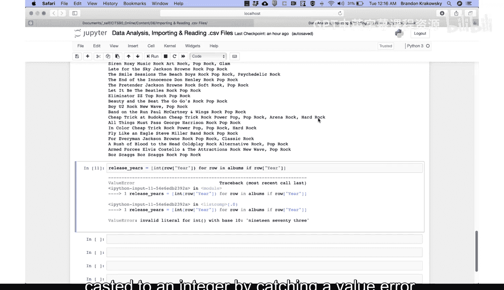
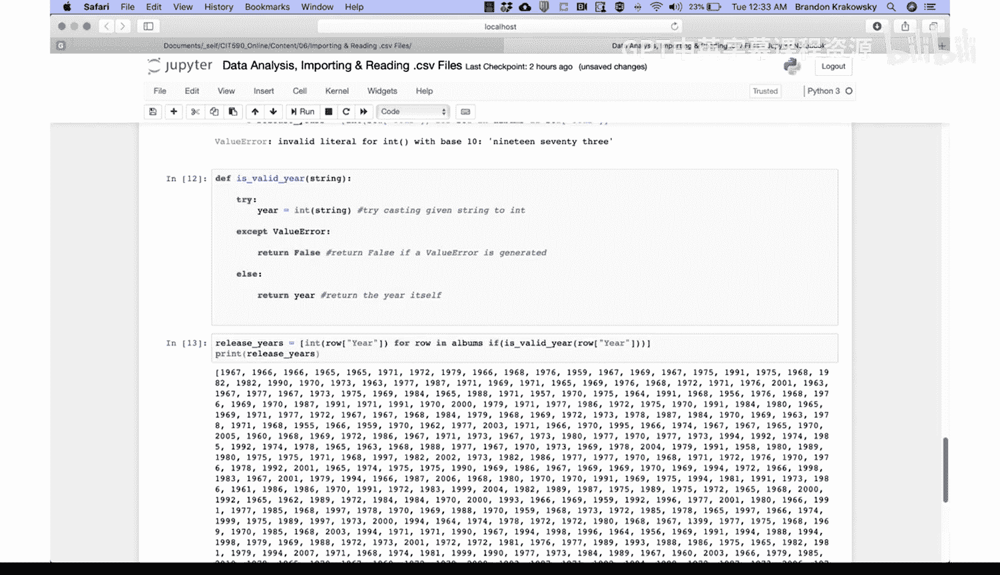
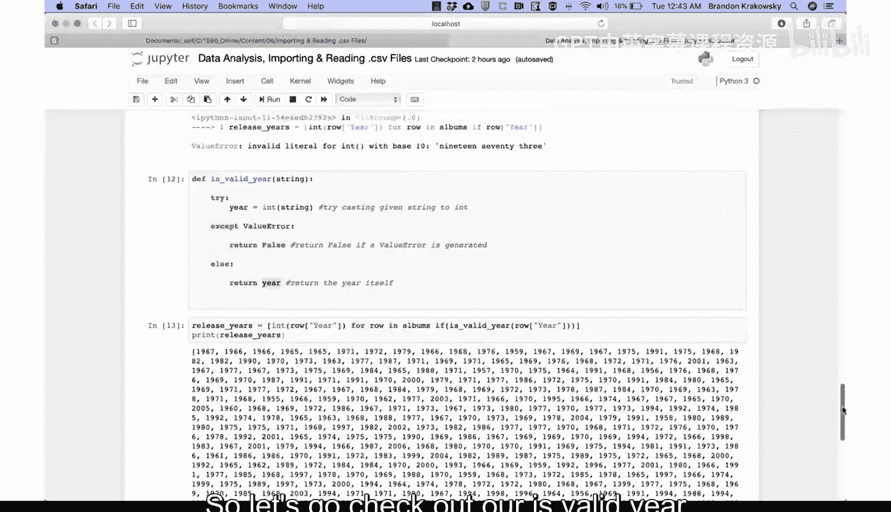
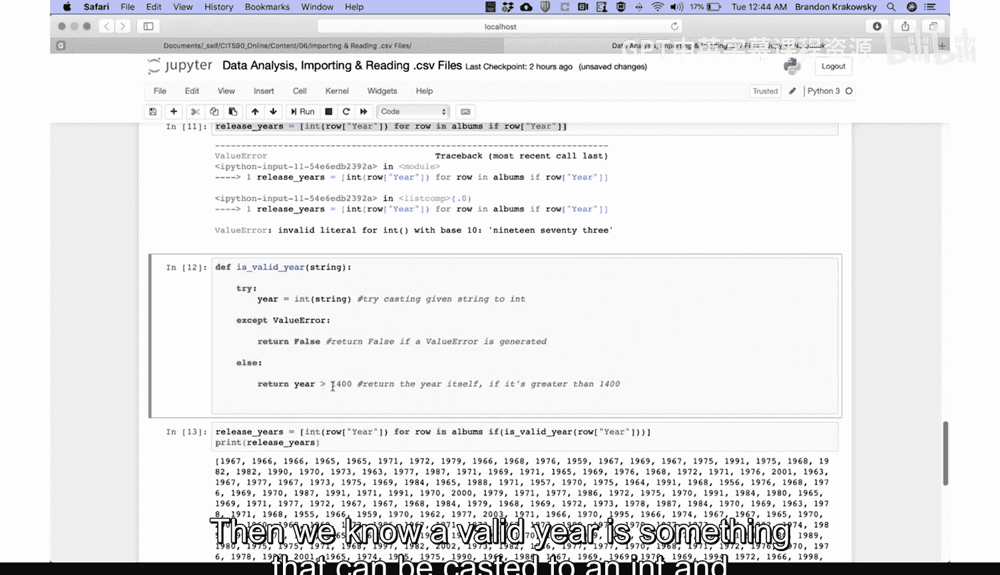
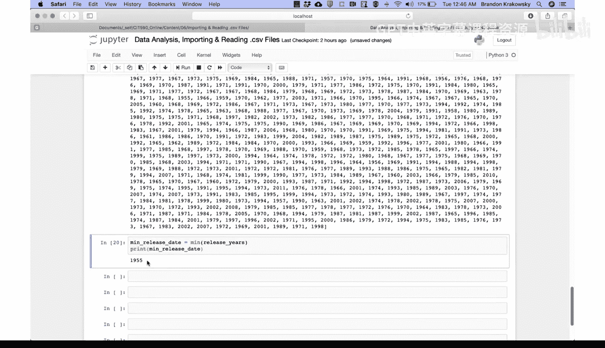
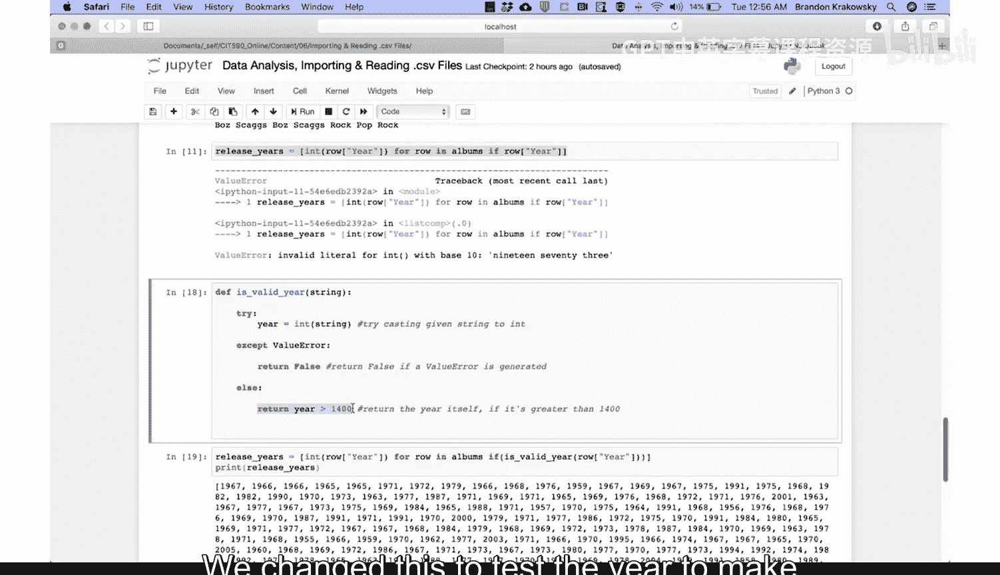
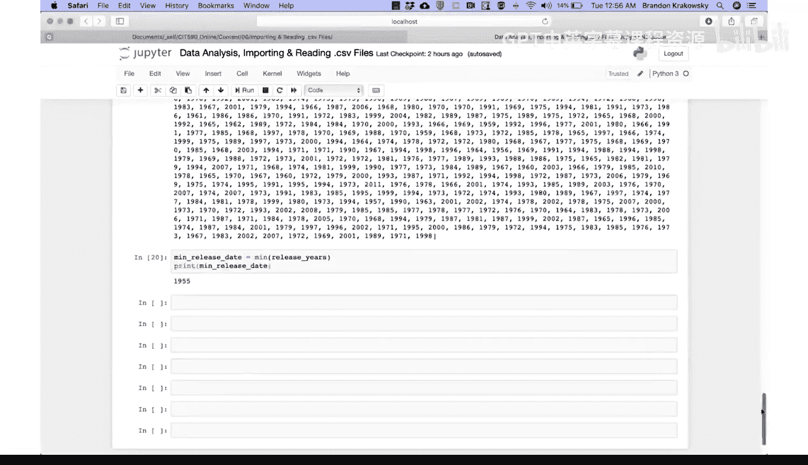
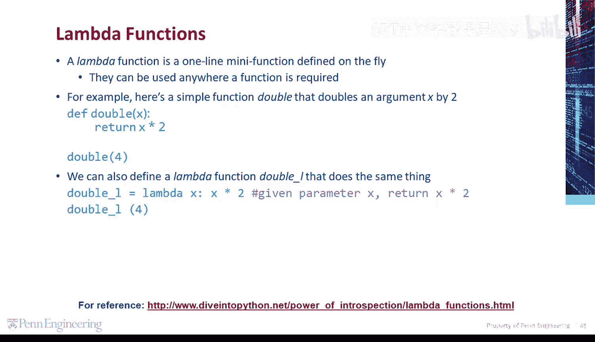
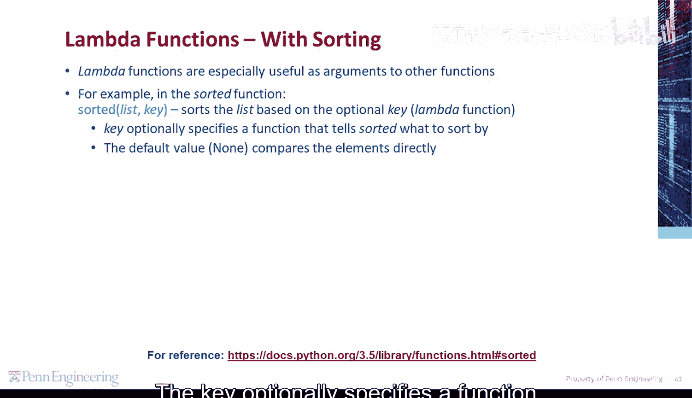
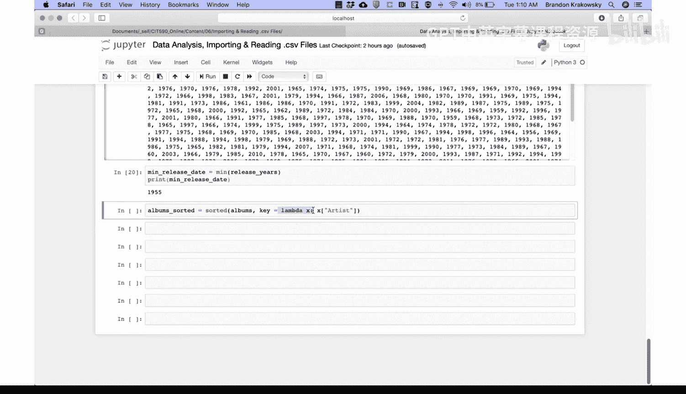

# 宾夕法尼亚大学《Python和Java编程入门1-2｜Introduction to Programming with Python and Java》中英字幕 p113 07_01_02_编码演示-捕获数据错误与排序.zh_en -BV13E421M7FF_p113-

What's the earliest release year for any album in our data set。First。

 let's get a list of release years casting each to an integer。We'll call it release years。

 We'll set that to a list。 Start with our for loop for each row in albums。If the year value exists。

 let's cast it to an int。Cast to an int。The year。😔，Value。😔，So for each row and our albums list。

Where the year exists， we're going to cast it to an integer。And add it to the new list。

 called releasease yearss。And by cast， we mean convert from one data type to another。 In this case。

 we're taking the year value， which is a string by default， and we're casting it to an integer。

 So we'll have a list of integers。So let's run our code。 and what happens is we get a value error。

Invalid literal for int with base 10。 That means one of our values is not numeric and can't be casted to an integer。

That means there's some value for the year column in our data that's not numeric and can't be casted Rather than try to figure out what it is。

 Let's just account for it and ignore it。So rather than try to find the nonnumeric value in our data。

 let's go ahead and just ignore it。 Let's write code to do that。

We're going to define a function that checks if a particular value can be casted to an integer by catching a value error。

So let's define our function。 And Python， we do that with the D EF keyword。

 we'll call the function is。Valid year for some given string。In the function。

 we're going to try some code， meaning the code could fail。 createate a variable year。

 We're going to try to cast the given string to an int。Try casting， given string to int。

If the code in the tribe block fails， let's go ahead and catch the particular error that's being caused。

In the accept block， the particular error is value error。

 If we try to cast something to an int that can't be casted to an int。 We'll get a value error。

In which case will return false because the provided year is not valid。

So we're going to return false if a value error。Is generated。Else or otherwise。

 let's just return the casted year itself。 Re the year。Itself。

Then we're going to use this is valid year function to eliminate values that don't have a valid year。

Now we're going to use this as valid year function to eliminate values that don't have a valid year。

So let's go ahead and just run this function。So I'm going to rewrite my code to generate the list of release years。

 So release。Years equals a list。 again， list comprehension for each row in albums if。

Is valid year from the。Year column， if that's valid， then we can go ahead and cast it。

 We know we can。So， we'll cast the。😔，Your column， given the row。😔，So again。

 for each rowow and albums， if the year value for that album is valid。

 meaning it can be casted to an int， go ahead and cast it to an int and add it to our new list。

 release yours。Now let's just print release years。Print， release。Years。😔，Our code。

There we have it。 That's the list of valid release years。

Now let's go ahead and print the minimum release date， print and release date。

So let's go ahead and run our code， we could see that the minimum release date is 1399。

 that's not really a valid year in our data set， so let's go ahead and make an adjustment to our Is valid year function。

So let's go check out our I valid year function。 If we scroll up， here it is。

 we're going to make one adjustment here when we return the year。

Let's only return true if the year is greater than 1400 will hard code that value return the year itself。

 if it's greater。Then。1400， then we know a valid year is something that can be casted to an int and is greater than 1400。

And let's go ahead and rerun our function definition。

 then let's rerun our code that populates the release years。List。😔，Printnt that。

 and then let's print the minimum release date。 And now the minimum release date is 1955。

 much better。

So again， what would we do in our is valid year function here。

 We change this to test the year to make sure that it's greater than 1400 before confirming that it's valid。

A lambmbda function is a one line mini function defined on the fly。

 It can be used anywhere a function is required。 For example。

 here's a simple function double that doubles an argument X by 2。We define double。

 for given x and return x times 2。If we call double with an argument of 4， we'll get 8。

We can also define a lambda function double underscore L that does the same thing。

Double L equals lambda for a given parameter X returning x times 2。

 If we call double underscore L with an argument of 4， we'll get 8。

Lambda functions are especially useful as arguments to other functions。 For example。

 in the sorted function， this sorts the list based on the optional key or Lambda function。

 The key optionally specifies a function that tells sorted what to sort by。

What if we want to sort our albums by artist？We can use the sorted function with a Lambda function。

Let's create a variable。 Als， sorted equals。The sorted function。

 and we're going to sort the list albums， and we're going to use the key parameter specifying a Lambda function。

The Lambda function is going to tell Python which column to sort by。Lambda。

 meaning here comes a function for a given x， which is the row。 It should return。Artist。

We're going to sort the albums using the key parameter， which specifies a lambda function。

The lambda function， given parameter X， which is the row。

 is going to use the artist column to compare。

