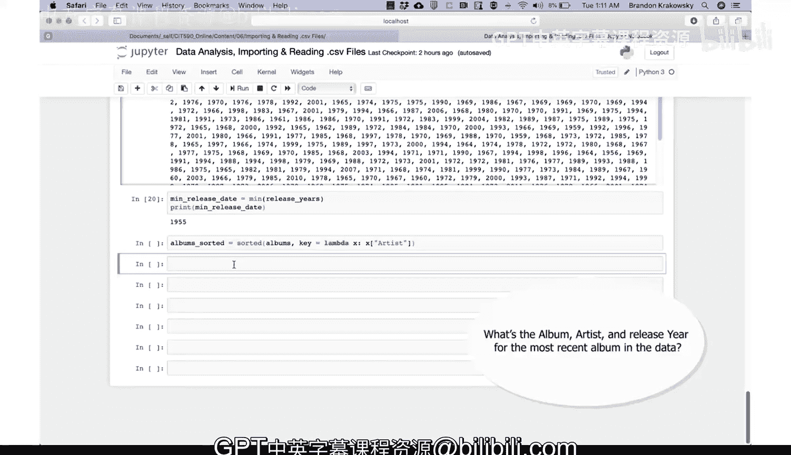
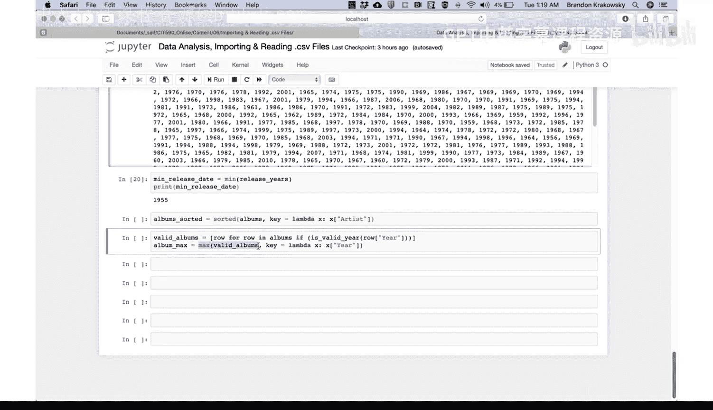
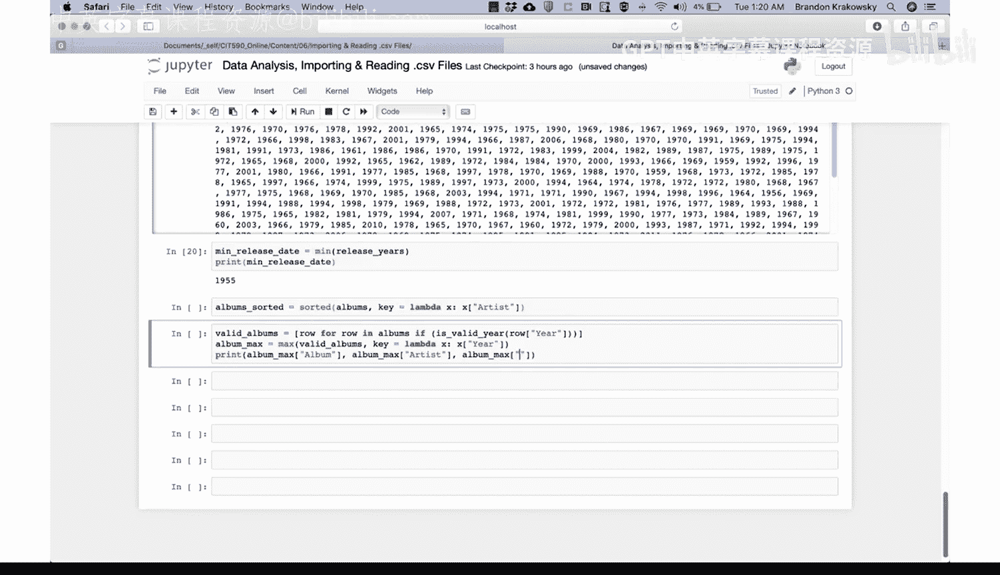
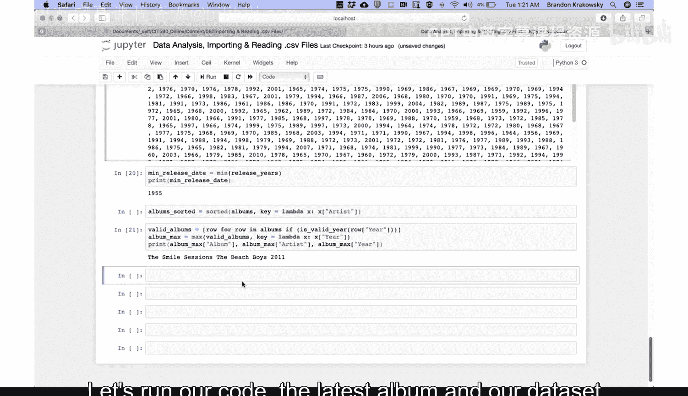
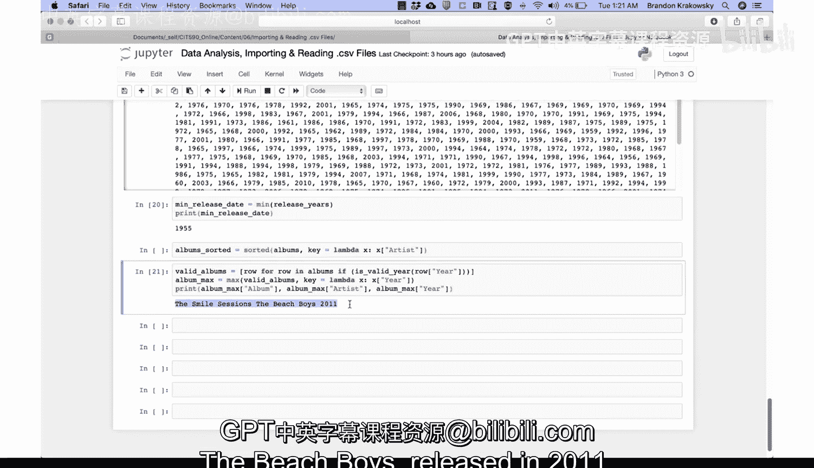

# Python和Java编程入门1-2：08_01_04：编码演示-计算最大值与最小值 🎯



在本节课中，我们将学习如何使用Python从数据集中找出最新的专辑。我们将通过过滤无效数据、使用`max()`函数以及`lambda`表达式来实现这一目标。

## 概述与数据准备

首先，我们需要从数据集中找出发行年份最晚的专辑，并输出其专辑名、艺术家和发行年份。由于部分专辑的发行年份数据可能无效，我们的第一步是过滤掉这些无效数据。

以下是具体步骤：我们将创建一个名为`valid_albums`的列表，其中只包含发行年份有效的专辑。我们使用列表推导式来实现这一点，对`albums`列表中的每一行数据，调用`is_valid_year`函数检查其年份是否有效。

```python
valid_albums = [row for row in albums if is_valid_year(row[‘year’])]
```

## 计算最新专辑

上一节我们介绍了如何过滤出有效的专辑数据。本节中，我们来看看如何从这些有效数据中找到发行年份最晚的专辑。

我们使用Python内置的`max()`函数来完成这个任务。`max()`函数可以接受一个`key`参数，该参数允许我们指定一个函数来决定比较的依据。在这里，我们使用`lambda`表达式来告诉函数，应该根据专辑的“year”字段来寻找最大值。

```python
album_max = max(valid_albums, key=lambda x: x[‘year’])
```

## 输出结果



在找到最新的专辑后，我们需要将其信息打印出来。

以下是需要打印的信息项：
*   专辑标题
*   艺术家
*   发行年份

对应的代码如下：
```python
print(album_max[‘title’])
print(album_max[‘artist’])
print(album_max[‘year’])
```



运行代码后，我们得到的结果是：数据集中最新的专辑是The Beach Boys在2011年发行的《The Smile Sessions》。



## 总结



本节课中我们一起学习了如何从数据集中计算最大值。我们首先过滤了无效的发行年份数据，然后利用`max()`函数配合`lambda`表达式作为`key`参数，成功地找出了发行年份最晚的专辑，并输出了它的详细信息。