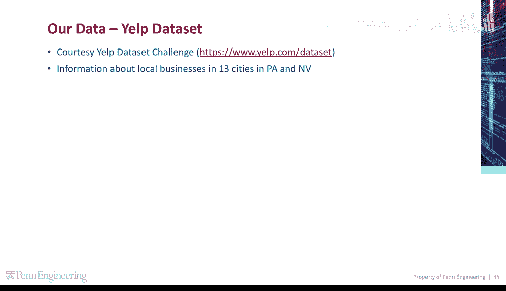
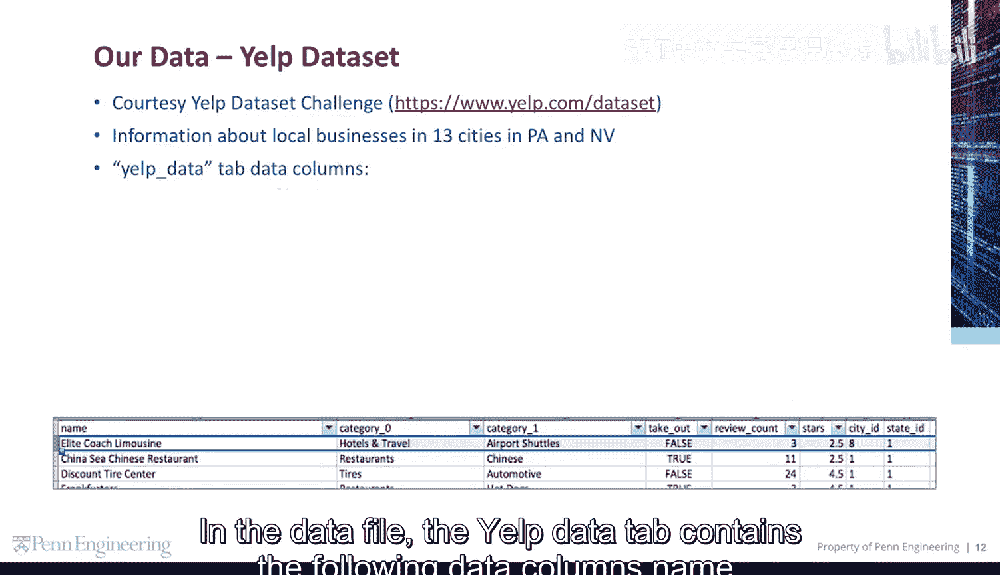
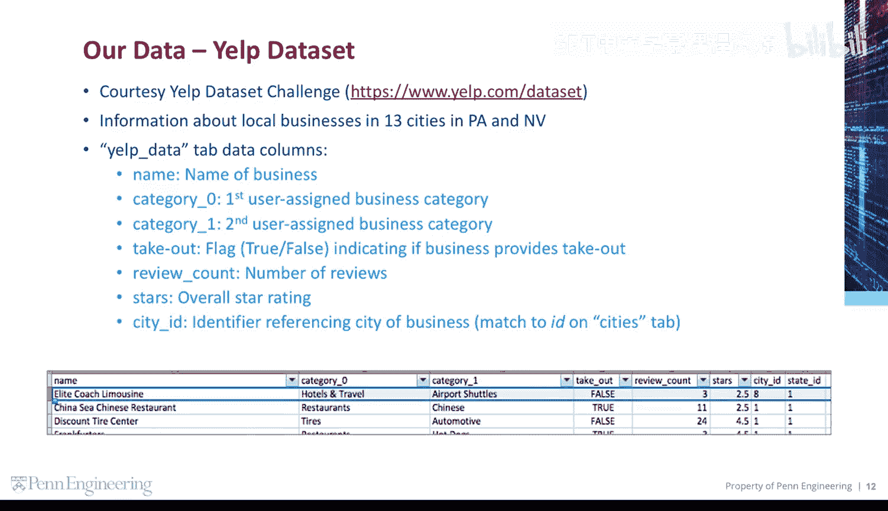
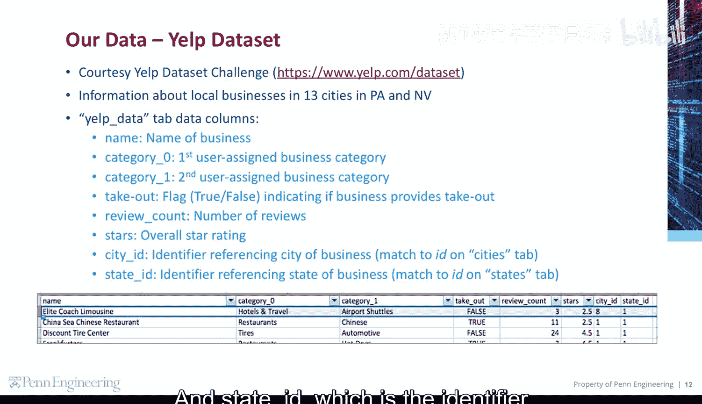
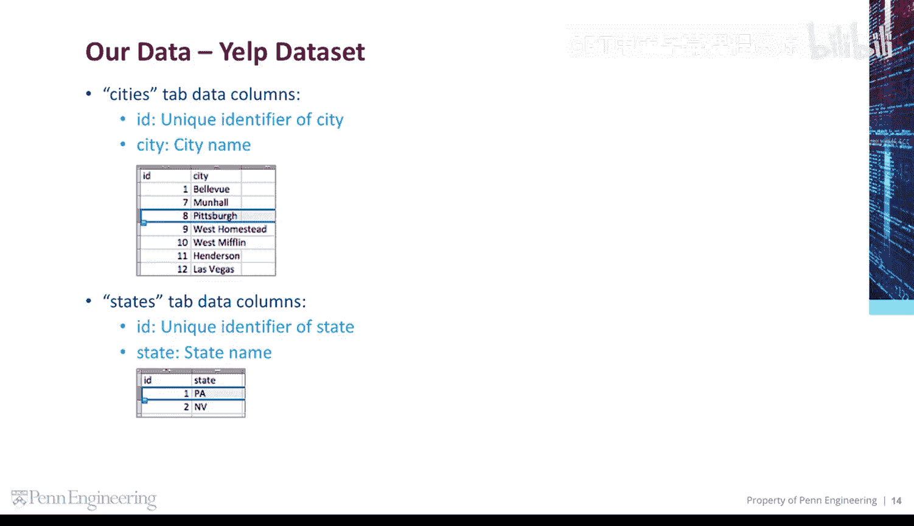

# Python和Java编程入门1-2：10：加载数据 📂

在本节课中，我们将学习如何加载和分析Yelp数据集。我们将了解数据文件的结构，识别其中的关键数据列，并理解不同数据表之间的关系。

---

在开始之前，请确认你已经下载了Yelp数据文件。该文件包含了美国宾夕法尼亚州和内华达州13个城市的本地商户信息。此数据来源于Yelp数据集挑战赛。

---

## 数据文件结构

数据文件包含三个主要的数据表：`Yelp data`、`Cities`和`States`。下面我们将逐一介绍每个表的结构。

### Yelp Data 表

`Yelp data` 表包含以下数据列：

*   **`name`**：商户的名称。
*   **`category0`**：用户分配的第一个商户类别。
*   **`category1`**：用户分配的第二个商户类别。在我们的数据中，这两个是最高级别的商户类别。
*   **`takeout`**：一个布尔标志（`true`或`false`），指示该商户是否提供外卖服务。
*   **`review count`**：该商户收到的评论数量。
*   **`stars`**：该商户的整体星级评分。
*   **`city ID`**：引用商户所在城市的标识符。此ID可以与`Cities`表中的`ID`列进行匹配。
*   **`state ID`**：引用商户所在州的标识符。此ID可以与`States`表中的`ID`列进行匹配。

---

### Cities 表

上一节我们介绍了主数据表，本节中我们来看看辅助的`Cities`表。它包含以下两列数据：

*   **`ID`**：城市的唯一标识符。
*   **`city`**：城市的名称。

---

### States 表

类似地，`States`表也包含两列数据：

*   **`ID`**：州的唯一标识符。
*   **`state`**：州的名称。

---

本节课中我们一起学习了Yelp数据集的基本结构。我们了解了主数据表（`Yelp data`）中的关键信息，如商户名称、类别、评分等，以及如何通过`city ID`和`state ID`与`Cities`、`States`这两个辅助表进行关联，从而获取更完整的地理位置信息。理解这种表间关系是进行后续数据分析的重要基础。