# 宾夕法尼亚大学《Python和Java编程入门1-2｜Introduction to Programming with Python and Java》中英字幕 p120 14_02_04_代码练习-连接数据.zh_en -BV13E421M7FF_p120-

In preparation for joining our data， let's go ahead and import the pandas library and load the Yelp data file。

 The first thing I do is import pandas as P D。 This imports the pandas library and allows me to reference it using an alias P D。

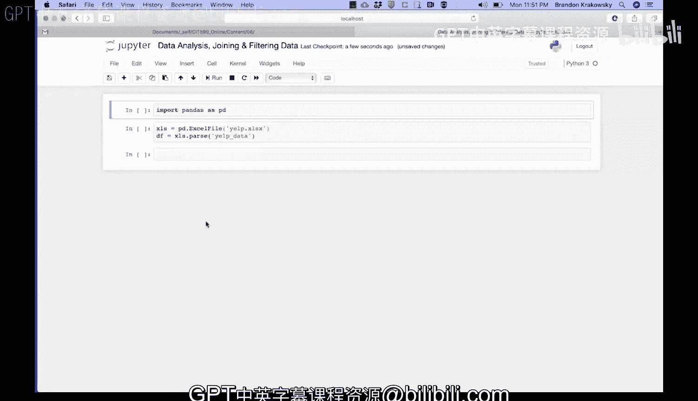

Using P D， I call Excel file and give it the name of the Excel file that I want to load。

 In this case， it's Yelp dot Excel S X。 That's an Excel file in the same directory as my Jupiter notebook file。

 Here's the Yelp Excel file。

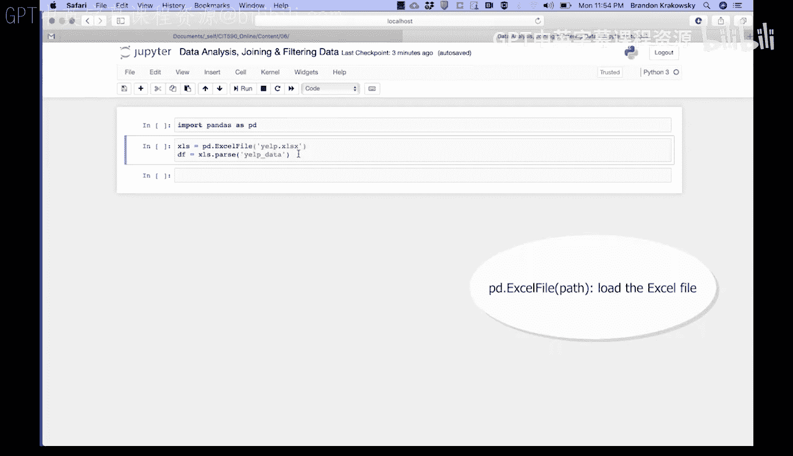

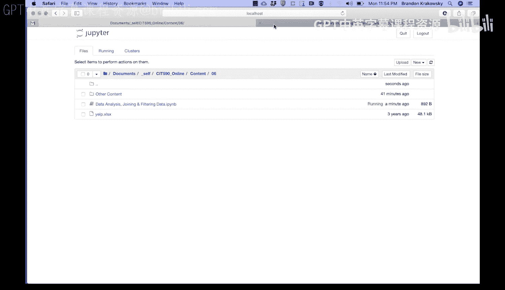

That returns an object， and I store it in a variable， X L S。Using that same XlS。

 I call the parse method， which parses an individual worksheet inside of the Excel file。

 In this case， I'm going to parse Yelp data that will return a data frame。

 and I'll store it in a variable D F。😡，I can now import pandas。Load my data。

And then view the first five rows of the Yelp data worksheet。

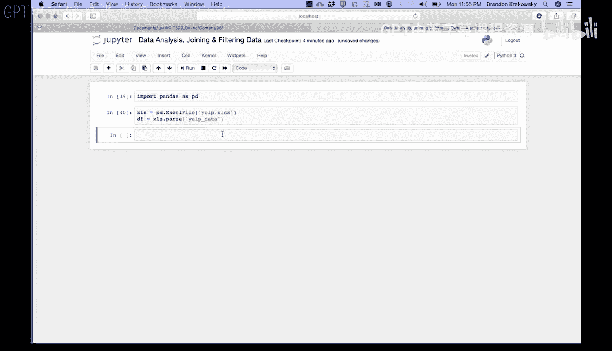

Df。Dot head run that。 and I can see the first five rows of data in the Yelp data worksheet。

To join to the city's data， I'm going to first import the city's worksheet into its own data frame using the parse method。

So X， LS dot parse， give it the name of the worksheet In this case。

 cities that will return a data frame。 I'm going to store it in D F underscore cities equals XLS dot parse citiesities。

 Run that， and I can view the first five rows of data in that worksheet D F。Cities head。

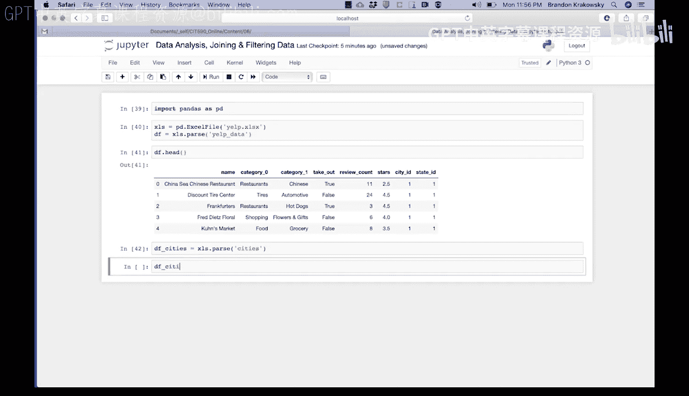

On that， I could see the data in the city's worksheet。

 I see the ID of the city and then the name of the city associated with each I。

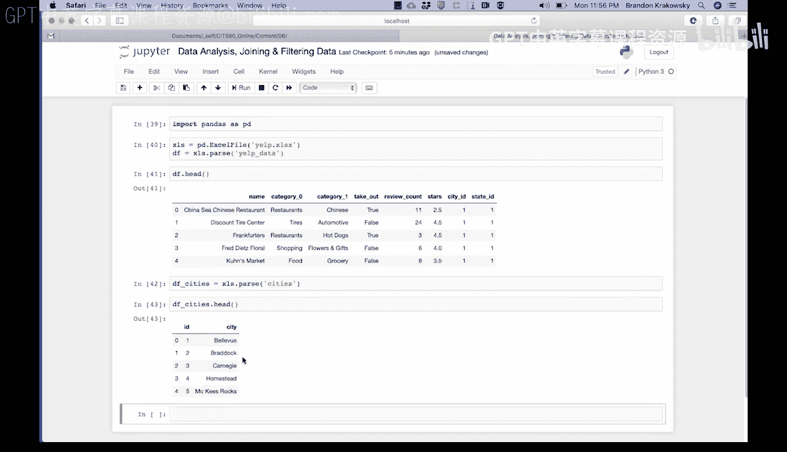

The pans function for performing joins is called mergege。 Here's how it works。PD dot mergege。

Then I specify the data frames to join in the left and right arguments。 So on the left。

 I'm going to use the Df data frame。 On the right， I'm going to use the Df citiesities data frame。

 Those are the two data frames that I'm going to join or merge。 Then I specify how to join。

 So how equals a string。😡，Inner join。And then specify the join keys in the two data frames。

 So in the left data frame， left on， I'm going to use the city ID column and in the right data frame right on I'm going to use the ID column。

 Those are the two columns that I'm going to match。😡，That will return a new data frame。

 And I'm going to call that D F。 So if I run that， it should have merged my data。

 Let's look at the first five rows of data， D F head。

And now I can see that the city information has been merged with the original data frame。 D F。

 Here's the city on the right now。Now let's merge to the state's data。

 The first thing we're going to want to do is import the state's worksheet into its own data frame。

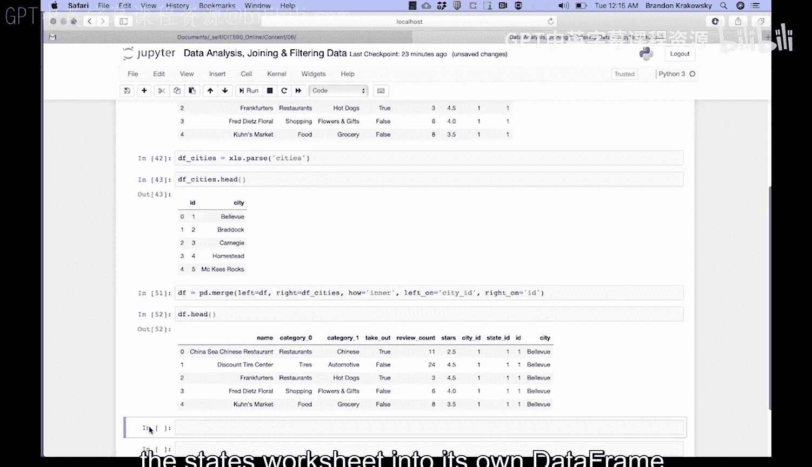

I'm going to call XLS dot parse and give it the name of the worksheet。 in this case。

 it states that's going to return a data frame。 We'll store that in DF underscore states。

I can run that， and I can see the first five rows of that worksheet， DF states。Dot head。

Here is the I D for each state and then the name of the state or the abbreviation for each state associated with that I D。

To merge the states data， we're going to use the merge function。 So I'm going to call Pd dot merge。

 The data frame on the left will be Df。 The data frame on the right will be Df states。

 and then how am I going to join them， How equals inner， that's a string。

 and then the join keys in both data frames。 So left on will be the state Id。

 and then the right on will be the I D。 That's the name of this column here。

 It's called Id and the state worksheet。 That's going to return a new data frame Again。

 I'm going to call that Df。 And I'm going to run that。 Let's just get the shape of that data frame。

 D dot shape， that's just an attribute。 If I run that， I could see that there's now。

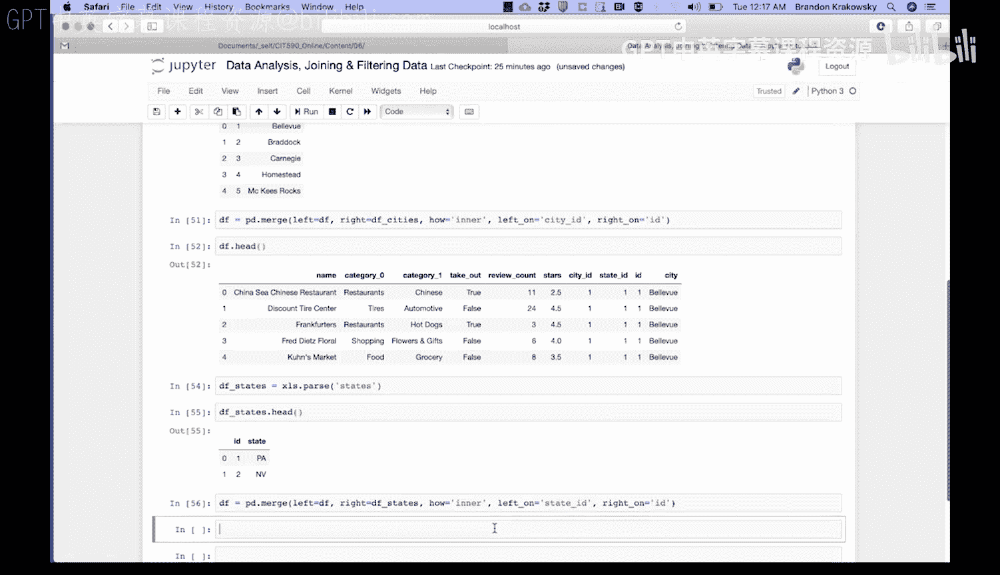

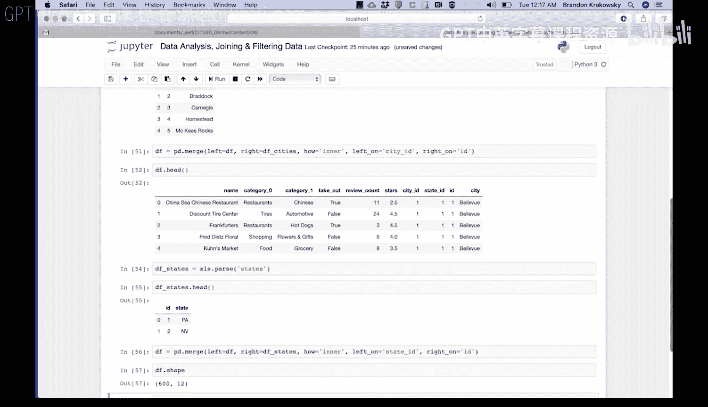

600 rows and 12 columns。 So it added two new columns。Let's get the first five rows of data again。

 D F。Dot head。 Call that。 I could see that the state's information has now been merged with the original data frame。

 Here's the state associated with each state I D。

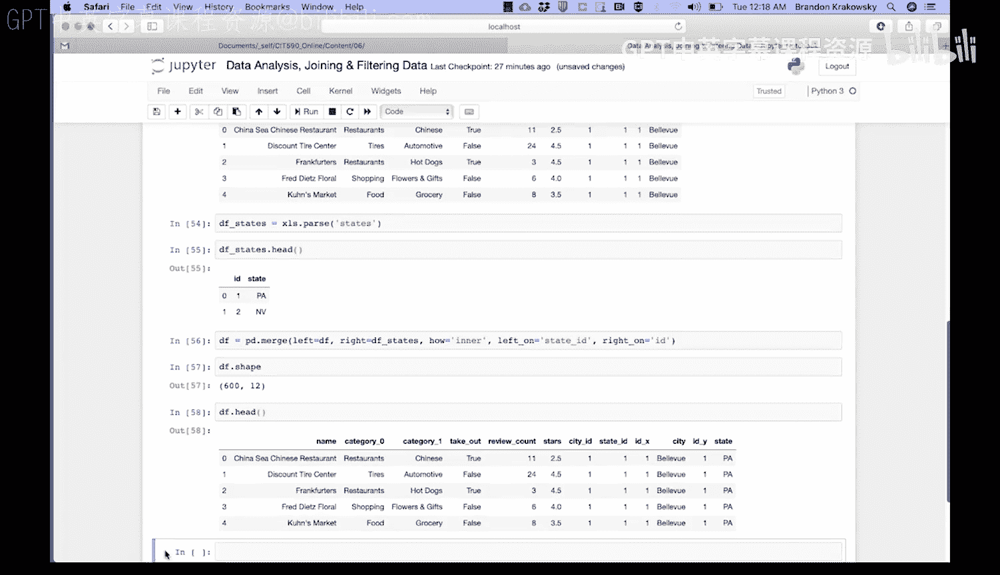

Now， let's show the name， city and state for the first 100 businesses。

 So I'm going to create a list of attributes。 A T T S， we'll call ats。

And what are the list of columns that I want to see， I want to see the name column。

I want to see the city column。And I also want to see the state column using those attributes in my data frame and inside of square brackets。

 I'm going to provide that list of column names。And then from that。

 I'm going to view the first 100 businesses。Now we could see the first 100 businesses。

 just the name and the city and the state associated with those businesses。

This IDX column is just a duplicate of the city ID column。

 and this IDY column is just a duplicate of this state ID column。

 So let's delete these duplicate columns。

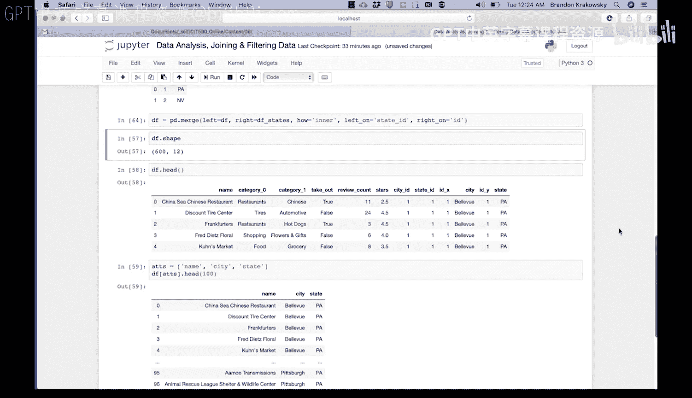

To do so， we're going to use the DEL keyword from the data frame， delete the ID underscore X column。

Then D EL from the data frame， let's delete the ID underscore Y column。Now， if we look at our data。

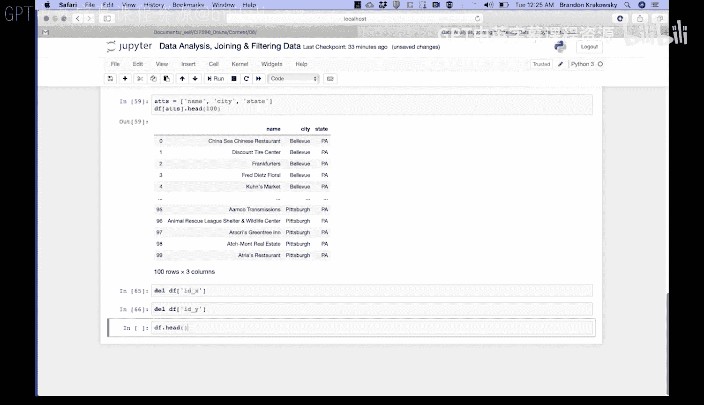

We no longer see those columns。 We just have the city I D， the state I。

 Those are the original columns in the Yelp data worksheet。

 and then the appended city and state information that we merged earlier。

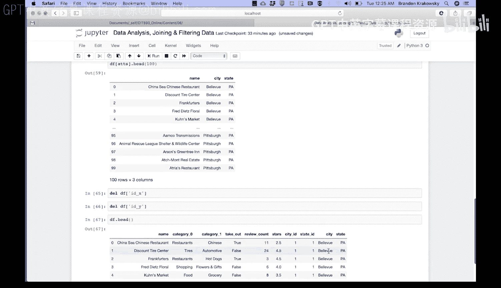