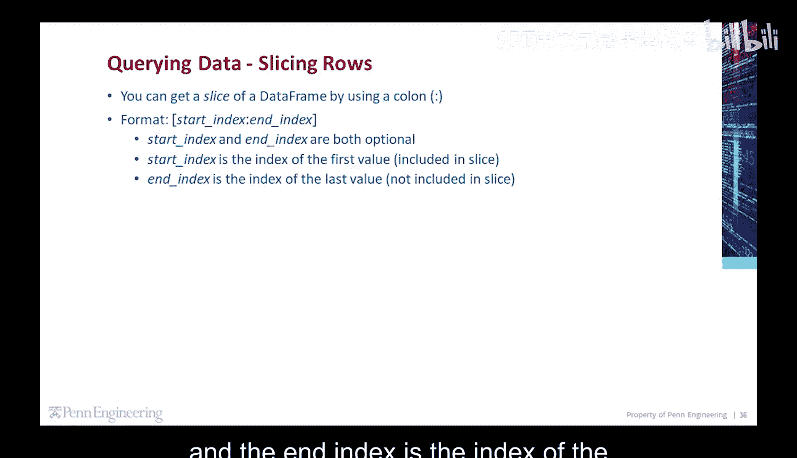
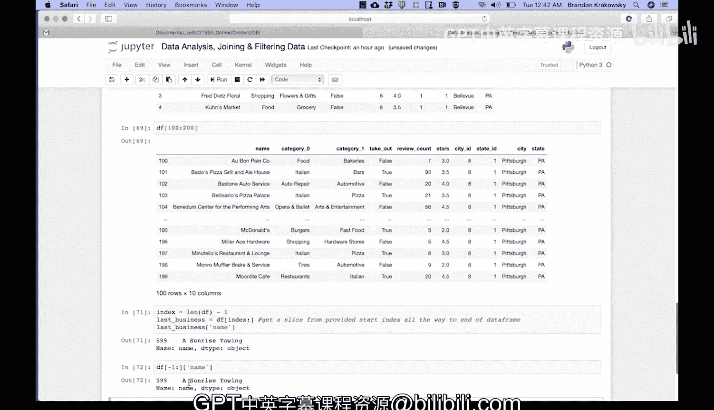

# Python和Java编程入门1-2：15：数据框切片操作

在本节课中，我们将要学习如何使用切片（Slicing）操作来获取Pandas数据框（DataFrame）中的特定部分数据。切片是一种高效的数据选取方法，允许我们通过索引范围来提取数据的子集。

## 切片的基本格式

你可以通过使用冒号来获取数据框的一个切片。其基本格式如下：



```python
dataframe[start_index:end_index]
```

在方括号内，你需要提供一个起始索引、一个冒号和一个结束索引。起始索引是切片中包含的第一个值的索引，而结束索引是切片中**不包含**的最后一个值的索引。这两个值都是可选的。

## 获取指定范围的切片

上一节我们介绍了切片的基本语法，本节中我们来看看如何获取数据中第二组100个企业的信息。

以下是具体步骤：
1.  从数据框中获取一个切片。
2.  起始索引设为100，结束索引设为200。
3.  执行此操作。

运行后，我们可以看到切片的起始索引是100，这是第一条记录。切片会一直延伸到索引199，因为索引200不包含在切片内。

## 获取最后一条记录

了解了如何获取中间范围的数据后，我们来看看如何定位并获取数据框中的最后一条记录。

以下是两种实现方法：

**方法一：通过计算长度获取**
1.  首先，获取数据框中最后一条记录的索引。这可以通过计算数据框的长度减1得到。
2.  然后，使用这个索引值作为起始索引来获取切片。在方括号中，起始索引就是我们上一步保存的最后一个索引值，后面跟着冒号。
3.  省略可选的结束索引，这样切片会从提供的起始索引一直延伸到数据框的末尾。
4.  将这个切片存储在变量中，例如 `last_business`。
5.  最后，从这个切片中提取出“名称”字段。

结果显示，数据框中的最后一个企业是“Sunrise Towing”，其索引是599。

**方法二：使用负索引**
另一种更简洁的方法是使用负索引。
1.  直接从数据框获取切片，使用 `-1` 作为起始索引。`-1` 会从末尾开始计数，代表数据框的最后一个索引。
2.  同样省略结束索引，让切片延伸到末尾。
3.  然后直接从结果中获取“名称”字段。

这样也能得到相同的结果：“Sunrise Towing”，索引599。

---



本节课中我们一起学习了数据框的切片操作。我们掌握了切片的基本语法 `dataframe[start:end]`，并实践了如何获取指定范围的数据行，以及两种获取最后一条记录的方法：通过计算长度和使用负索引。切片是处理数据框子集的重要工具。