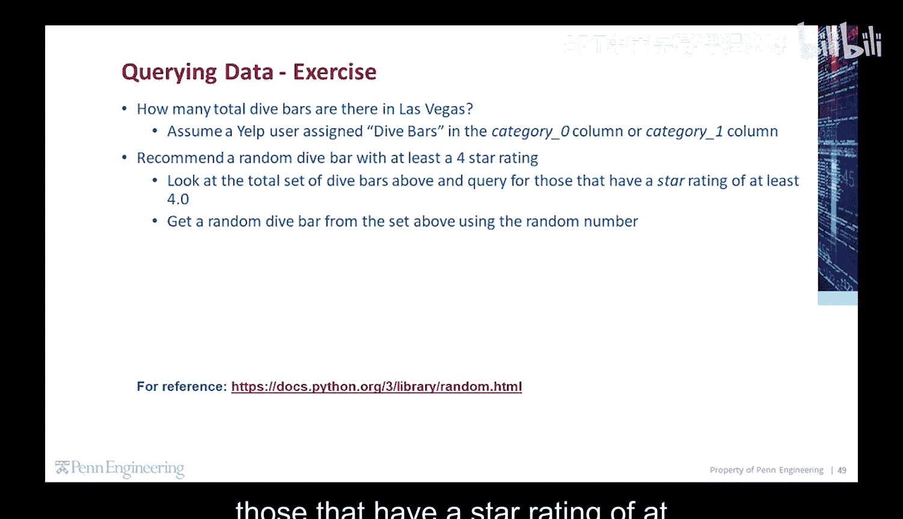
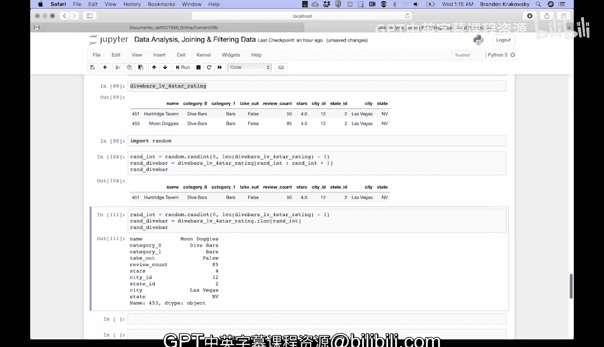

# 编程入门：1-2：代码练习 - 拉斯维加斯潜水酒吧推荐 🍸

在本节课中，我们将学习如何使用Python进行数据筛选和随机选择。我们将通过一个具体案例——从数据集中找出拉斯维加斯所有评分至少为4星的潜水酒吧，并随机推荐一家——来实践这些技能。

---

上一节我们介绍了数据筛选的基本概念，本节中我们来看看如何将这些概念应用于一个具体的练习。



我们的目标是：首先，统计拉斯维加斯共有多少家潜水酒吧；其次，从这些酒吧中筛选出评分至少为4星的；最后，从符合条件的酒吧中随机推荐一家。

以下是实现此目标的具体步骤：

1.  **筛选拉斯维加斯的潜水酒吧**
    我们首先需要从数据集中找出所有位于拉斯维加斯且被归类为“潜水酒吧”的行。这需要组合多个条件。

2.  **统计总数**
    在得到筛选后的数据框后，我们可以通过获取其长度来得知潜水酒吧的总数。

3.  **筛选高评分酒吧**
    接着，我们在上一步的结果中，进一步筛选出评分（`stars`列）大于或等于4.0的酒吧。

4.  **随机推荐**
    最后，我们从高评分酒吧的列表中，随机选择一家进行推荐。

---

### 步骤一：筛选拉斯维加斯的潜水酒吧

我们首先定义三个筛选条件：
*   `lv`：城市为“Las Vegas”。
*   `cat0_bars`：`category0`列为“Dive Bars”。
*   `cat1_bars`：`category1`列为“Dive Bars”。

然后，我们将这些条件组合起来，创建一个新的数据框 `dive_bars_lv`。这个数据框包含所有满足“城市是拉斯维加斯”并且“`category0`或`category1`是潜水酒吧”条件的行。

```python
# 定义筛选条件
lv = df['city'] == 'Las Vegas'
cat0_bars = df['category0'] == 'Dive Bars'
cat1_bars = df['category1'] == 'Dive Bars'

# 组合条件，创建包含拉斯维加斯所有潜水酒吧的新数据框
dive_bars_lv = df[lv & (cat0_bars | cat1_bars)]
```

### 步骤二：统计潜水酒吧总数

现在，我们可以通过计算 `dive_bars_lv` 数据框的长度来得到总数。

```python
# 获取潜水酒吧的总数
total_dive_bars = len(dive_bars_lv)
print(f"拉斯维加斯共有 {total_dive_bars} 家潜水酒吧。")
```

### 步骤三：筛选高评分酒吧

接下来，我们在 `dive_bars_lv` 的基础上，增加一个评分条件，创建另一个数据框 `dive_bars_lv_4star`，它只包含评分至少为4星的酒吧。

```python
# 在潜水酒吧中筛选评分>=4.0的
stars_condition = dive_bars_lv['stars'] >= 4.0
dive_bars_lv_4star = dive_bars_lv[stars_condition]
print(f"其中，有 {len(dive_bars_lv_4star)} 家评分至少为4星。")
```

### 步骤四：随机推荐一家酒吧

为了随机推荐，我们需要生成一个随机索引。首先导入 `random` 模块，然后生成一个介于0和数据框最大索引之间的随机整数。我们介绍两种方法来获取对应的行。

**方法一：使用切片**

```python
import random

# 生成一个随机索引
r_int = random.randint(0, len(dive_bars_lv_4star) - 1)

# 使用切片获取该索引对应的行
rand_dive_bar = dive_bars_lv_4star[r_int:r_int+1]
print("随机推荐的潜水酒吧是（切片法）:")
print(rand_dive_bar)
```

**方法二：使用 `.iloc` 方法**

`.iloc` 方法通过整数位置选择行，这是更直接的方式。

```python
import random

# 生成一个随机索引
r_int = random.randint(0, len(dive_bars_lv_4star) - 1)

# 使用.iloc通过整数位置获取行
rand_dive_bar = dive_bars_lv_4star.iloc[r_int]
print("随机推荐的潜水酒吧是（.iloc法）:")
print(rand_dive_bar)
```

每次运行上述代码块，你可能会看到不同的酒吧被推荐，例如“Huntridge Tavern”或“Moondogies”。

---



本节课中我们一起学习了如何组合多个条件对数据进行筛选，如何计算筛选结果的数量，以及如何使用 `random` 模块实现随机选择。通过“拉斯维加斯潜水酒吧推荐”这个练习，我们实践了从数据查询到结果输出的完整流程，这是数据分析中非常实用的基础技能。