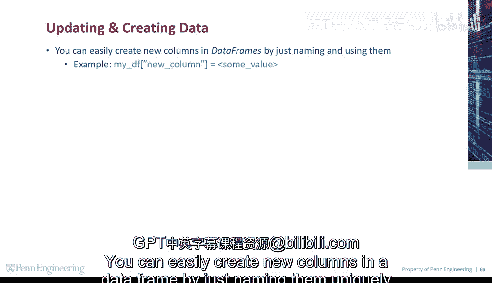
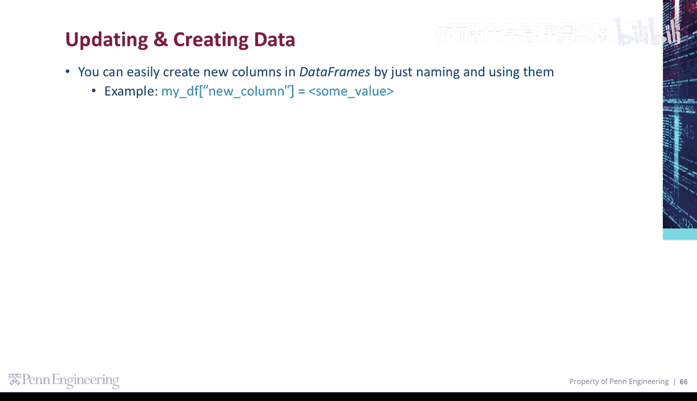
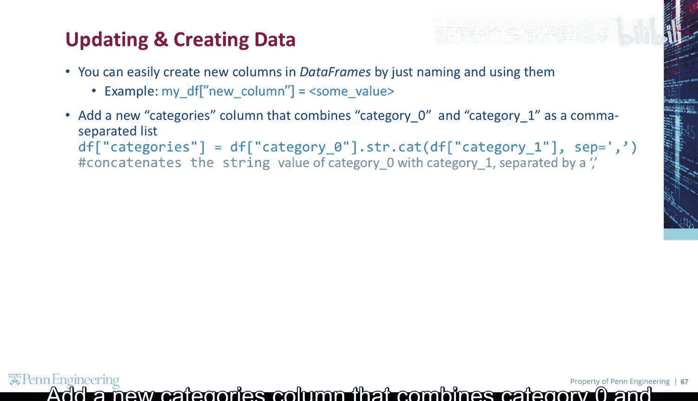
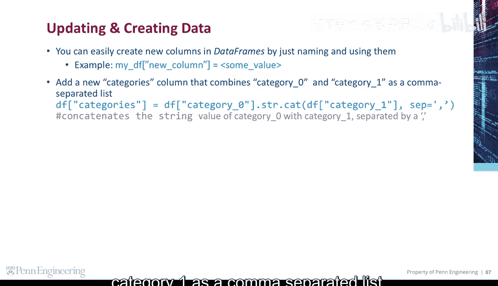
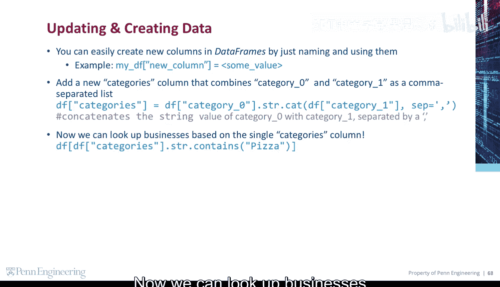
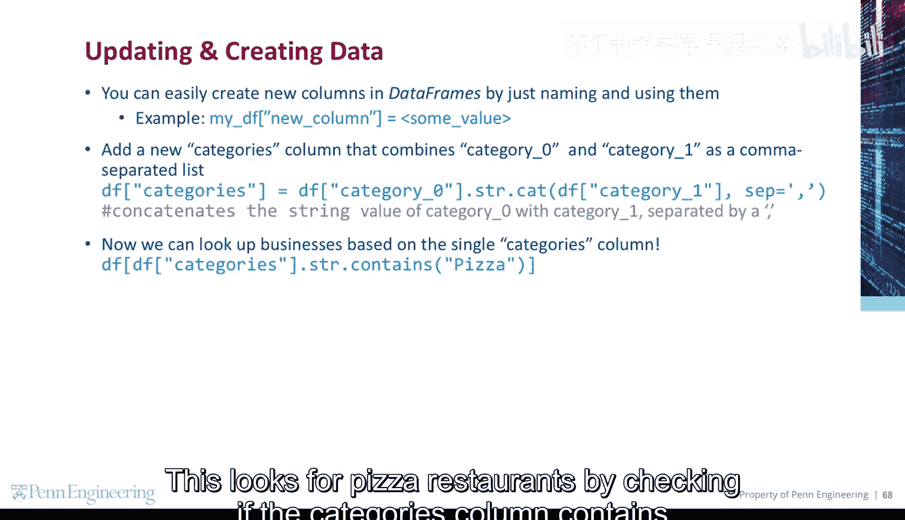
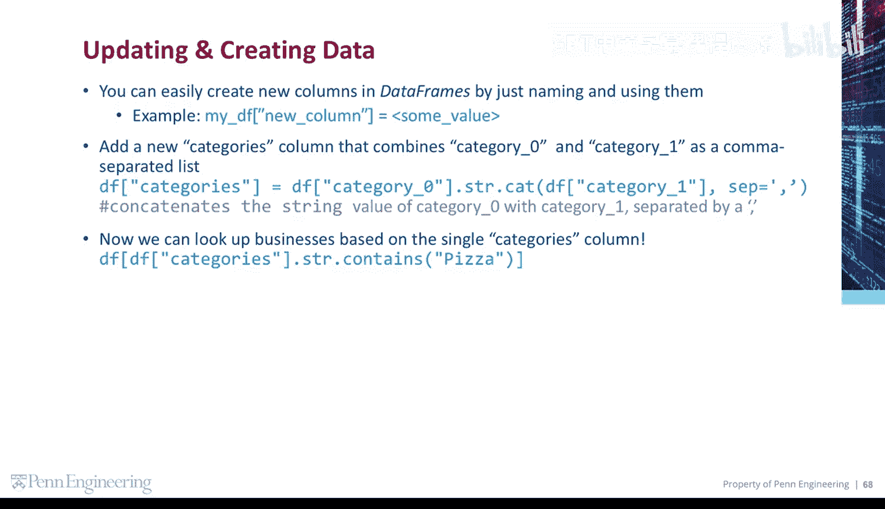

# 宾夕法尼亚大学《Python和Java编程入门1-2｜Introduction to Programming with Python and Java》中英字幕 p127 21_02_11_更新与创建数据.zh_en -BV13E421M7FF_p127-

You can easily create new columns in a data frame by just naming them uniquely and using them。😡。

For example， some new column in my DF equals some value。

Add a new categories column that combines category0 and category1 as a comma separated list。

This concatenates the string value of category 0 with category 1 and separates them by a comma。

Now we can look up businesses based on a single categories column。

This looks for pizza restaurants by checking if the categories column contains the string， pizza。

