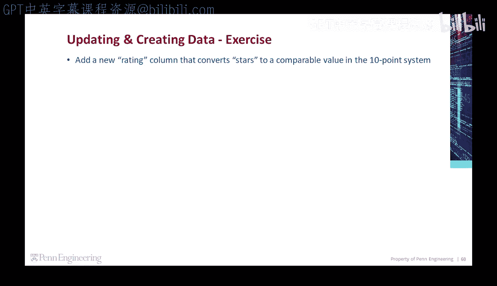
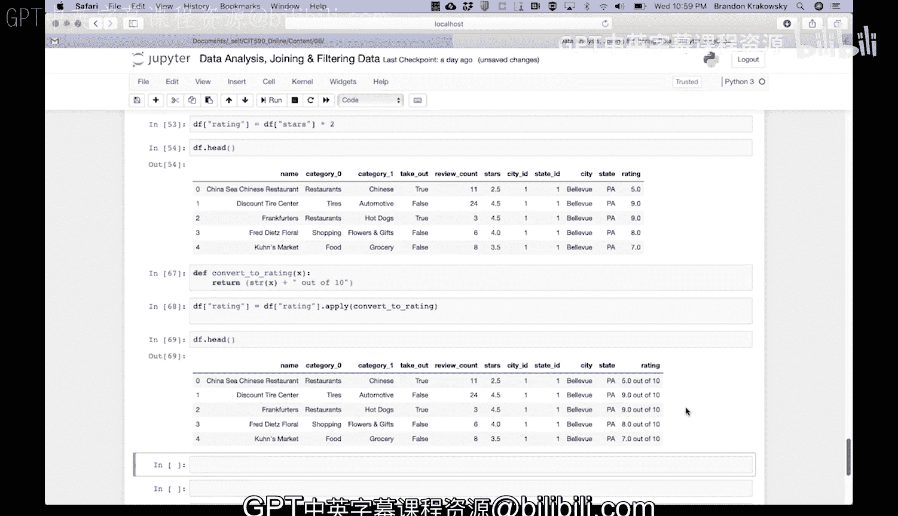

# 宾夕法尼亚大学《Python和Java编程入门1-2｜Introduction to Programming with Python and Java》中英字幕 p128 22_02_12_代码练习-添加评分列.zh_en -BV13E421M7FF_p128-

Let's do an exercise。Every business has a star's rating value that's on a scale from 1 to 5。

 Let's add a new rating column that converts the stars rating value to a comparable value in the 10 point system。

To add a new column， we can go ahead and just name a new column and use it。

 Let's set the rating column to be the current value of stars times 2。

If we run that code and then look at the first five rows of our data， we can see that each business。

 in addition to the star's value， which is on a scale from 1 to 5。

 we have a rating value on the scale from 1 to 10。Now。

 let's update the new rating column so that it displays the rating as x out of 10。 First。

 let's create a helper function that will take a rating value as an argument and concatenate a string to it。

So let's define a function。 convert to rating， which will take a given x。

 That's the rating itself between 1 and 10。 And then it's going to return the following The x value casted to a string。

 concatenated with another string out of 10 for each rating。

 it will appear as the rating itself out of 10。To run the helper function for the rating in each row。

 let's use the apply method。For the rating column， let's apply the convert to rating function to each rating value。

 And then we're going to overwrite the existing rating values to be that。

 And then we'll run that code。 And then let's get the first five lines。

 And we'll see that each rating is now a particular rating value out of 10。

