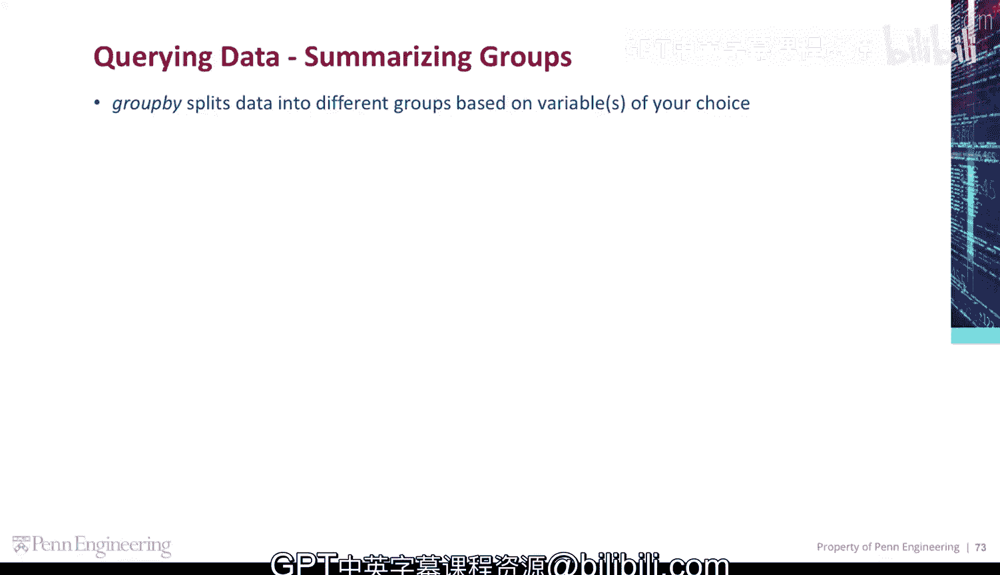
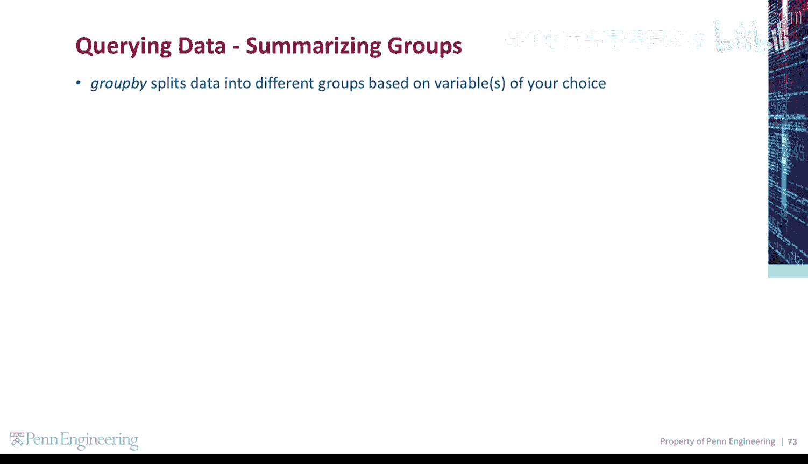
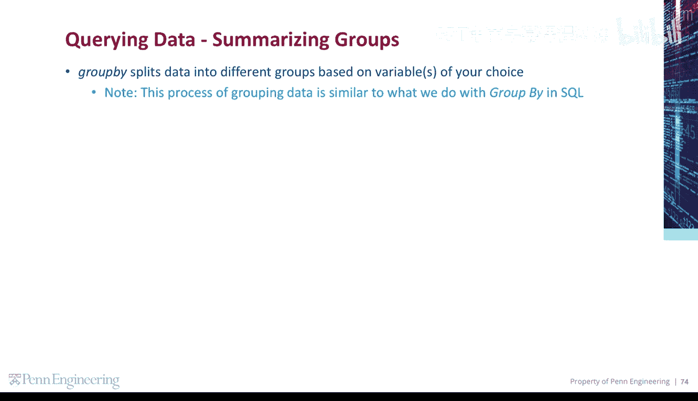
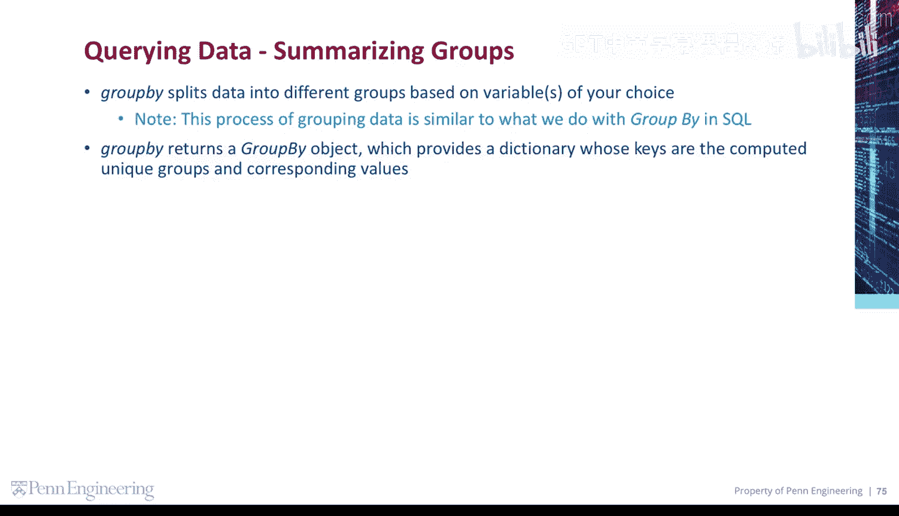
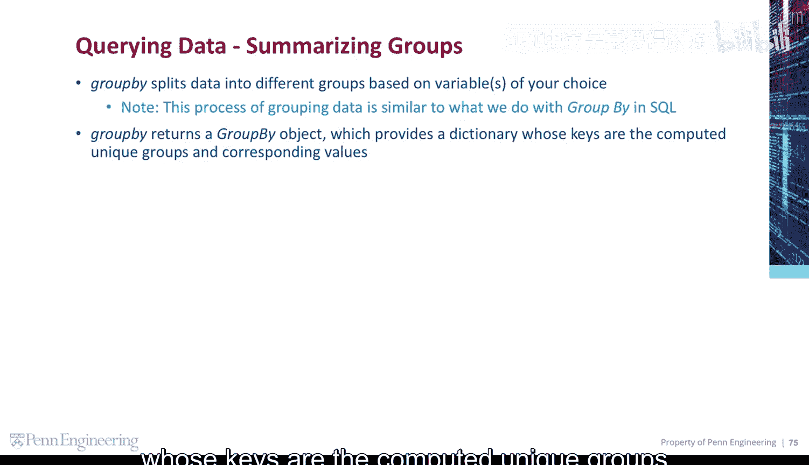
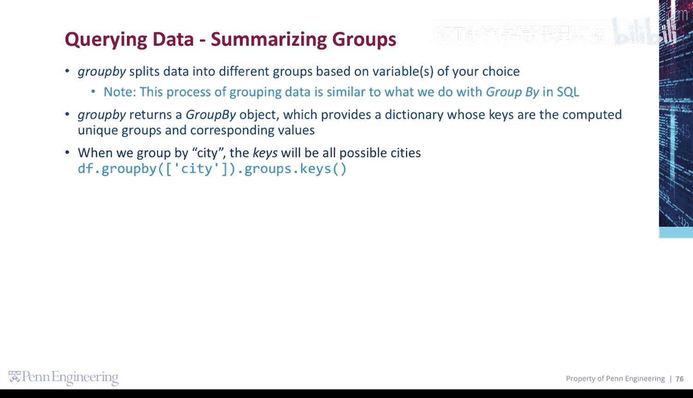
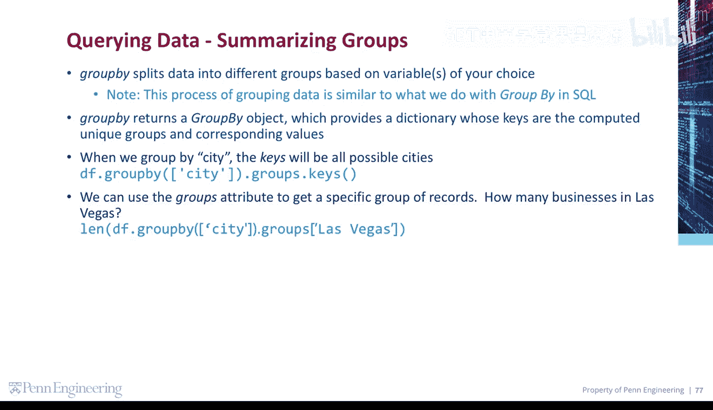
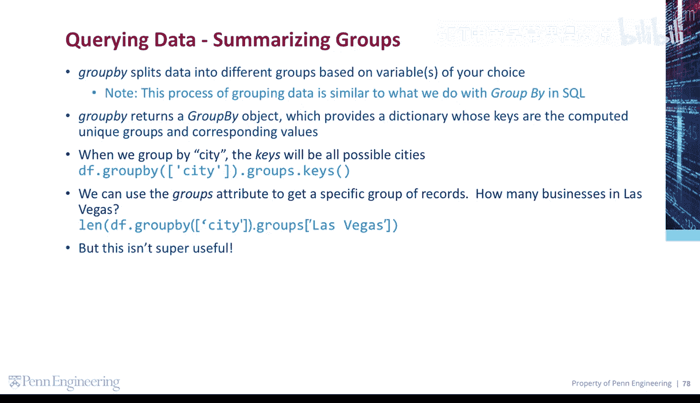
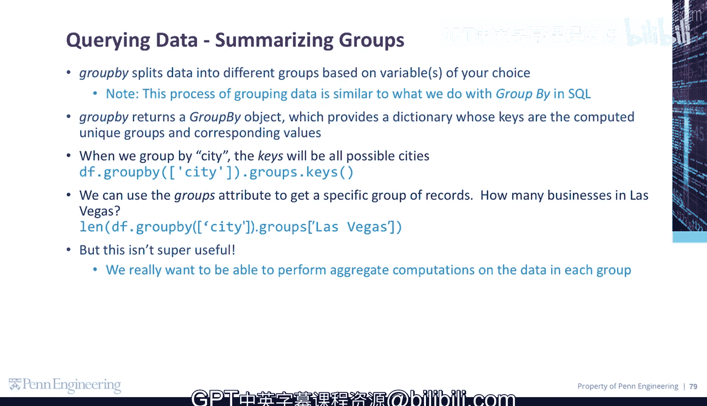

# 宾夕法尼亚大学《Python和Java编程入门1-2｜Introduction to Programming with Python and Java》中英字幕 p129 23_03_01_分组汇总.zh_en -BV13E421M7FF_p129-

The group by method splits data into different groups based on variables of your choice。

Note， this process of grouping data is similar to what we do with group I and SQL。

GroupI returns a group by object， which provides a dictionary whose keys are the computed unique groups and their corresponding values。

For example， when we group by city， the keys will be all possible cities。

We can use the group's attribute to get a specific group of records。

How many businesses are there in Las Vegas？But this kind of info in itself isn't actually all that useful。

 what we really want to be able to do is to perform aggregate computations on the data within each group。

