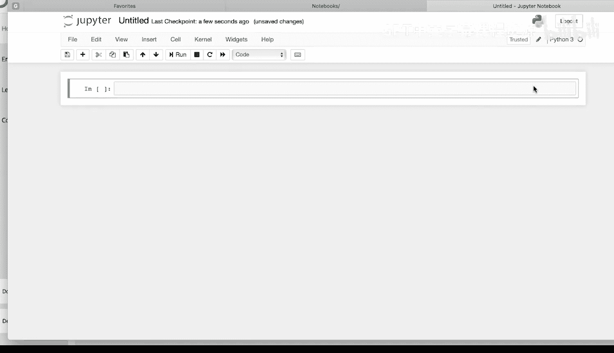
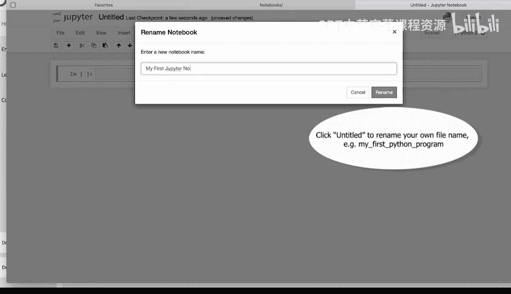
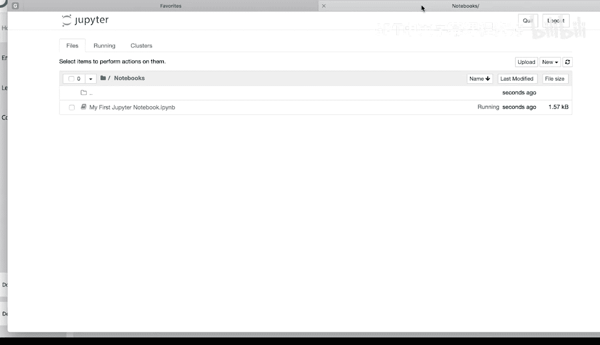
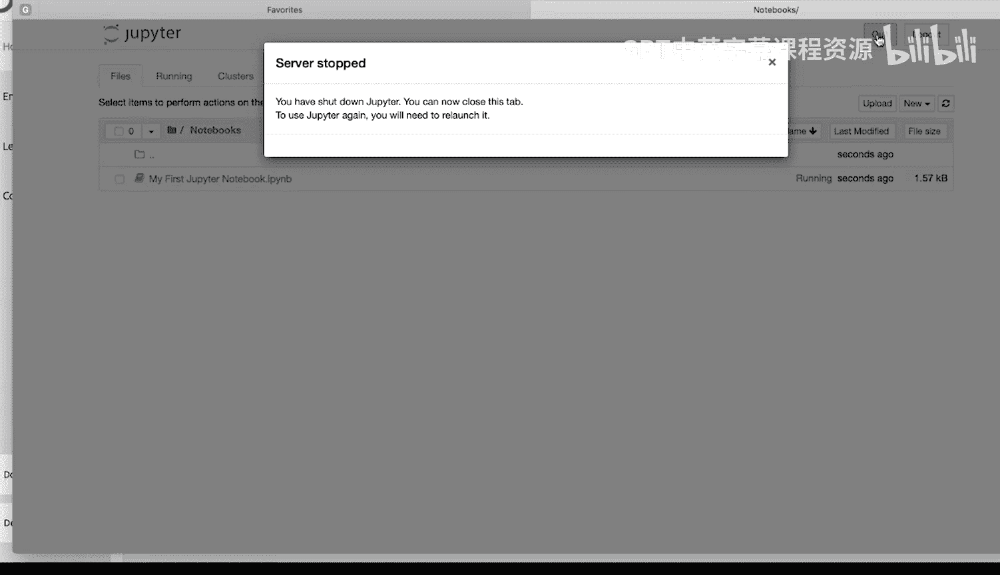

# Python和Java编程入门1-2：013_01_03：使用Jupyter Notebook 📓

在本节课中，我们将学习如何启动、创建和操作Jupyter Notebook，这是运行Python代码的交互式环境。我们将涵盖从启动Notebook到编写、运行代码以及管理代码单元的基本操作。

## 启动Jupyter Notebook

下载并安装Anaconda后，可以通过几种方式启动Jupyter Notebook。

最简单的方法是打开电脑上的Anaconda Navigator，然后点击启动按钮来启动Jupyter Notebook。

这将在你的默认浏览器中启动Jupyter Notebook。你可以导航到想要创建和保存Notebook文件的文件夹。

## 创建与重命名Notebook

要创建一个Notebook，请点击右上角的“New”按钮，并选择最新版本的Python（通常是Python 3）。




这将创建你的第一个Notebook文件。要重命名它，请点击顶部的标题。




输入一个名称，然后点击“Rename”。

## 编写与运行代码

你将在代码单元（cell）内编写和运行Python代码。

例如，输入以下代码：
```python
print("Hello, world")
```

要运行代码，可以按 `Control + Return`。这将在当前单元中运行代码，本例中会将“Hello, world”打印到控制台。

或者，可以按 `Shift + Return`。这将在运行当前单元代码后，在其下方创建一个新的代码单元。

按 `Shift + Return` 后，代码再次运行，将“Hello, world”打印到控制台，并在下方创建一个新单元。

## 管理代码单元

以下是管理代码单元的基本操作。

要手动创建新单元，可以点击单元左侧选中它，然后按键盘上的 `A` 键。`A` 键会在上方插入一个单元。

选中一个单元后，按 `B` 键会在下方插入一个单元。

要删除一个单元，点击单元左侧选中它，然后按两次 `D` 键（即 `D D`）即可删除。

## 保存与退出

Notebook文件会自动保存，但如需手动保存，可以点击左侧的保存按钮。

要退出Jupyter Notebook，可以关闭你的Notebook文件。



然后点击右上角的“Quit”按钮。




这将停止服务器并退出Jupyter Notebook。

## 总结


本节课中我们一起学习了Jupyter Notebook的基本使用。我们了解了如何启动Notebook、创建和重命名文件、在单元中编写并运行Python代码（如 `print("Hello, world")`），以及如何使用快捷键（`A`、`B`、`D D`）来插入和删除单元。最后，我们还学习了如何保存工作和安全退出Notebook环境。