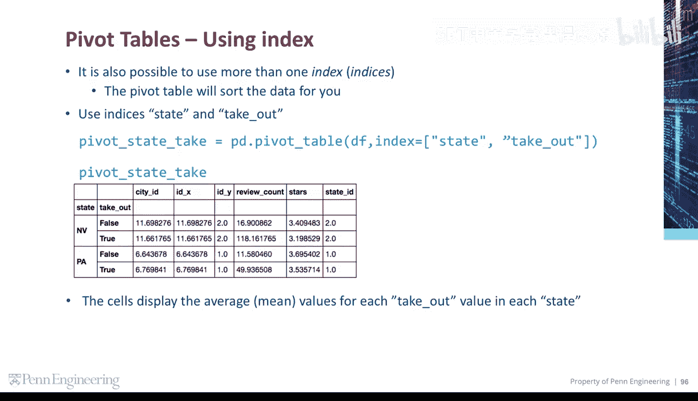

# 宾夕法尼亚大学《Python和Java编程入门1-2｜Introduction to Programming with Python and Java》中英字幕 p132 26_03_04_使用索引.zh_en -BV13E421M7FF_p132-

Let's create a pivot table and use city as the index。By default。

 the pivot table calculates the average or mean for every column in the result。

The type of pivot city is still a data frame。It's also possible to use more than one index called indices。

The pivot table will sort the data for you here we use indices， state and takeout。

The cells display the average or mean values for each takeout value within each state。

