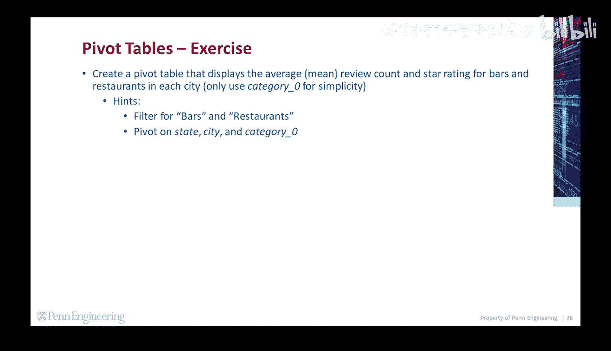
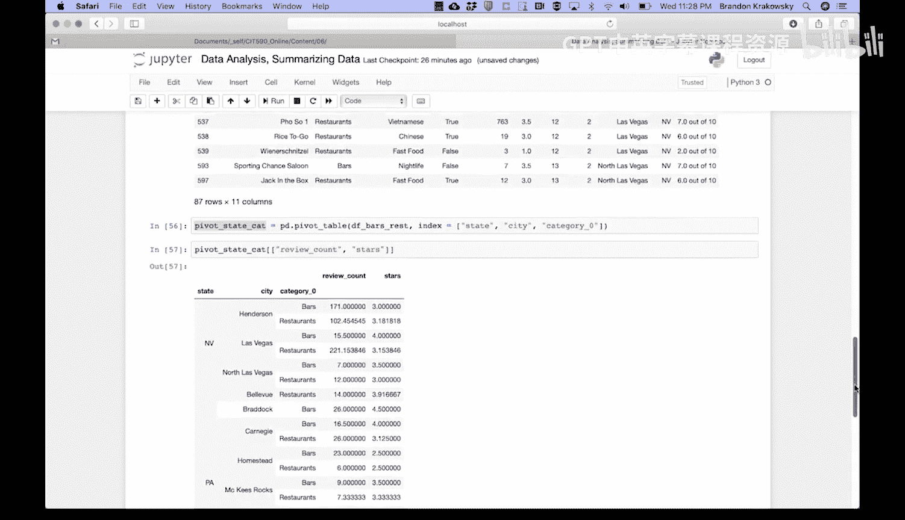
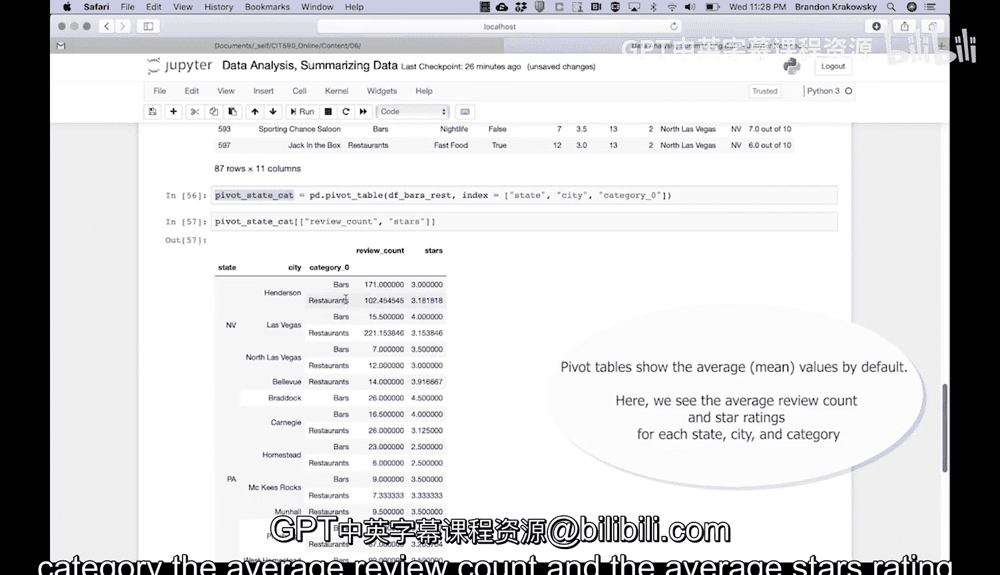

# Python和Java编程入门1-2：27：代码练习-平均评论数与评分

在本节课中，我们将通过一个练习来学习如何使用Pandas库创建数据透视表。具体目标是创建一个数据透视表，用于显示每个城市中酒吧和餐厅的平均评论数量和平均星级评分。为了简化操作，我们只关注`category_0`这一列。

## 概述

我们将从原始数据框开始，首先筛选出类别为“酒吧”和“餐厅”的行。然后，我们将以`state`、`city`和`category_0`作为索引，创建一个数据透视表，并计算`review_count`和`stars`两列的平均值。

## 筛选数据



首先，我们需要从原始数据框中筛选出仅包含酒吧和餐厅的数据。以下是具体步骤。

我们检查`category_0`列中的值是否在指定的列表中。这个列表包含“Bars”和“Restaurants”。这个操作会检查`category_0`列中的每个值是否为“酒吧”或“餐厅”。

我们将这个条件存储在变量`bars_rest`中。

```python
bars_rest = df['category_0'].isin(['Bars', 'Restaurants'])
```

接着，我们使用这个条件来过滤原始数据框。

```python
df_bars_rest = df[bars_rest]
```

运行以上代码后，我们将得到一个新的数据框`df_bars_rest`，其中只包含酒吧和餐厅的数据。这个筛选仅基于`category_0`列的值。

## 创建数据透视表

上一节我们筛选出了所需的数据，本节中我们来看看如何创建数据透视表。

现在，我们使用Pandas的`pivot_table`函数来创建数据透视表。我们将以`state`、`city`和`category_0`作为索引。

以下是创建数据透视表的代码。

```python
pivot_state_cat = pd.pivot_table(df_bars_rest,
                                  index=['state', 'city', 'category_0'])
```

我们将这个数据透视表存储在变量`pivot_state_cat`中。运行后，我们会得到一个数据框，它实际上就是一个数据透视表。

## 查看特定列

在创建好的数据透视表中，我们只关心与评论和评分相关的列。

我们将查看数据透视表中的`review_count`和`stars`这两列。

```python
result = pivot_state_cat[['review_count', 'stars']]
```

运行以上代码后，我们得到最终的数据透视表。现在，我们可以清晰地看到每个州、每个城市、每个类别（酒吧或餐厅）的平均评论数量和平均星级评分。



## 总结



本节课中我们一起学习了如何利用Pandas进行数据筛选和创建数据透视表。我们首先从原始数据中筛选出酒吧和餐厅的数据，然后以州、城市和类别为索引，创建了一个显示平均评论数和平均评分的数据透视表。这个练习帮助我们掌握了数据聚合和分析的基本方法。