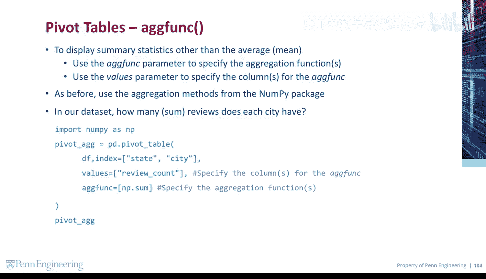
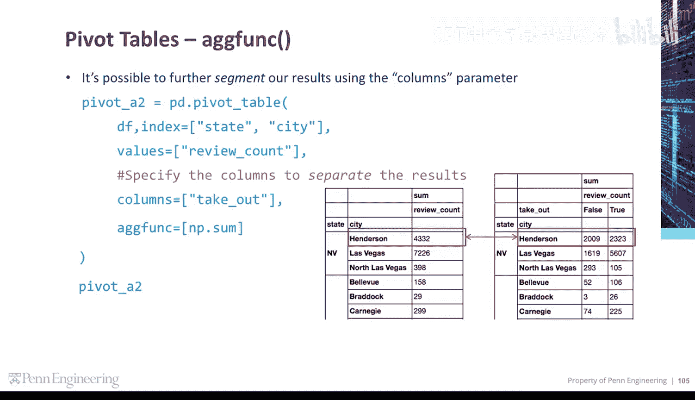
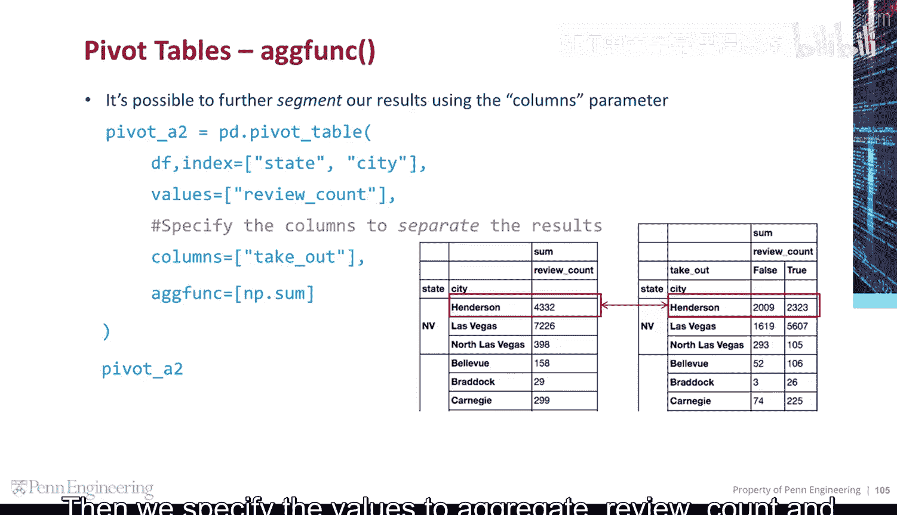
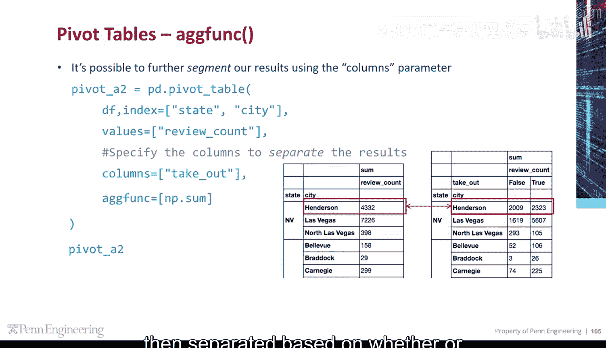
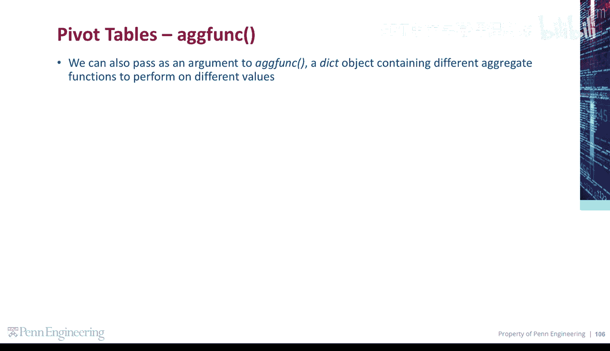
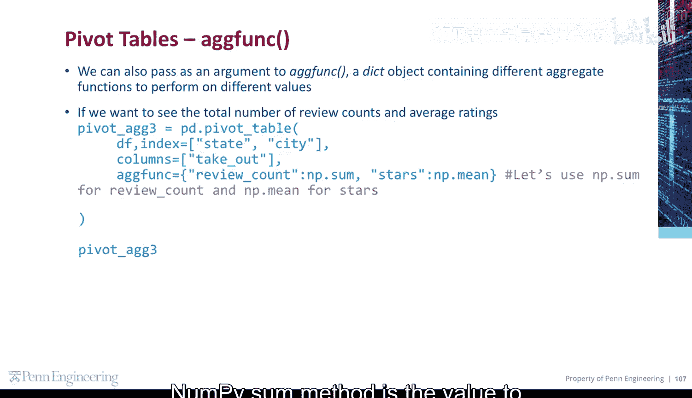
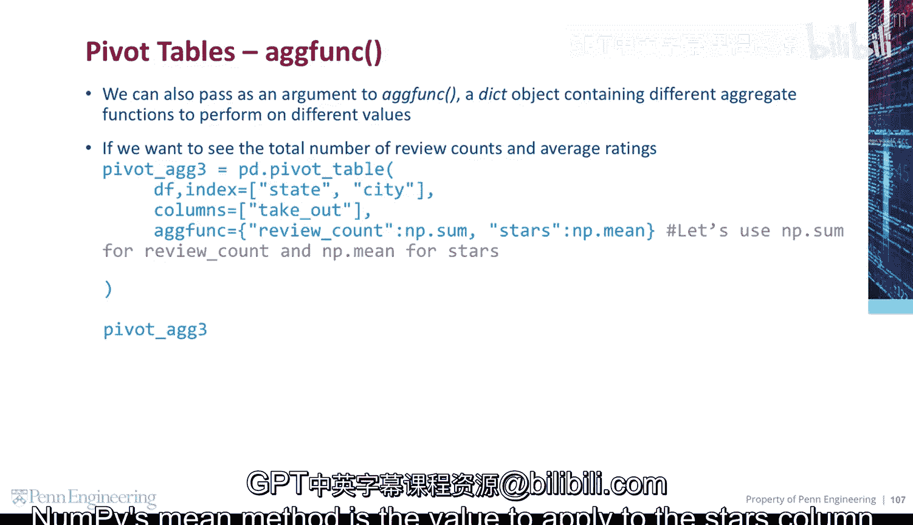
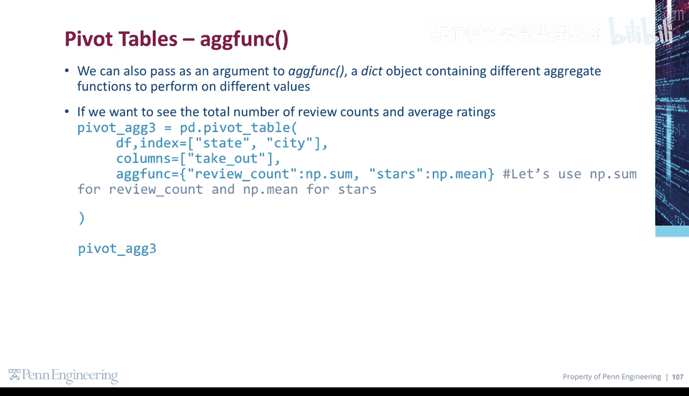

# Python和Java编程入门1-2：28：聚合函数 📊

在本节课中，我们将学习如何在数据透视表中使用聚合函数，以计算除平均值以外的其他汇总统计数据，例如总和。我们还将探讨如何同时为不同的列应用不同的聚合方法。

## 概述

上一节我们介绍了数据透视表的基本概念。本节中，我们来看看如何使用 `aggfunc` 参数来指定不同的聚合函数，以及如何通过 `values` 和 `columns` 参数对数据进行更细致的分组分析。

## 指定聚合函数

要显示平均值以外的汇总统计数据，需使用 `aggfunc` 参数来指定聚合函数。同时，使用 `values` 参数来指定需要聚合的列。与之前一样，我们将使用 `NumPy` 包中的聚合方法。

例如，在我们的数据中，每个城市有多少条评论？我们可以创建一个数据透视表。

以下是创建该数据透视表的步骤：
1.  在 `index` 参数上设置州和城市。
2.  对于要聚合的值，指定评论数列，因为这是我们要计算总和的列。
3.  对于 `aggfunc`，指定要应用的聚合方法，我们将使用 `NumPy` 包中的 `sum` 方法。



代码示例如下：
```python
pd.pivot_table(df, index=['state', 'city'], values='review_count', aggfunc=np.sum)
```


## 使用列参数进一步细分结果



我们可以通过再次使用 `columns` 参数来进一步细分结果。这里，我们创建一个以州和城市为索引的数据透视表。




然后，我们指定要聚合的值（评论数）和要应用的聚合方法。


我们还指定了 `columns` 参数，以便根据“是否提供外卖”来进一步细分结果。这样，我们可以看到每个城市的评论数量，并根据商家是否提供外卖进行了区分。




## 为不同列应用不同的聚合函数

我们还可以向 `aggfunc` 传递一个字典对象作为参数，该字典包含要对不同值执行的不同聚合函数。字典中可以包含多个键值对。




例如，如果我们想查看评论的总数和评分的平均值，可以使用以下格式来指定。

以下是创建该数据透视表的步骤：
1.  创建一个数据透视表。
2.  传递一个字典对象，其中列名作为键，应用于该列的聚合方法作为值。
    *   在本例中，`review_count` 是一个键，`NumPy` 的 `sum` 方法是应用于“评论数”列的值。
    *   `stars` 是另一个键，`NumPy` 的 `mean` 方法是应用于“星级”列的值。

代码示例如下：
```python
pd.pivot_table(df, index=['state', 'city'], values=['review_count', 'stars'], aggfunc={'review_count': np.sum, 'stars': np.mean})
```









## 总结


本节课中我们一起学习了数据透视表中聚合函数的高级用法。我们掌握了如何使用 `aggfunc` 参数指定不同的聚合方法（如求和），如何利用 `columns` 参数对数据进行多维度细分，以及如何通过传递字典来为不同的数据列同时应用不同的聚合函数。这些技巧能帮助我们更灵活、更高效地从数据中提取有价值的汇总信息。