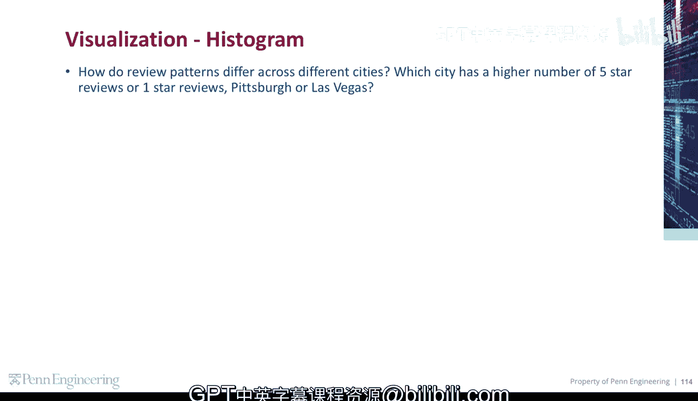
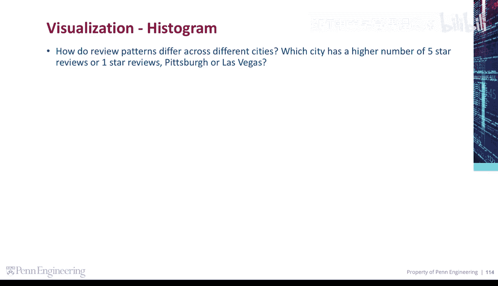
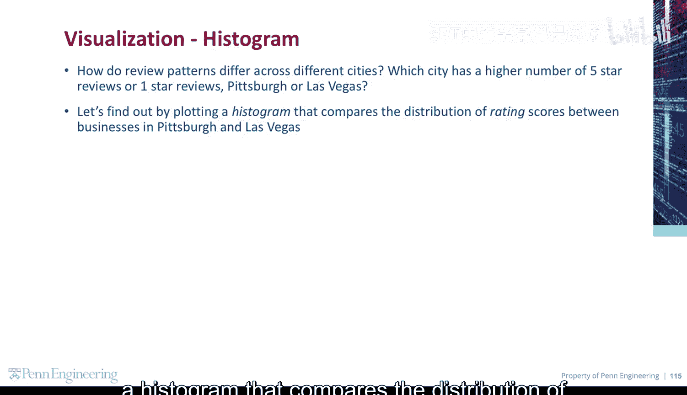
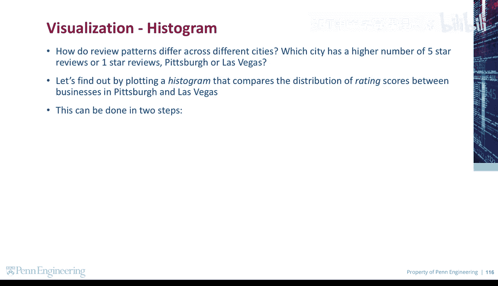
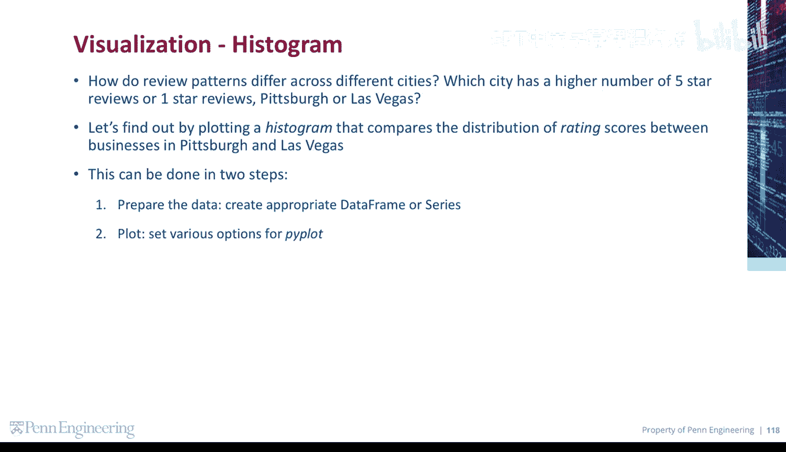
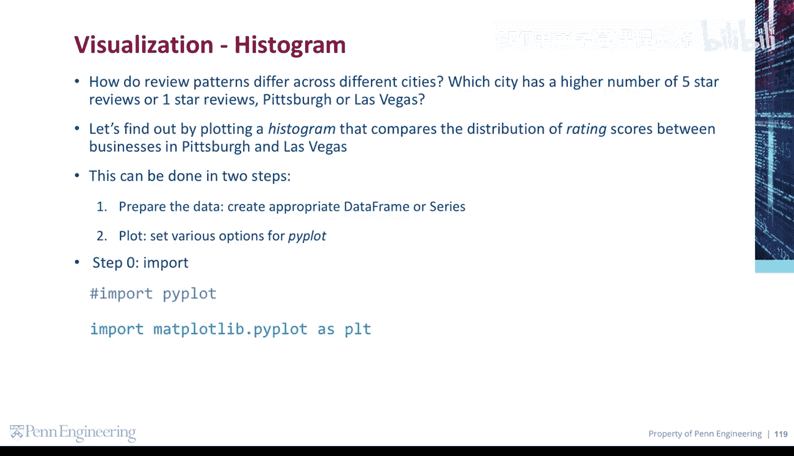

# Python和Java编程入门1-2：31：直方图比较 📊

在本节课中，我们将学习如何使用直方图来比较两个不同城市（匹兹堡和拉斯维加斯）的商家评分分布。我们将通过Python的Plotly库来实现这一可视化，从而直观地看出哪个城市拥有更多五星或一星评价。



## 概述与目标

我们想要探究的问题是：不同城市的评价模式有何差异？具体来说，在匹兹堡和拉斯维加斯这两个城市中，哪个城市的五星评价或一星评价数量更多？

为了解决这个问题，我们将绘制一个直方图来比较这两个城市商家的评分分布。整个过程主要分为两个步骤：首先准备数据并创建合适的数据框，然后使用Plotly库进行绘图并设置相关选项。

## 数据准备

在开始绘图之前，我们需要导入必要的库并准备好用于比较的数据。以下是数据准备阶段的关键步骤。



首先，我们需要导入Plotly Express库，它是一个用于快速创建图的高级接口。

```python
import plotly.express as px
```

接下来，我们需要从数据源中筛选出匹兹堡和拉斯维加斯这两个城市的数据，并创建一个包含城市和评分两列的数据框，为后续绘图做好准备。

## 绘制直方图

数据准备就绪后，我们现在可以开始绘制比较直方图了。Plotly Express使得创建复杂的图表变得非常简单。



我们将使用 `px.histogram` 函数。以下是创建直方图的核心代码结构：

```python
fig = px.histogram(data_frame=prepared_df,
                   x='stars',
                   color='city',
                   barmode='overlay', # 设置模式为叠加，便于比较
                   opacity=0.75,      # 设置透明度，使重叠部分可见
                   title='Rating Distribution: Pittsburgh vs Las Vegas')
fig.show()
```

在这段代码中：
*   `data_frame` 参数指定我们准备好的数据框。
*   `x='stars'` 指定将评分数据作为直方图的横轴。
*   `color='city'` 指定根据城市字段对数据进行着色，从而区分两个城市。
*   `barmode='overlay'` 是一个关键设置，它让两个城市的直方图条形重叠在一起，而不是并排排列，这样能更直观地比较分布形状。
*   `opacity` 参数设置了条形的透明度，确保重叠部分也能清晰可见。

## 图表解读与分析

生成的图表将并排显示匹兹堡和拉斯维加斯商家的评分分布。通过观察直方图形状，我们可以进行以下分析：



以下是解读直方图时关注的核心点：
1.  **峰值比较**：观察哪个城市在特定评分区间（尤其是1星和5星）的条形更高，条形高度代表了该评分区间的商家数量。
2.  **分布形状**：比较两个城市整体评分的分布是偏左（低分多）、偏右（高分多）还是更为集中。
3.  **重叠区域**：利用叠加模式，可以直接看出在任一评分区间，哪个城市的商家数量占主导地位。



通过这种直观的比较，我们就能得出最初问题的结论，例如发现拉斯维加斯的商家可能拥有更多极端评价（极高或极低），而匹兹堡的评价可能更集中于中间范围。



## 总结

本节课中，我们一起学习了如何使用Plotly绘制比较直方图。我们首先明确了通过可视化比较两个城市评分分布的目标，然后完成了数据导入和筛选的准备工作，最后使用 `px.histogram` 函数并设置 `color` 和 `barmode` 参数成功创建了直观的叠加直方图。这种方法不仅能用于比较城市间的评分，还可以广泛应用于任何需要对比两个或多个组别数据分布的场合。