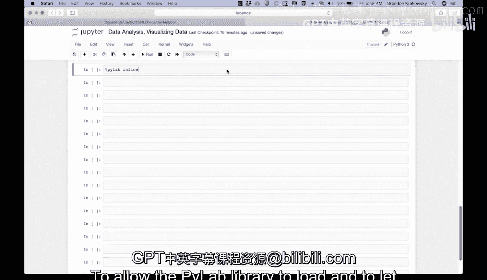
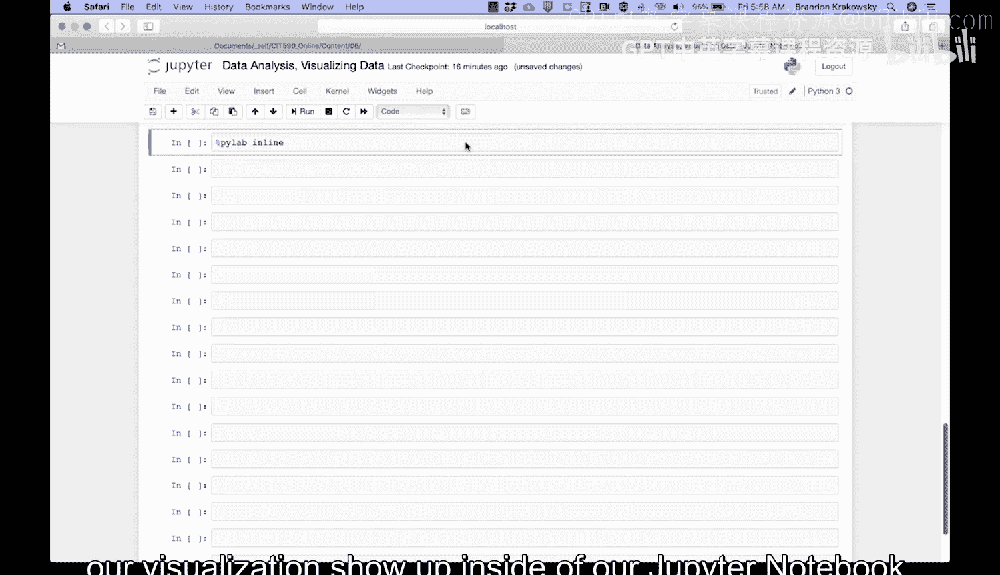
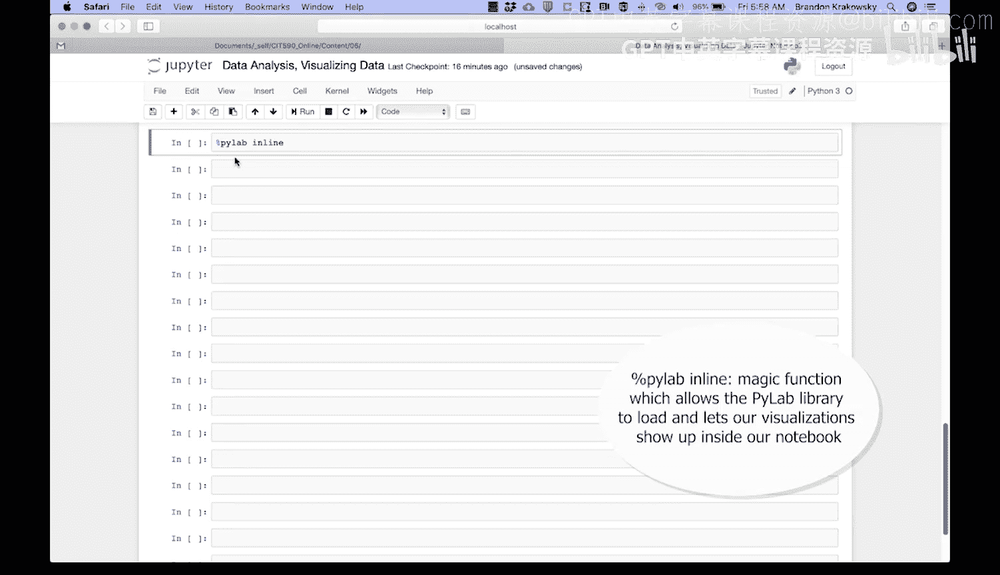
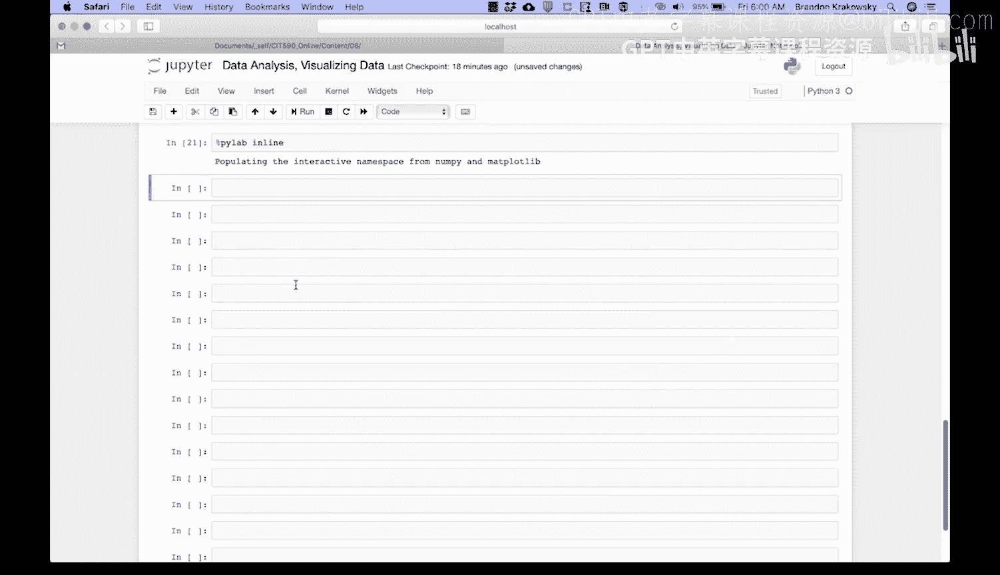
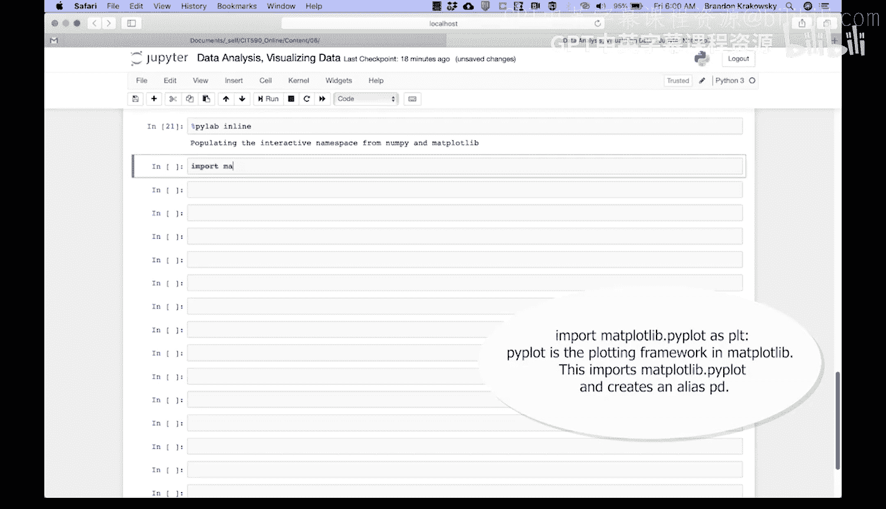
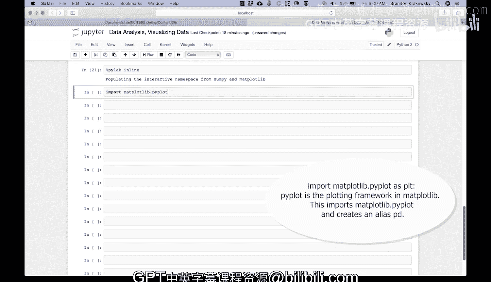

# Python和Java编程入门1-2：32：直方图编码演示-展示数据分布 📊

在本节课中，我们将学习如何在Jupyter Notebook中使用Matplotlib库创建直方图，以直观地展示数据的分布情况。我们将从配置环境开始，逐步完成数据可视化的全过程。



---

为了让Pla库能够加载，并使我们的可视化图表显示在Jupyter Notebook中，我们需要运行一个“魔法函数”。

以下是具体步骤：
1.  在代码单元格中输入 `%pylab`。
2.  运行该单元格以激活Matplotlib的交互模式。

现在，我们可以导入Matplotlib库中的绘图模块了。



---



上一节我们配置好了绘图环境，本节中我们来看看如何导入必要的库。

通过以下代码导入Matplotlib的`pyplot`模块，并为其设置一个常用的别名`plt`，以简化后续的调用。



```python
import matplotlib.pyplot as plt
```



---



本节课中我们一起学习了在Jupyter Notebook中配置Matplotlib环境并导入`pyplot`模块的方法。掌握了这些基础步骤，我们就可以开始创建各种图表，包括接下来要绘制的直方图，来探索和分析数据了。