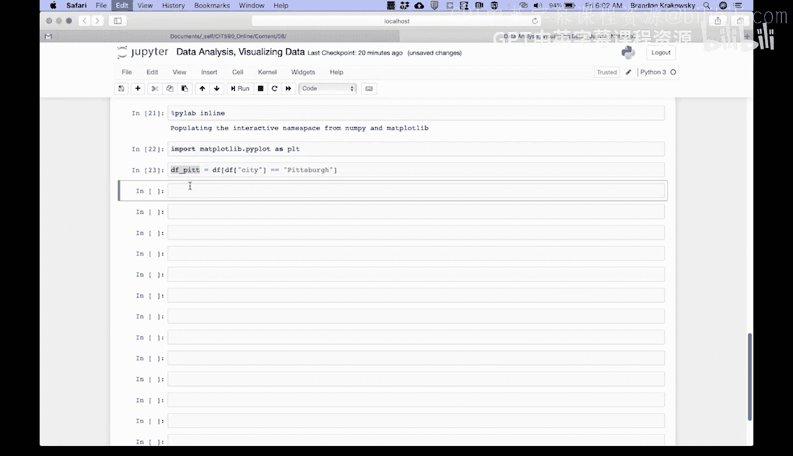
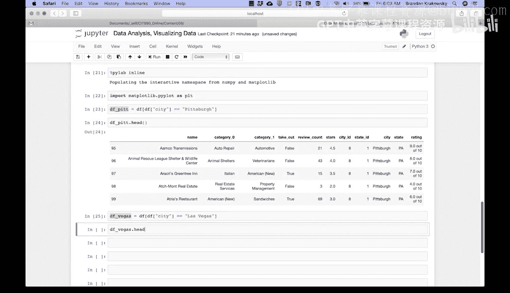
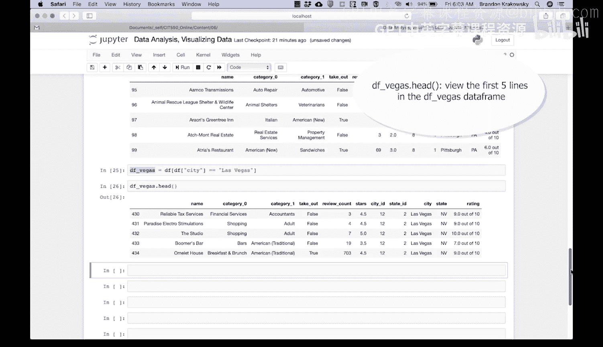
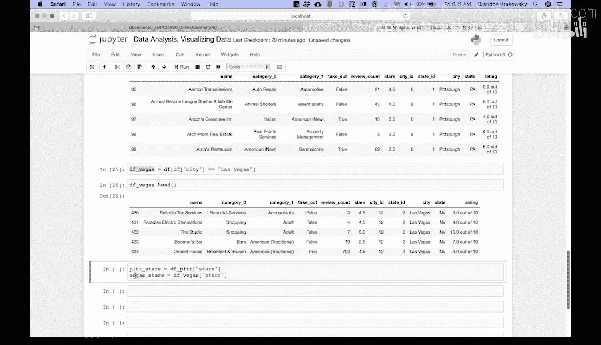
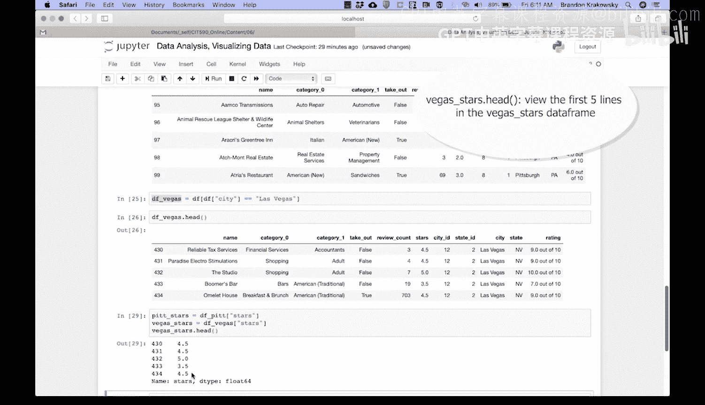

# Python和Java编程入门1-2：33：直方图编码演示-准备数据 📊

在本节课中，我们将学习如何为绘制直方图准备数据。具体来说，我们将从一个包含多个城市商业信息的数据集中，筛选出匹兹堡和拉斯维加斯两个城市的数据，并提取出我们关心的“星级评分”列。

## 概述

为了比较两个城市的商业评分分布，我们需要先从原始数据集中分离出各自的数据。本节将演示如何使用条件筛选创建新的数据框，并从中提取特定的数据列，为后续绘制直方图做好准备。



## 创建城市数据框

首先，我们需要从原始数据框中，根据“城市”这一条件，分别创建匹兹堡和拉斯维加斯两个独立的数据框。

以下是具体步骤：



1.  **创建匹兹堡数据框**：我们使用条件 `city == ‘Pittsburgh’` 来筛选数据。
    ```python
    df_pit = df[df[‘city’] == ‘Pittsburgh’]
    ```
    运行此代码后，我们得到了一个名为 `df_pit` 的新数据框，其中只包含匹兹堡的商业数据。查看前五行数据，可以确认筛选成功。

    



2.  **创建拉斯维加斯数据框**：接下来，我们使用条件 `city == ‘Las Vegas’` 进行筛选。
    ```python
    df_vegas = df[df[‘city’] == ‘Las Vegas’]
    ```
    我们将结果存储在 `df_vegas` 数据框中。同样，查看其前五行数据，可以确认其中均为拉斯维加斯的商业信息。

    

## 提取星级评分数据

上一节我们成功创建了两个城市的数据框。本节中，我们来看看如何从中提取出绘制直方图所需的核心数据——`stars`（星级评分）列。

因为直方图旨在展示数值的分布情况，所以我们只需要每个数据框中的评分数据。以下是提取方法：

1.  **提取匹兹堡的评分数据**：从 `df_pit` 数据框中提取 `stars` 列。
    ```python
    pit_stars = df_pit[‘stars’]
    ```
2.  **提取拉斯维加斯的评分数据**：从 `df_vegas` 数据框中提取 `stars` 列。
    ```python
    vegas_stars = df_vegas[‘stars’]
    ```
    提取完成后，我们可以查看 `pit_stars` 的前五行数据。可以看到，现在数据中只包含纯数值的星级评分，这正是我们绘制直方图所需要的格式。

    


## 总结



本节课中，我们一起学习了为比较性直方图准备数据的关键步骤。我们首先通过条件筛选，从原始数据集中分离出匹兹堡和拉斯维加斯两个城市的数据子集。接着，我们从这两个子集中提取了核心的分析指标——`stars` 评分列。现在，`pit_stars` 和 `vegas_stars` 这两个数据序列已经准备就绪，可以在接下来的课程中用于绘制并排的直方图，从而直观地对比两个城市商业评分的分布情况。