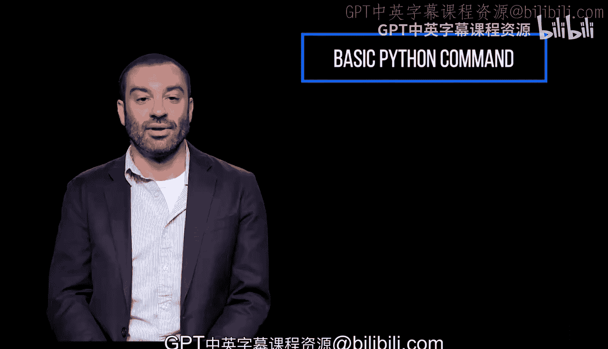
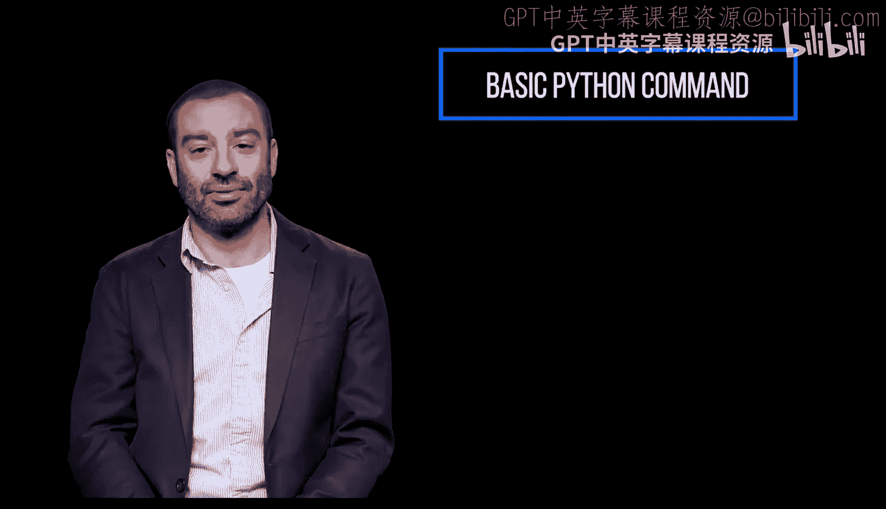
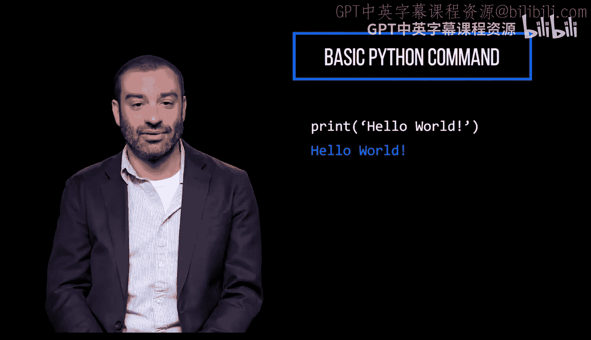
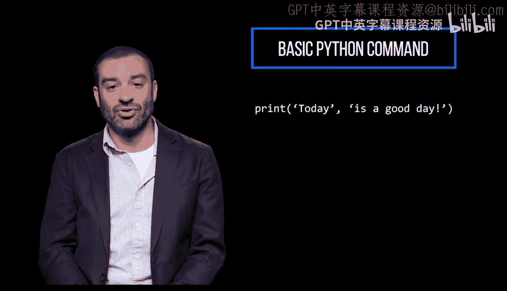
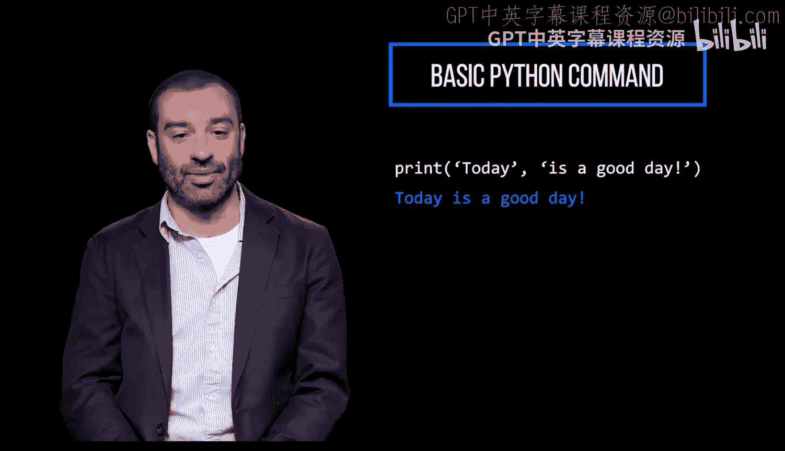
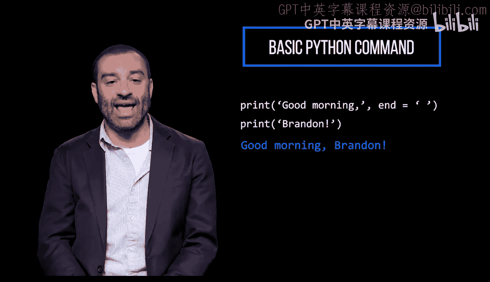
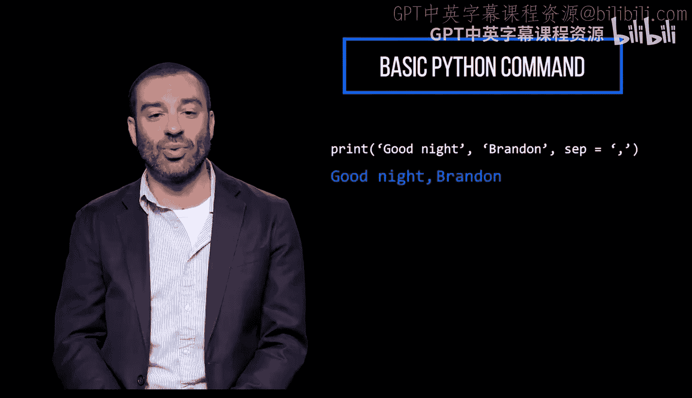
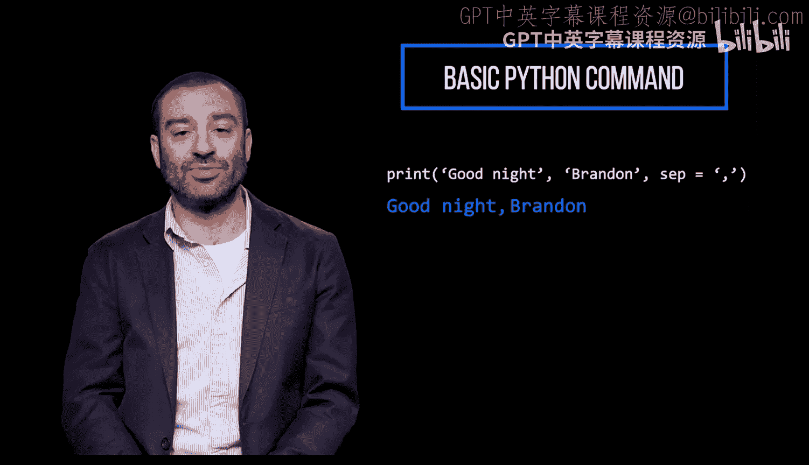
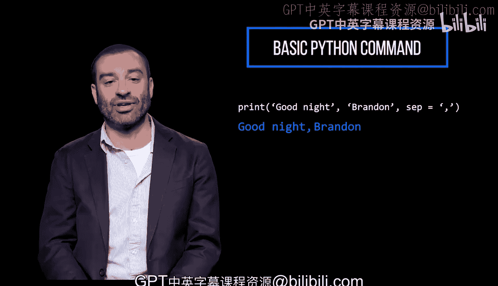

# Python编程入门：1.1：如何编写Python代码 🐍

在本节课中，我们将要学习Python编程中最基础但至关重要的部分：如何使用`print`函数向控制台输出信息。我们将从最简单的用法开始，逐步探索其更高级的功能。



## 使用`print`函数输出内容

让我们从最基本的Python `print`命令开始，它用于向控制台输出信息。



`print`函数的功能是将指定的消息打印到屏幕上。

以下是`print`函数的基本用法示例：
```python
print("Hello, World!")
```



## 字符串的引号与连接

在`print`函数中，你可以使用双引号或单引号来定义字符串，两者效果相同。

你还可以使用`print`命令来连接（或链接）字符和字符串。





以下是字符串连接的一个例子：
```python
print("Hello" + " " + "World!")
```

## 修改`print`语句的结束符

默认情况下，`print`语句以换行符（`\n`）结束，这意味着每次调用`print`后输出会换到新的一行。

但是，我们可以通过为`print`命令添加`end`参数来覆盖这个默认行为。


例如，以下代码将多个`print`语句的输出打印在同一行：
```python
print("Hello", end=" ")
print("World!")
```



## 指定`print`参数之间的分隔符

通常，传递给`print`函数的多个参数之间会用一个空格分隔。

我们可以通过为`print`命令添加`sep`参数来指定不同的分隔符。



例如，以下代码使用连字符而非空格来分隔参数：
```python
print("2023", "10", "27", sep="-")
```



---



本节课中我们一起学习了Python `print`函数的核心用法。我们掌握了如何输出基本文本、连接字符串，以及通过`end`和`sep`参数灵活控制输出的格式。这些是构建更复杂程序的基础。