# 宾夕法尼亚大学《Python和Java编程入门1-2｜Introduction to Programming with Python and Java》中英字幕 p140 34_03_06_直方图编码演示-设置Pyplot选项.zh_en -BV13E421M7FF_p140-

So let's place a histogram for the star ratingatings values for Pittsburgh。

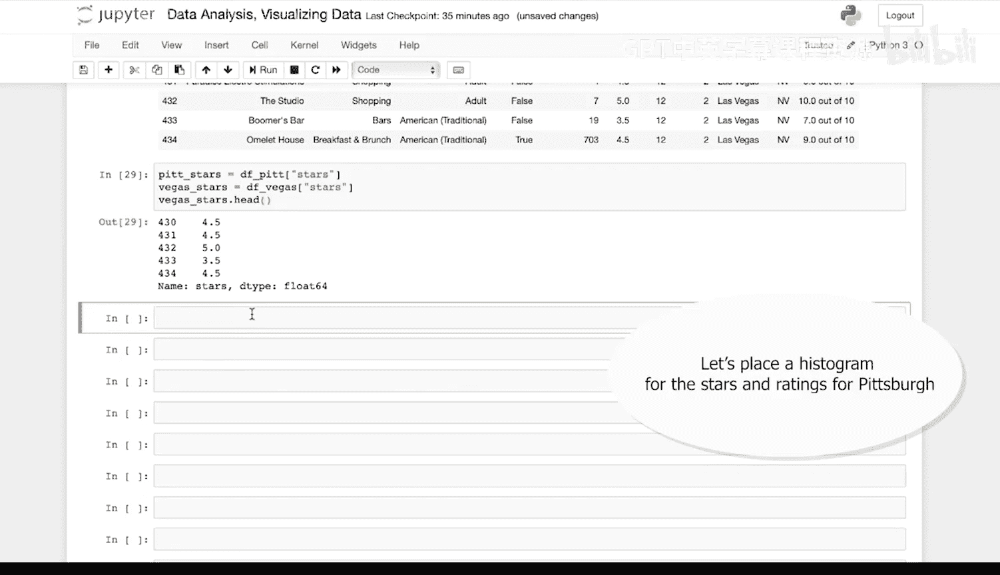

Pylo has several configurations that we can use when creating visualizations。

 Let's use some of the basic ones。

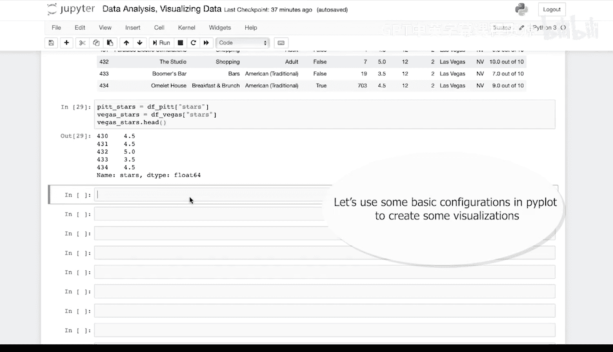

So using the Pi plot library， let's call hist。 and then we're going to pass some arguments。

 The first argument is going to be the data or data frame。

 which is the star ratings values for Pittsburgh。

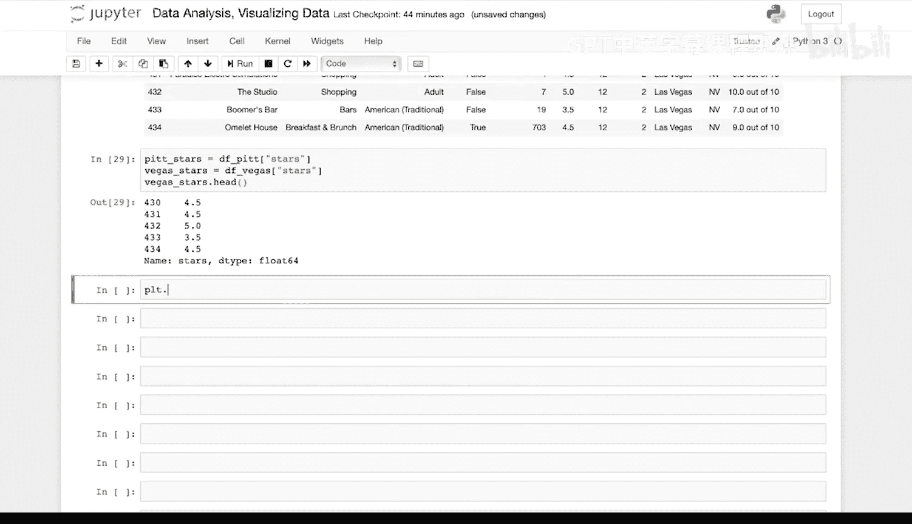

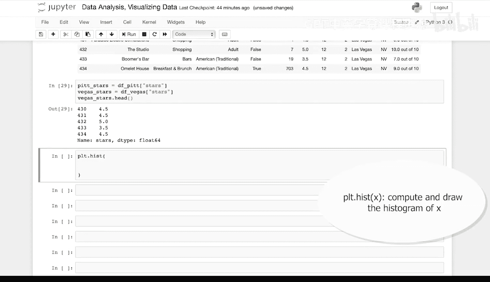

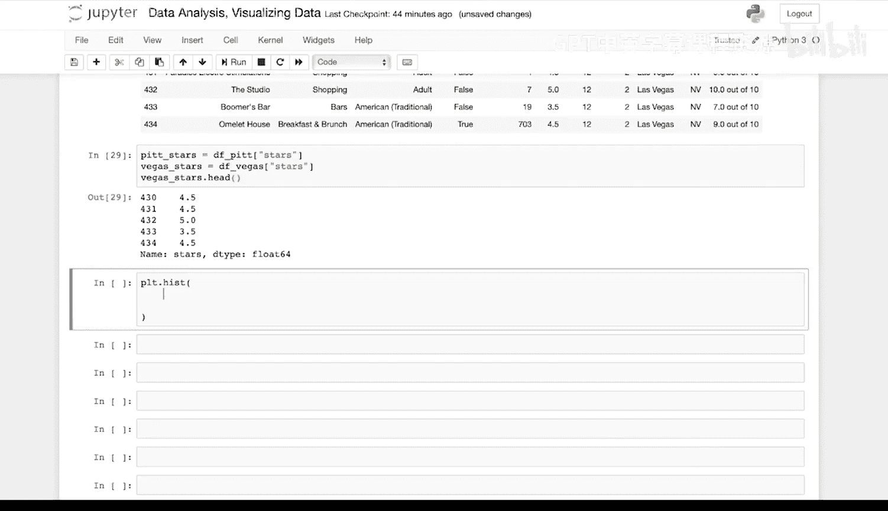

Pit stars。 Then we're going to set an alpha or a transparency setting for the bars in the histogram。

Alpha equals 0。3。

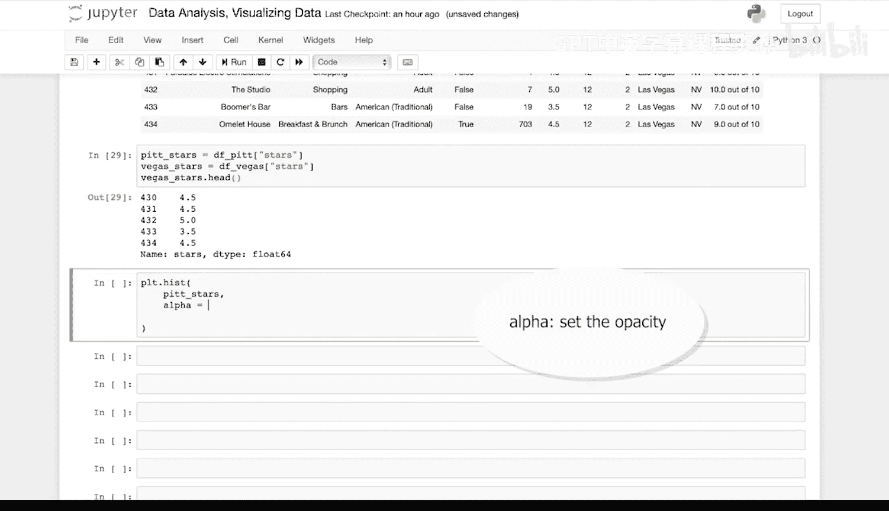

That we'll set a color for the bars in the histogram。

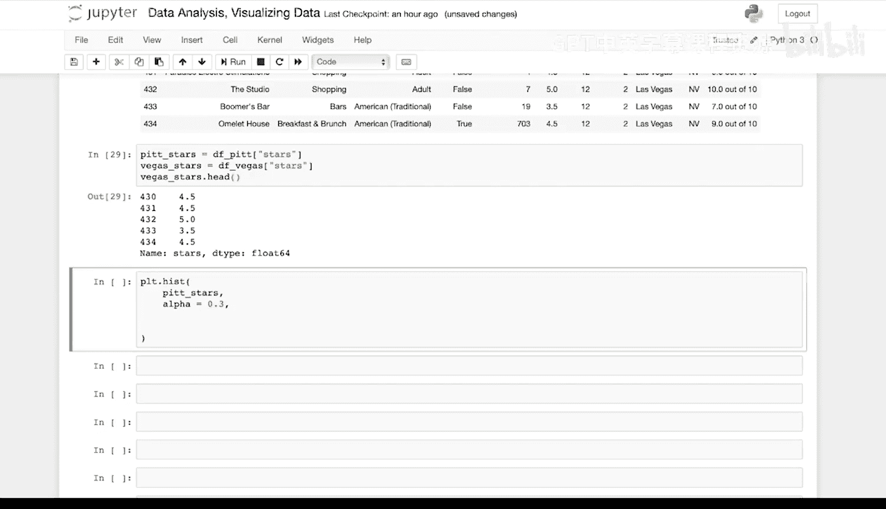

Color equals。 Let's use yellow。

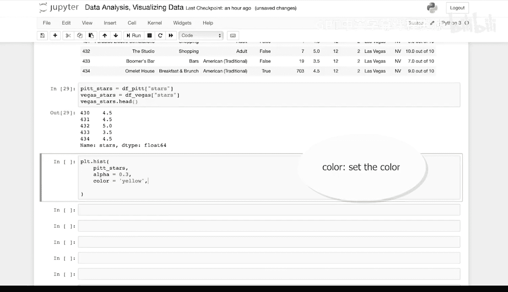

Let's set a label for the histogram。Label equals。😔。

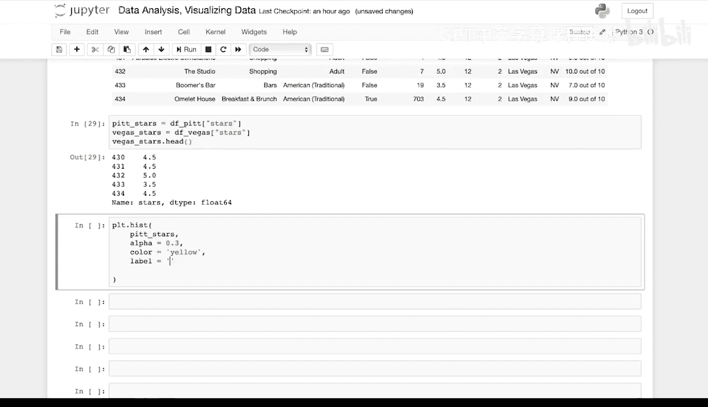

Pittburgh。And then finally， let's set the bins or the dividers for the x axis to size automatically。

 So bins equals。

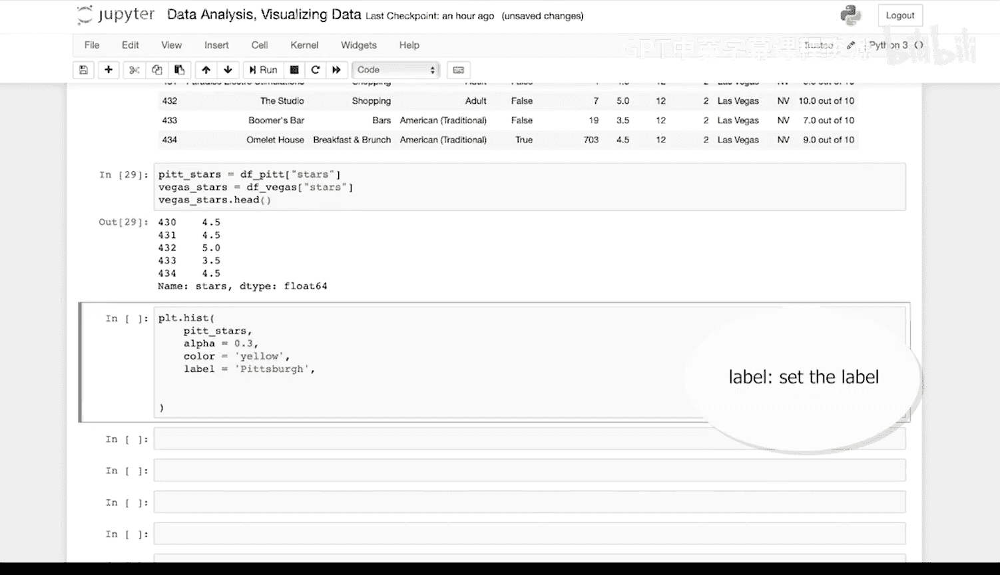

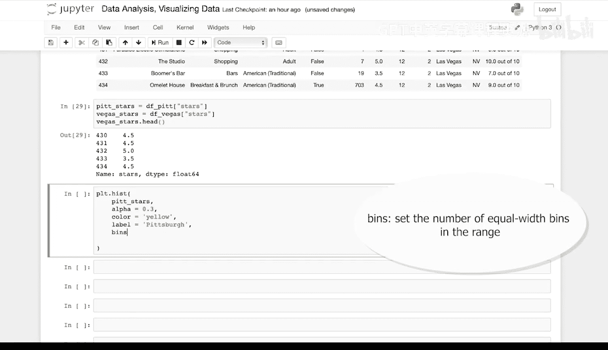

Auto。

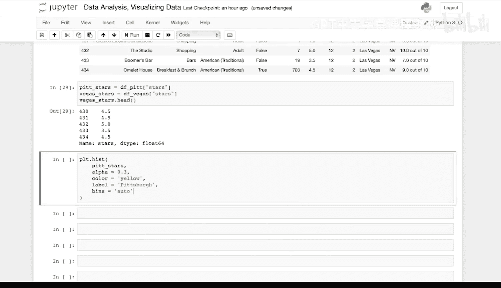

Now let's add another histogram for Las Vegas。 This will overlay the Las Vegas data with the Pittsburgh data。

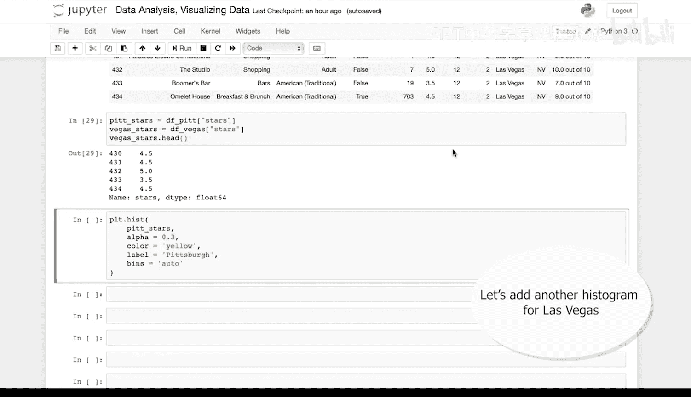

So let's copy this。 I'm going to call hist again this time with the。

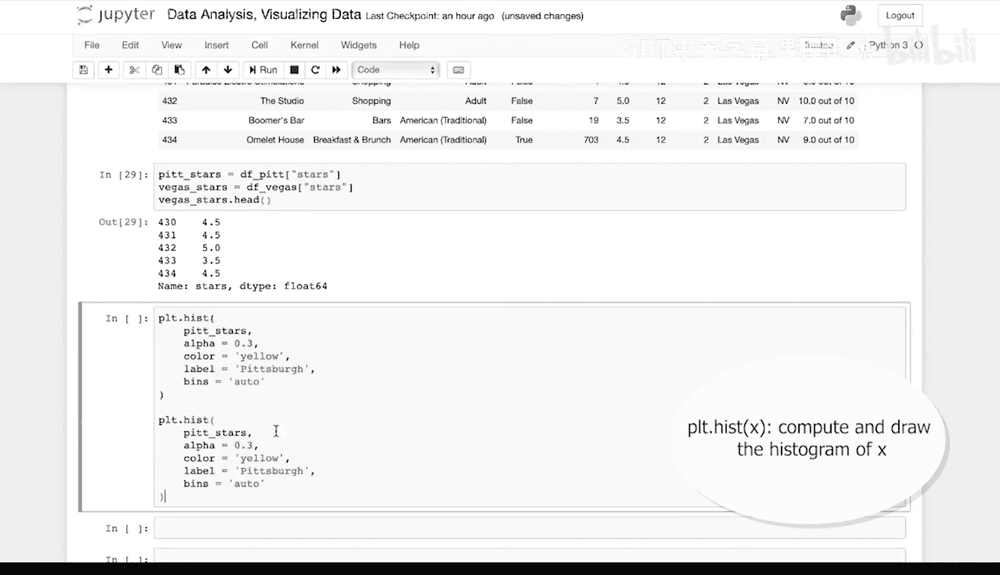

Vegus stars， the alpha will be the same。 The color will change to red。 The label will be La Vegas。

 and the bins are still set to auto。

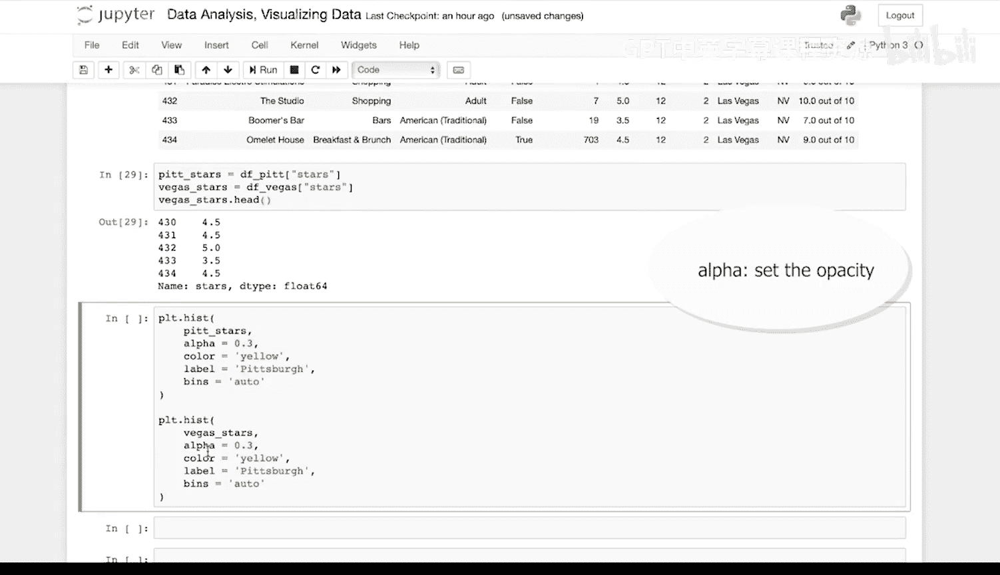

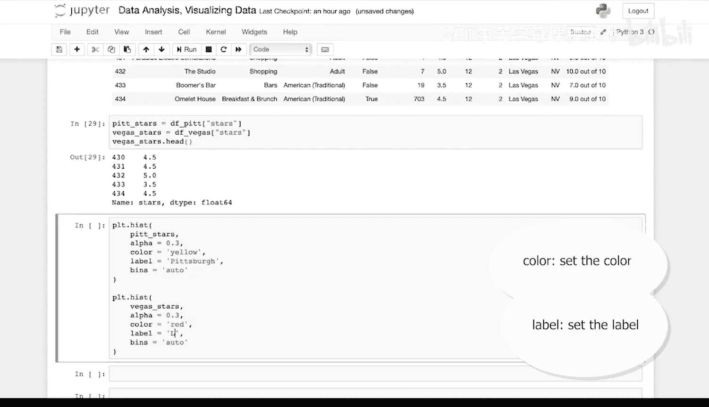