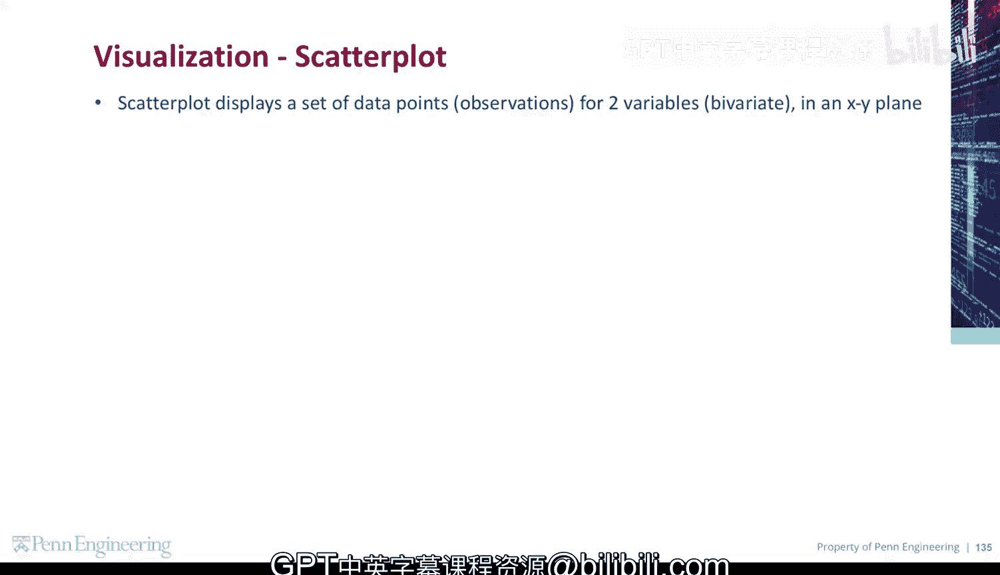
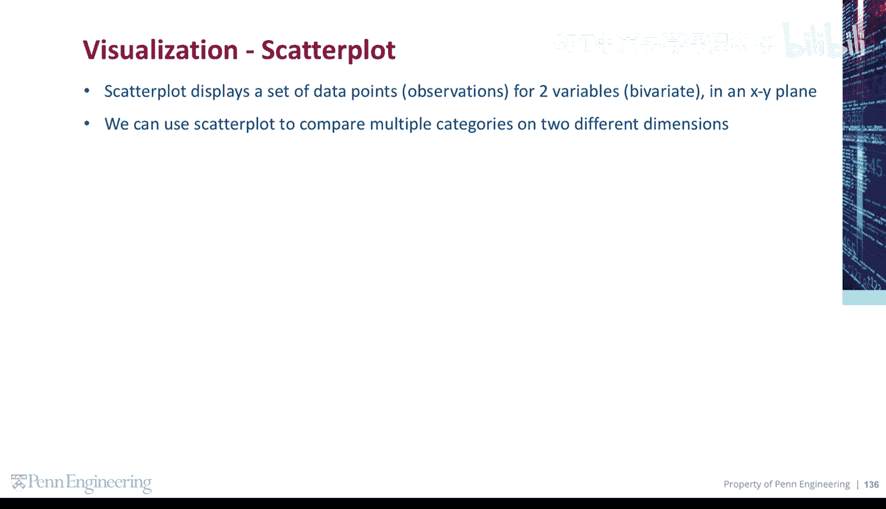
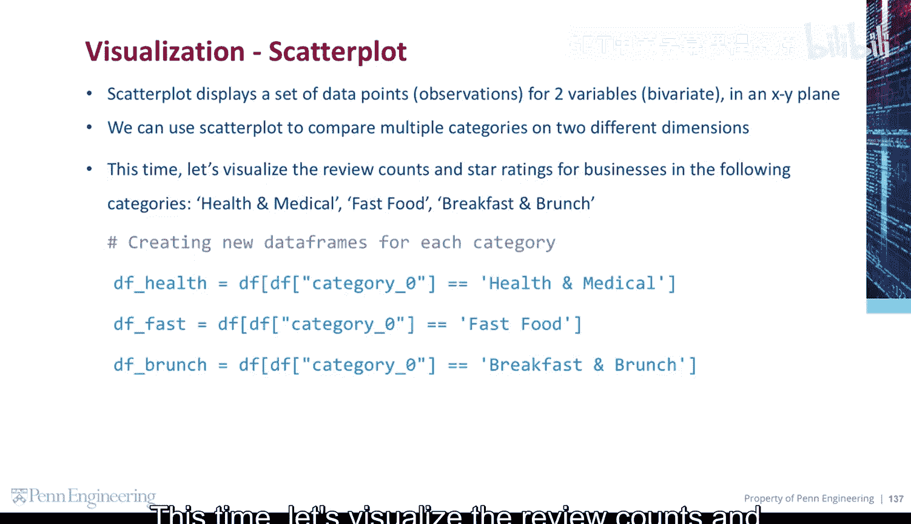
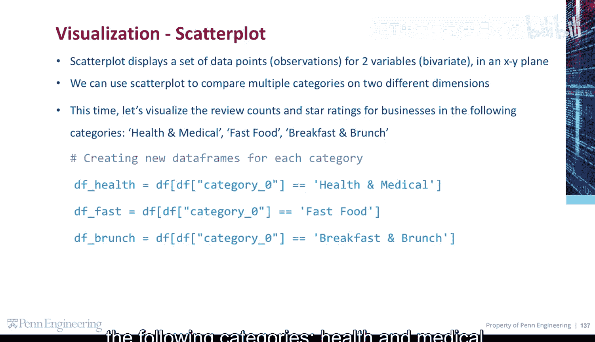
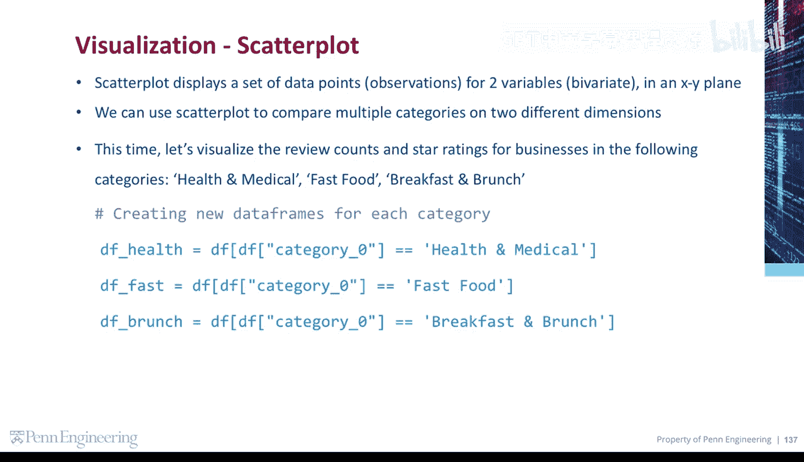
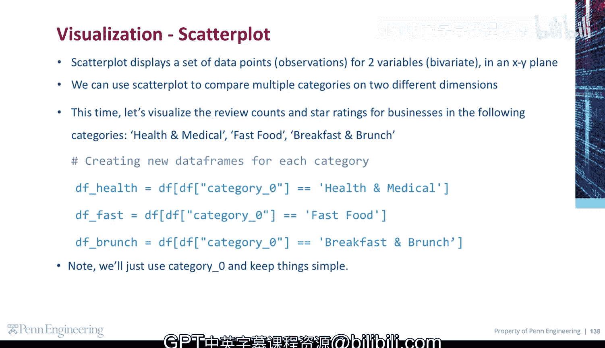

# 宾夕法尼亚大学《Python和Java编程入门1-2｜Introduction to Programming with Python and Java》中英字幕 p142 36_03_08_散点图.zh_en -BV13E421M7FF_p142-

Scatter plots display a set of data points or observations for two variables in an XY plane。

We can use a scatter plot to compare multiple categories on two different dimensions。 This time。

 let's visualize the review counts and star ratings for businesses in the following categories。

 health and medical， fast food， and breakfast and brunch。😡。

Let's start by creating new data frames for each category Note。

 we'll just use category0 and keep things simple。😡。

