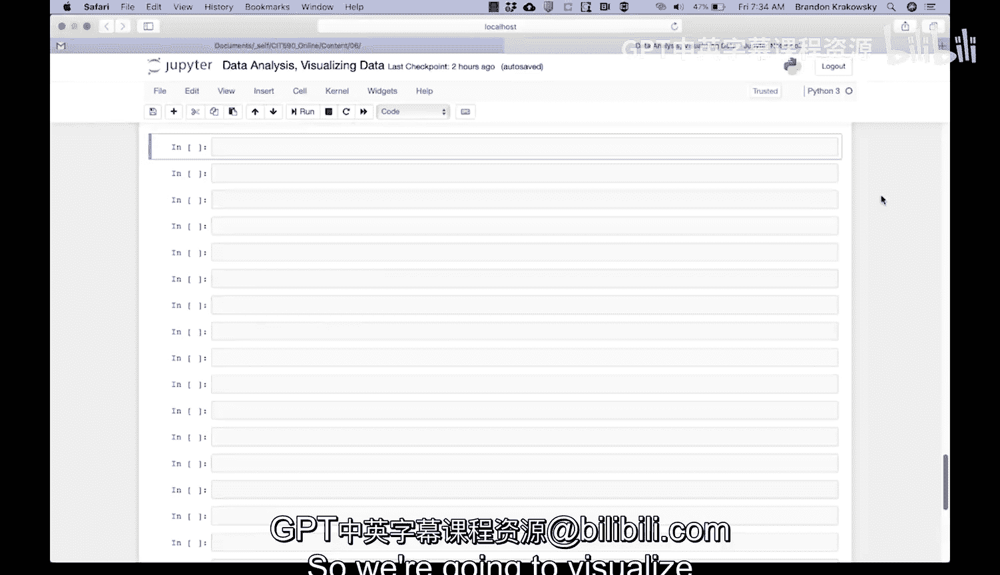
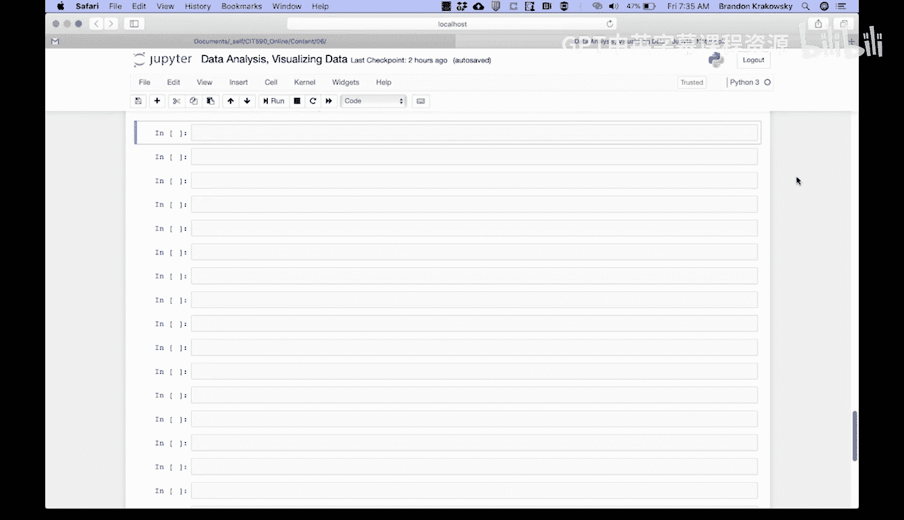

# 宾夕法尼亚大学《Python和Java编程入门1-2｜Introduction to Programming with Python and Java》中英字幕 p143 37_03_09_散点图编码演示-比较不同维度的数据点.zh_en -BV13E421M7FF_p143-

So we're going to visualize the review counts and star ratings for three different categories of businesses。

 health and medical， fast food， breakfast and brunch。

 so we're going to create new data frames for each category。

