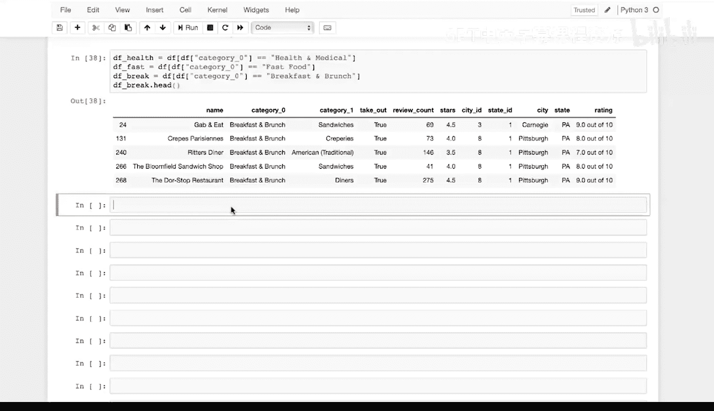
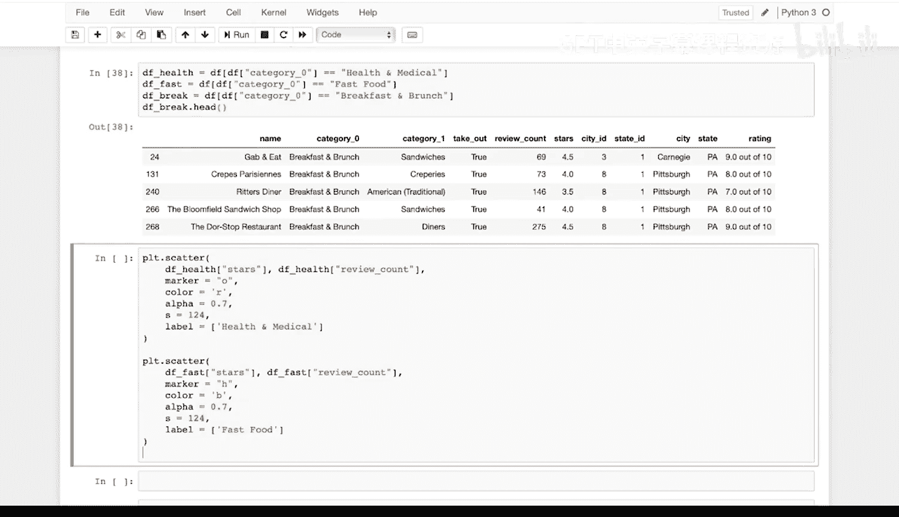
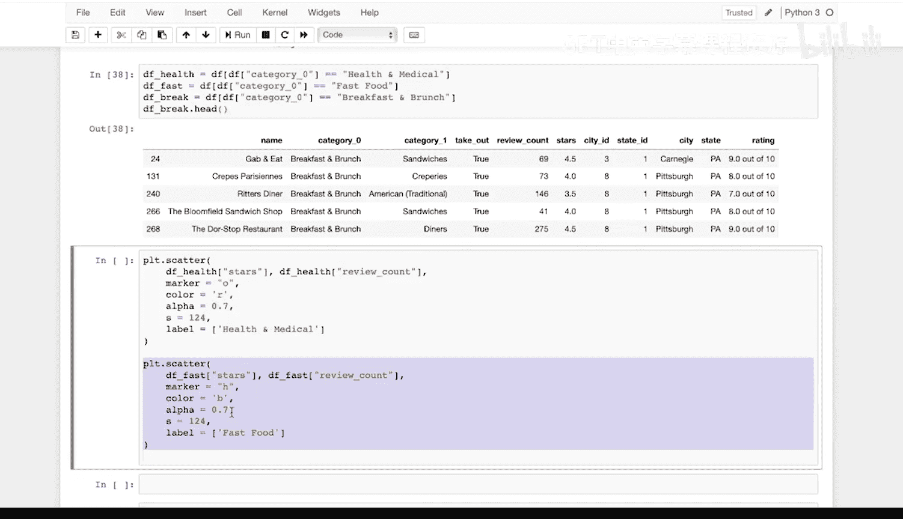
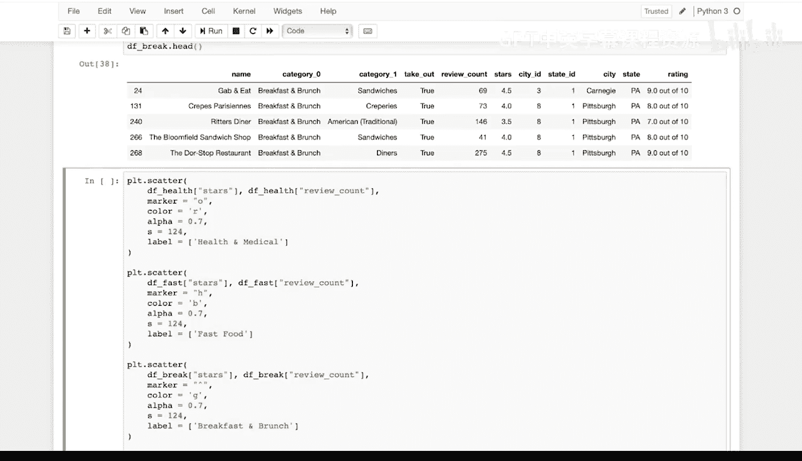
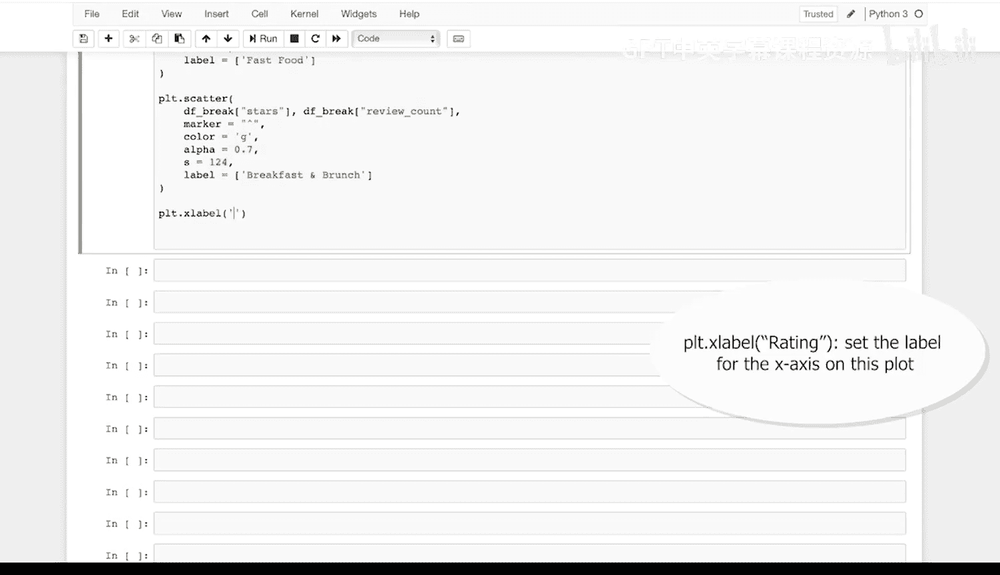
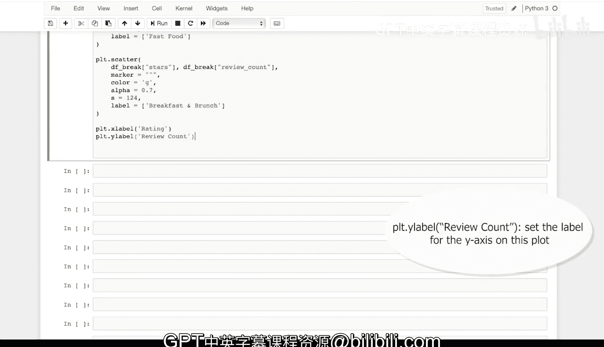
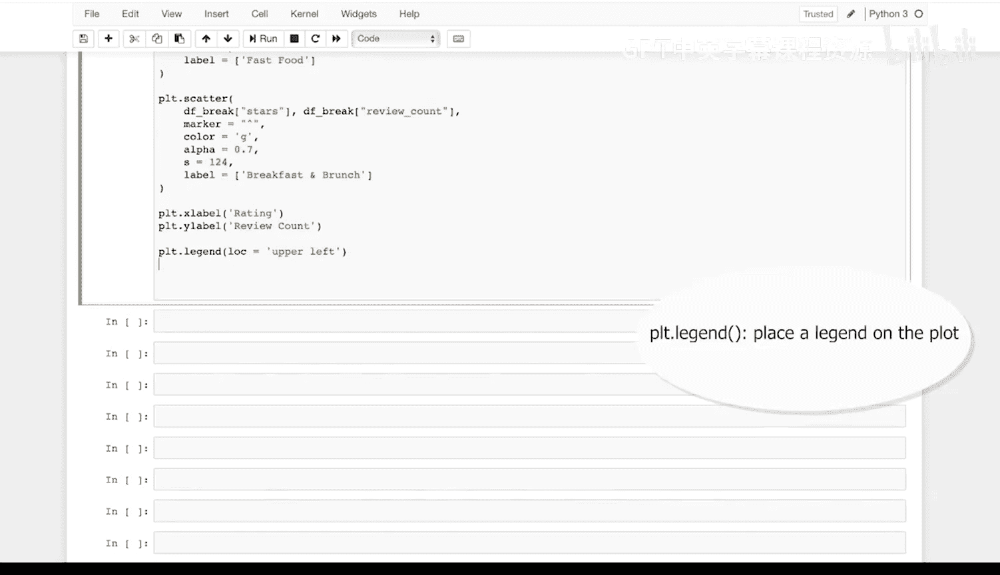

# Python和Java编程入门1-2：39：散点图编码演示-设置Pyplot选项



在本节课中，我们将学习如何使用Matplotlib库的Pyplot模块创建和自定义散点图。我们将通过一个具体示例，展示如何在同一张图表中绘制多个数据集，并设置不同的标记、颜色和标签，最后添加坐标轴标签和图例。

## 创建第一个散点图

上一节我们介绍了散点图的基本概念，本节中我们来看看如何用代码实现它。首先，我们使用 `plt.scatter()` 函数来创建散点图。该函数的前两个参数分别是X轴和Y轴的数据。

对于“健康与医疗”类别的数据，我们将查看其星级评分与评论数量之间的关系。在散点图中，每个数据点对应图上的一个标记。

以下是创建“健康与医疗”类别散点图的代码：

```python
plt.scatter(health['stars'], health['review_count'],
            marker='o', color='r', alpha=0.5, s=50, label='Health and Medical')
```

在这段代码中：
*   `health['stars']` 和 `health['review_count']` 是X轴和Y轴的数据。
*   `marker='o'` 设置标记形状为小写字母‘o’，即圆形。
*   `color='r'` 设置标记颜色为红色。
*   `alpha=0.5` 设置标记的透明度。
*   `s=50` 设置标记的大小。
*   `label='Health and Medical'` 为此系列数据设置标签。

## 添加第二个数据集

接下来，我们在同一个图表中添加第二个数据集。我们将为“快餐”类别的数据绘制散点图，以展示其星级评分与评论数量之间的关系。

以下是添加“快餐”类别散点图的代码：

```python
plt.scatter(fast['stars'], fast['review_count'],
            marker='h', color='b', alpha=0.5, s=50, label='Fast Food')
```

在这段代码中：
*   我们将数据框名称从 `health` 更改为 `fast`。
*   `marker='h'` 将标记形状更改为六边形。
*   `color='b'` 将标记颜色更改为蓝色。
*   标签更新为 `'Fast Food'`。



## 添加第三个数据集

现在，我们在图表中添加第三个数据集。我们将为“早餐与早午餐”类别的数据绘制散点图。

以下是添加“早餐与早午餐”类别散点图的代码：



```python
plt.scatter(break['stars'], break['review_count'],
            marker='^', color='g', alpha=0.5, s=50, label='Breakfast and Brunch')
```

在这段代码中：
*   我们将数据框名称更改为 `break`。
*   `marker='^'` 将标记形状更改为上三角。
*   `color='g'` 将标记颜色更改为绿色。
*   标签更新为 `'Breakfast and Brunch'`。

## 添加图表标签和图例

在绘制了所有数据系列之后，我们需要为图表添加坐标轴标签和图例，使图表信息更完整。



以下是添加标签和图例的代码：



```python
plt.xlabel('Rating')
plt.ylabel('Review Count')
plt.legend(loc='upper left')
```

在这段代码中：
*   `plt.xlabel('Rating')` 设置X轴的标签为“Rating”。
*   `plt.ylabel('Review Count')` 设置Y轴的标签为“Review Count”。
*   `plt.legend(loc='upper left')` 添加图例，并将其位置设置在图表左上角。



## 总结



本节课中我们一起学习了如何使用Matplotlib创建多系列散点图。我们掌握了 `plt.scatter()` 函数的基本用法，并学会了如何通过参数自定义每个数据系列的标记形状、颜色、大小、透明度和标签。最后，我们还为图表添加了坐标轴标签和图例，使其更具可读性。通过这个练习，你可以将多个数据集直观地呈现在同一张图表中进行比较分析。