# Python和Java编程入门1-2：016_01_03_基本数据类型 📊

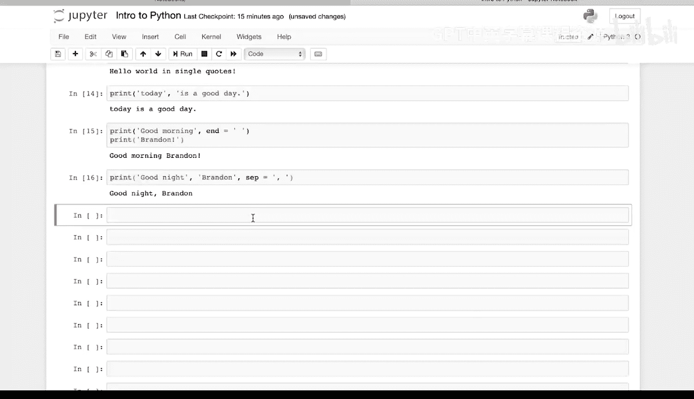

在本节课中，我们将要学习Python中的基本数据类型。理解数据类型是编程的基础，它决定了我们可以对数据进行何种操作。我们将从整数和浮点数开始，并学习如何使用`type()`命令来确认数据的类型。

## 整数类型 (int) 🔢

在Python中，每个值都有一个与之关联的类型。让我们从整数（`int`）开始。整数是正或负的、没有小数点的完整数字。

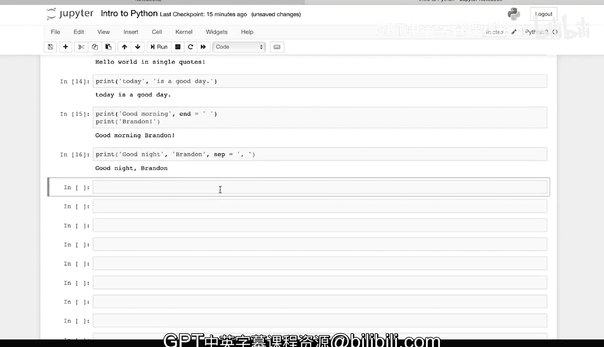

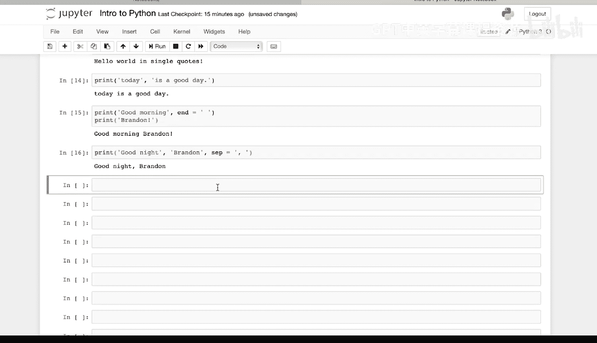

例如，`8`是一个整数。

`-1`也是一个整数。

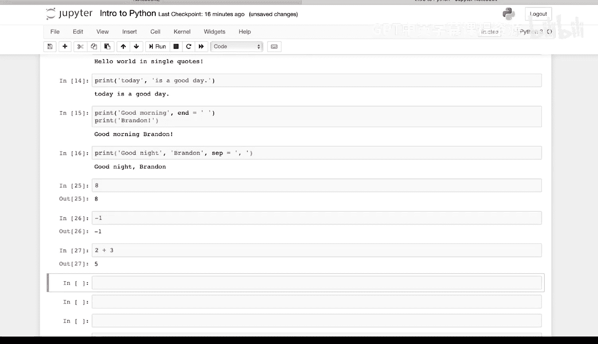

我们可以进行一些简单的数学运算。`2 + 3`，将两个整数相加，得到整数`5`。

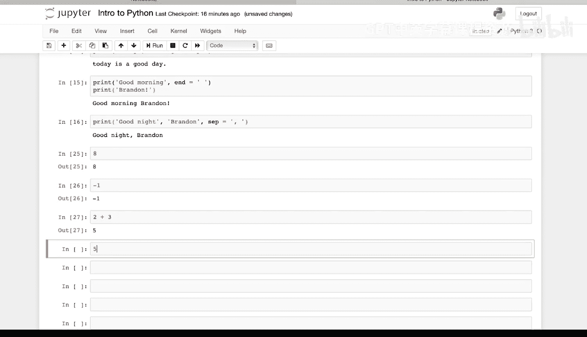

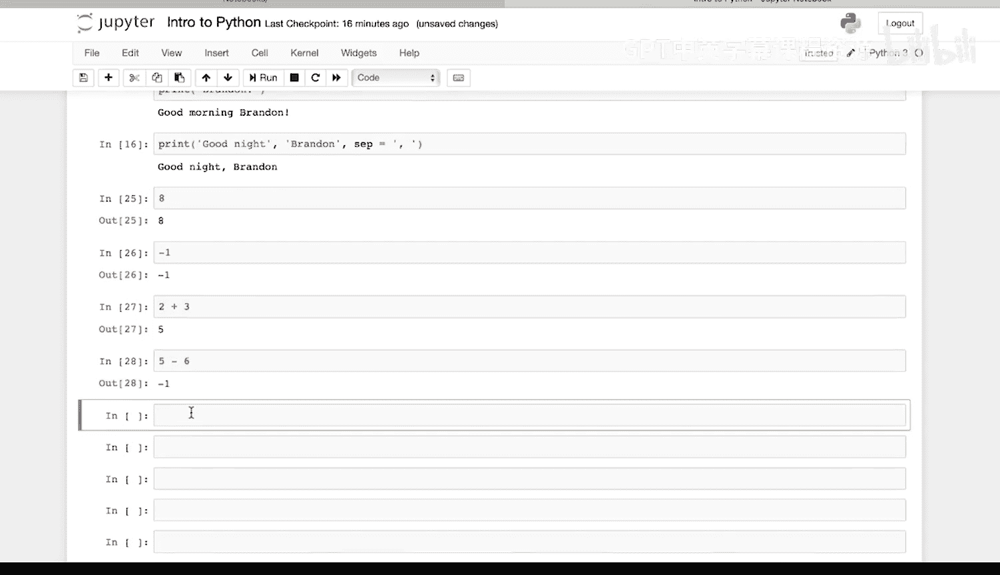

`5 - 6`，得到`-1`，同样是一个整数。

`2 * 3`，得到`6`，也是一个整数。

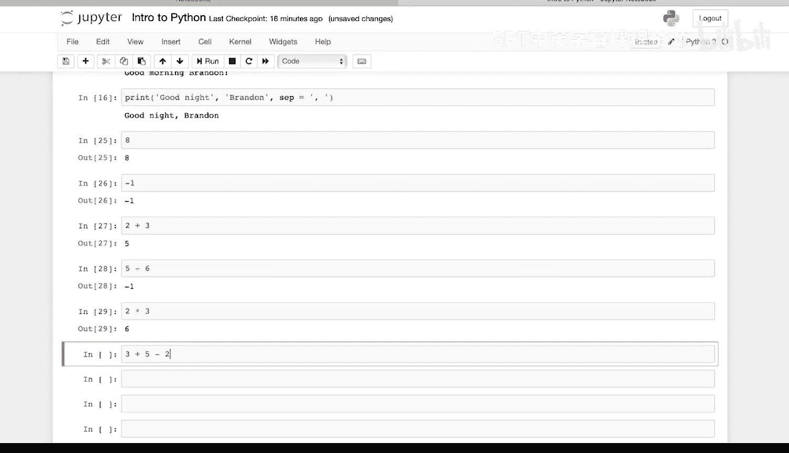

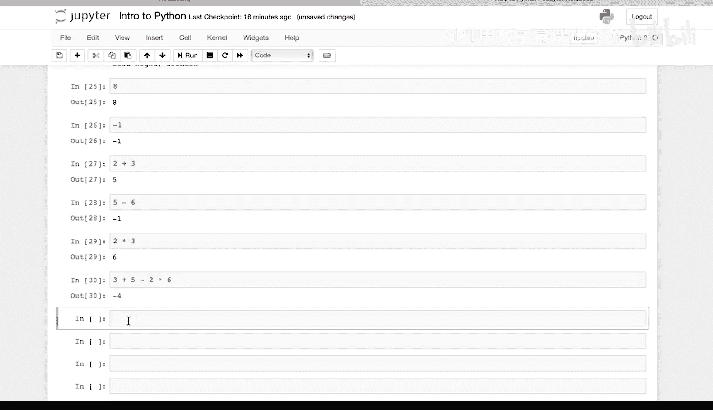

稍微复杂一点的运算：`3 + 5 - 2 * 6`。根据运算顺序，我们得到`-4`。

记住运算顺序，我们可以使用括号：`(3 + 5 - 2) * 6`，得到`36`，这也是一个整数。

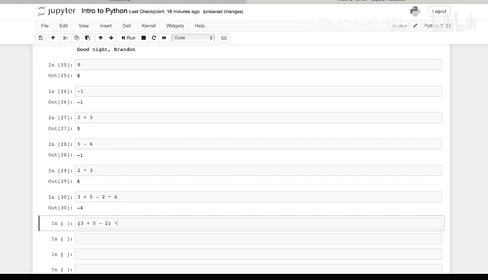

我们可以使用`type()`命令来确认一个值是什么类型。在这种情况下，`type(99)`会告诉我们`99`是一个整数。

## 浮点数类型 (float) 🌊

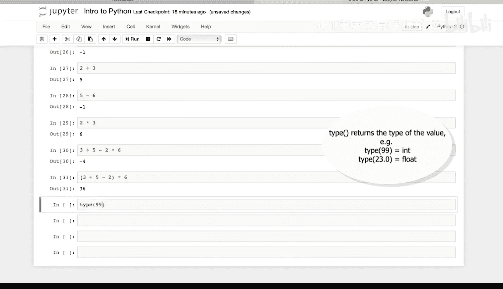

上一节我们介绍了整数，本节中我们来看看浮点数。浮点数是包含小数点的正数或负数。

例如，`1.3`是一个浮点数。

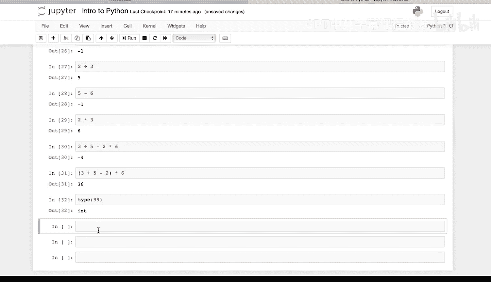

`23.0`是一个浮点数。

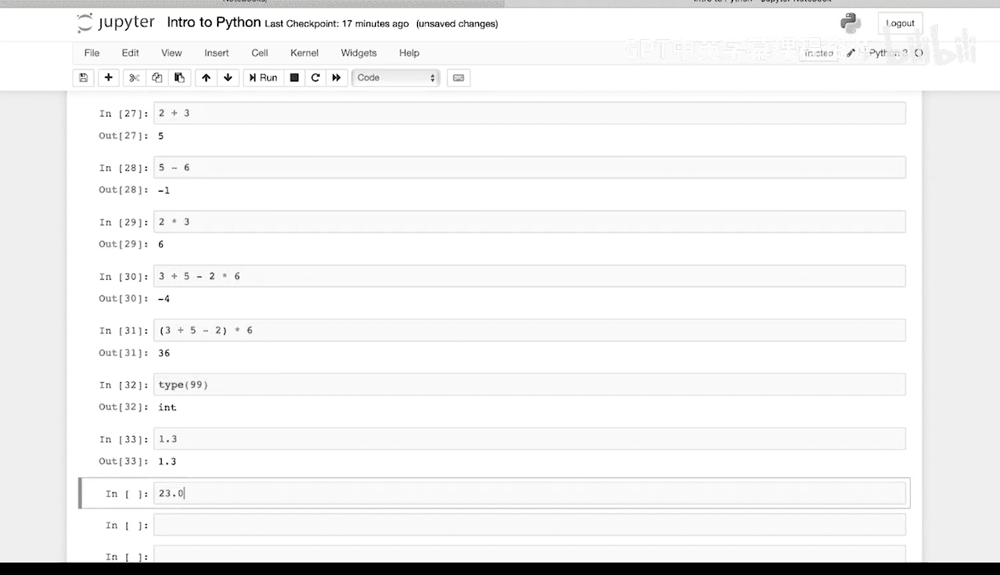

`-5.1`也是一个浮点数。

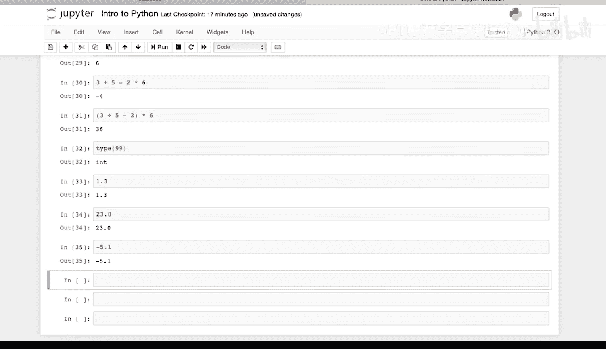

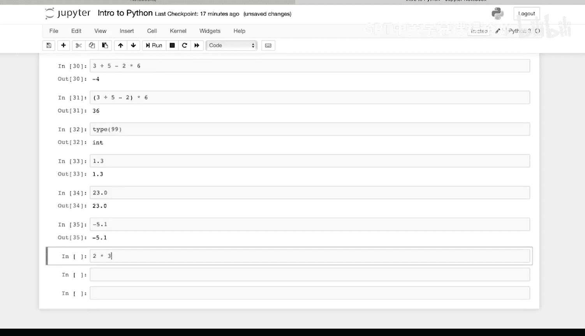

`2 * 3.5`，一个整数乘以一个浮点数，结果是浮点数`7.0`。

`7 / 2.0`，结果是浮点数`3.5`。

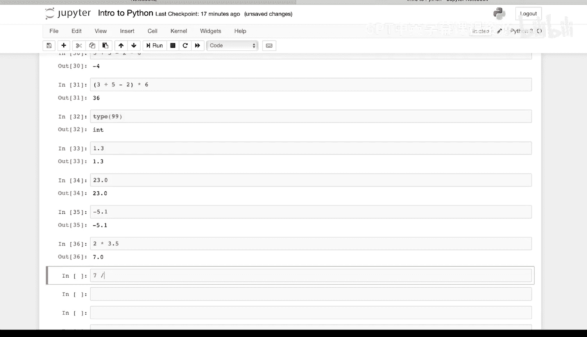

如果我们想查看一个对象的类型，可以再次使用`type()`命令。`type(0.1)`会显示`0.1`是一个浮点数。

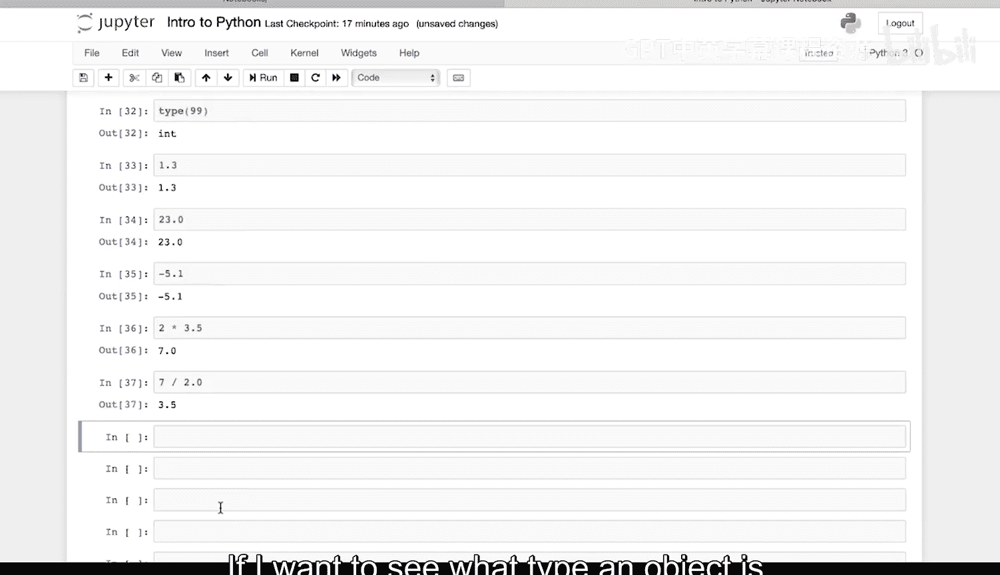

---

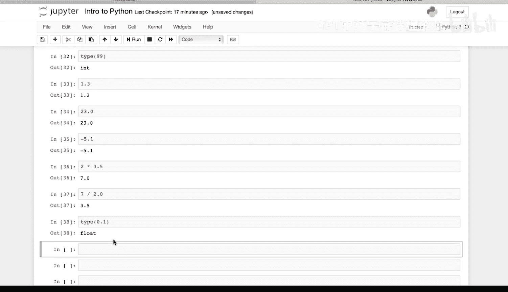

本节课中我们一起学习了Python中的两种基本数据类型：整数（`int`）和浮点数（`float`）。我们了解了它们的定义，并通过示例学习了如何对它们进行数学运算。我们还掌握了使用`type()`函数来检查任何值的类型，这是编程中一个非常有用的调试和验证工具。理解这些基础是后续学习更复杂数据类型和操作的关键。