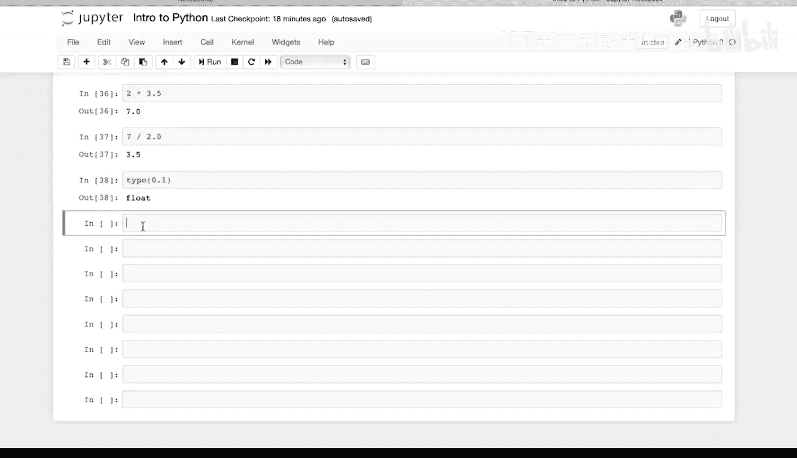
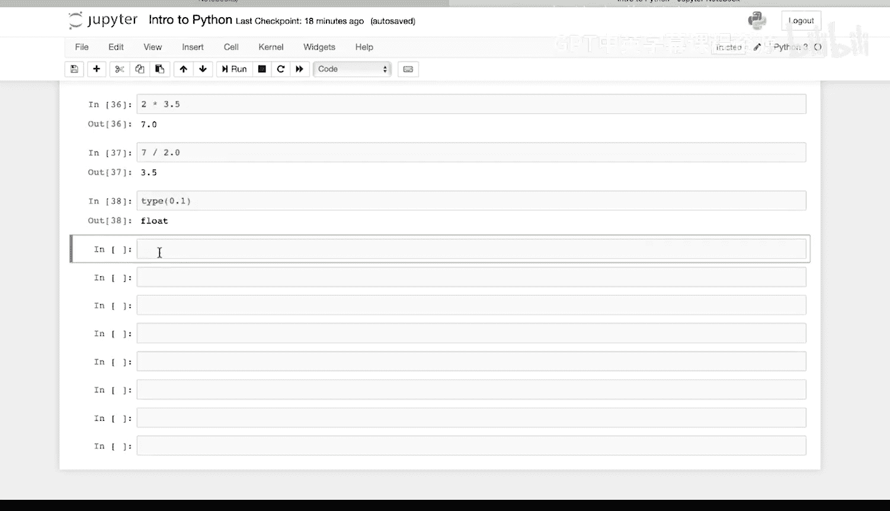
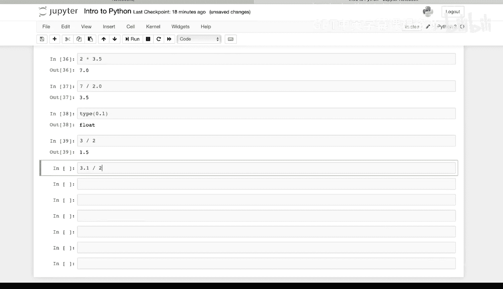
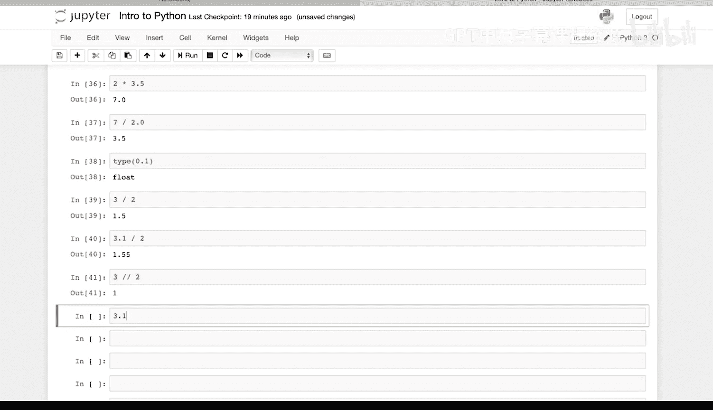
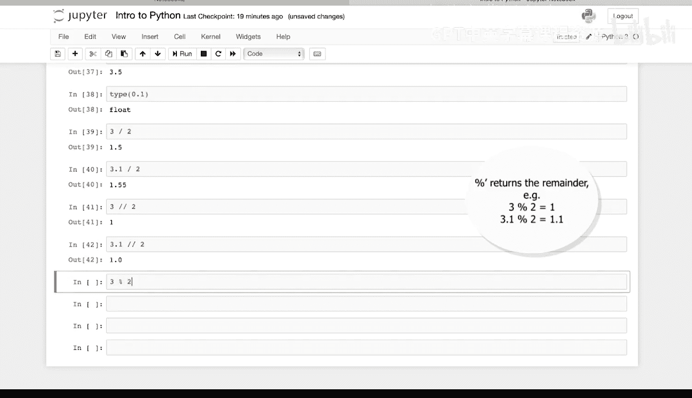
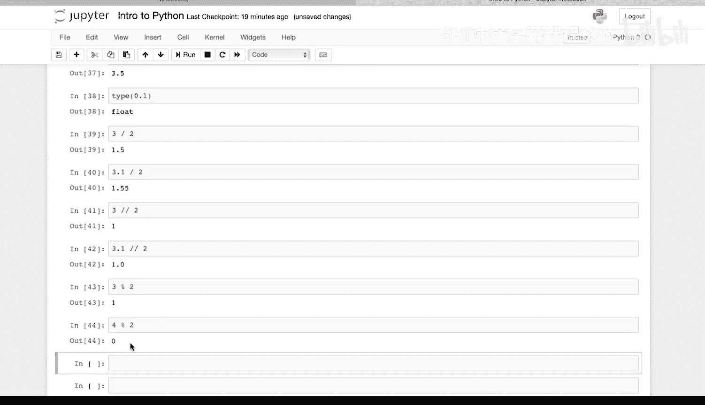
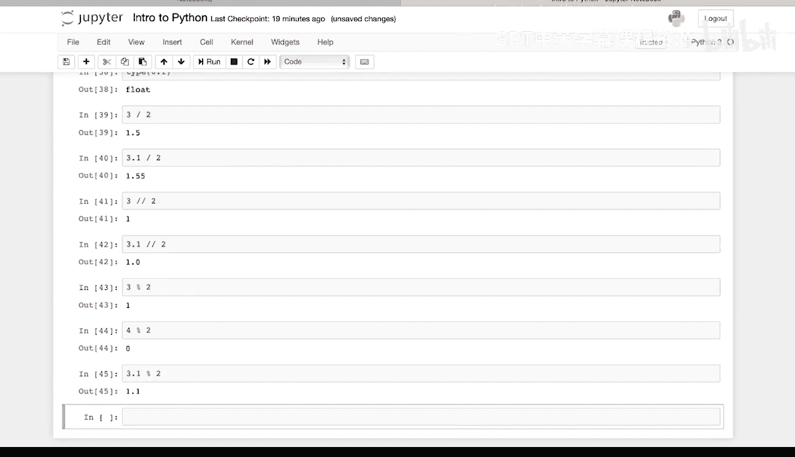
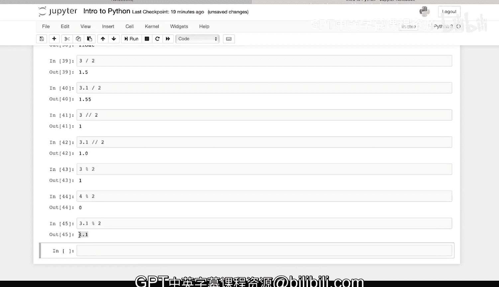
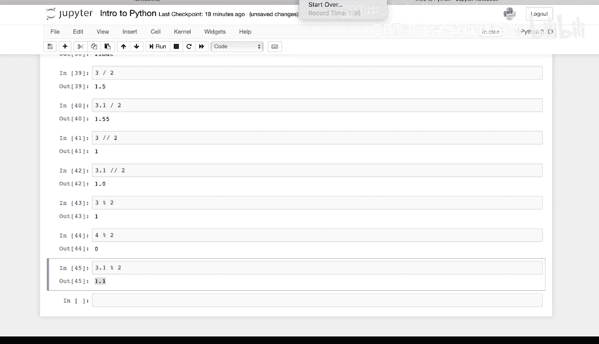

# Python和Java编程入门1-2：018：关于除法运算 🧮

在本节课中，我们将要学习Python中的三种除法运算：普通除法、整数除法和取模运算。理解这些运算的区别对于进行精确的数值计算至关重要。

## 普通除法

首先，我们来看最基础的除法运算，它使用单个正斜杠 `/` 作为运算符。这种除法会返回一个精确的结果，包括小数部分。

以下是几个普通除法的例子：

*   `3 / 2` 的结果是 `1.5`。
*   `3.1 / 2` 的结果是 `1.55`。

## 整数除法

上一节我们介绍了返回精确结果的普通除法，本节中我们来看看整数除法。整数除法使用两个连续的正斜杠 `//` 作为运算符。它的作用是进行除法运算后，**返回结果的整数部分，直接舍弃小数部分**。

以下是整数除法的运算示例：

*   `3 // 2` 的结果是 `1`。因为2只能整除3一次。
*   `3.1 // 2` 的结果同样是 `1`。即使被除数是浮点数 `3.1`，运算结果也只会保留整数部分 `1`。

## 取模运算

了解了返回商的整数除法后，我们再来学习取模运算。取模运算使用百分号 `%` 作为运算符。它的作用是进行除法运算后，**返回余数部分**。

以下是取模运算的示例：

*   `3 % 2` 的结果是 `1`。因为 `3` 除以 `2` 等于 `1`，余数为 `1`。
*   `4 % 2` 的结果是 `0`。因为 `4` 可以被 `2` 整除，没有余数。
*   `3.1 % 2` 的结果是 `1.1`。因为 `3.1` 除以 `2` 等于 `1`，余数为 `1.1`。

## 总结

本节课中我们一起学习了Python中的三种除法运算：
1.  **普通除法 (`/`)**：返回包含小数的精确结果。
2.  **整数除法 (`//`)**：返回商的整数部分，舍弃小数。
3.  **取模运算 (`%`)**：返回除法运算后的余数。

掌握这些运算将帮助你在程序中更灵活地处理数值计算。