# Python和Java编程入门1-2：019_01_06_布尔值 🔢

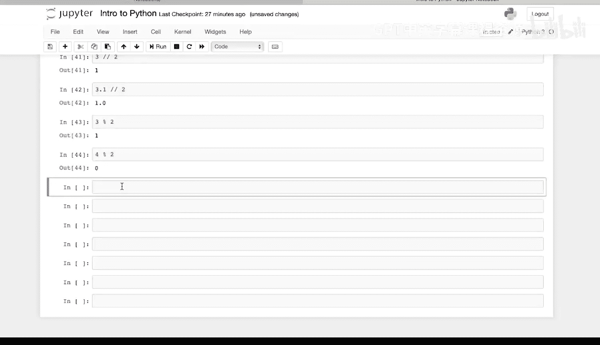

在本节课中，我们将要学习Python中的布尔值。布尔值是一种表示“真”或“假”的数据类型，它是编程中进行逻辑判断和决策的基础。我们将通过具体的例子来理解布尔值是如何工作的，以及如何通过比较运算得到布尔值。

---

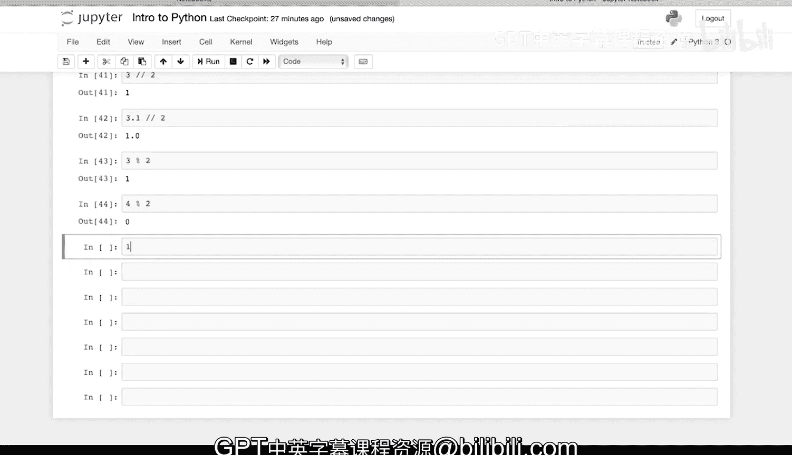

## 什么是布尔值？ 🤔

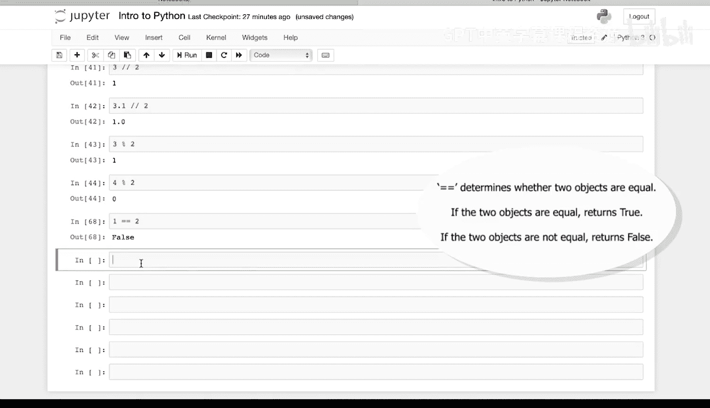

布尔值（Boolean）是一个表示“真”（True）或“假”（False）的值。在Python中，我们可以通过比较运算来得到布尔值。

例如，我们可以问：1等于2吗？

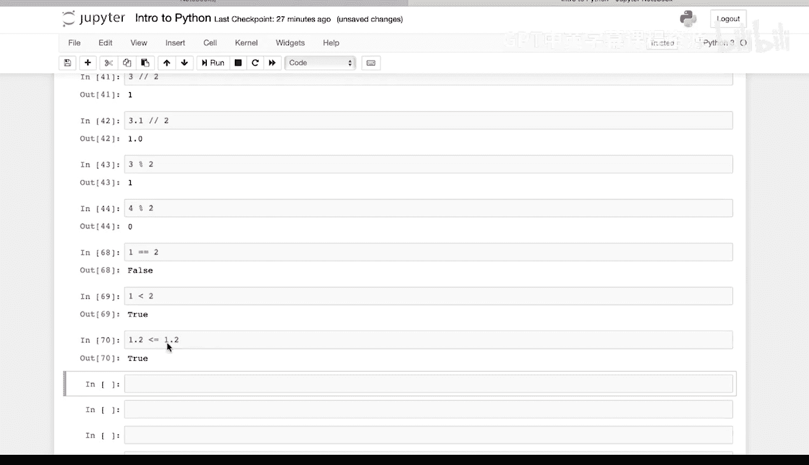

```python
1 == 2
```
这个表达式的值是 `False`。

---

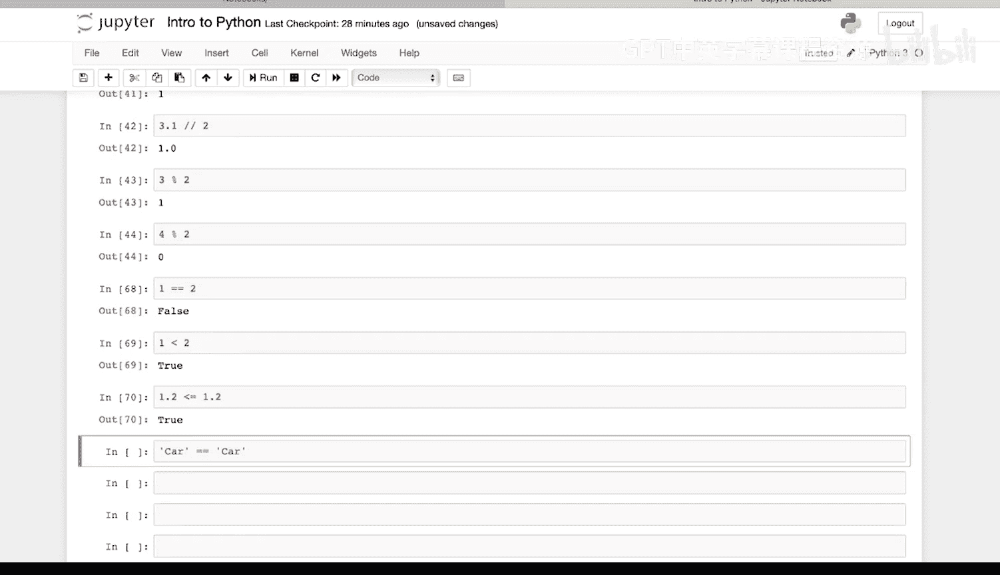

## 数值比较与布尔值

上一节我们介绍了布尔值的基本概念，本节中我们来看看如何使用比较运算符来生成布尔值。

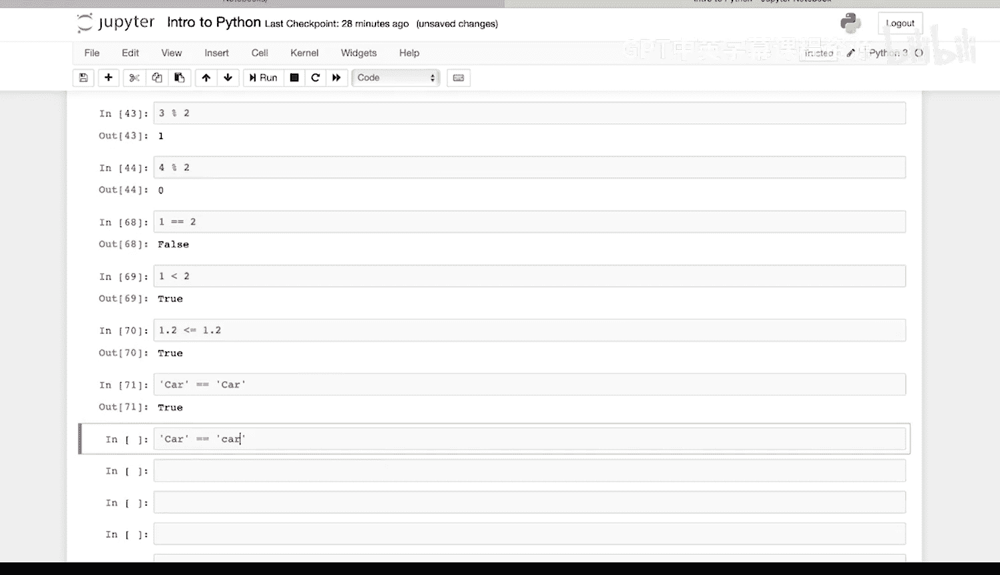

以下是几个数值比较的例子：

*   `1 < 2` 的结果是 `True`。
*   `1.2 <= 1.2` 的结果是 `True`，因为1.2等于1.2。

---

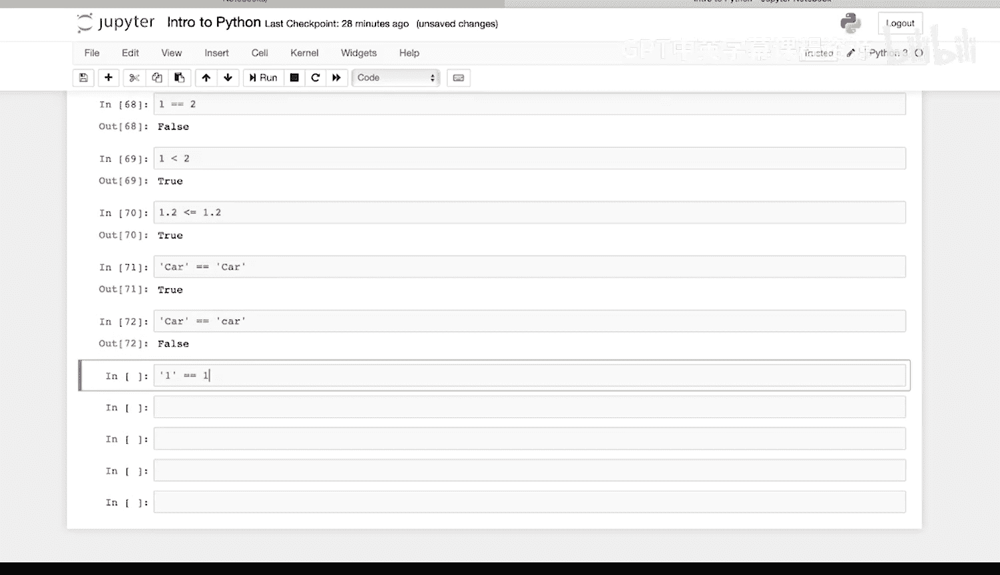

## 字符串比较与布尔值

除了数字，我们也可以比较字符串。字符串的比较会同时考虑类型和值。

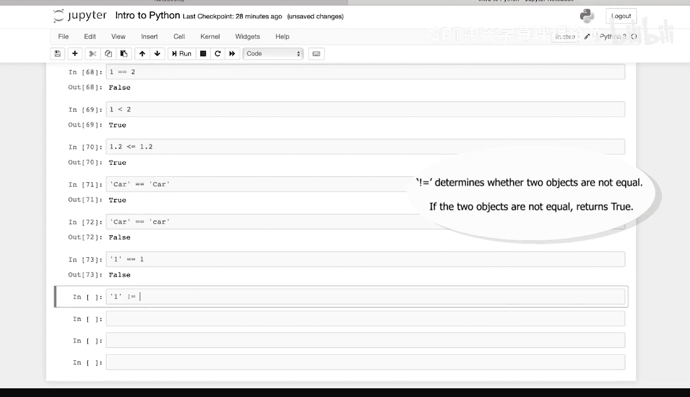

以下是几个字符串比较的例子：

*   `‘car’ == ‘car’` 的结果是 `True`，因为类型相同，值也相同。
*   `‘Car’ == ‘car’` 的结果是 `False`，因为虽然类型相同，但值不同（大小写不同）。
*   `‘1’ == 1` 的结果是 `False`，因为类型不同（一个是字符串，一个是整数）。

我们还可以使用“不等于”运算符 `!=` 进行比较：
*   `‘1’ != 1` 的结果是 `True`，因为它们确实不相等。

---

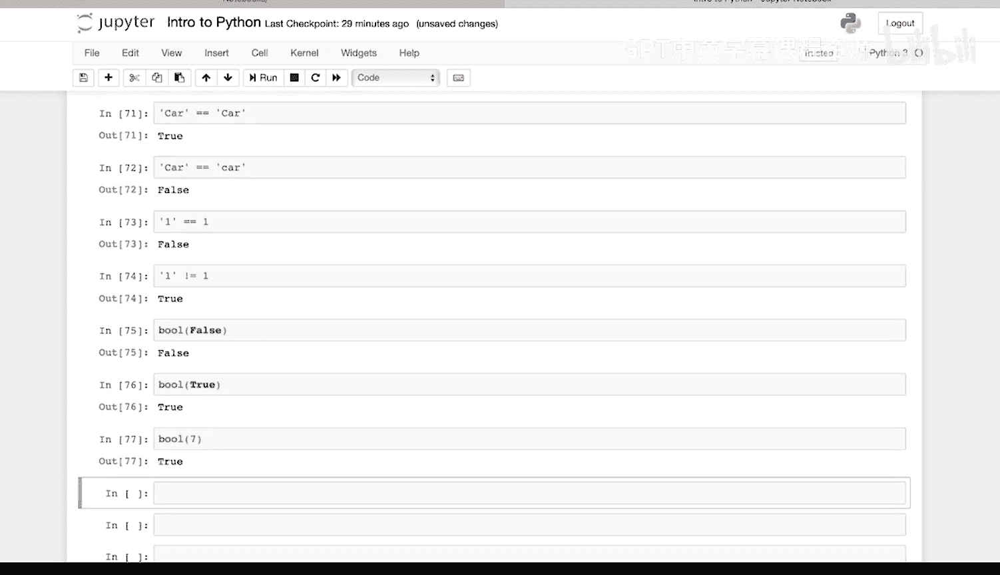

## 对象的布尔值

在Python中，每个对象都有一个内在的布尔值。这意味着我们可以直接测试一个对象在逻辑上是“真”还是“假”。

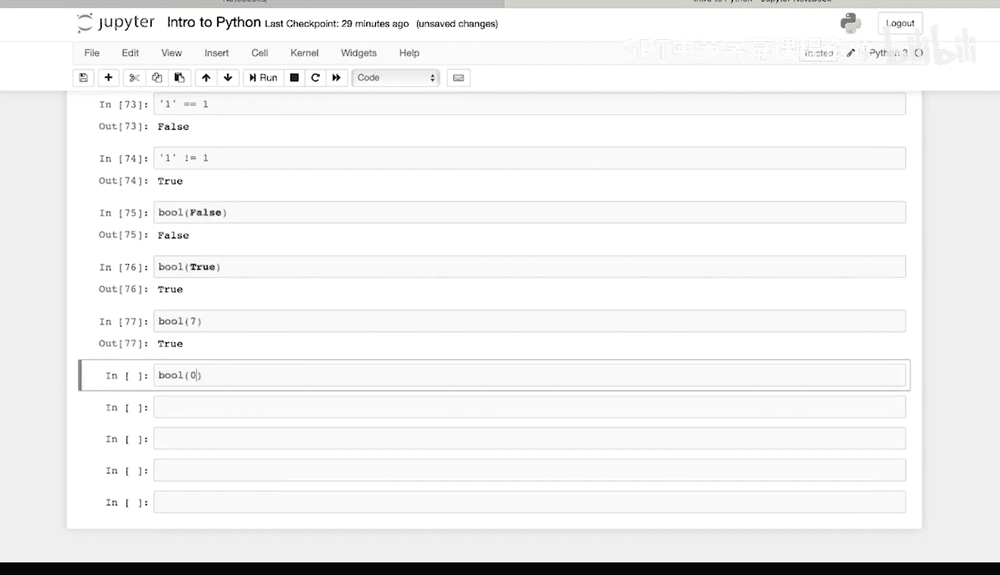

以下是测试不同对象布尔值的例子：

*   `bool(False)` 的值是 `False`。
*   `bool(True)` 的值是 `True`。
*   `bool(7)` 的值是 `True`。
*   `bool(0)` 的值是 `False`。通常，任何非零数值的布尔值都是 `True`，而零的布尔值是 `False`。
*   `bool(7 == 0)` 的值是 `False`，因为 `7 == 0` 这个比较表达式本身的结果是 `False`。

---

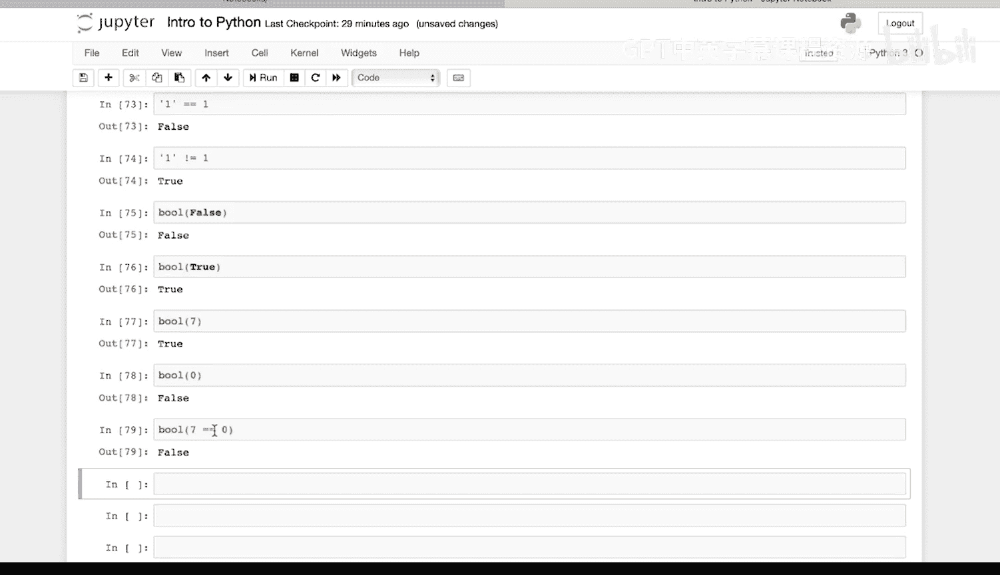

## 总结

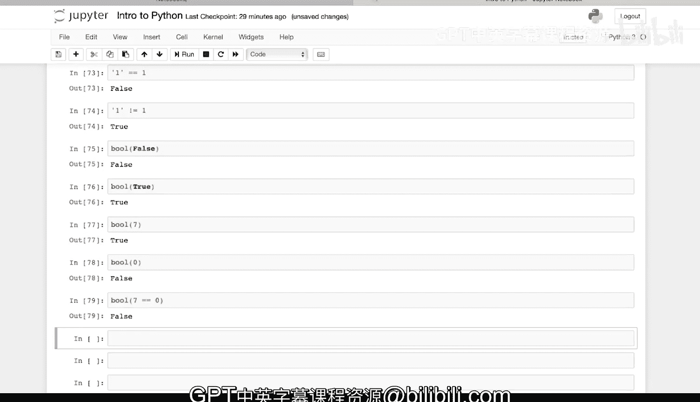

本节课中我们一起学习了Python中的布尔值。我们了解到布尔值是 `True` 或 `False`，可以通过比较运算符（如 `==`， `!=`， `<`， `<=`）来获得。我们还学习了Python中每个对象都有一个内在的布尔值，例如非零数字为 `True`，零为 `False`。理解布尔值是掌握程序流程控制（如 `if` 语句）的关键第一步。