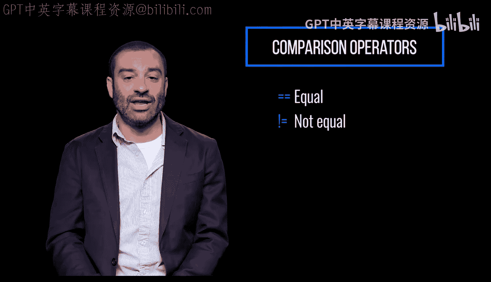
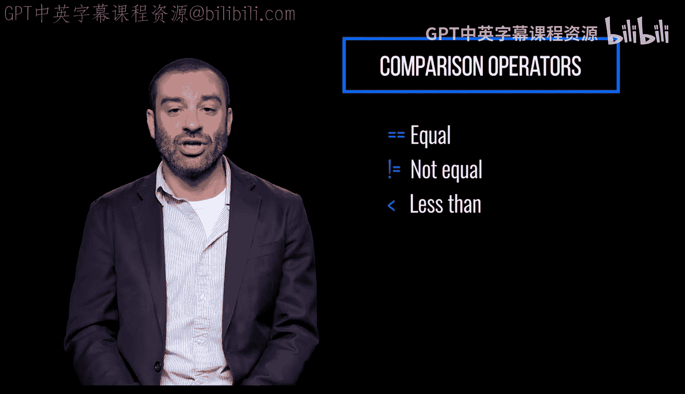
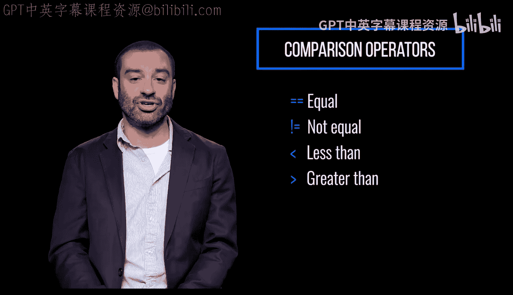
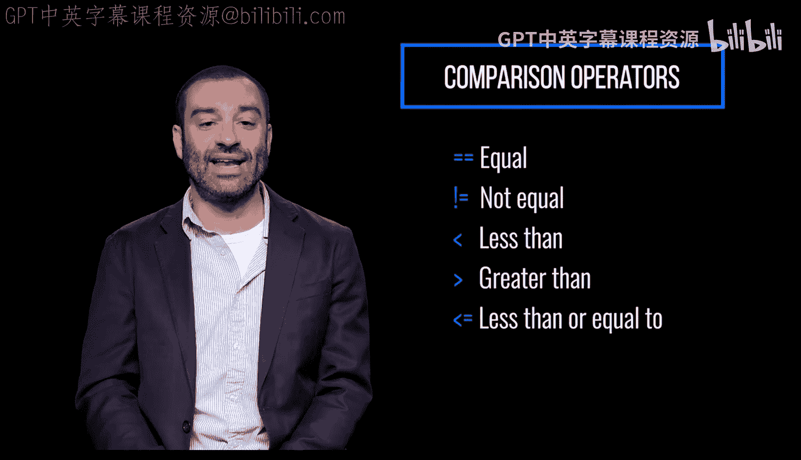
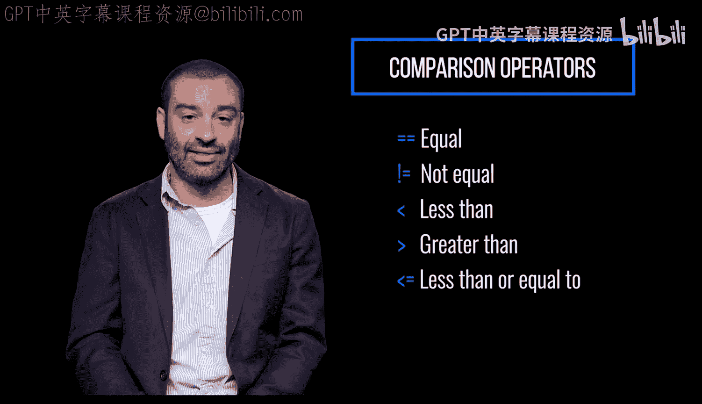
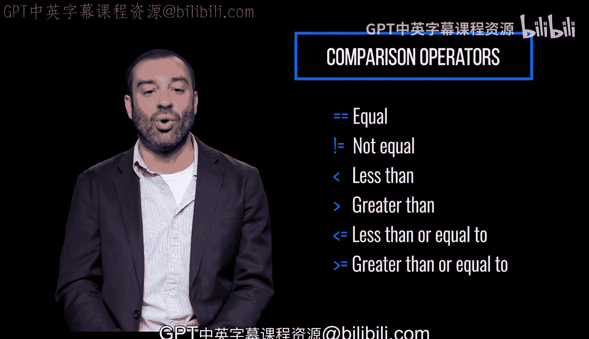

# Python和Java编程入门1-2：1.7：比较运算符 🔍

在本节课中，我们将要学习Python中的比较运算符。比较运算符用于比较两个值，并判断它们之间的关系，其运算结果是一个布尔值（`True` 或 `False`）。掌握比较运算符是编写条件判断语句的基础。

## 相等与不相等比较

上一节我们介绍了变量的概念，本节中我们来看看如何比较两个值是否相等。

使用双等号 `==` 可以测试两个值是否相等。使用感叹号加等号 `!=` 可以测试两个值是否不相等。

以下是这两种运算符的示例：
*   `5 == 5` 的结果是 `True`。
*   `5 == 3` 的结果是 `False`。
*   `5 != 3` 的结果是 `True`。
*   `5 != 5` 的结果是 `False`。

## 大小比较

除了判断相等，我们还可以比较数值的大小关系。

使用小于号 `<` 可以测试一个值是否小于另一个值。使用大于号 `>` 可以测试一个值是否大于另一个值。

以下是这两种运算符的示例：
*   `3 < 5` 的结果是 `True`。
*   `5 < 3` 的结果是 `False`。
*   `7 > 2` 的结果是 `True`。
*   `2 > 7` 的结果是 `False`。

## 包含等值的大小比较

有时我们需要判断一个值是否“小于或等于”或“大于或等于”另一个值。

小于等于号 `<=` 测试一个值是否小于或等于另一个值。同理，大于等于号 `>=` 测试一个值是否大于或等于另一个值。

以下是这两种运算符的示例：
*   `5 <= 5` 的结果是 `True`。
*   `4 <= 5` 的结果是 `True`。
*   `6 <= 5` 的结果是 `False`。
*   `5 >= 5` 的结果是 `True`。
*   `6 >= 5` 的结果是 `True`。
*   `4 >= 5` 的结果是 `False`。

本节课中我们一起学习了Python的六种基本比较运算符：`==`（等于）、`!=`（不等于）、`<`（小于）、`>`（大于）、`<=`（小于等于）和 `>=`（大于等于）。它们用于比较两个值并返回布尔结果，是构建程序逻辑判断的核心工具。