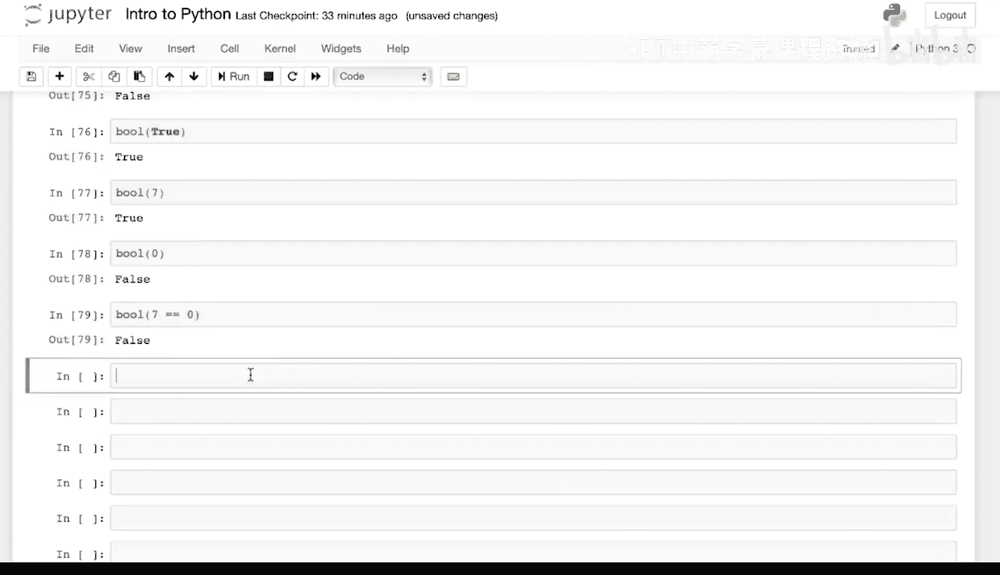
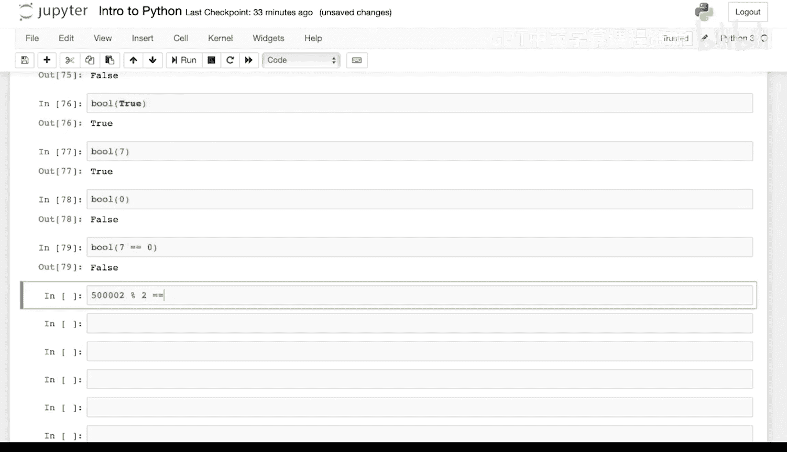
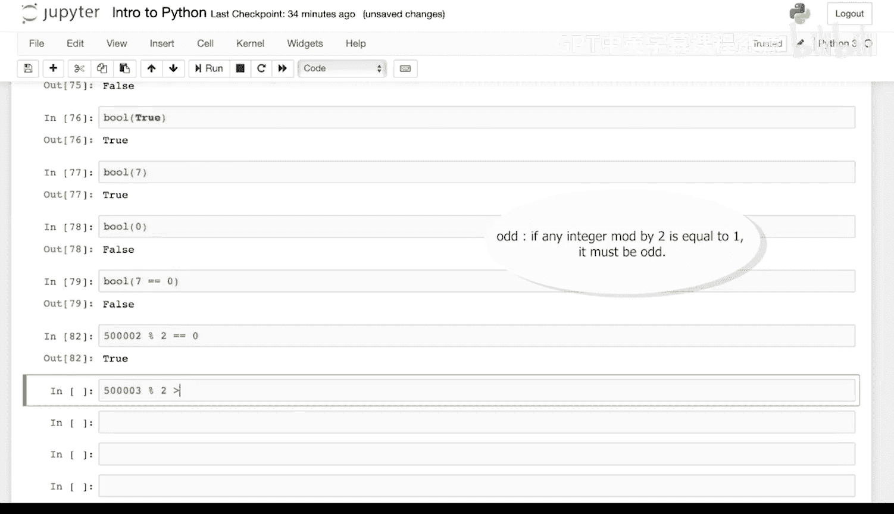
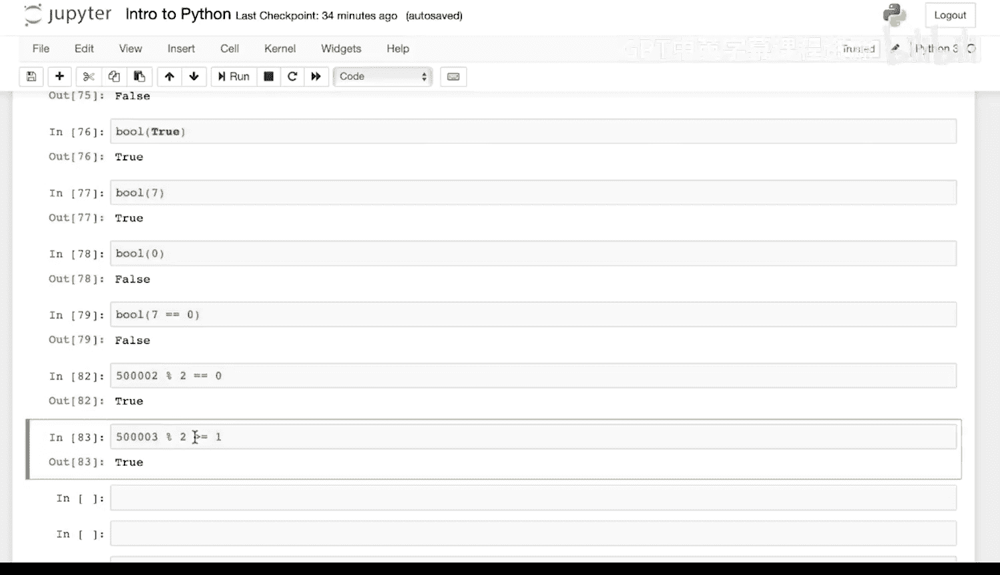

# Python和Java编程入门1-2：021：代码练习-判断奇偶数 🧮

在本节课中，我们将通过一个简单的代码练习来学习如何使用取模运算符判断一个整数是奇数还是偶数。我们将从理解奇偶数的数学定义开始，然后将其转化为编程逻辑。



## 概述

判断一个数字是奇数还是偶数是编程中的基础任务。其核心原理基于一个简单的数学运算：**取模运算**。取模运算返回两个数相除后的余数。对于判断奇偶性，我们关心的是这个数字除以2后的余数。

## 判断奇偶性的原理

一个整数如果能被2整除，即除以2的余数为0，那么它就是偶数。反之，如果除以2的余数不为0（通常为1），那么它就是奇数。这个逻辑可以用取模运算符 `%` 来表示。

以下是判断逻辑的公式化描述：
*   **偶数**：`number % 2 == 0`
*   **奇数**：`number % 2 != 0` 或 `number % 2 == 1`



上一节我们介绍了判断奇偶性的基本原理，本节中我们来看看如何应用这些原理进行具体的判断练习。

## 代码练习解析

让我们通过两个具体的数字来实践这个判断过程。

**示例一：判断50002是否为偶数**

我们取数字50002，计算它除以2的余数，并检查余数是否等于0。
```python
50002 % 2 == 0
```
计算结果是 `True`。因为50002除以2没有余数，所以它是偶数。



**示例二：判断50003是否为奇数**

接下来，我们取数字50003，计算它除以2的余数。
```python
50003 % 2
```
余数大于或等于1（实际上就是1）。因为除以2有余数，所以它一定是奇数。



## 总结

本节课中我们一起学习了如何使用取模运算符 `%` 来判断一个整数的奇偶性。关键点在于检查 `number % 2` 的结果：如果等于0，则是偶数；如果不等于0（或等于1），则是奇数。这是将基础数学概念转化为编程逻辑的一个经典且实用的例子。