# 宾夕法尼亚大学《Python和Java编程入门1-2｜Introduction to Programming with Python and Java》中英字幕 p22 022_01_09_字符串.zh_en -BV13E421M7FF_p22-

Strings are characters enclosed within single or double quotes。 So nice。

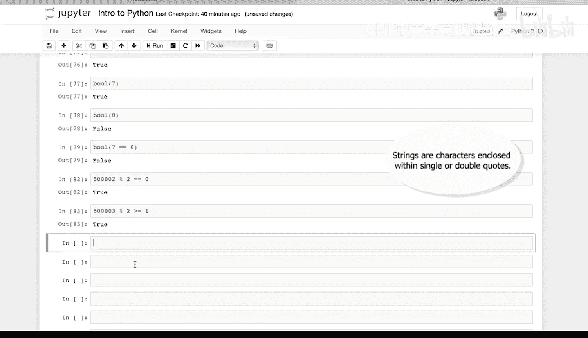

In single quotes， that's a string。

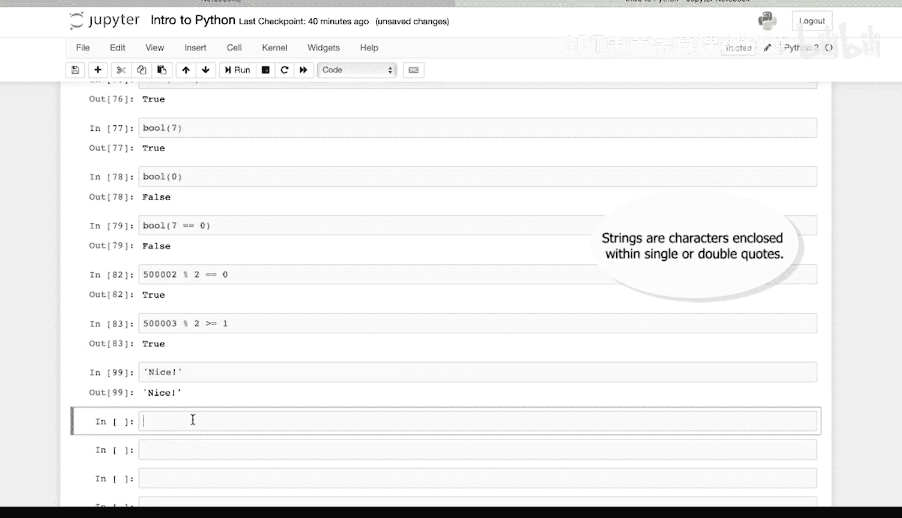

Nice in double quotes。That's also a string。And nice and single quotes is equal to。

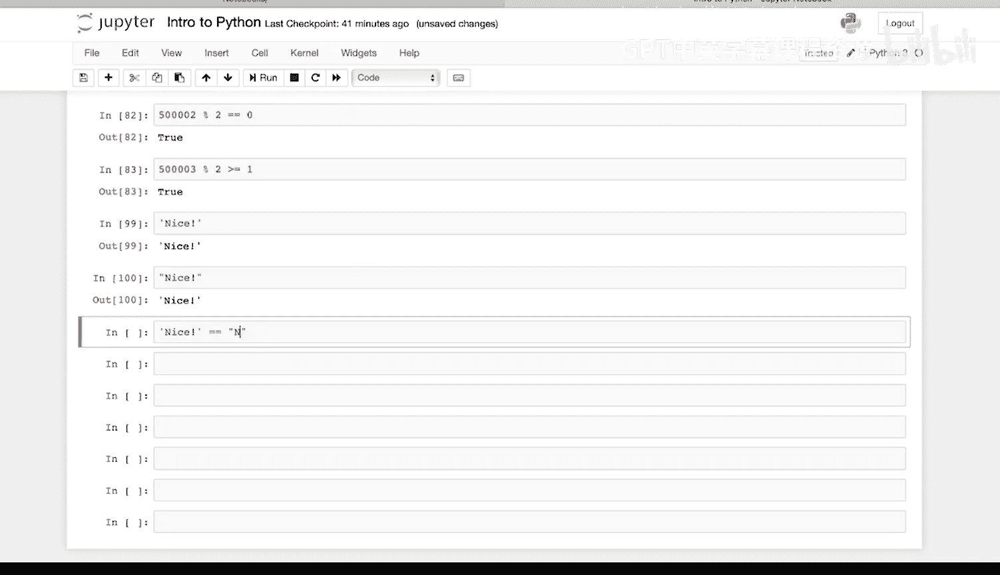

Nice in double quotes， same type， same value。We can concatenate or link together characters and strings using a plus sign。

 so wow。Python is so cool。

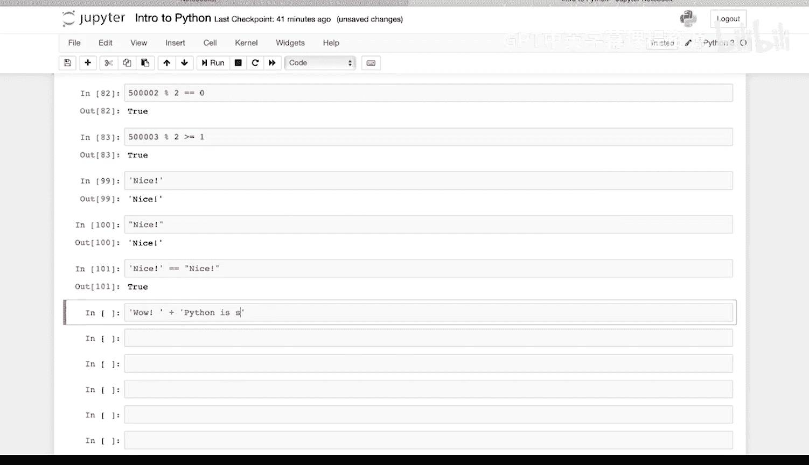

We're incatenating these together， one string， plus and another string。

 so Python knows that were trying to link these two strings together。

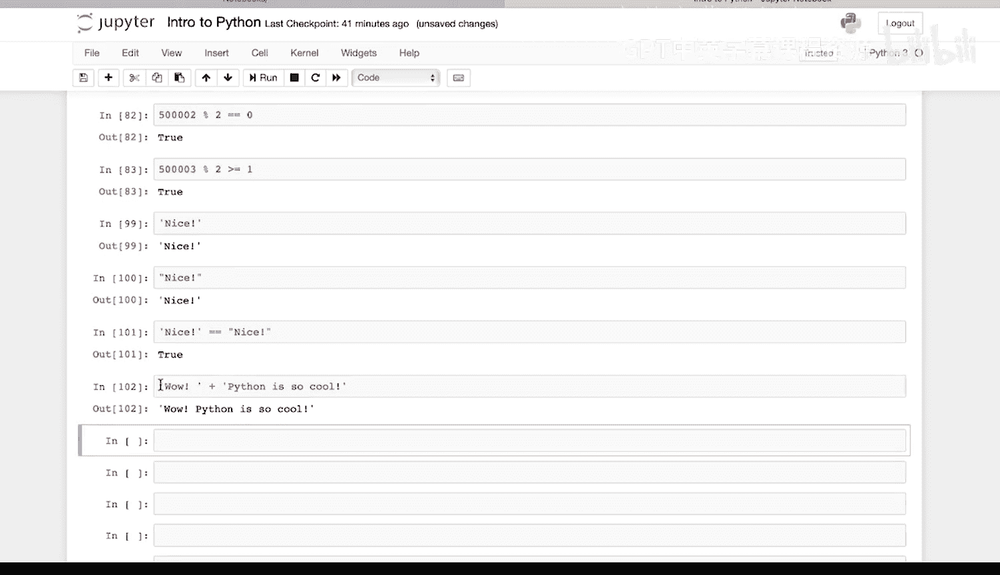

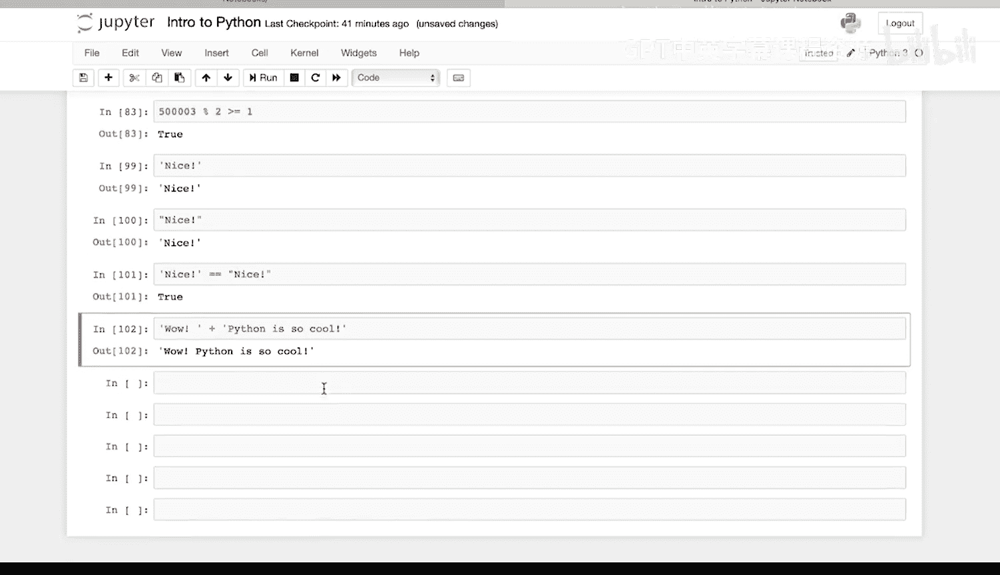

And we can test if an object is a string， so what is the type of yes in single quotes？

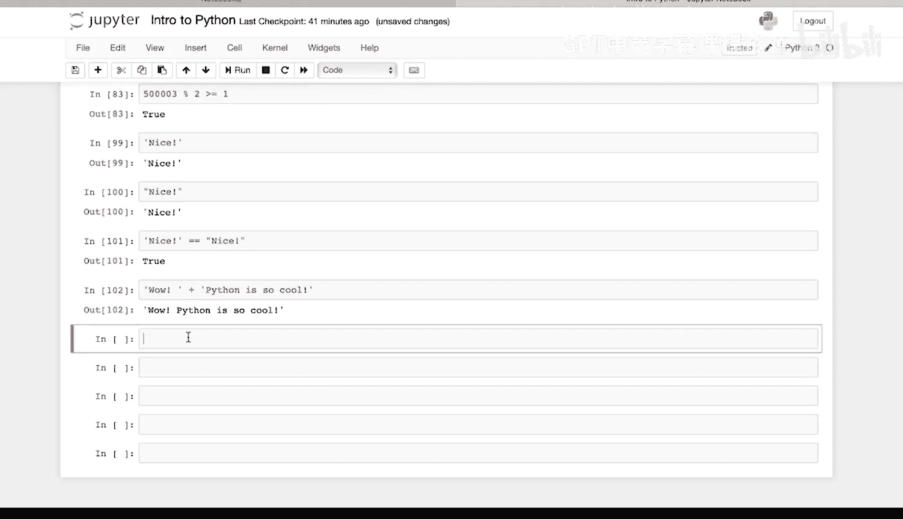

It's a string， or STR。What is the type of。1，03 in double quotes。

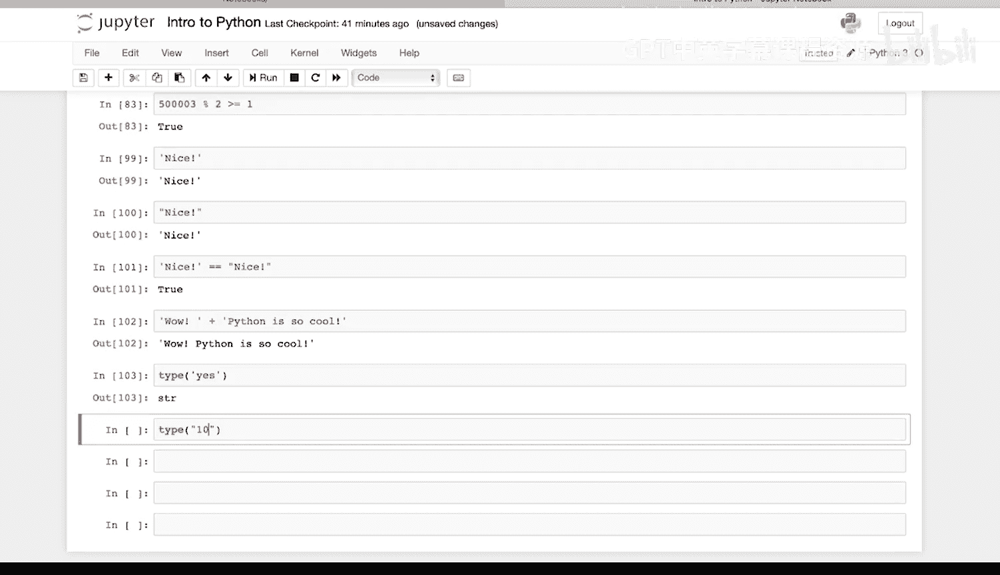

Well， that's also a SR。And was the type of 1，03， the number。 It's an int。

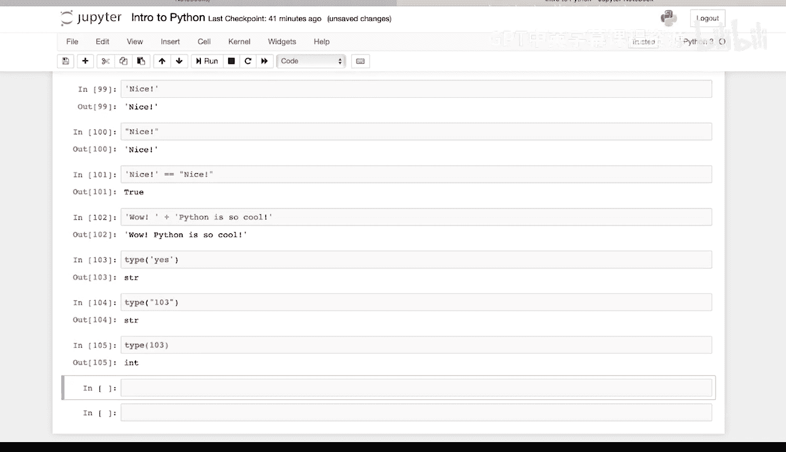

We can print multiple strings。Print name。And Prince Brandon and Prince Kraowski。

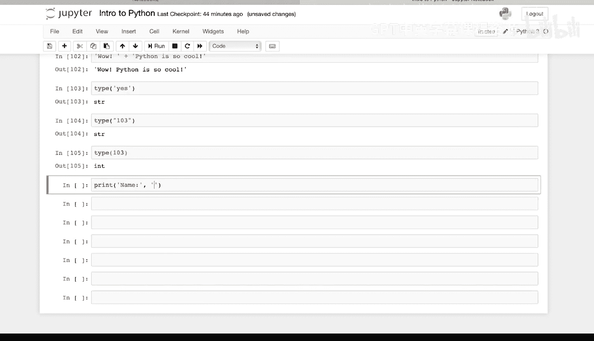

Python prints all three next to each other。We can also print a concatenated string by using the plus sign。

 so print。Name。😔，Plus。😔，Brrandon。Plus。😔，Kakowski。😔。

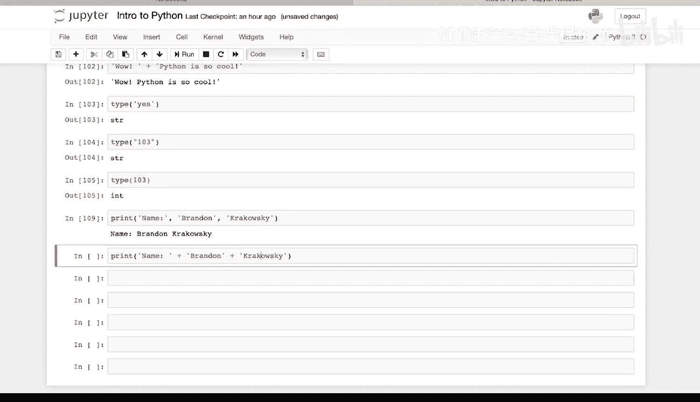

This concatenates the string name plus Brandon， plus Krarkowski inside of the print command。

 and then print the whole thing。 It looks exactly the same as this output。

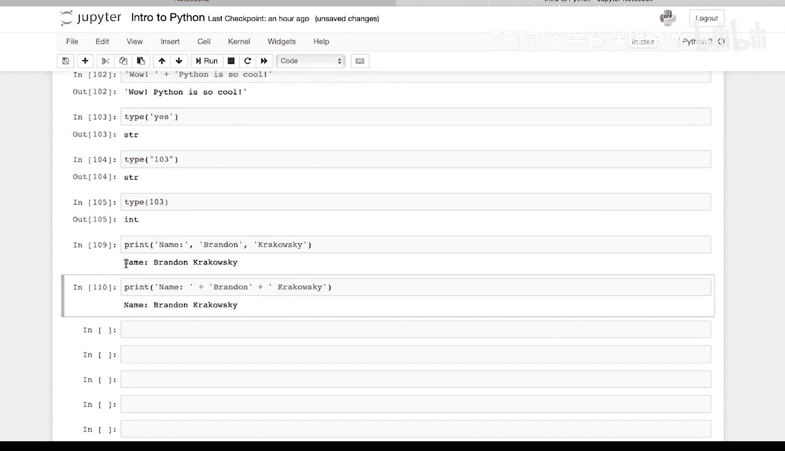

Finally， we can print strings with special characters。 So when Python strings。

 the back slash is a special character also called an escape character。 So print。😊，Brandon。

Back slash。Single quote S。Last name is Kraowski。

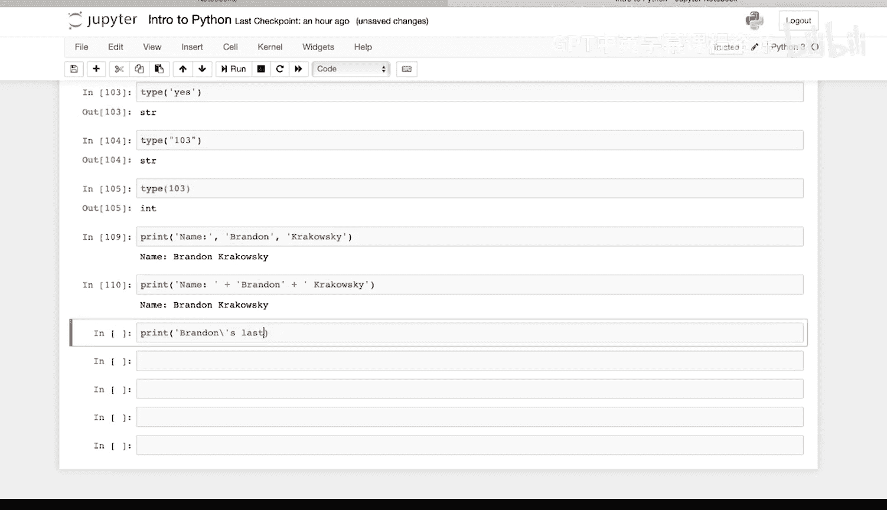

And run that， this Prince Brandon's last name is Krkowski。 The back slash is an escape character。

 It's telling Python that this single quote is to be treated as an ordinary character and not something that's enclosing the string。

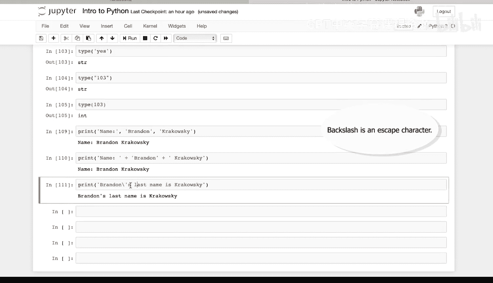