# Python和Java编程入门1-2：23：类型转换 🔄

在本节课中，我们将要学习Python中的类型转换。类型转换是指将数据从一种类型转换为另一种类型，例如将浮点数转换为整数，或将数字转换为字符串。掌握类型转换对于处理不同类型的数据和避免程序错误至关重要。

---

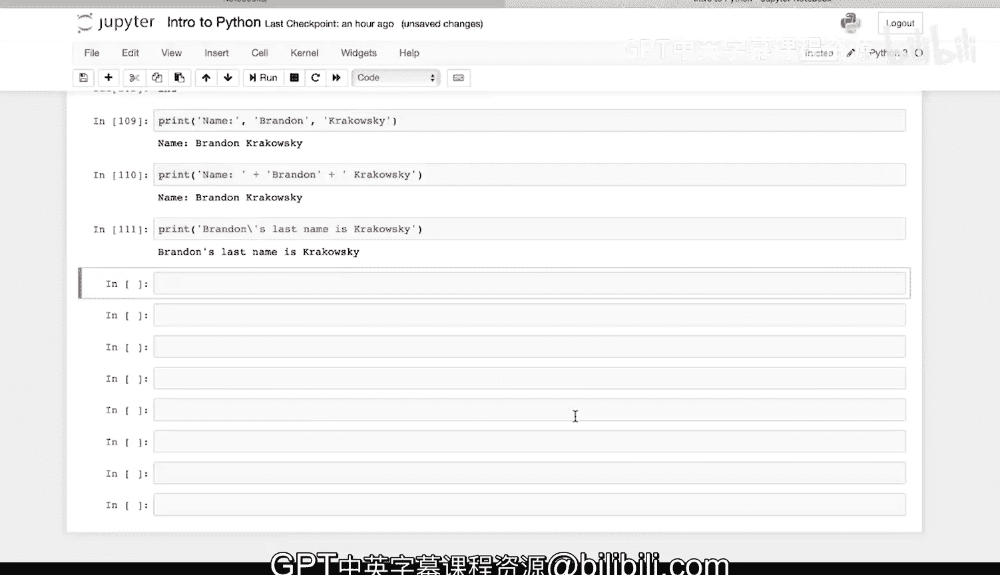

## 从浮点数转换为整数

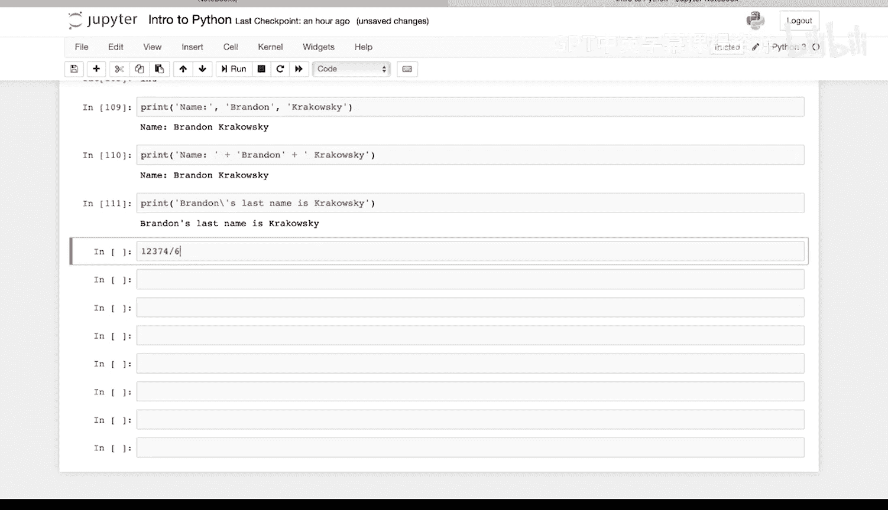

上一节我们介绍了基本的数据类型，本节中我们来看看如何在它们之间进行转换。首先，我们来看一个将浮点数转换为整数的例子。

在Python中，你可以使用内置的 `int()` 函数进行转换。例如，计算 `1237 / 62` 会得到一个浮点数结果。

```python
result = 1237 / 62
print(result)  # 输出: 19.925925925925927
```

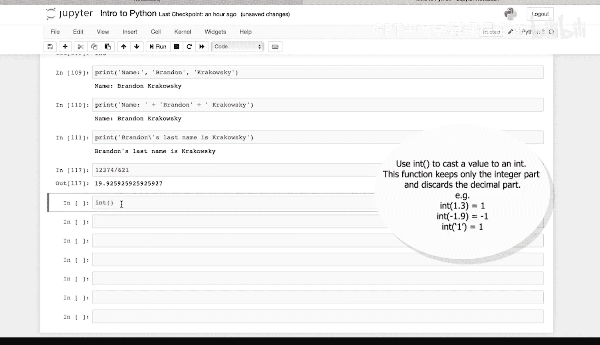

这是一个浮点数。如果我们想将其转换为整数，可以使用 `int()` 函数。

```python
int_result = int(1237 / 62)
print(int_result)  # 输出: 19
```

需要注意的是，`int()` 函数会**向下取整**到最接近的整数。因此，19.925... 被转换成了19。

---

## 使用 `round()` 函数进行四舍五入

如果你希望将一个浮点数**四舍五入**到最接近的整数，而不是简单地向下取整，应该使用Python内置的 `round()` 函数。

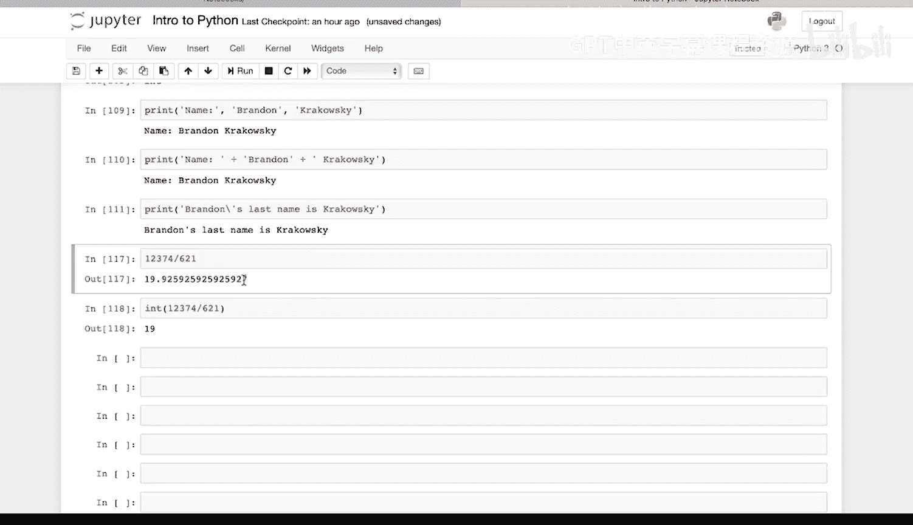

```python
rounded_result = round(1237 / 62)
print(rounded_result)  # 输出: 20
```

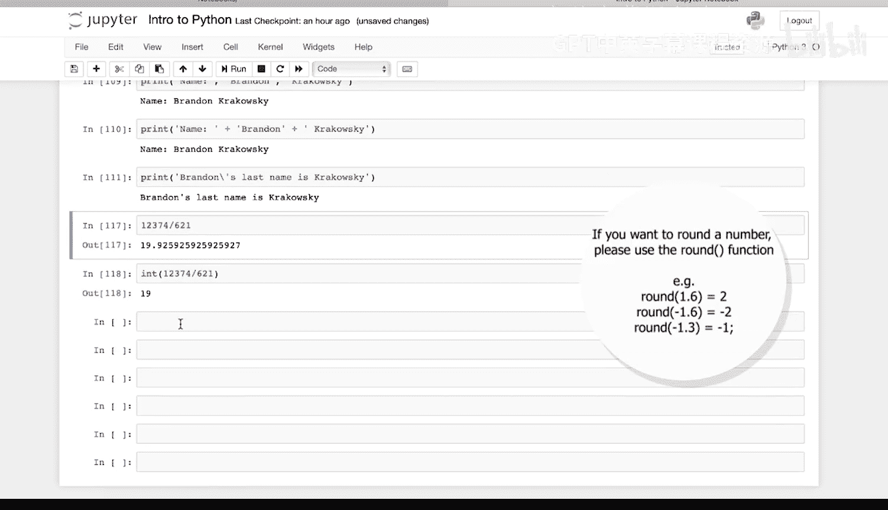

这样，19.925... 就被正确地四舍五入为20。

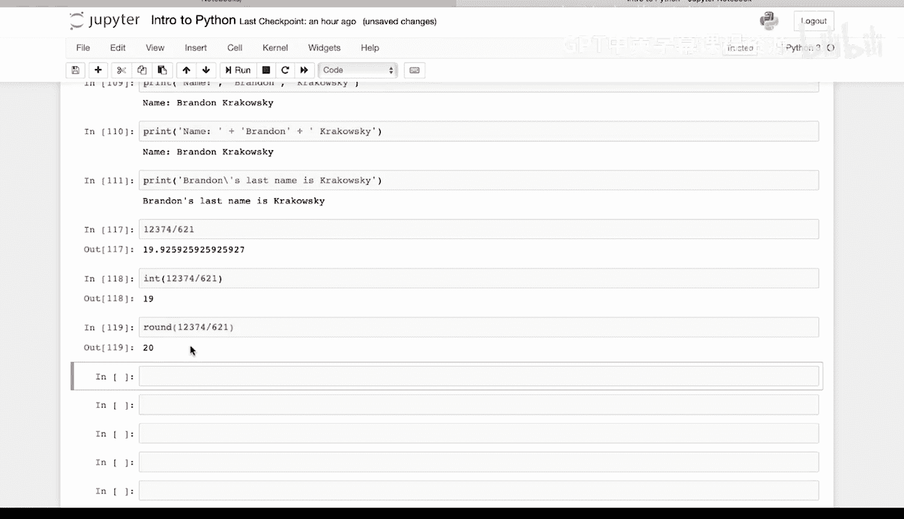

---

## 从字符串转换为整数

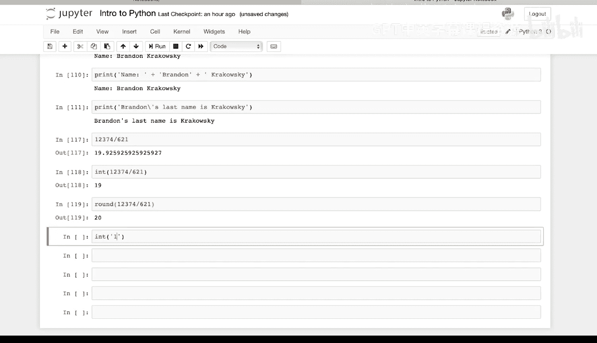

类型转换不仅限于数字之间。你也可以将字符串转换为整数，前提是字符串的内容是有效的数字。

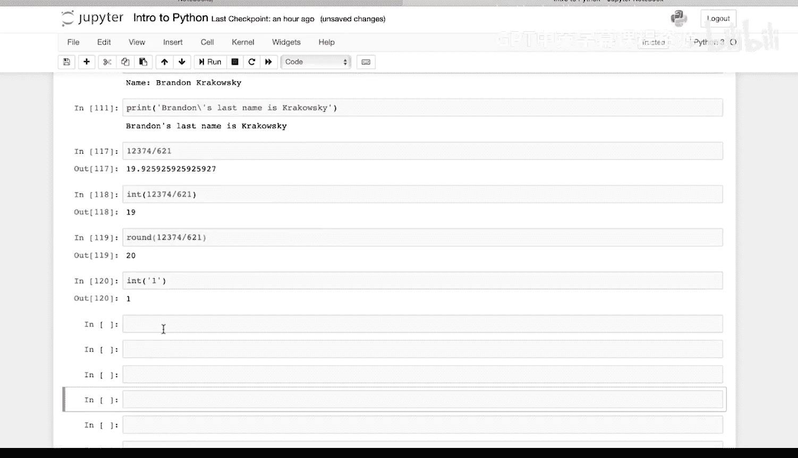

```python
number_from_string = int("1")
print(number_from_string)  # 输出: 1
```

---

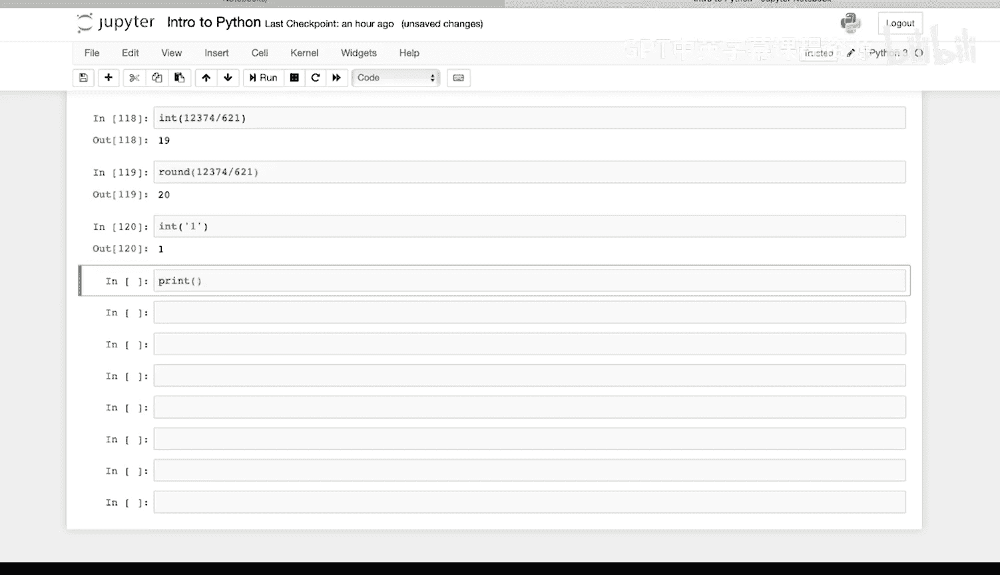

## 打印与字符串拼接

在编程中，我们经常需要将数字和文本一起打印出来。以下是几种不同的方法。

首先，可以直接打印一个数学表达式的结果。

```python
print(4 / 2)  # 输出: 2.0
```

其次，可以使用逗号分隔的方式，在同一行 `print` 函数中打印字符串和数字。

```python
print("4 mod 2 equals", 4 % 2)  # 输出: 4 mod 2 equals 0
```

然而，如果你尝试使用加号 `+` 来拼接字符串和数字，Python会报错，因为它不知道如何将这两种不同类型的数据连接在一起。

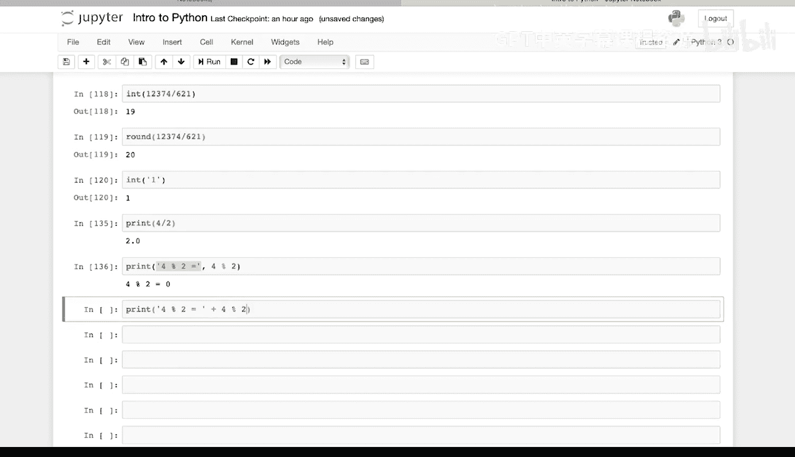

```python
# 这行代码会引发 TypeError 错误
# print("4 mod 2 equals" + 4 % 2)
```

---

## 使用 `str()` 函数解决拼接问题

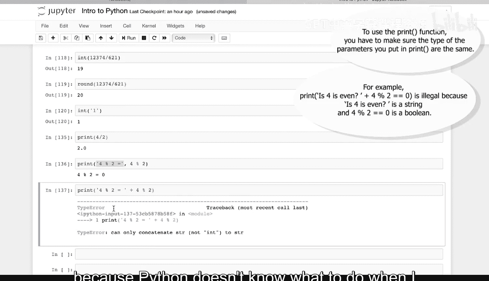

要解决上述问题，我们需要使用 `str()` 函数将数字显式地转换为字符串，然后再进行拼接。

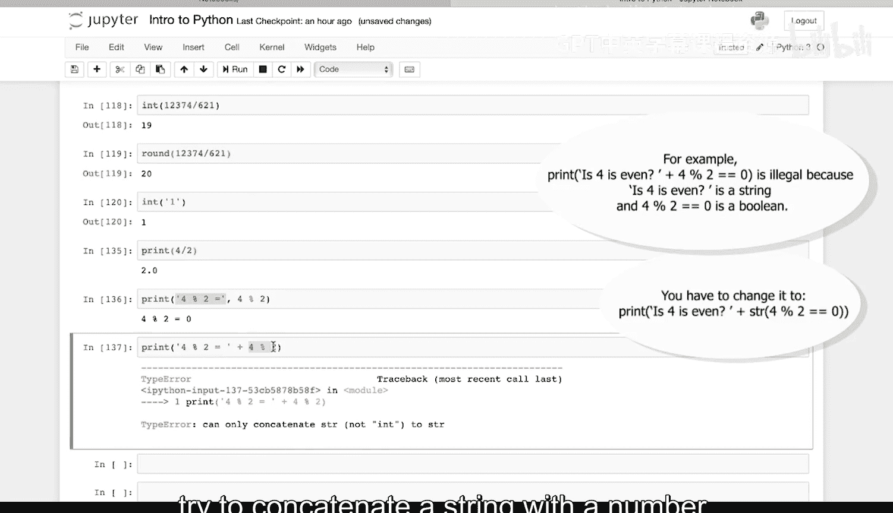

以下是正确的做法：

```python
print("4 mod 2 equals" + str(4 % 2))  # 输出: 4 mod 2 equals 0
```

通过 `str(4 % 2)`，我们将计算结果 `0` 转换成了字符串 `"0"`，从而可以安全地与前面的文本进行拼接。

---

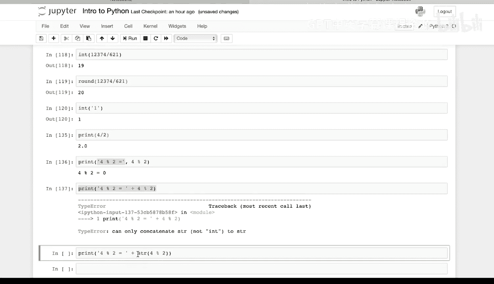

## 打印布尔值

同样的原则也适用于布尔值。布尔值也需要先转换为字符串，才能与其他字符串拼接。

```python
print("Is 4 even? " + str(4 % 2 == 0))  # 输出: Is 4 even? True
```

在这里，表达式 `4 % 2 == 0` 的结果是布尔值 `True`。我们使用 `str()` 函数将其转换为字符串 `"True"`，然后完成拼接。

---

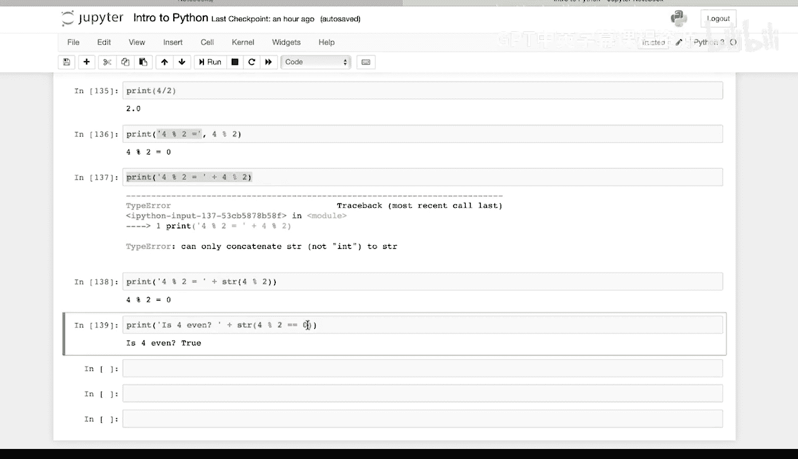

本节课中我们一起学习了Python中的类型转换。我们了解了如何使用 `int()`、`round()` 和 `str()` 等内置函数在不同数据类型（如整数、浮点数、字符串和布尔值）之间进行转换。记住，在进行字符串拼接时，确保所有操作数都是字符串类型，这是避免 `TypeError` 的关键。