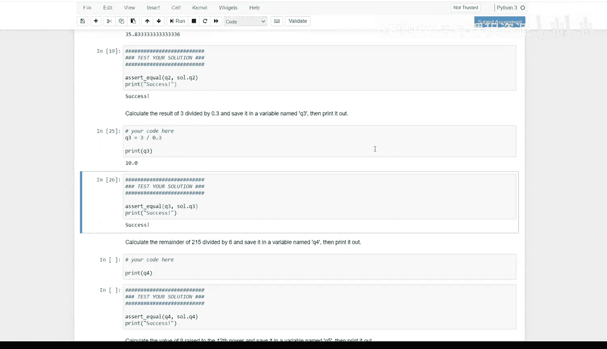
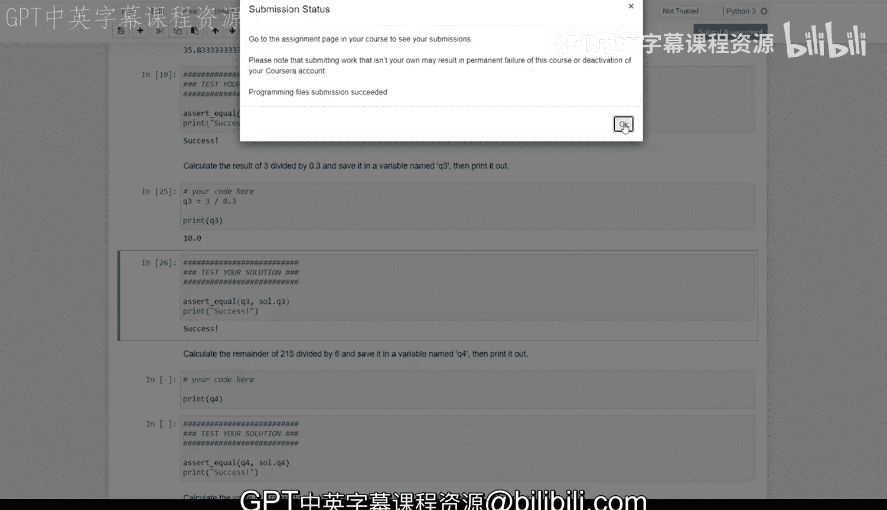

# Python和Java编程入门1-2：024：如何使用Coursera实验环境-理解自动评分输出 🧑‍💻


在本节课中，我们将学习如何在Coursera的实验环境中完成编程作业，理解自动评分系统的输出信息，并掌握解决常见问题的方法。

## 启动与界面介绍

上一节我们介绍了课程背景，本节中我们来看看如何开始第一个作业。

打开作业后，你会看到一个名为Jupyter Notebook的界面。这是一个非常方便的工具，它为我们提供了编写代码的环境和作业说明。这意味着你无需在本地电脑上安装任何软件或担心系统依赖问题，无论你使用的是Mac、Windows还是Linux系统，都不会影响你的编程学习。这为我们提供了一个极佳的入门Python编程的方式。

## 理解变量初始化与执行代码单元

在作业的顶部，有一个关于变量初始化的说明。强烈建议你仔细阅读并确保完全理解这部分内容，因为它对于成功完成本次作业以及未来的作业都至关重要。

我们需要做的第一件事是执行顶部的代码单元。代码单元就是Notebook中这些灰色的方框，它们是可运行的代码块，你可以在其中编写和修改代码。其中一些单元可能是只读的，例如用于测试的单元或作业正常运行所必需的部分。

运行一个单元最简单的方法是点击顶部的运行按钮。然而，使用键盘快捷键通常更方便。你可以按住`Shift`或`Control`键再按`Enter`键。根据你按住的键不同，执行后你可能会停留在当前单元，也可能会跳转到下一个单元。

例如，如果我按住`Control`再按`Enter`，单元执行后我仍停留在该单元。如果我按住`Shift`再按`Enter`，单元执行后我会跳转到下一个单元。同样，你可以使用方向键在单元间导航，也可以通过按`Enter`键进入单元进行编辑。这是一个只读单元，所以我无法修改它，但我可以进入单元并移动光标。

当一个单元执行时，你会看到一个旋转的星号。在这个方括号里它转得很快，但在课程后期执行一些复杂的代码块时，可能需要几秒钟才能完成。

## 完成第一道题目与理解测试

现在，我们来看第一道题目。题目要求我们计算`3.93`乘以`4901`的结果，并将其保存在一个名为`Q1`的变量中。

观察代码，我们发现已有的打印语句已经引用了`Q1`变量，因此我们很清楚这里需要做什么。让我们创建一个名为`Q1`的变量，并为其赋值`3.93 * 4901`。

```python
Q1 = 3.93 * 4901
```

如果我在这里按住`Control`并按`Enter`，我可以在执行代码块的同时保持在该单元内。

接下来，我将运行测试单元。我们会看到，当我运行这个单元时，它打印出了“success”，因为我们的计算是正确的。但为了演示，让我们在这个单元中故意制造一个错误。我通过点击上箭头键导航回这个单元，然后按`Enter`开始输入。我们将把乘数改为`4`而不是`3.93`。

```python
Q1 = 4 * 4901  # 错误的示例
```

你会注意到输出略有变化，但我们更感兴趣的是测试结果。当我们运行这个测试时，会收到一条错误信息。这条信息可能很长，看起来有点吓人，但一旦你见过几次，就能很快掌握要领。

最重要的部分是底部显示的内容：**`AssertionError`**。这个断言错误基本上是说这两个数字不匹配，系统期望它们相等，但实际并不相等。

观察实际的测试用例，我们可以看到`assertEqual`语句，它比较了我们刚刚创建的变量`Q1`和解决方案中的版本`S.Q1`。这些测试的工作原理是，我们有一个作业的解决方案版本，并将其存储在其他地方。然后，在需要时提取这些值，以确认你计算的值与我们期望的解决方案值是否一致。

## 修正错误与继续作业

为了修正这个错误，我们可以直接回到出错的地方，将乘数改回`3.93`。我们按住`Shift`并按`Enter`跳转到下一个单元，然后按住`Control`并按`Enter`执行这个单元，现在我们就得到了“success”信息。

成功通过`Q1`的测试后，我们使用方向键向下移动，继续处理`Q2`。在这个例子中，我们将进行一个类似的计算操作，并将结果赋值给一个名为`Q2`的变量。

同样，我们可以执行这个单元，看到打印语句返回我们期望的值。但再次，通过一个错误来演示会更有趣。让我们稍微修改一下这个计算。

当我们执行测试时，我们会再次跳到这里查看断言错误，因为它提供了最重要的信息。从这里我们可以看出数字不匹配。如果我们仔细查看这条更长的信息，实际上可以开始理解发生了什么。在最顶部，这个绿色箭头指向了`assert`语句，该语句基本上是在比较我们创建的变量和解决方案变量。

这看起来很熟悉，因为它实际上就包含在这个单元里。我们知道`43.0`也很熟悉，因为我们刚刚在这个单元中打印过。因此，如果我们将其修正为正确的值`35.83`，就可以通过这个测试并看到“success”信息。

让我们再做一个例子。`Q3`是一个类似的问题，我们需要将`3 / 0.3`的结果赋值给`Q3`。之后我们打印出值，然后继续到测试用例，这次我们通过了。

## 使用验证按钮与提交作业

现在，让我们尝试用一种稍微不同的方法来检查测试用例。顶部的“Validate”按钮是一个很好的方式，可以验证你是否通过了Notebook中的所有测试，而不仅仅是你当前所在的这个测试单元。

当我点击它时，系统会计算每一个测试。你会注意到很多测试都失败了，但这很正常，因为我们还没有真正完成整个作业。如果我们查看最顶部，会看到第一个失败的测试是关于`Q4`的，这再次说明我们尚未完成`Q4`。

现在，如果我们修改`Q3`使其失败，然后返回并再次验证，我们应该会在顶部看到`Q3`失败。因此，“Validate”按钮是快速确保你通过所有测试的好方法。

如果我们再次修正`Q3`并运行单元，现在我们就通过了前三个测试。



一旦你验证了你的工作，并且确信已经通过了足够多的测试，你就可以提交这份作业了。提交后，你随时可以回来重新提交。提交后不久，你应该会在作业页面上看到成绩。但如果你没有得到期望的成绩，你随时可以回来再次尝试。

## 总结



本节课中我们一起学习了如何在Coursera的Jupyter Notebook环境中完成编程作业。我们了解了如何执行代码单元、理解并修正自动评分系统给出的错误信息，以及如何使用“Validate”按钮全面检查作业。希望这些内容对你有所帮助，如果在学习过程中有任何后续问题，请在论坛上发帖提问。祝你在课程中学习顺利！