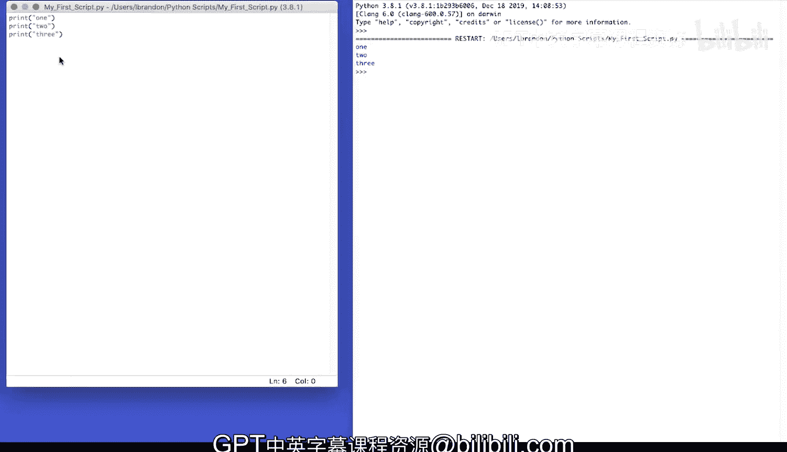
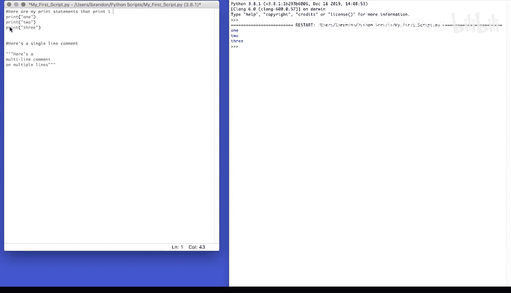
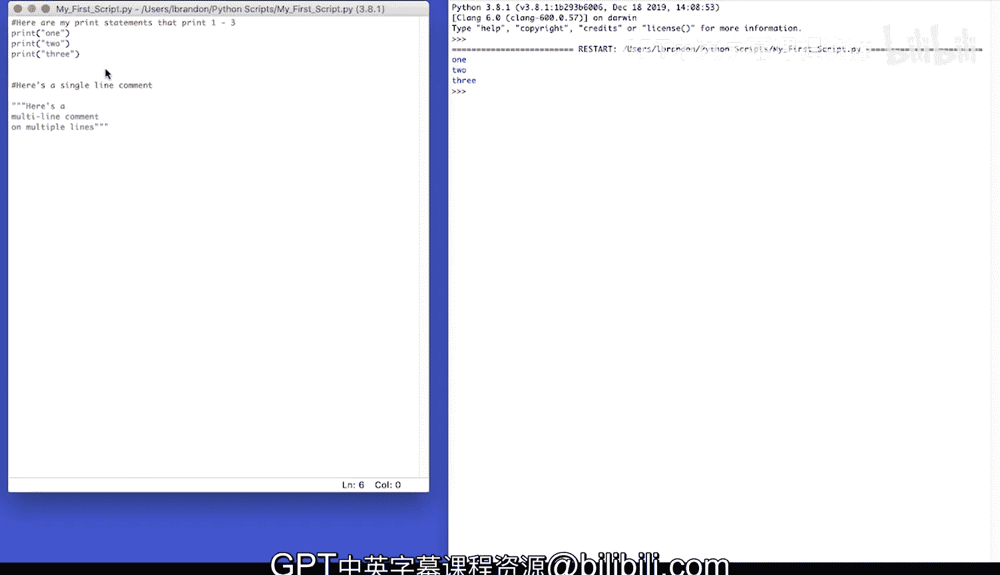
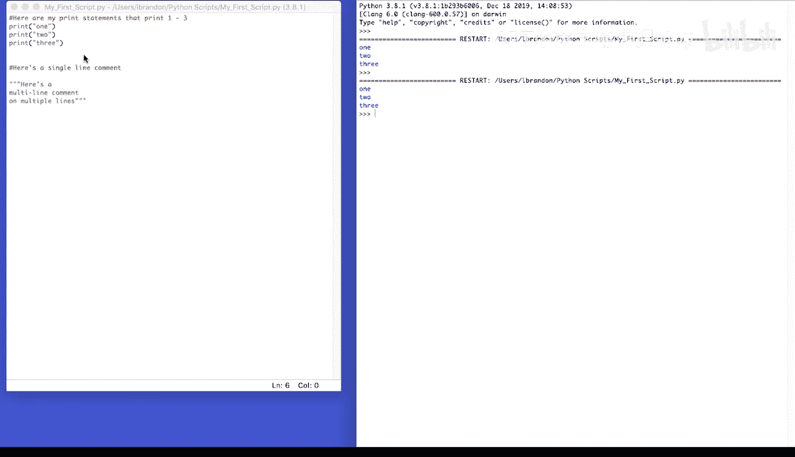

# 宾夕法尼亚大学《Python和Java编程入门1-2｜Introduction to Programming with Python and Java》中英字幕 p28 028_01_02_为Python脚本添加注释.zh_en -BV13E421M7FF_p28-

You can add comments to Python scripts。Use the hash sign to comment a single line of text。So。

Here's a single line comment。You can use three double quotation marks or use three single quotation marks to comment multiple lines at once。

Here's a。😔，Multiline。😔，Comment on。Multiple lines。Adding comments to a script keeps your code organized and readable。

 Comments can be used to document your code。 At the very least。

 you should add comments to all non trivial lines of code。Here are my print statements that print。1。

2，3。

If I run my script， Python will ignore the comments。

