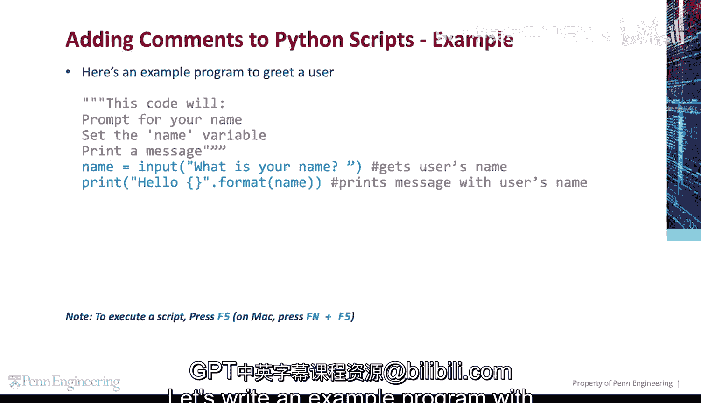
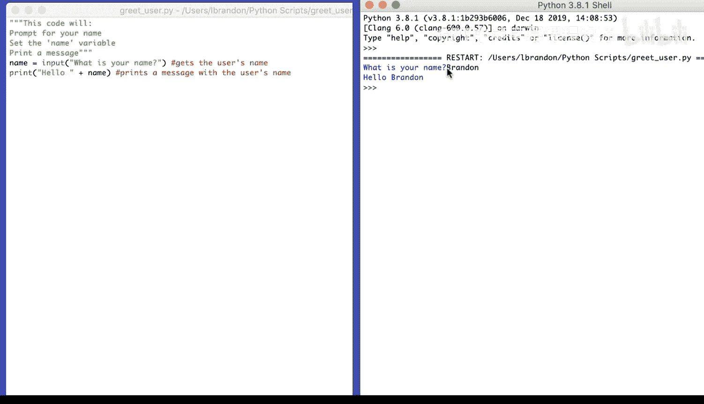

# Python编程入门：1.3：代码练习-注释问候用户程序 📝

在本节课中，我们将学习如何编写一个包含注释的Python程序。注释是代码中用于解释程序功能的文本，它不会被计算机执行，但对程序员理解代码至关重要。我们将通过一个简单的“问候用户”程序来实践这一概念。

## 概述

我们将创建一个程序，它首先请求用户输入姓名，然后将输入的姓名存储在一个变量中，最后打印出一条包含该姓名的问候语。在整个过程中，我们会使用注释来描述每一步代码的作用。

## 编写带注释的程序

上一节我们了解了注释的基本概念，本节中我们来看看如何在实际代码中应用它。

以下是我们将要编写的程序的核心步骤：



1.  **提示用户输入姓名**：程序会显示一个问题，等待用户输入。
2.  **存储用户输入**：将用户输入的信息保存到一个变量中，以便后续使用。
3.  **输出问候信息**：将存储的姓名与问候语结合，并打印到屏幕上。

现在，让我们用代码来实现这些步骤，并为每一行关键代码添加注释。

```python
# 提示用户输入姓名，并将输入结果存储在变量‘name’中
name = input("What is your name? ")

# 打印一条包含用户姓名的问候信息
print("Hello, " + name)
```

## 代码解析

在上一部分，我们写好了完整的代码。本节中我们来详细解析每一行代码及其注释的作用。

以下是代码中两个核心部分的解释：

*   **第一行代码**：`name = input(“What is your name? “)`
    *   `input()` 是一个函数，它会在屏幕上显示括号内的文本（这里是`”What is your name? “`），并等待用户在命令行中输入信息。
    *   用户输入的内容（例如”Alice”）会被赋值给等号左边的变量 `name`。变量就像一个标签，指向存储的数据。
*   **第二行代码**：`print(“Hello, ” + name)`
    *   `print()` 函数用于将内容输出到屏幕。
    *   我们使用加号 `+` 将字符串 `”Hello, “` 和变量 `name` 中存储的值连接起来，形成完整的问候语，例如 `”Hello, Alice”`。

## 运行程序

代码编写并添加注释后，下一步就是运行它，看看实际效果。

保存文件（例如 `greeting.py`）并运行。程序会首先在命令行中显示提示：
```
What is your name?
```
当你输入姓名（例如“Bob”）并按下回车后，程序会输出：
```
Hello, Bob
```
整个过程清晰地展示了从获取用户输入到处理并输出结果的数据流。



## 总结

本节课中我们一起学习了如何为一个简单的Python程序添加注释。我们编写了一个交互式的问候程序，它使用 `input()` 函数获取用户输入，用变量存储数据，最后用 `print()` 函数输出个性化问候。通过为关键代码行添加注释（以 `#` 开头），我们使程序的功能一目了然，这对于代码的维护和与他人协作非常重要。记住，清晰的注释是优秀编程习惯的重要组成部分。