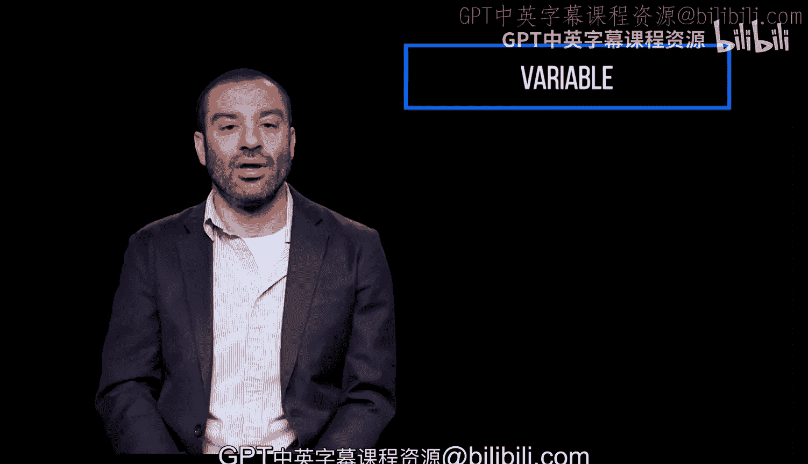
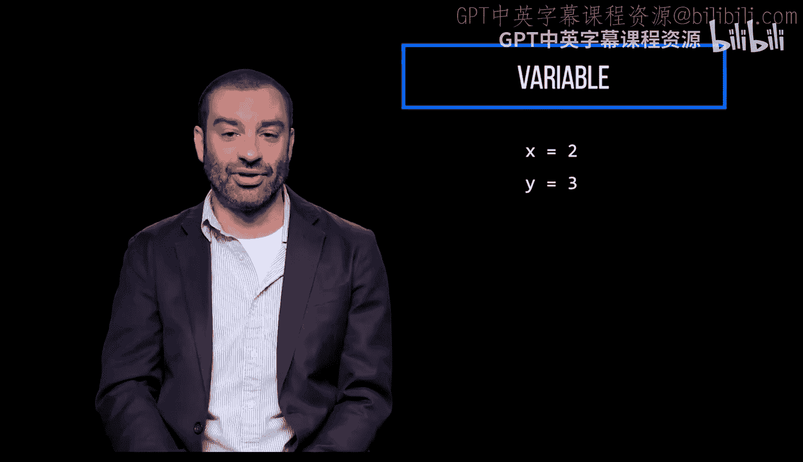
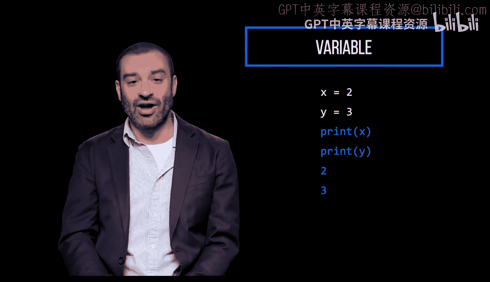
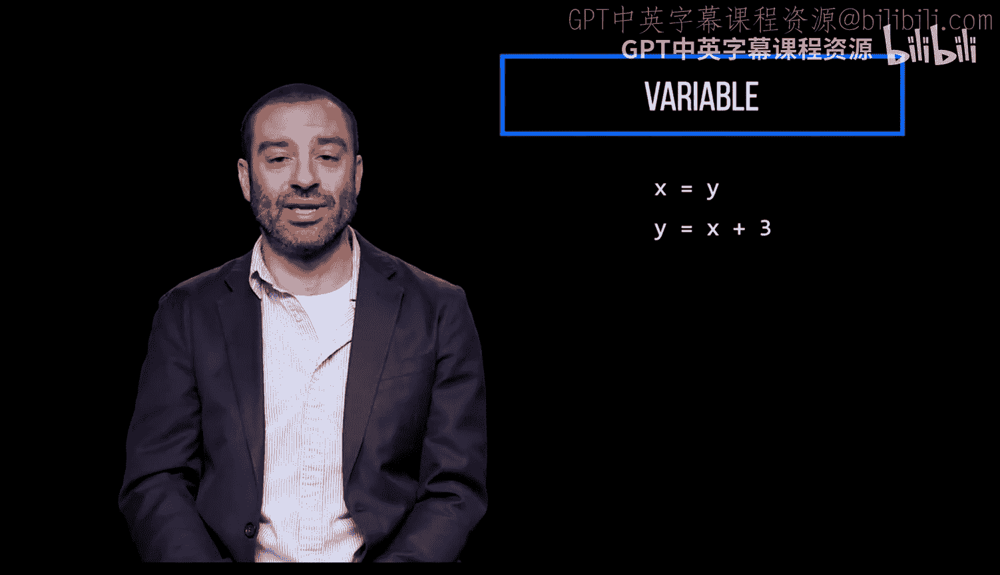
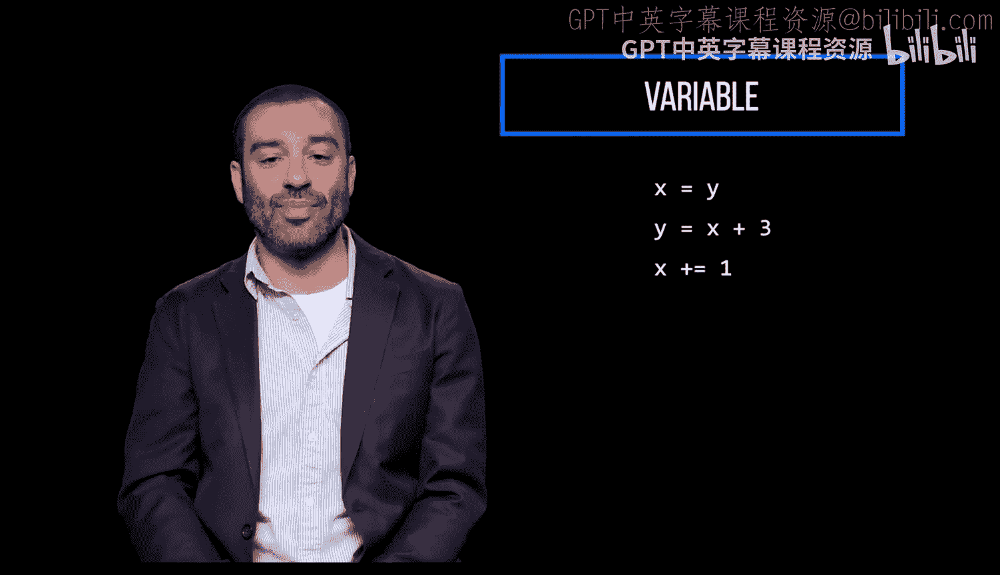
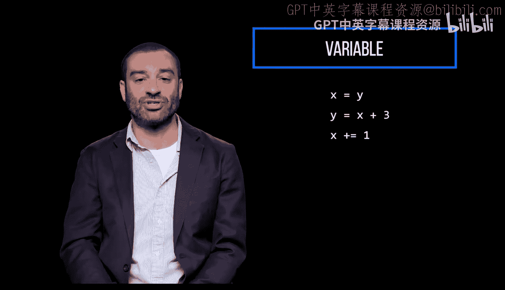
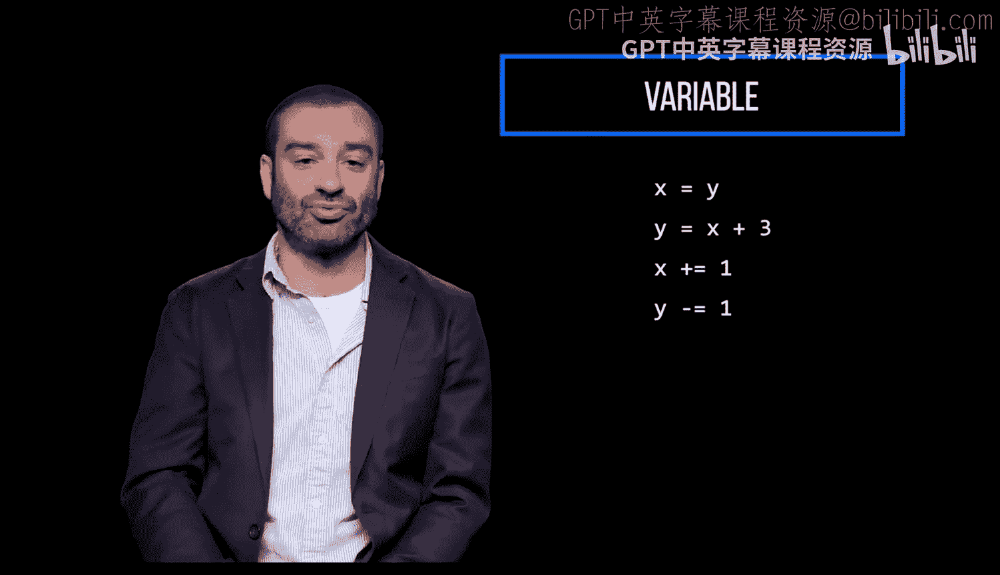
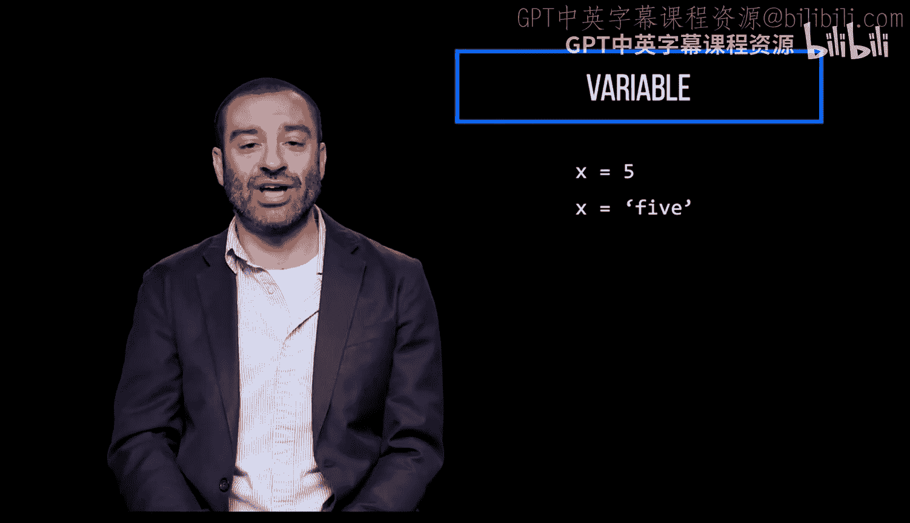
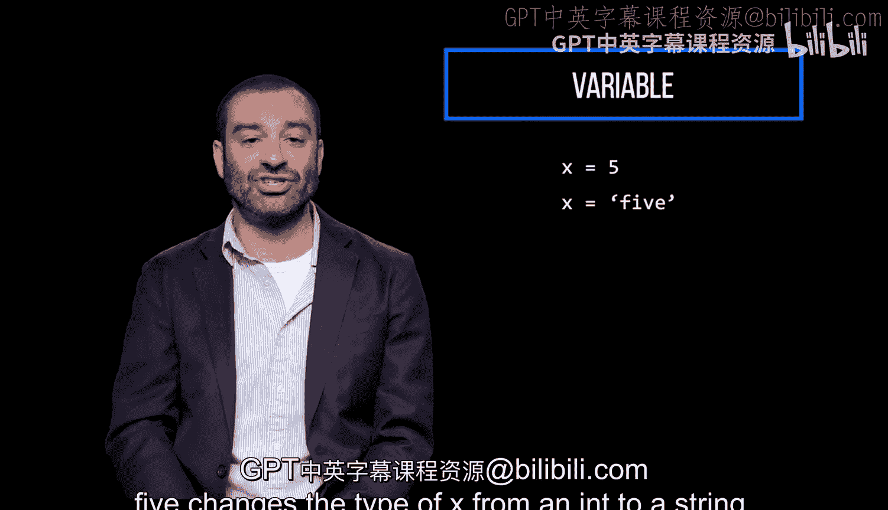

# 宾夕法尼亚大学《Python和Java编程入门1-2｜Introduction to Programming with Python and Java》中英字幕 p30 030_01_01_变量赋值.zh_en -BV13E421M7FF_p30-

A variable is a symbolic name for or reference to a value。 When a variable gets assigned a value。

 it takes the type of the value。 You can use variables to store all kinds of stuff。

Variable names are case sensitive。 Python is dynamically typed。

 which means if you assign the same variable a different value later on in your code。

 the variable is updated with the new value。

Here we increment x by 1， which is the same as writing x equals x plus 1。

And decrement y by1， which is the same as writing， y equals y minus1。

Variables can change types here， setting x to the string5 changes the type of x from an int to a string。

