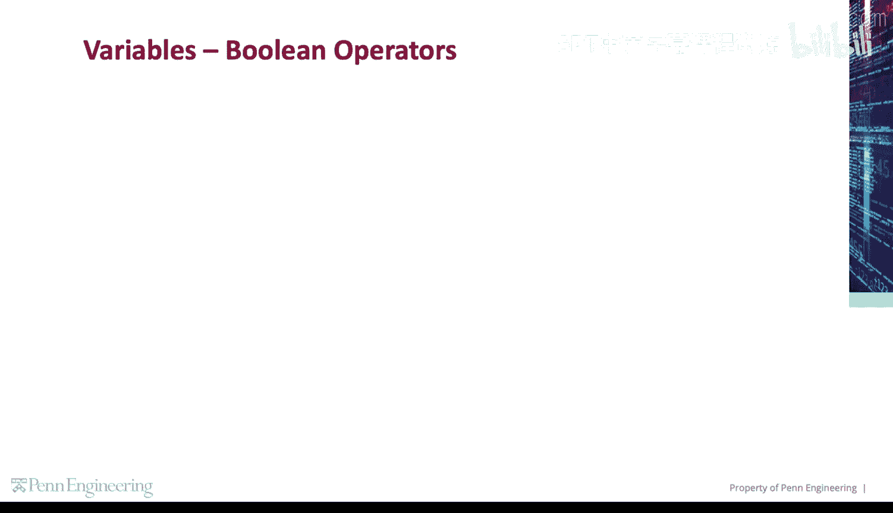
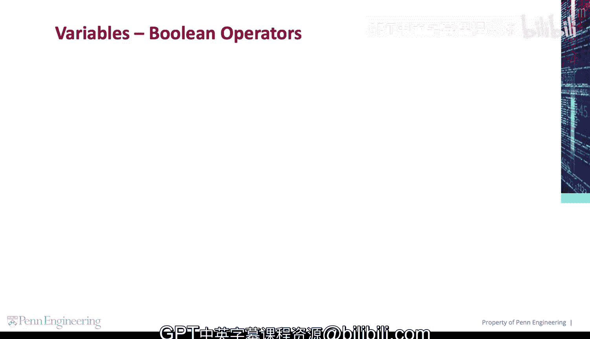
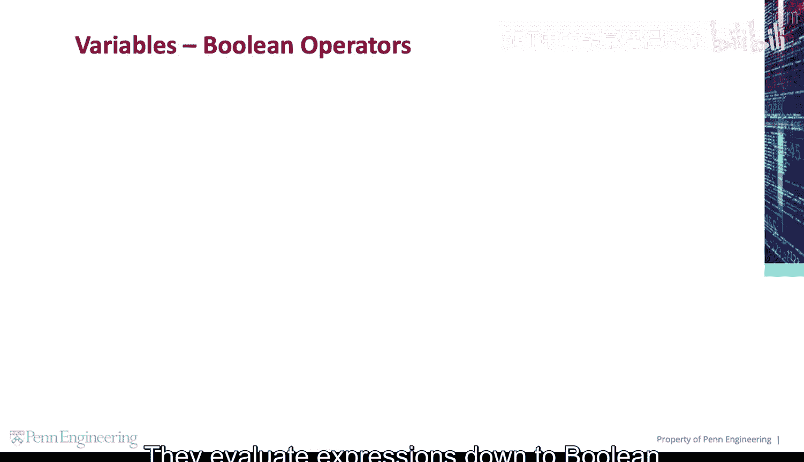
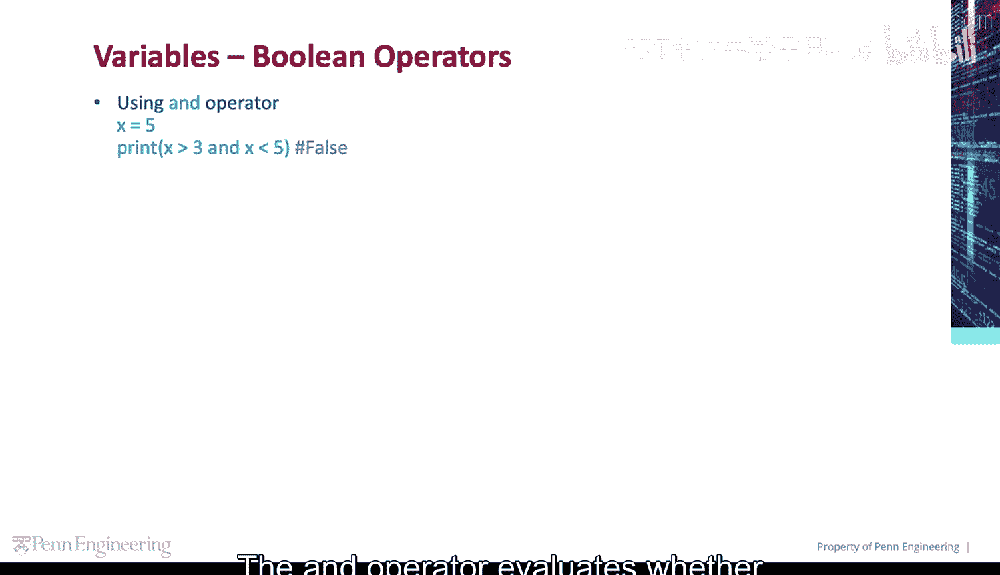
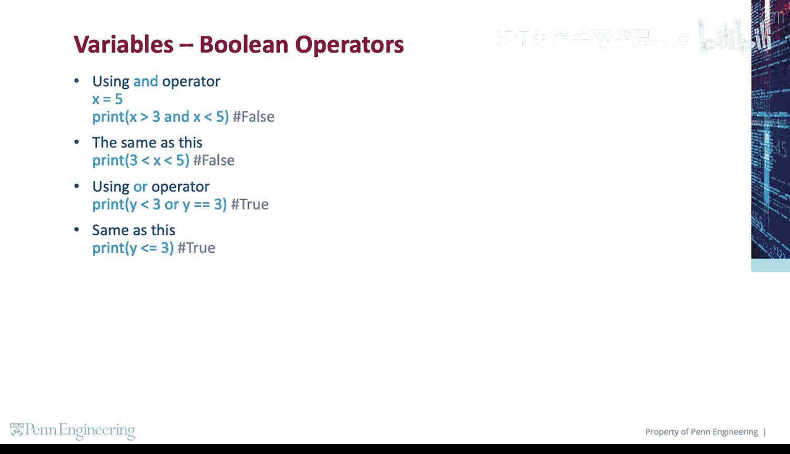
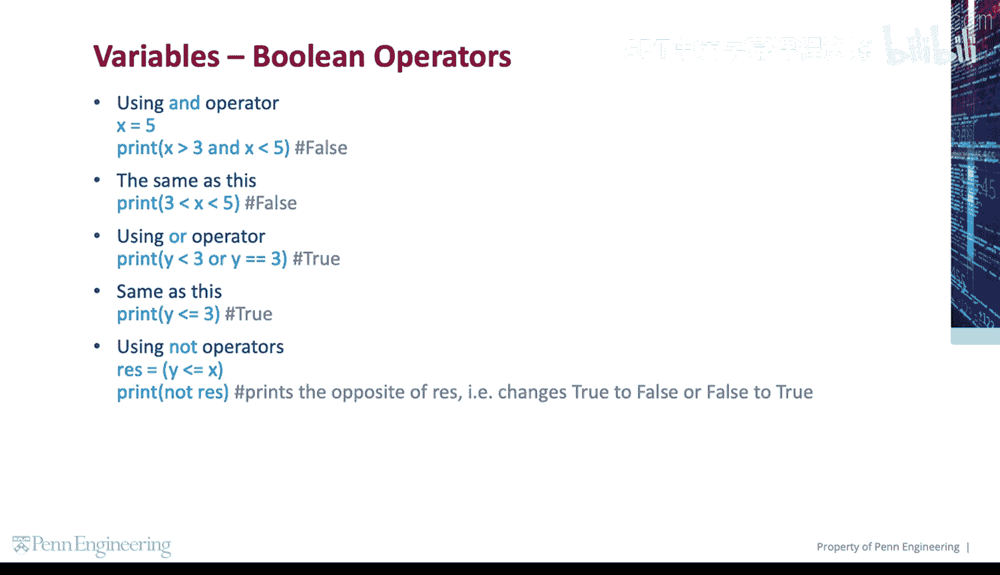
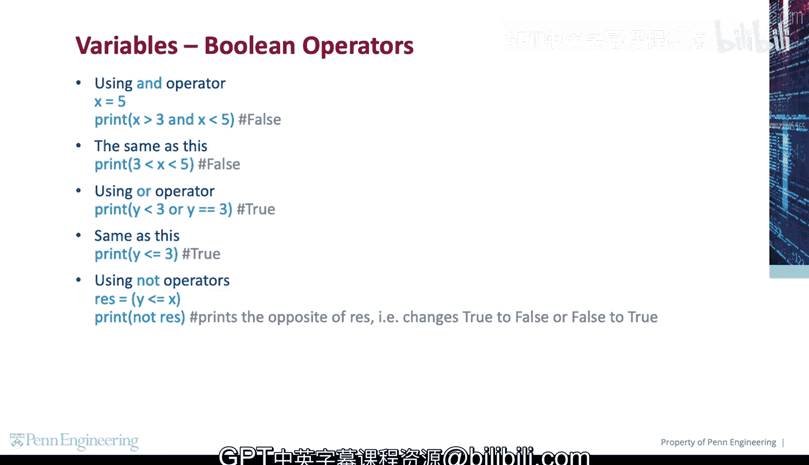

# 宾夕法尼亚大学《Python和Java编程入门1-2｜Introduction to Programming with Python and Java》中英字幕 p31 031_01_02_布尔运算符.zh_en -BV13E421M7FF_p31-

There are three logical operators that are used to compare values。

They evaluate expressions down to Boolean values， returning either true or false。

The and operator evaluates whether two expressions are true or false。

After setting x to 5， we can print the Boolean result of x is greater than 3， and x is less than 5。

 This is false。Another way to write this is 3 less than x， less than 5。 This is also false。

The orar operator determines if at least one expression is true。After setting y to 2。

 we can print the Boolean result of y is less than3 or Y is equal to3。 This is true。

This is the same as writing Y less than or equal to3。

The not operator returns the opposite of a value。 For example。

 returns false if the original value is true。Here we set the res variable to y less than or equal to x。

We know this is true。 So when we print not res， we should get the opposite of res， which is false。

