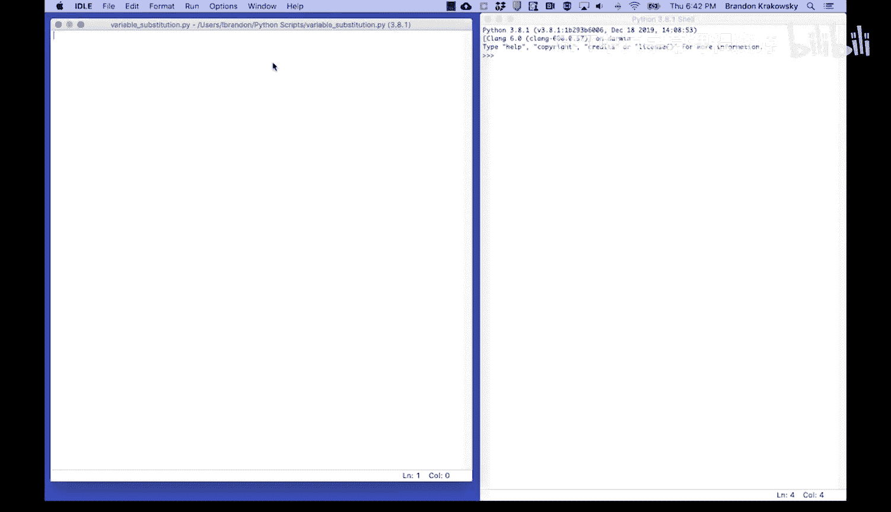
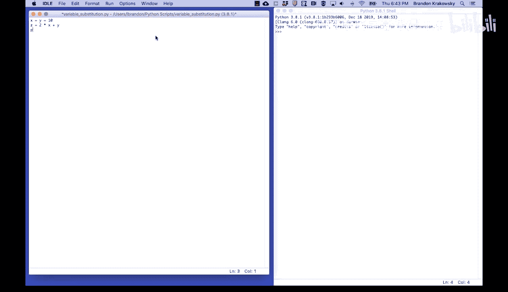
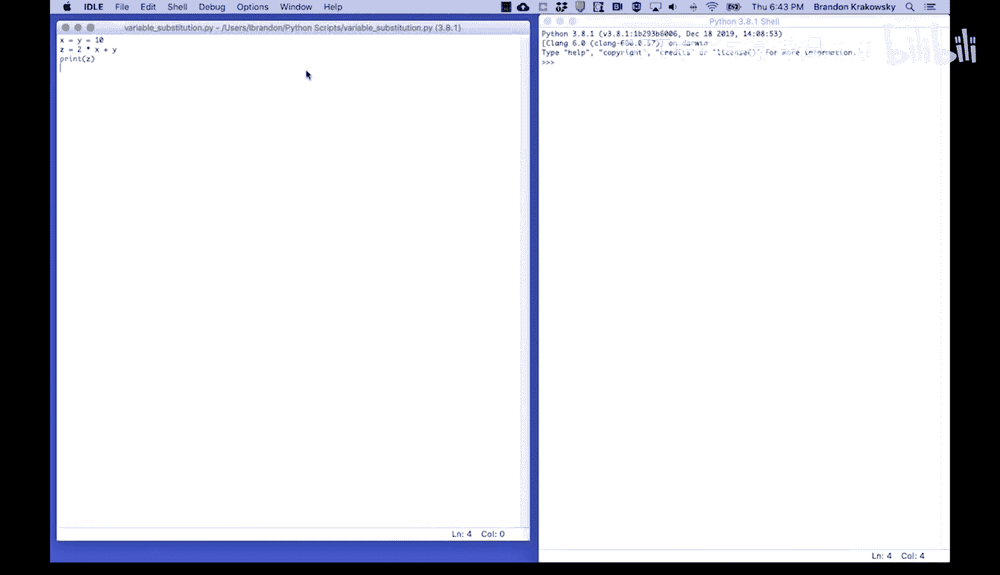
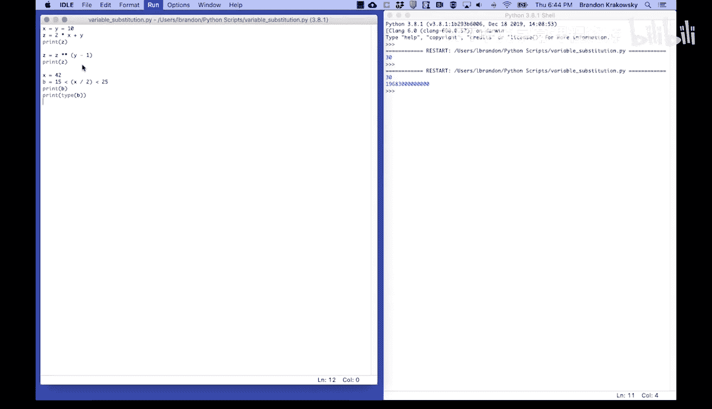
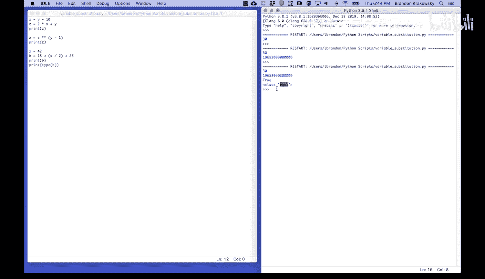
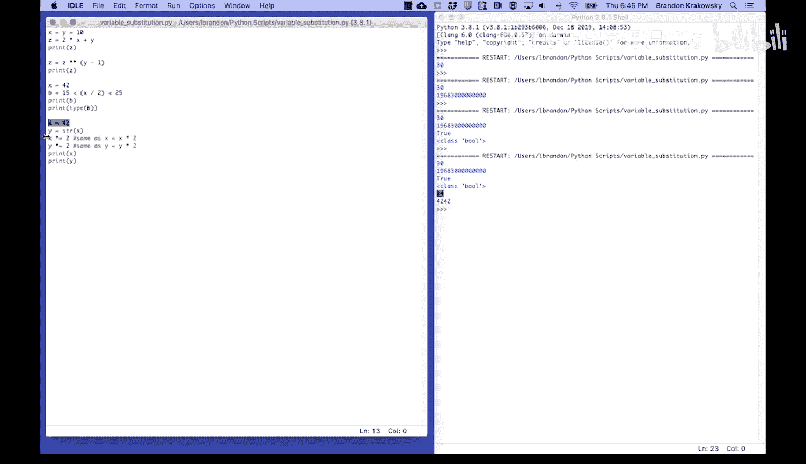
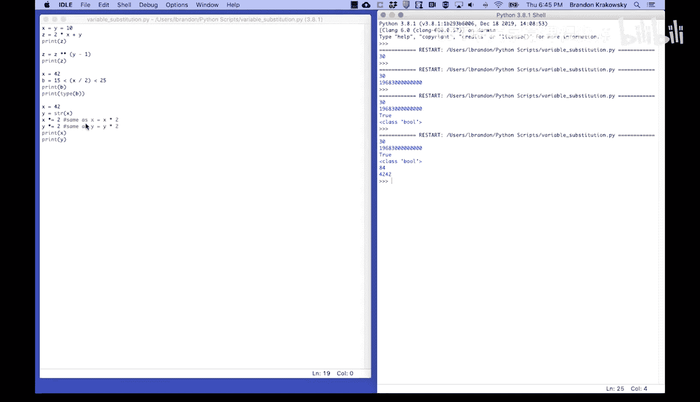
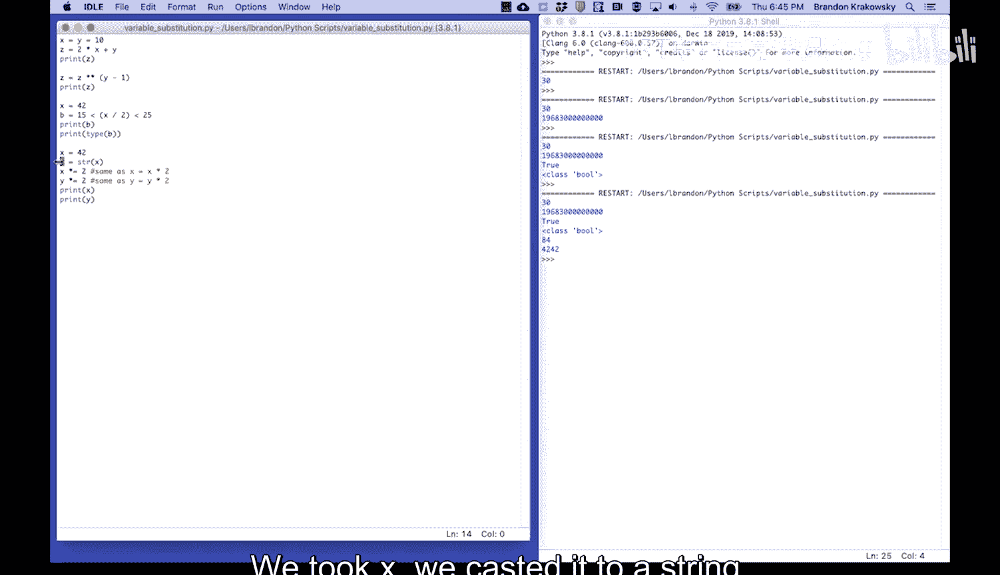
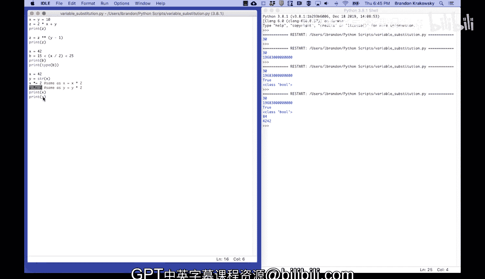
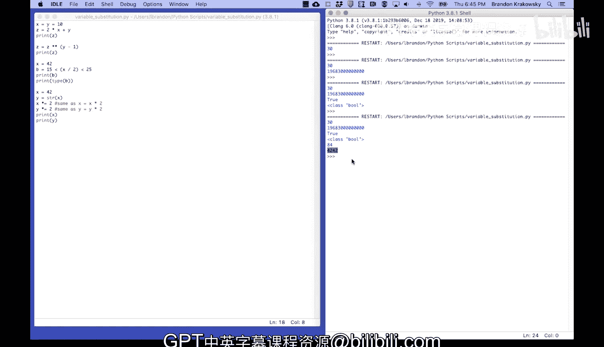

# 宾夕法尼亚大学《Python和Java编程入门1-2｜Introduction to Programming with Python and Java》中英字幕 p32 032_01_03_变量替换.zh_en -BV13E421M7FF_p32-

You can substitute variables in mathematical expressions。 For example， x equals y equals 10。

This sets both x and y to 10。Z equals 2 times the value of x plus the value of y。

Then we'll print Z。

Z is 30。Then we'll set Z to B Z to the power of y minus。1。And we'll print Z。Z is now this number。

You can substitute inbuolean expressions， so x is equal to 42。

B is equal to 15 less than x divided by 2， less than 25。Let's print B。Let's also print the type of B。

B is true。And be as a bull or boolean。

You could substitute variables in multiplication。So x equals 42。

Y is equal to the casted version of x。 So take x， which is 42。 Turn it into a string。

 Store that in y。Then we're going to double X。We're going to。Double why。This is the same as。

X equals x times 2。And this is the same as y equals y times 2。Let's print X。Let's print why。X is 84。

So x was 42。

We doubled x multiplied by 2， and we printed it。 It became 84。W is 42，42？

We took X。 We cast it to a string。 We stored it in Y。 We multiplied by 2。

In this case， it concatenated why to itself。

Thus， becoming 42，42。

