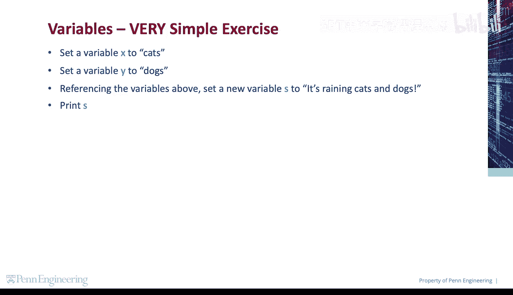
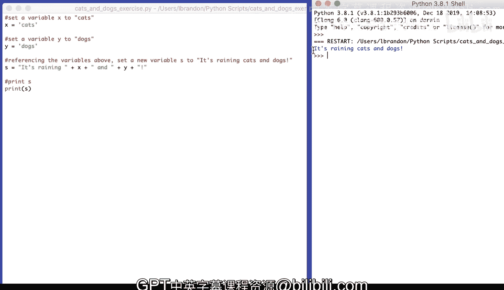

# 宾夕法尼亚大学《Python和Java编程入门1-2｜Introduction to Programming with Python and Java》中英字幕 p34 034_01_05_代码练习-猫狗数量统计.zh_en -BV13E421M7FF_p34-

Let's do a very simple exercise。First， we're going to set a variable X to cats。

Then we're going to set a variable Y to dogs。Then referencing those variables。

 we're going to set a new variable S to its raining cats and dogs。And then we're going to print S。

So， we'll set x to。cats。We'll set y to。Dogs。S will be its。Raiing。😔，And。Why。😔。

And then we're going to print S。So x is cats。 Y is dogs。

 S is this string concatenated with the value of x。Concatenated with the value of this string。

Concatenated with the value of y， concatenated with this string， and then we'll print S。It's raining。

 cats and dogs。

