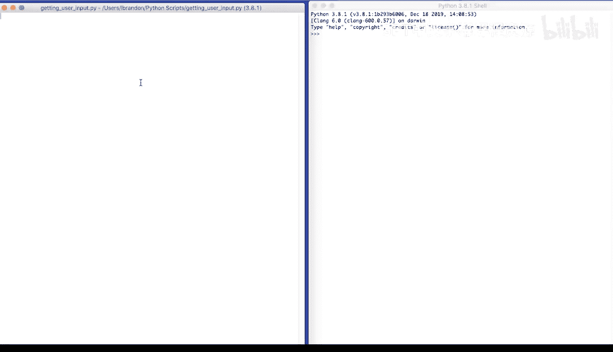
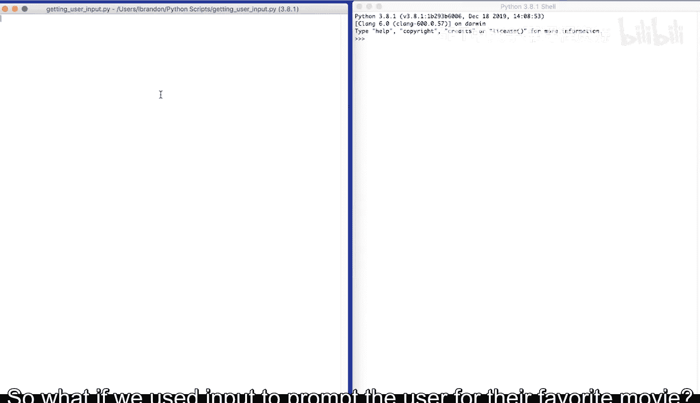
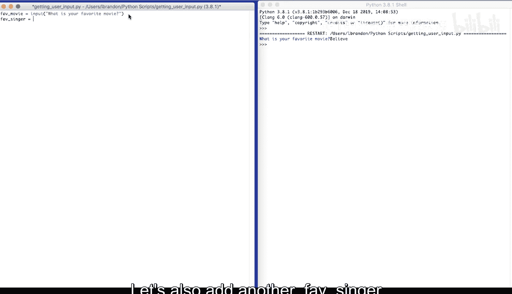
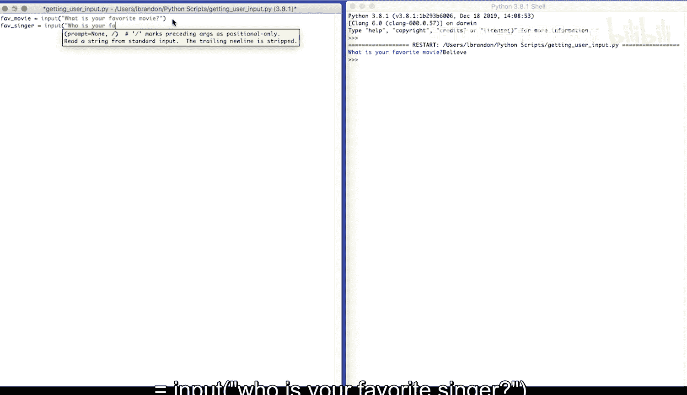
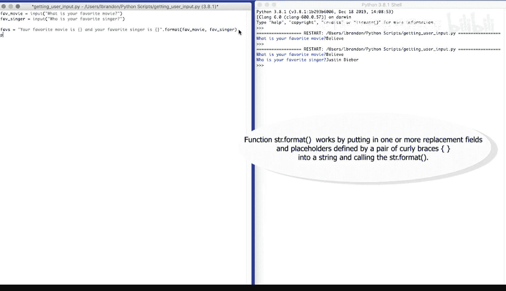
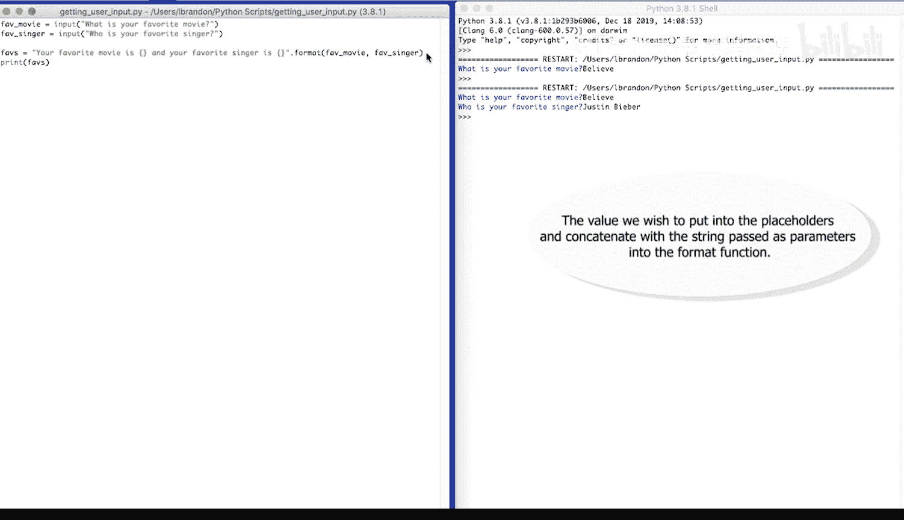
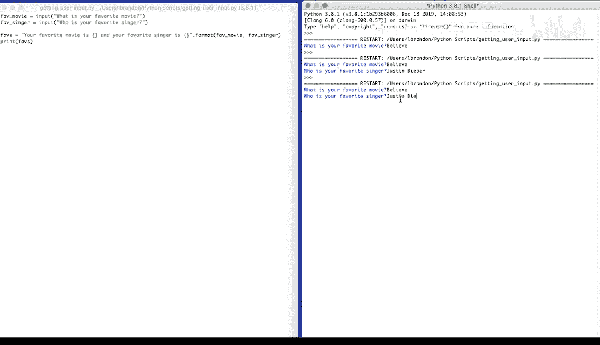
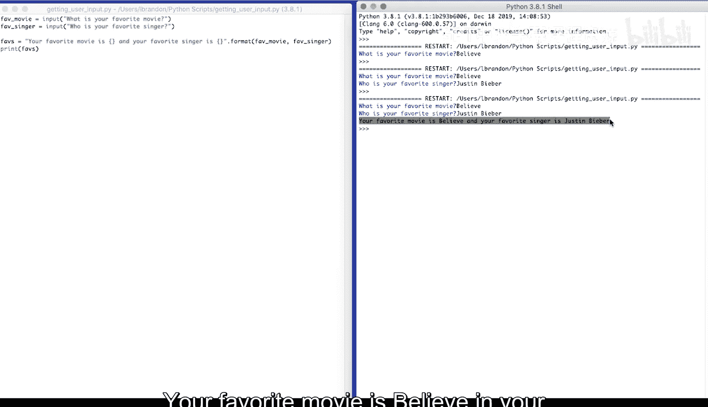
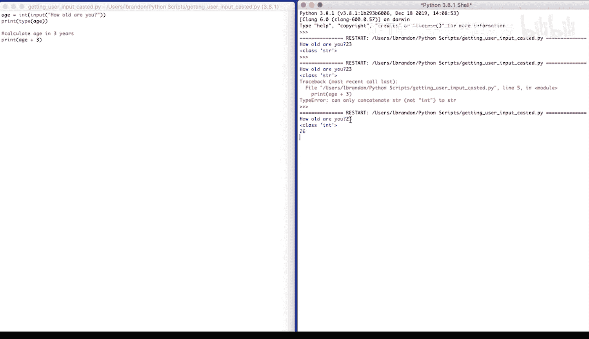

# Python和Java编程入门1-2：1.6：获取用户输入 🎯



在本节课中，我们将要学习如何在Python程序中获取用户的输入。这是创建交互式程序的基础，能让程序根据用户提供的信息动态运行。

## 概述



上一节我们介绍了变量的赋值和字符串格式化。本节中我们来看看如何让程序与用户进行交互，即获取用户在程序运行时输入的信息。

## 使用 `input()` 函数

要获取用户输入，可以使用 `input()` 函数。这个函数会暂停程序执行，等待用户在控制台输入内容，并将输入的内容作为字符串返回。

以下是 `input()` 函数的基本用法：

```python
input("提示信息")
```



例如，我们可以用 `input()` 来询问用户最喜欢的电影：



```python
input("What is your favorite movie?")
```

运行这段代码时，程序会首先在控制台打印提示信息 “What is your favorite movie?”，然后等待用户输入。用户输入的内容（例如 “Believe”）会被函数返回。

## 将输入存储到变量中

你可以根据用户输入动态地设置变量。例如，我们可以创建两个变量来分别存储用户最喜欢的电影和歌手。

以下是实现此功能的代码示例：

```python
fave_movie = input("What is your favorite movie?")
fave_singer = input("Who is your favorite singer?")
```

运行这段代码，程序会依次询问两个问题，并将用户的回答分别存储在 `fave_movie` 和 `fave_singer` 变量中。

## 组合输入信息



获取用户输入后，我们通常需要处理或展示这些信息。我们可以像之前学习的那样，使用字符串格式化来组合这些变量。



以下是如何将用户输入组合成一句完整的话：

```python
faves = "Your favorite movie is {} and your favorite singer is {}.".format(fave_movie, fave_singer)
print(faves)
```



在这段代码中，花括号 `{}` 是占位符，`.format()` 方法会将 `fave_movie` 和 `fave_singer` 的值依次插入到对应的位置。



运行完整的程序，效果如下：
1.  程序询问 “What is your favorite movie?”，用户输入 “Believe”。
2.  程序接着询问 “Who is your favorite singer?”，用户输入 “Justin Bieber”。
3.  程序最后输出组合后的句子：“Your favorite movie is Believe and your favorite singer is Justin Bieber.”

## 处理数值输入

默认情况下，`input()` 函数返回的数据类型是**字符串**。这在处理年龄、数量等数值信息时需要注意。

请看以下代码：

```python
age = input("How old are you?")
print(type(age))
```

即使用户输入了数字 “23”，`age` 变量的类型仍然是字符串。如果我们尝试进行数学计算：

```python
print(age + 3)
```

程序会报错，因为我们试图将一个字符串和一个整数相加。

为了解决这个问题，我们需要进行**类型转换**。可以使用 `int()` 函数将字符串转换为整数。

以下是修正后的代码：

```python
age = int(input("How old are you?"))  # 将输入转换为整数
print(type(age))  # 现在类型是 
print("In three years, you'll be", age + 3)
```

现在，程序可以正确计算并输出：“In three years, you'll be 26.”



## 总结

本节课中我们一起学习了Python中获取用户输入的核心方法。
我们首先介绍了 `input()` 函数的基本用法，它用于接收用户的文本输入。
接着，我们学习了如何将输入存储到变量中，并利用字符串格式化来组合和展示这些信息。
最后，我们探讨了 `input()` 函数默认返回字符串的特性，并学习了如何使用 `int()` 函数进行类型转换以处理数值计算。
掌握用户输入是创建交互式程序的关键一步。