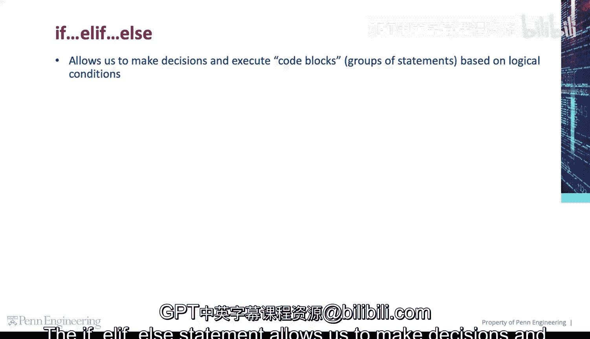
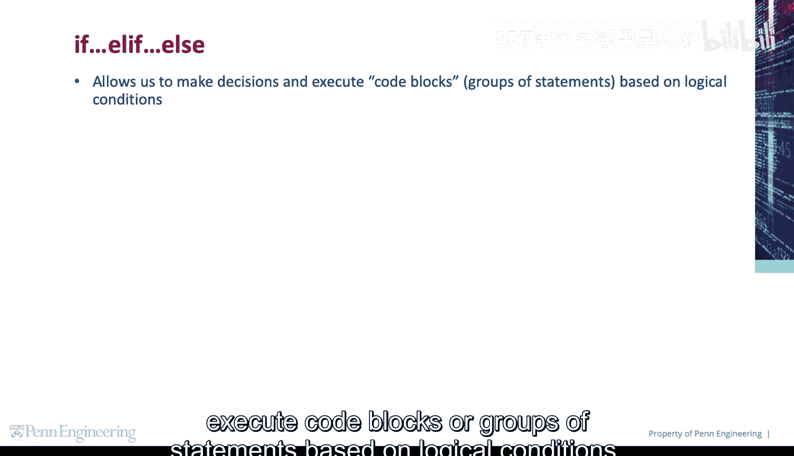
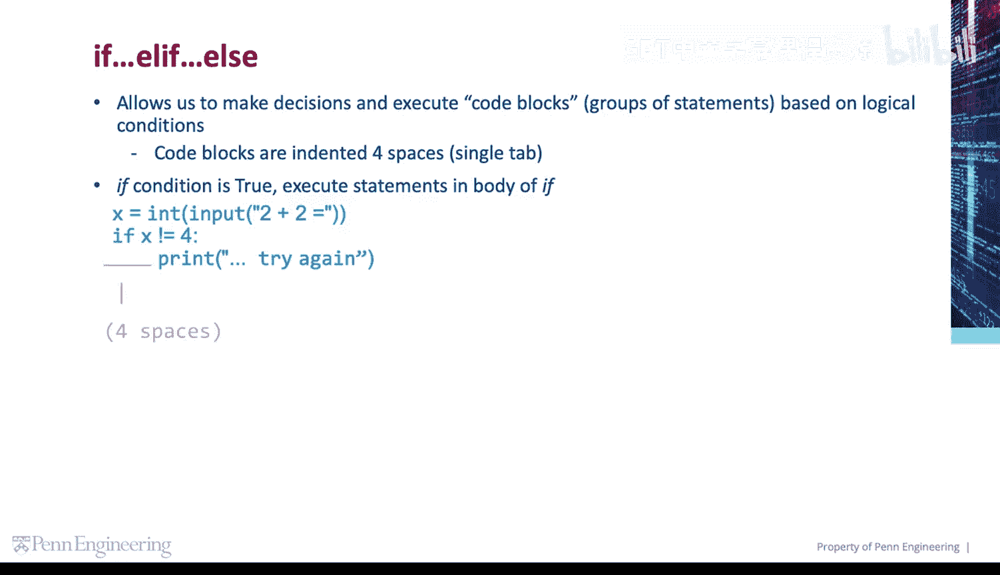
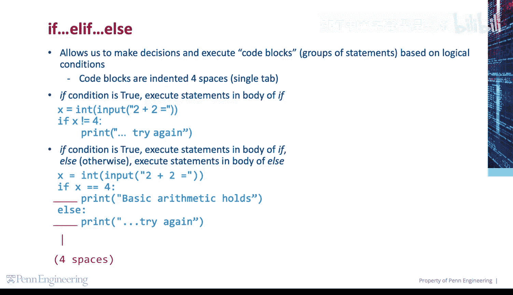
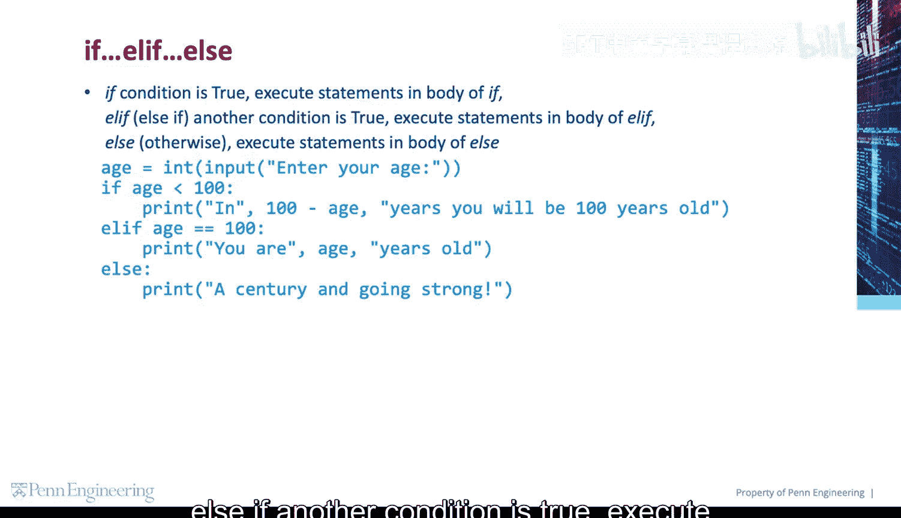
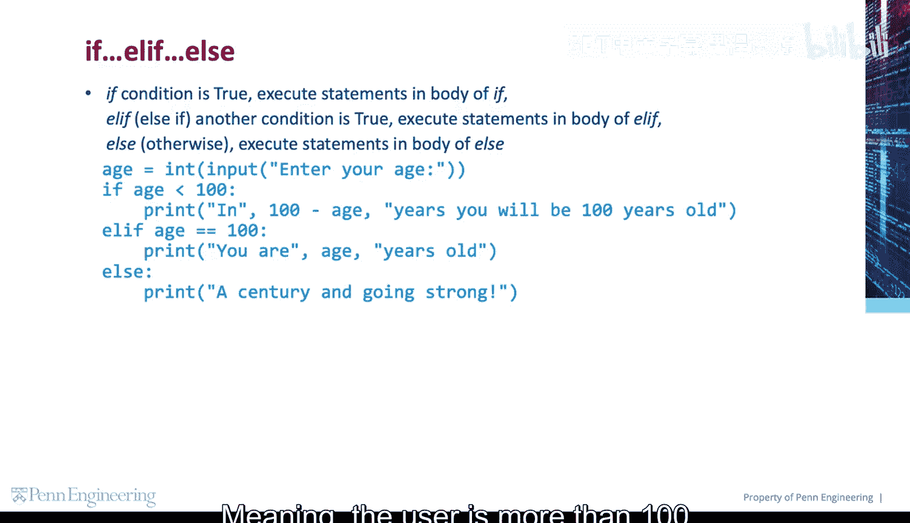
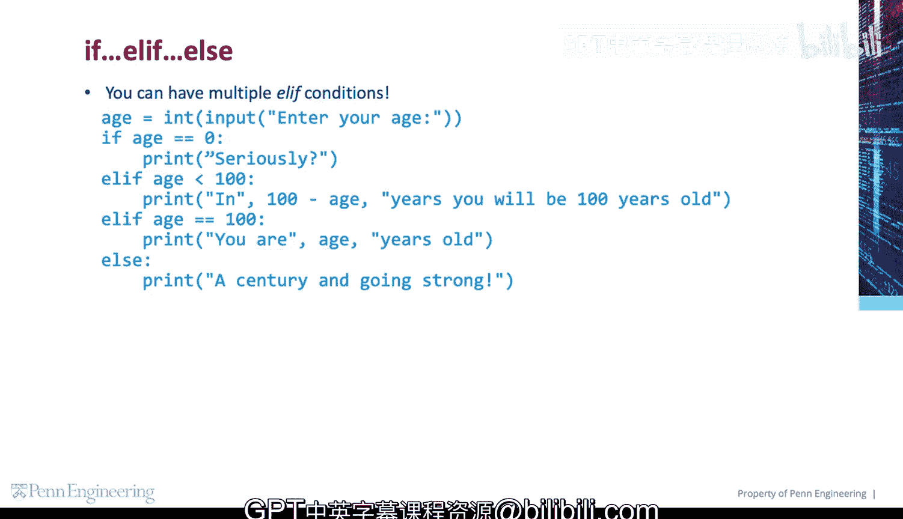

# Python编程入门：第1章：条件语句 `if-elif-else` 🧠

在本节课中，我们将要学习Python中用于程序决策的核心工具——条件语句。通过`if`、`elif`和`else`，我们可以让程序根据不同的情况执行不同的代码块。



## 概述

条件语句允许我们基于逻辑判断来决定执行哪一部分代码。这是实现程序“智能”和交互性的基础。我们将从最简单的`if`语句开始，逐步扩展到更复杂的`if-elif-else`结构。



---

## `if` 语句

`if`语句是最基本的条件判断结构。它检查一个条件是否为真，如果为真，则执行其下方缩进的代码块。

代码块通过**缩进**（通常是4个空格或一个制表符）来定义。

**基本语法公式**：
```python
if condition:
    # 如果条件为真，则执行这里的语句
```

让我们看一个例子。首先，我们获取用户输入`2+2`的结果，并将其转换为整数。然后，我们判断这个值是否不等于4。



以下是具体步骤：
1.  获取用户输入并转换为整数。
2.  使用`if`语句判断该值是否不等于4。
3.  如果条件成立，则执行缩进的代码块，打印“try again”。

```python
x = int(input(“2 + 2 = “))
if x != 4:
    print(“try again”)
```

---

## `if-else` 语句

上一节我们介绍了`if`语句，它只在条件为真时执行代码。但很多时候，我们希望在条件为假时执行另一段代码。这时就需要用到`if-else`语句。

如果`if`的条件为真，则执行`if`代码块中的语句；否则（`else`），执行`else`代码块中的语句。

**基本语法公式**：
```python
if condition:
    # 条件为真时执行的语句
else:
    # 条件为假时执行的语句
```



在下面的例子中，我们同样获取`2+2`的答案。如果答案等于4，我们打印“basic arithmetic holds”；否则，打印“try again”。

```python
x = int(input(“2 + 2 = “))
if x == 4:
    print(“basic arithmetic holds”)
else:
    print(“try again”)
```

---




## `if-elif-else` 语句

当我们需要在多个条件中进行选择时，`if-elif-else`结构就派上用场了。`elif`是“else if”的缩写，用于检查额外的条件。

程序会按顺序检查每个`if`和`elif`的条件。一旦某个条件为真，就执行对应的代码块，然后跳过整个结构的其余部分。如果所有`if`和`elif`的条件都为假，则执行`else`块。

**基本语法公式**：
```python
if condition1:
    # 条件1为真时执行
elif condition2:
    # 条件2为真时执行
else:
    # 以上条件都不为真时执行
```

假设我们询问用户的年龄，并根据不同年龄段给出不同的回应。

以下是判断逻辑：
1.  如果年龄小于100岁，执行`if`块。
2.  如果年龄等于100岁，执行`elif`块。
3.  如果以上都不满足（即年龄大于100岁），执行`else`块。



```python
age = int(input(“Please enter your age: “))
if age < 100:
    print(“You are young!”)
elif age == 100:
    print(“You are exactly one century old!”)
else:
    print(“You are wise beyond your years!”)
```

---

## 多个 `elif` 条件

你可以根据需要使用任意数量的`elif`条件来构建更精细的判断逻辑。程序会从上到下依次检查每个条件。

**扩展语法公式**：
```python
if condition1:
    # 语句
elif condition2:
    # 语句
elif condition3:
    # 语句
# ... 可以有更多 elif
else:
    # 语句
```

让我们扩展年龄判断的例子，增加更多分类。

以下是更详细的年龄分类：
*   如果年龄为0岁，打印一条特殊消息。
*   如果年龄小于100岁，打印“You are young!”。
*   如果年龄等于100岁，打印“You are exactly one century old!”。
*   如果以上条件均不满足（年龄大于100岁），则执行`else`块。

```python
age = int(input(“Please enter your age: “))
if age == 0:
    print(“Welcome to the world!”)
elif age < 100:
    print(“You are young!”)
elif age == 100:
    print(“You are exactly one century old!”)
else:
    print(“You are wise beyond your years!”)
```

---

## 总结

本节课中我们一起学习了Python条件语句的核心结构。
*   **`if`语句**：用于执行单一条件判断。
*   **`if-else`语句**：提供了条件为假时的备选执行路径。
*   **`if-elif-else`语句**：允许我们在多个互斥的条件中进行选择，是构建复杂程序逻辑的基石。



记住，代码块的界定完全依赖于**缩进**，这是Python语法的一个重要特点。通过熟练运用这些条件语句，你已经可以让你的程序根据不同的输入做出不同的反应了。