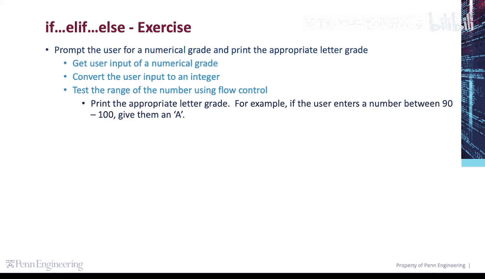
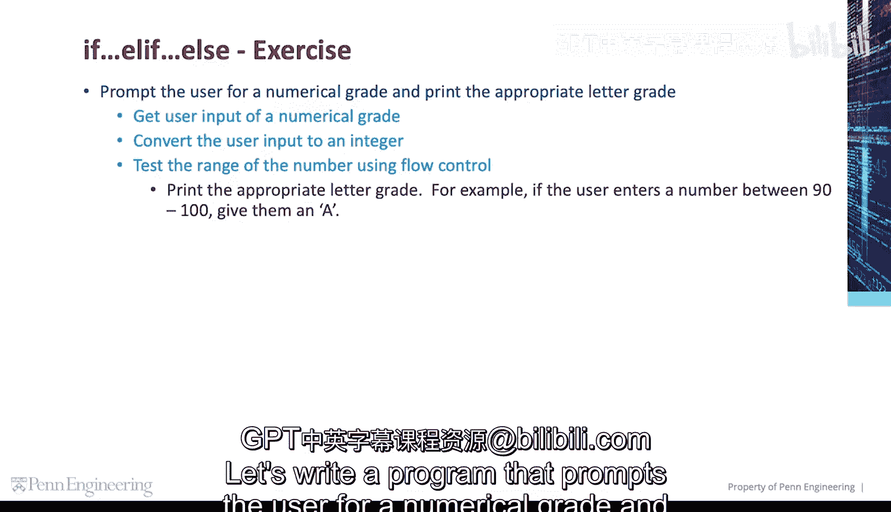
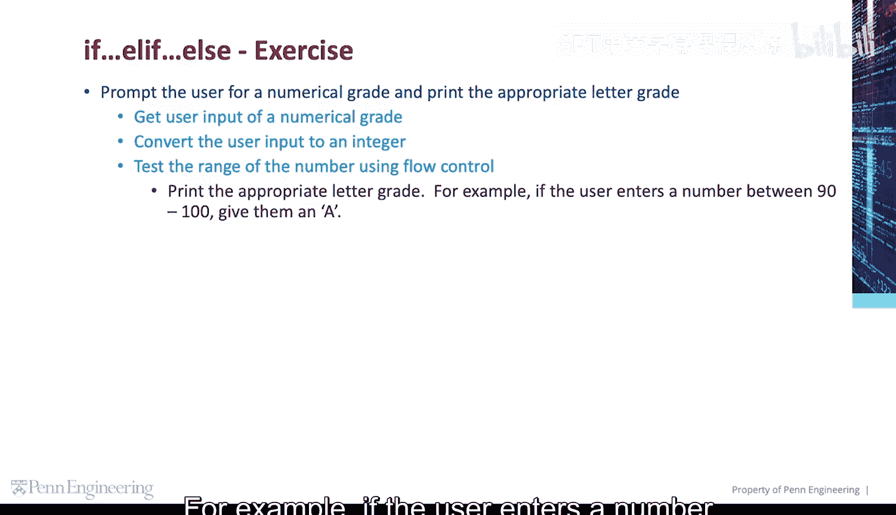
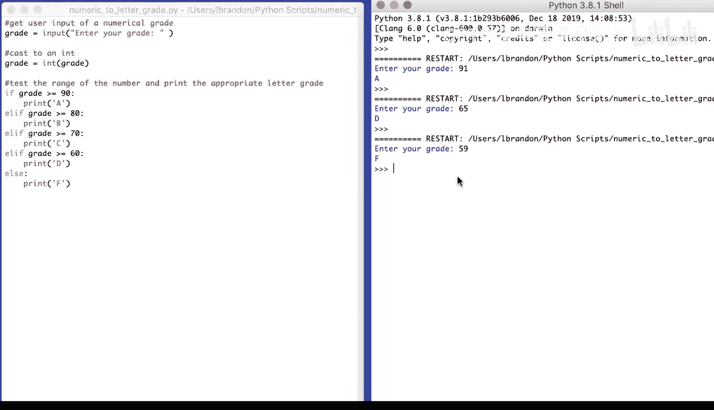

# 宾夕法尼亚大学《Python和Java编程入门1-2｜Introduction to Programming with Python and Java》中英字幕 p38 038_01_02_代码练习-数字成绩转字母等级.zh_en -BV13E421M7FF_p38-

Let's write a program that prompts the user for a numerical grade and prints the appropriate letter grade。

So first， we're going to get user input of a numerical grade。Convert the user input to an integer。

Test the range of the number using flow control。And then print the appropriate letter grade。

 For example， if the user enters a number between 90 and 100， give them an A。 So first。

 let's create a variable grade。

We'll get user input。Enter your grade。We'll cast that to an int。 So grade equals int grade。

And then we'll test the range of the number。 So let's say， if the grade。

Is greater than or equal to 90。Print。Ai。LF。Grade is greater than， or equal to 80。Print。Bi。L F。Greed。

😔，Is greater than or equal to 70。Print。😔，Xi。😔，E if。Grade is greater than or equal to 60。Print。Di。

Else。Print F。The first condition checks if the grade is greater than or equal to 90。If it is。

 it prints an A。If it fails this test， it goes to the next condition。

Is the grade greater than or equal to 80？Prince a B， if it fails that condition。

 it goes to the next one， so on and so forth until it gets to the L and print an F。

 Let's run our code。Enter your grade，91。A。Enter your grade。65。Di。Enter your grade。59。F。

