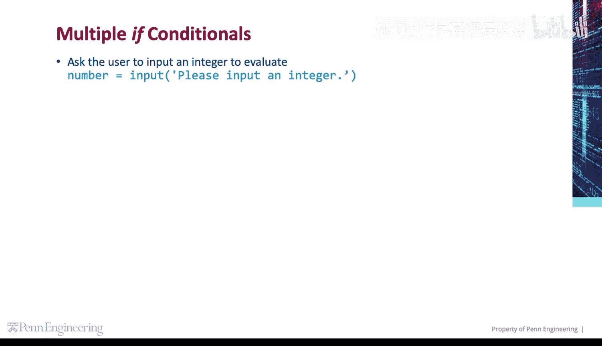
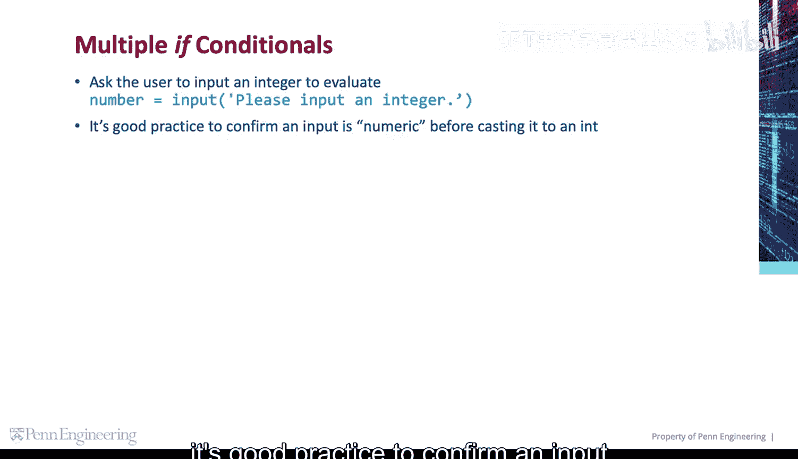
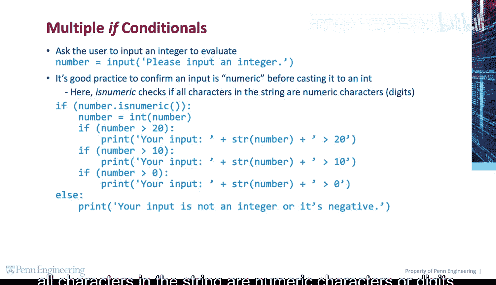
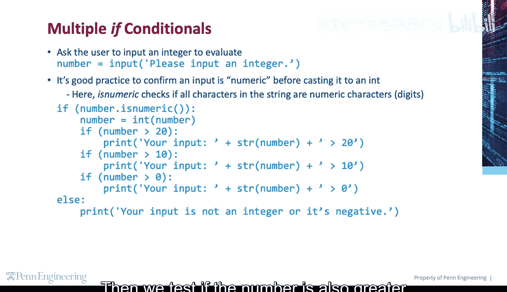
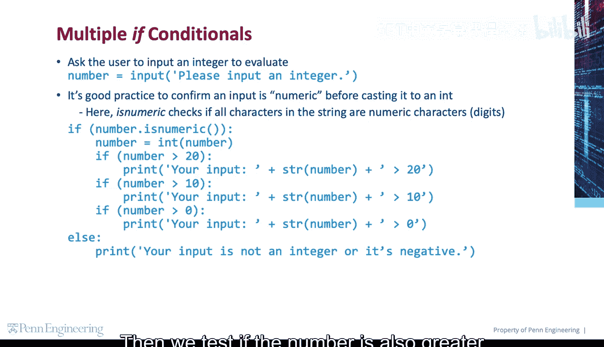
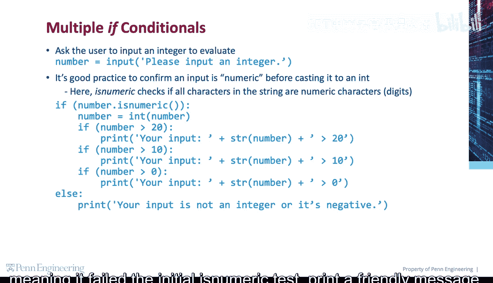
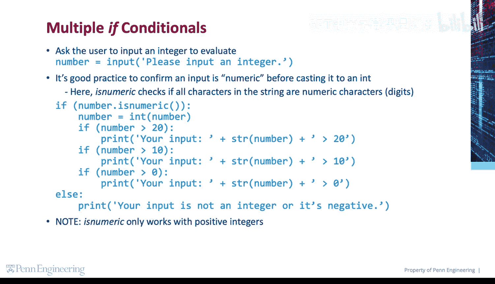

# Python和Java编程入门1-2：1.3：多重条件判断 📊

在本节课中，我们将要学习如何在程序中设置多个独立的`if`条件判断语句。我们将通过一个具体的例子，演示如何依次检查用户输入的数字是否满足一系列条件，并理解每个条件是如何被独立测试的。

## 概述

我们可以使用多个`if`条件语句，这意味着每个条件都会被单独测试。首先，程序会要求用户输入一个整数。在编程中，一个良好的实践是在将字符串转换为整数之前，先确认输入是否为数字。为此，我们可以使用字符串的`.isnumeric()`方法。

## 检查输入是否为数字

在将用户输入转换为整数之前，我们需要验证输入是否由纯数字字符组成。以下是实现此功能的代码：



```python
user_input = input("请输入一个整数：")
if user_input.isnumeric():
    number = int(user_input)
    # 后续的条件判断将在这里进行
else:
    print("输入无效，请输入一个数字。")
```



`.isnumeric()`方法会检查字符串中的所有字符是否都是数字字符。如果是，则返回`True`，我们便可以安全地将其转换为`int`类型。




## 执行多重条件判断

在确认输入是数字并完成类型转换后，我们可以运行一系列独立的`if`条件测试。每个条件都会按顺序被评估。

以下是多个独立`if`语句的示例：

```python
if number > 20:
    print(f"数字大于20: {number}")


if number > 10:
    print(f"数字大于10: {number}")

if number > 0:
    print(f"数字大于0: {number}")
```





请注意，这些条件是独立的。一个数字如果大于20，它同样也会满足大于10和大于0的条件，因此所有相关的打印语句都会执行。

## 处理非数字输入


如果用户的输入未能通过最初的`.isnumeric()`测试，程序将跳转到`else`分支，并打印一条友好的错误信息。

```python
else:
    print("抱歉，您输入的不是一个有效的正整数。")
```



## 重要注意事项


需要特别注意的是，`.isnumeric()`方法仅对**正整数**有效。它无法识别负号（“-”）或小数点（“.”），因此不能用于检查负数或浮点数。

## 总结



本节课中我们一起学习了多重条件判断。我们了解了如何使用多个独立的`if`语句来依次测试不同条件，并掌握了在类型转换前使用`.isnumeric()`方法验证用户输入是否为数字的良好实践。记住，每个`if`语句都是独立执行的，并且`.isnumeric()`仅适用于检查正整数。