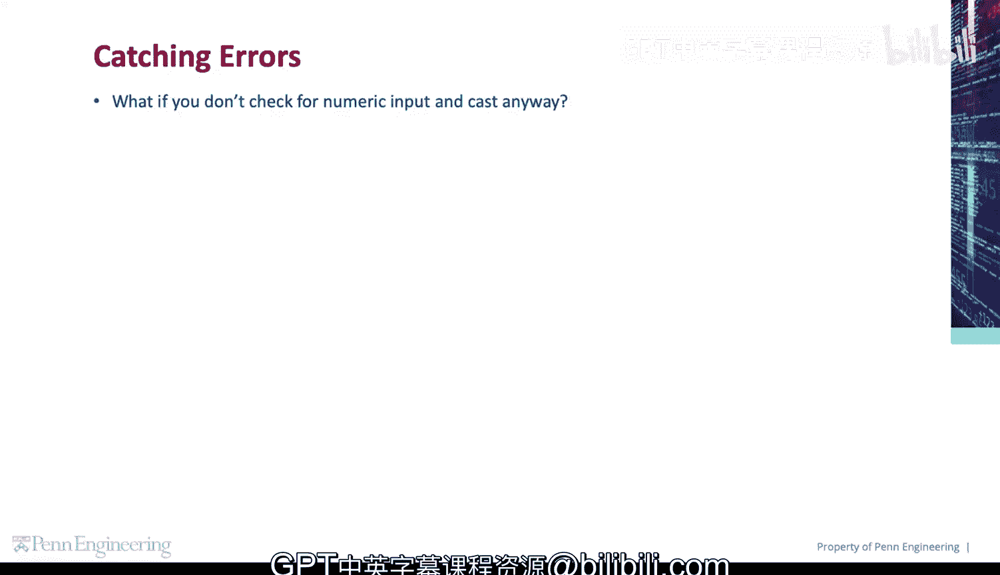
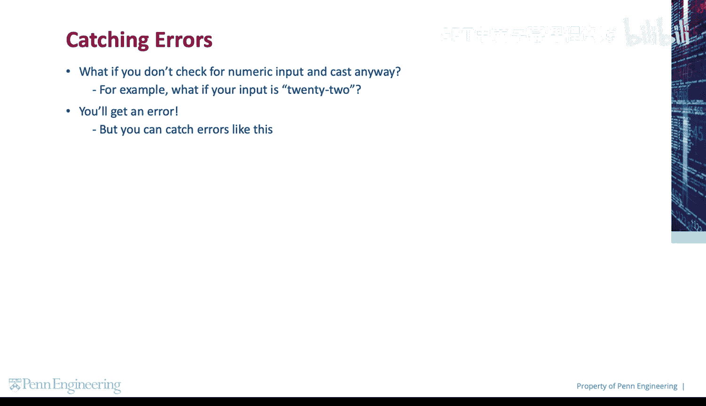
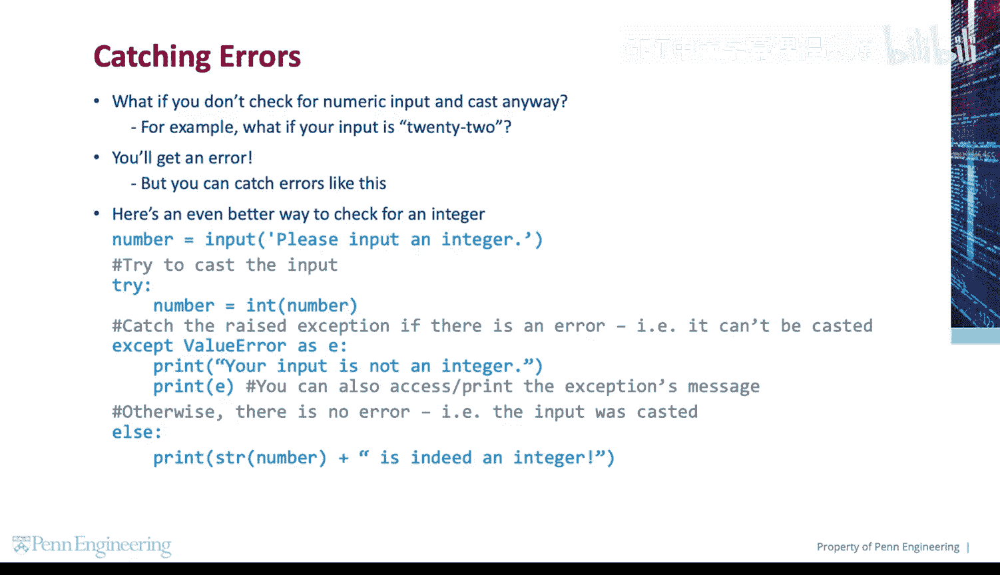
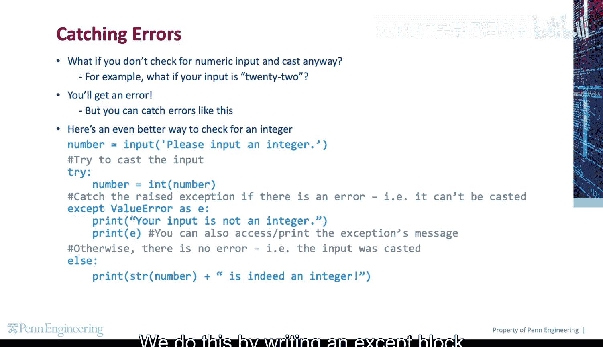
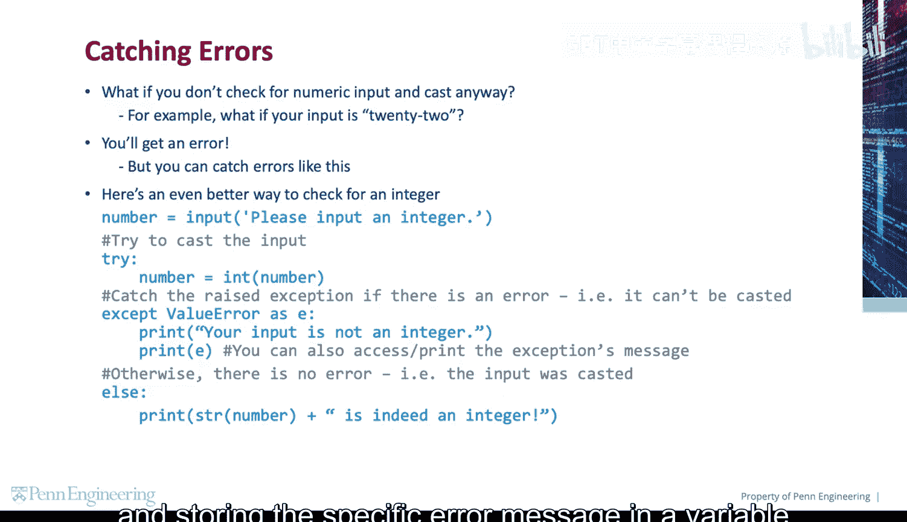
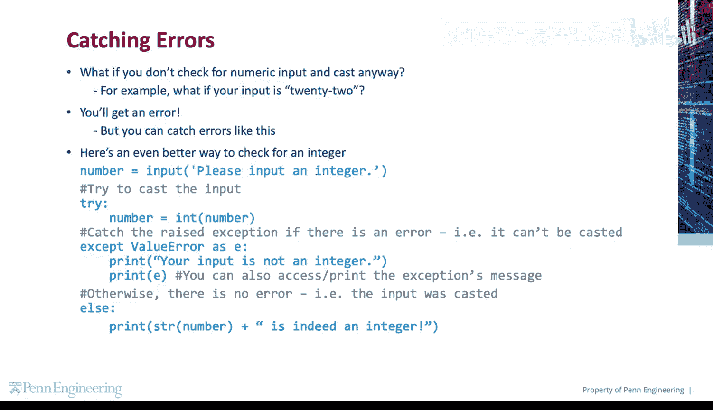
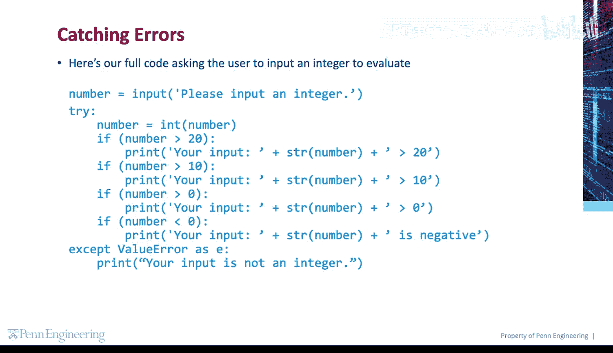
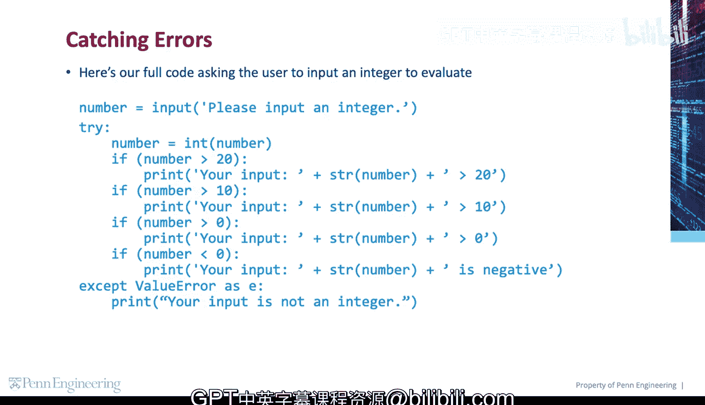

# 宾夕法尼亚大学《Python和Java编程入门1-2｜Introduction to Programming with Python and Java》中英字幕 p40 040_01_01_验证用户输入.zh_en -BV13E421M7FF_p40-

So what if you don't check for numeric input and try to cast anyway， For example。

 what if your input is the string22。If you try to cast to an int， you'll get an error。

But you can catch errors like this。 Here's an even better way to check for an integer。

 before casting。

First， we get the user input and try to cast it to an int。 We do this in a try block。

 If there's an error， meaning the value can't be casted to an int， we catch the raised exception。

We do this by writing an accept block and storing the specific error message in a variable E。

We can then print a friendly message and or access and print the message。😡，Otherwise。

 there is no error meaning the input was successfully casted to an int。

 and we print the value itself。

Here's our reworked original code asking the user to input an integer to evaluate。😡。

Note the else clause is optional and not really needed here， so we're leaving it out。

