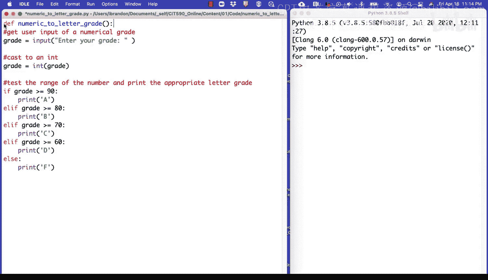
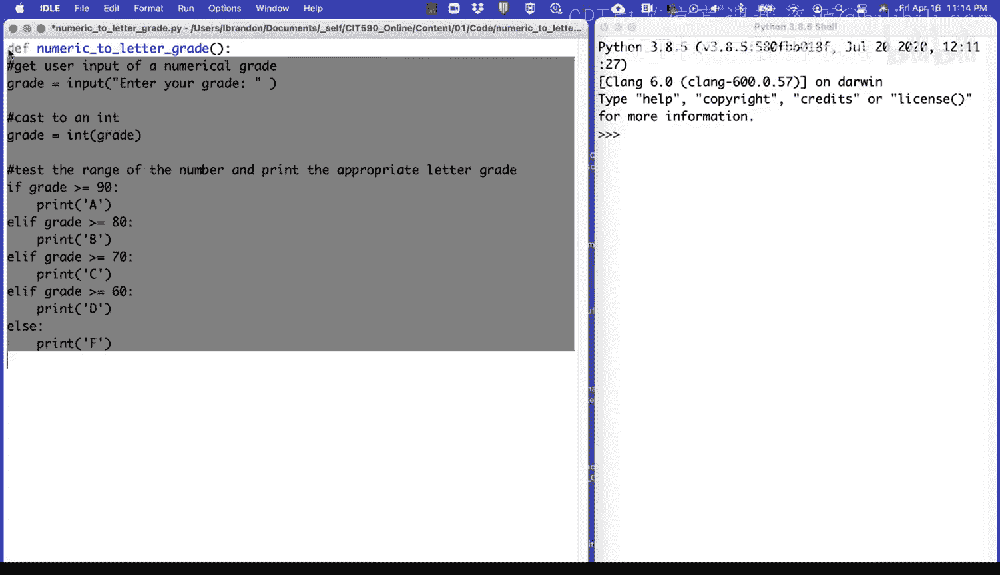
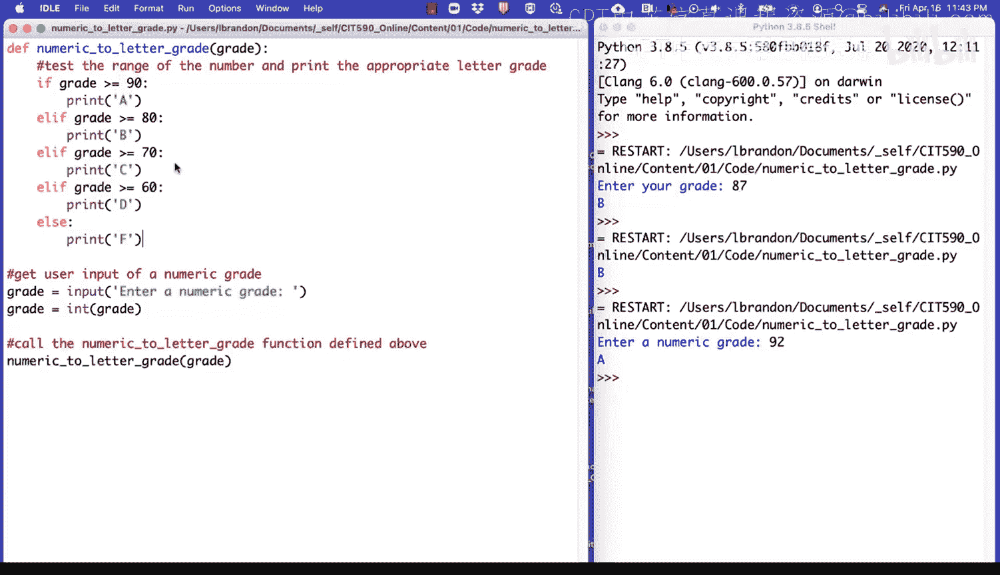

# 宾夕法尼亚大学《Python和Java编程入门1-2｜Introduction to Programming with Python and Java》中英字幕 p42 042_01_02_编程演示-创建成绩转换函数.zh_en -BV13E421M7FF_p42-

Recall the exercise where we prompted the user for a numerical grade and printed the appropriate letter grade。

Let's take the code for that exercise and convert it so that it uses a user defined function。

Here's the code for the exercise。Recall that we first get user input of a numerical grade。

Then we cast the value to an int。And then we test the range of the number and print the appropriate letter grade。

Let's take all of this code and put it into a user defined function。😡，So I'll define a function。Tf。

Nummeric。Two letter grade。I use parentheses。

Followed by a colon， and then I'll take all of the code。And I'll indent it。

And now I can call the function to run all of this code。Nummeric。2。😔，Lettter。G。Parrenheses。

Could run my code。Ento your grade。87。B。So here we call the numeric to letter grade function。

Defined above。Here， when we call the function， it runs all of the code inside of the body of the function。

Another way to do this is to define the function with a single parameter。Let's call it grade。

And then let's remove this code。From the function。Now we can pass a specific value to the function to convert to a letter grade。

For example， I can pass 87 to the function this way。If I run the function。I could see that I get a B。

I could also use the code to get user input of a grade and pass that value to the function to convert to a letter grade。

 So let me do that here。Grade equals input。Enter。A numeric grade。Well cast it to an int。

And then we'll pass this value。To the function here。So get user input of a。Nummeric grade。

Let me run my code again。Enter a numeric grade。92。A。I get the user input here。I cast it to an int。

 I pass the value to the numeric to letter grade function here。It runs the code。

I get the user input here。I cast it to an int。I pass that value as an argument to the function。

The function runs。 It takes in the given parameter。

 and then it runs the code in the body of the function。

