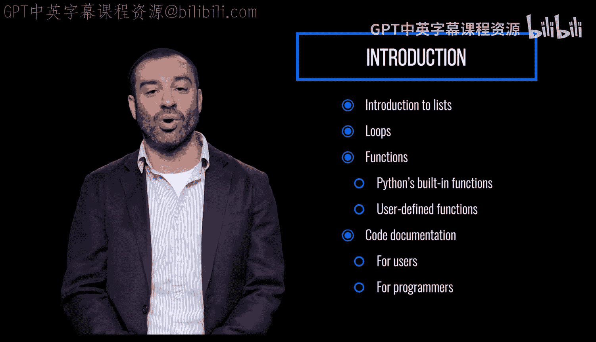

# 宾夕法尼亚大学《Python和Java编程入门1-2｜Introduction to Programming with Python and Java》中英字幕 p43 043_02_01_模块介绍_2.zh_en -BV13E421M7FF_p43-

We'll start this module with a brief intro to lists。

 one of Python's most commonly used data structures。

We'll learn just enough to get us started with loops。

 which are used to repeat a process or run a block of code multiple times。😡，We'll get into functions。

 which are blocks of organized code used to perform a single related action。

We'll review some of Python's built in functions and learn how to design our own user defineded functions to use as building blocks in our own programs along the way。

 will learn best practices for documenting our code for two different audiences。

 the users who are using our code and want to understand it at a high level and the programmers who are reading it and want to know how it works。

😡。

