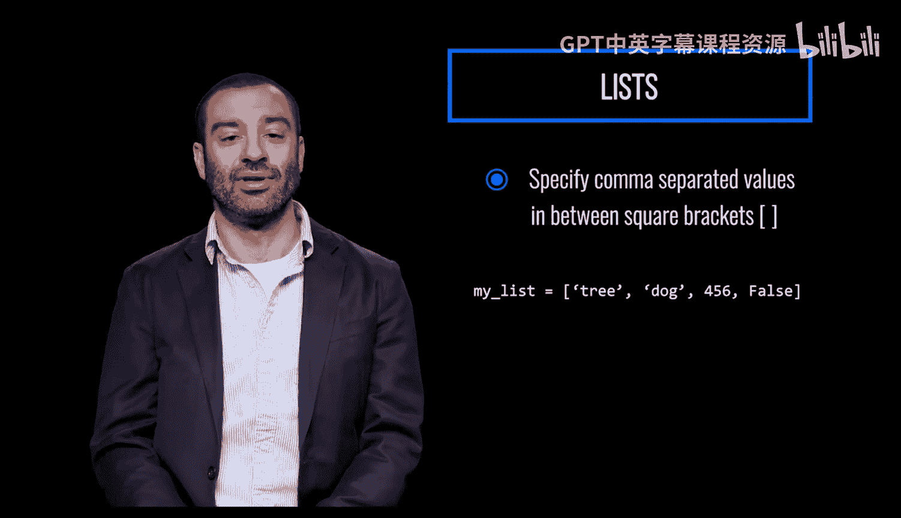
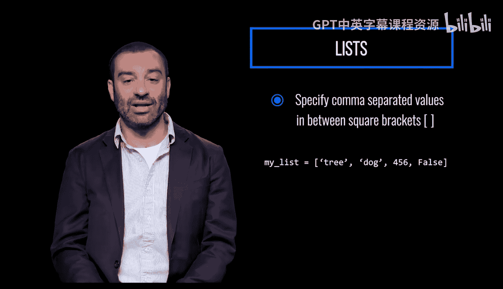

# Python和Java编程入门1-2：044：创建列表 📝

在本节课中，我们将要学习Python中一种非常重要的数据结构——列表。我们将了解列表是什么，它的核心特性，以及如何创建和访问列表中的元素。


---

## 什么是列表？ 🤔

列表是Python中的一种数据结构。列表是最常用的序列类型。

列表是**可变**的，这意味着一旦列表被定义，其中的单个元素可以被更改。


---


## 如何创建列表？ 🛠️

上一节我们介绍了列表的基本概念，本节中我们来看看如何创建一个列表。


要创建一个列表，需要在方括号 `[]` 内指定用逗号分隔的值。

创建列表的通用语法如下：
```python
my_list = [value1, value2, value3, ...]
```

以下是创建列表时需要注意的几个要点：
*   列表中可以包含不同类型的值。
*   列表中的每个项目都被分配一个索引值，索引从 **0** 开始。

---



## 总结 📚



本节课中我们一起学习了Python列表的基础知识。我们了解到列表是一种可变且常用的序列数据结构。我们学会了使用方括号和逗号来创建列表，并知道了列表可以包含混合类型的数据，其元素通过从0开始的索引进行访问。掌握列表的创建是使用Python进行数据组织和处理的第一步。