# 宾夕法尼亚大学《Python和Java编程入门1-2｜Introduction to Programming with Python and Java》中英字幕 p45 045_02_04_更新列表.zh_en -BV13E421M7FF_p45-

Let's create a list with some random elements and store it in variable listist1。😡。

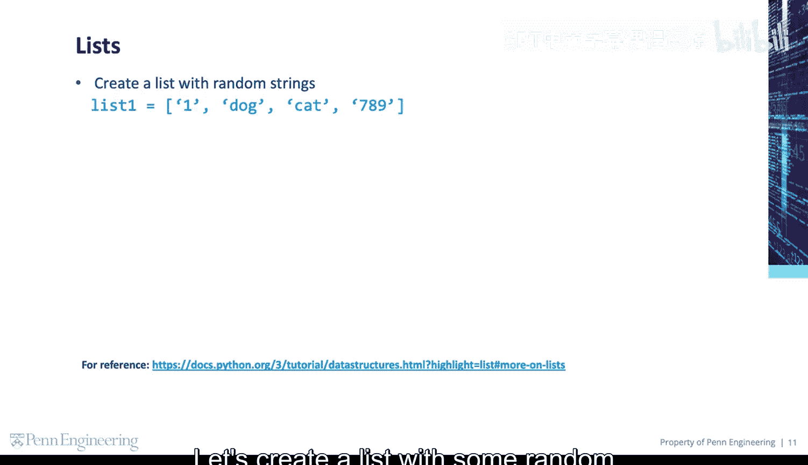

We can print the list。We can also get and print the length of the list by using the built in Python LN function。

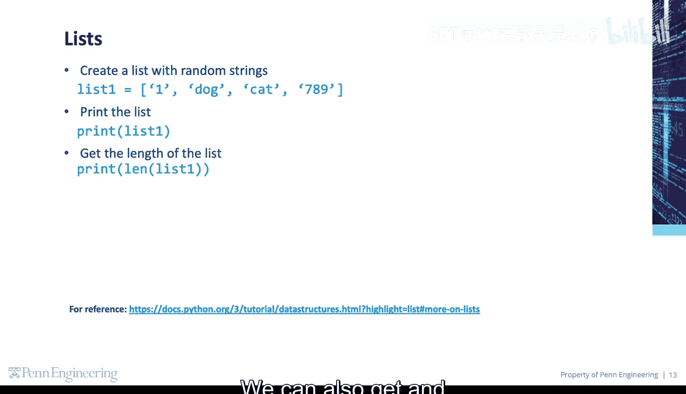

This returns the length of the list or the number of items in the list。

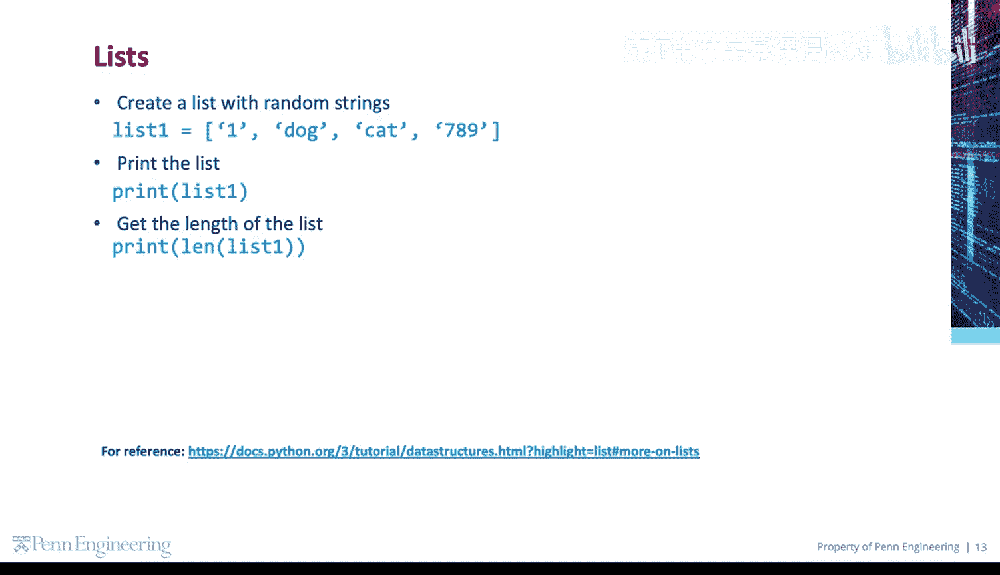

We can get specific items in a list。

Here we get and print the second item in the list by using index 1 inside of square brackets。

Remember that list item indexes start at 0。 so index 1 will give us the second item in the list。

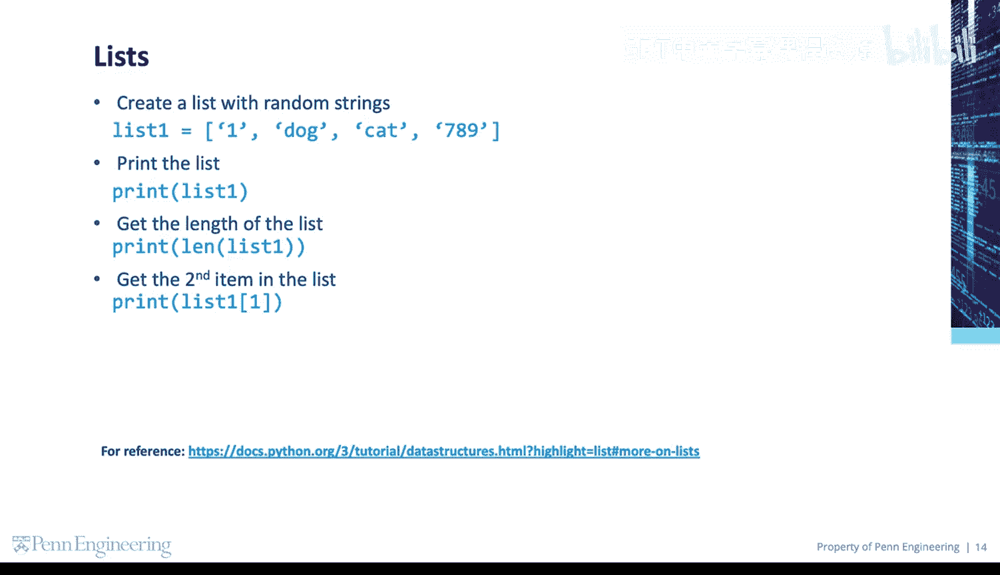

Here we try to get the fifth item in the list。Note that this item doesn't exist since we only have four total items in the list。

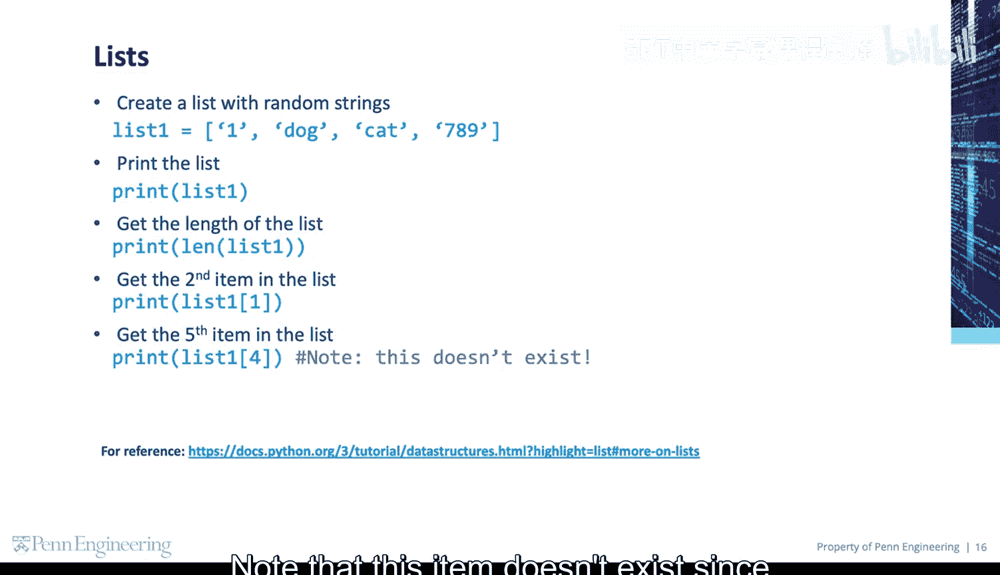

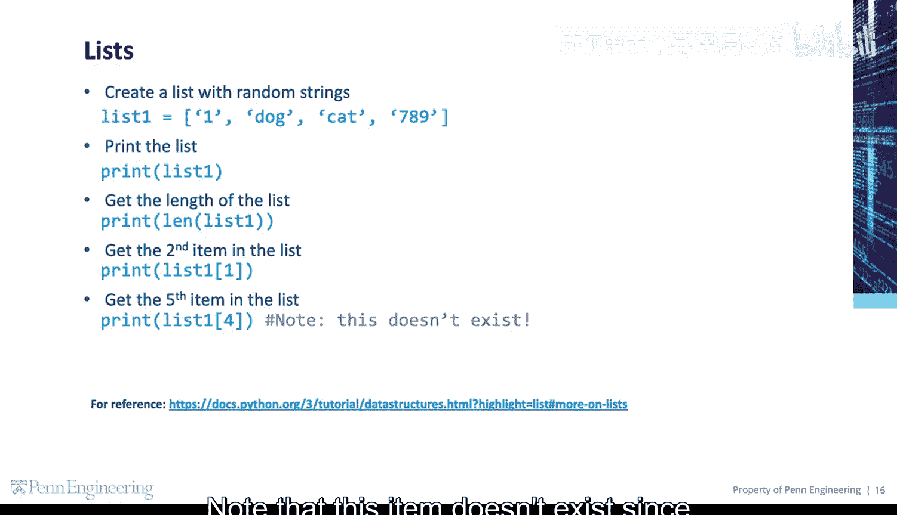

In this case， Python will give us a list index error。

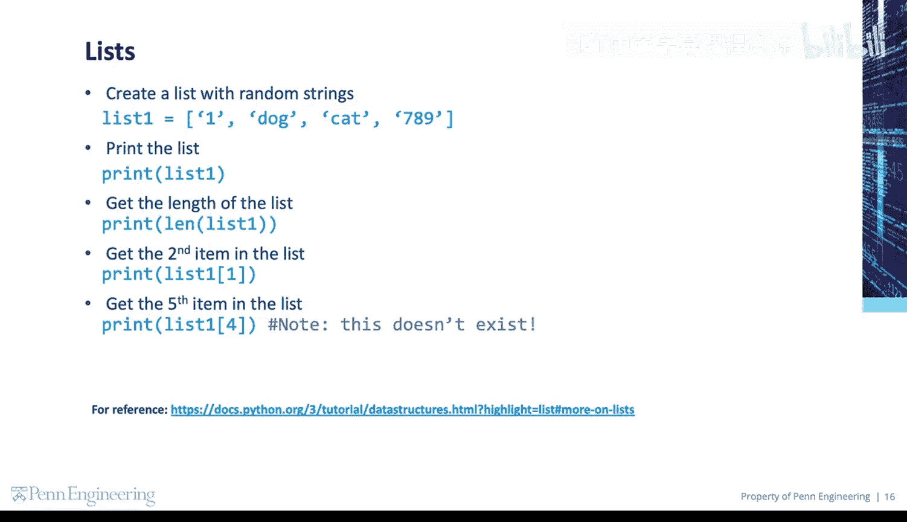

You can add items to a list by using the append method or remove items from a list using the P method。

😡。

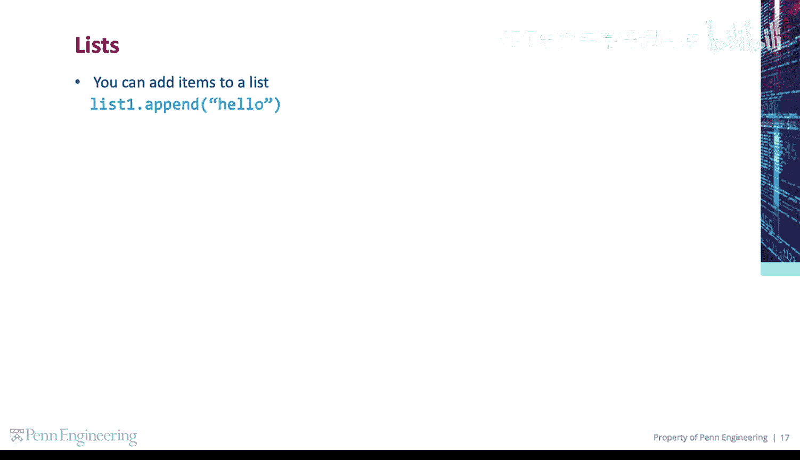

If you use P without an index argument， it will remove the last item in the list。

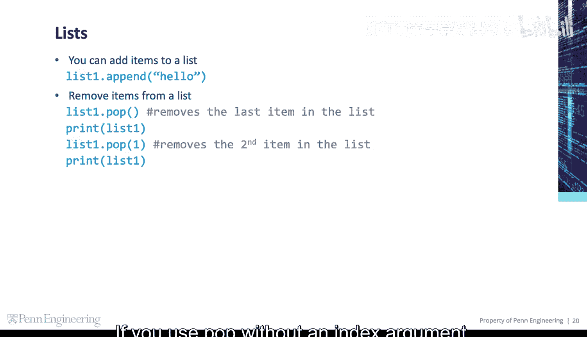

If you use P with an index argument， it will remove the item at that specific index location。

This removes the second item in the list。

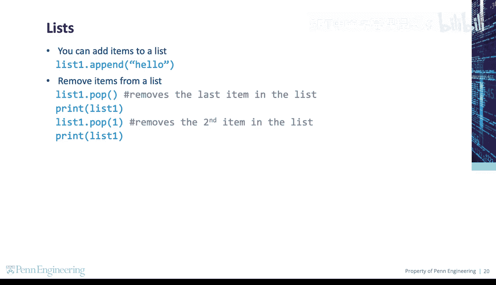

You can also check to see if a specific item is in a list。

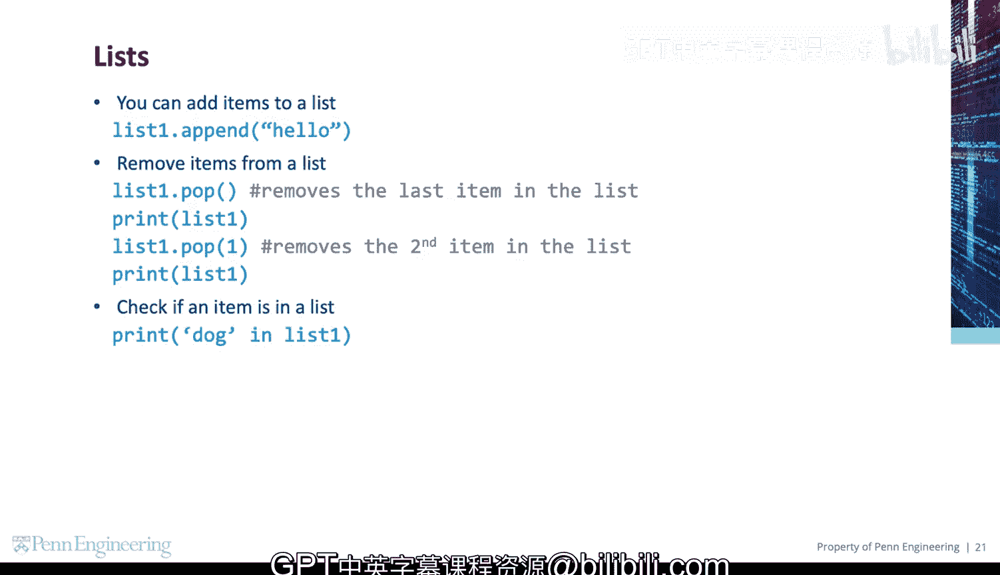

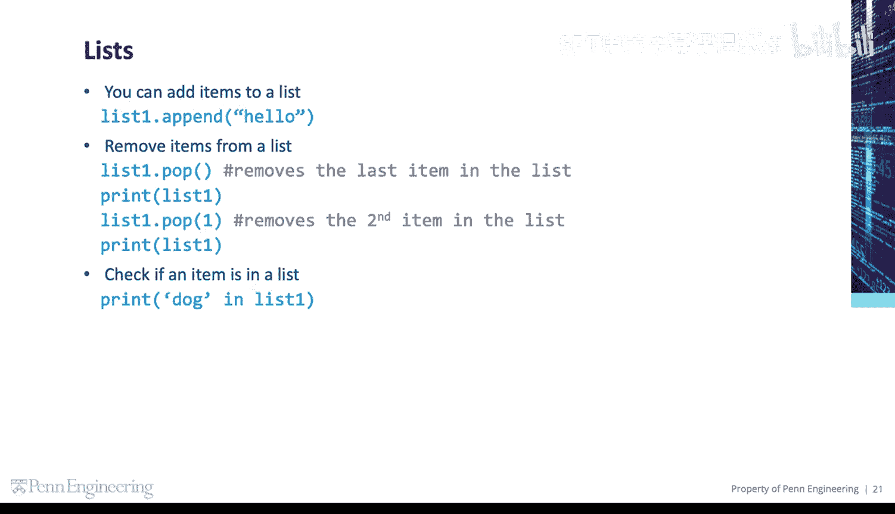