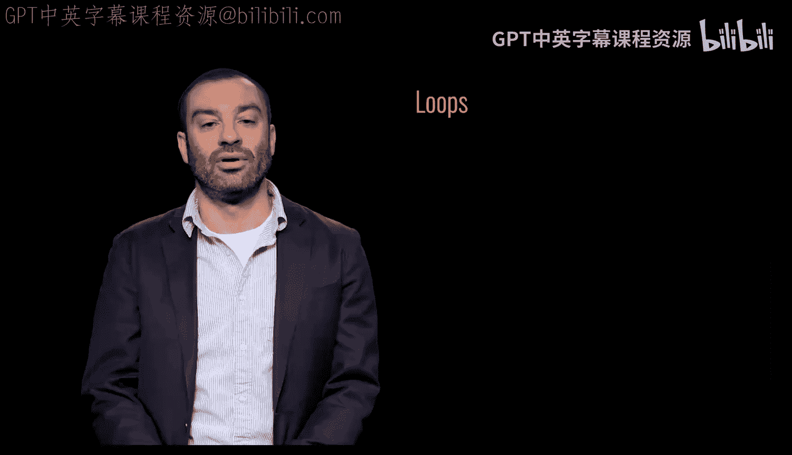
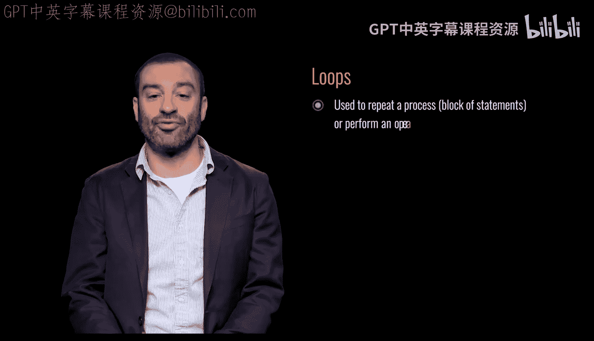
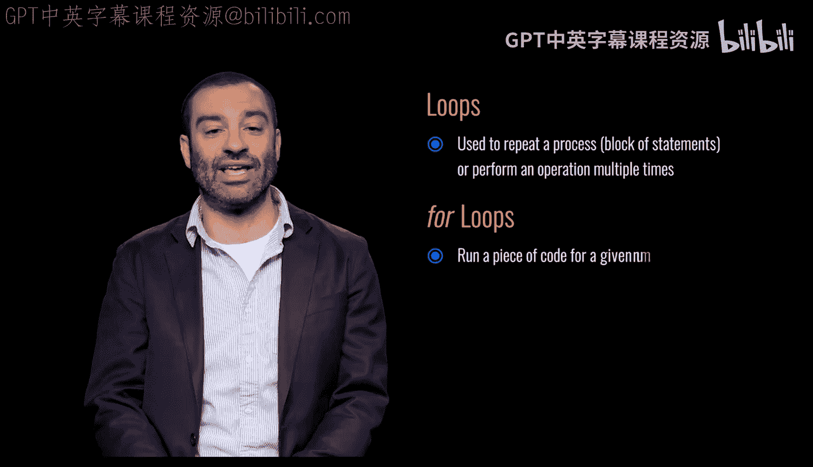
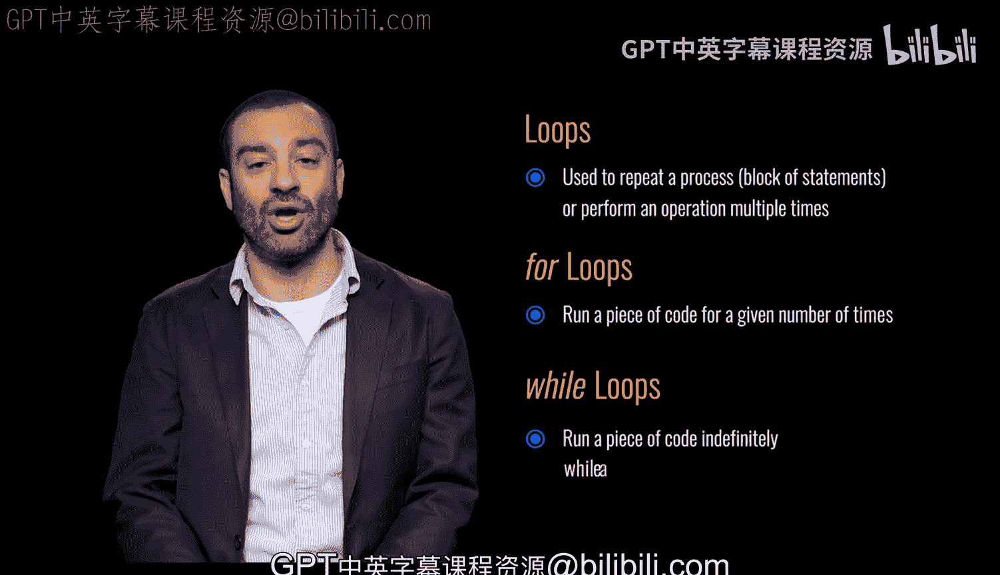

# Python和Java编程入门1-2：1：循环类型 🔄

在本节课中，我们将要学习编程中一个非常基础且强大的概念——循环。循环允许我们重复执行一段代码，从而高效地处理重复性任务。我们将重点介绍两种主要的循环类型：`for`循环和`while`循环，并理解它们各自的工作原理和适用场景。

## 什么是循环？ 🔁



循环用于重复一个过程、一段代码块，或者多次执行某个操作。通过使用循环，我们可以避免编写大量重复的代码，使程序更加简洁和高效。

## 循环的两种主要类型

上一节我们介绍了循环的基本概念，本节中我们来看看两种具体的循环类型。理解它们的区别是掌握循环的关键。

以下是两种主要的循环类型：

*   **`for`循环**：这种循环会运行一段代码**指定的次数**。它通常在我们提前知道需要重复多少次时使用。
*   **`while`循环**：这种循环会**持续地**运行一段代码，**只要**某个条件被满足。它通常在我们不确定需要重复多少次，但知道何时应该停止时使用。

## `for`循环详解

`for`循环的核心思想是“遍历”。它常用于遍历一个序列（如列表、字符串）或执行固定次数的操作。

在Python中，`for`循环的基本语法如下：
```python
for 变量 in 序列:
    # 要重复执行的代码块
```
例如，遍历一个数字列表并打印每个数字：
```python
for number in [1, 2, 3, 4, 5]:
    print(number)
```
这段代码会依次将列表中的每个数字赋值给变量`number`，然后执行`print(number)`，总共执行5次。



## `while`循环详解

`while`循环的核心是“条件”。只要条件为真，循环体内的代码就会一直执行。



在Python中，`while`循环的基本语法如下：
```python
while 条件:
    # 要重复执行的代码块
```
例如，当计数器小于5时，持续打印并增加计数器的值：
```python
count = 0
while count < 5:
    print(count)
    count = count + 1
```
这段代码会先检查`count < 5`是否为真。如果为真，则执行打印和增加`count`的操作，然后再次检查条件，直到`count`不再小于5为止。



## 总结

本节课中我们一起学习了编程中的循环结构。我们了解到，**循环用于重复执行代码**。我们重点探讨了两种循环：**`for`循环用于执行指定次数的重复**，而**`while`循环则在满足条件时持续重复**。理解何时使用`for`循环，何时使用`while`循环，是编写高效、清晰代码的重要一步。