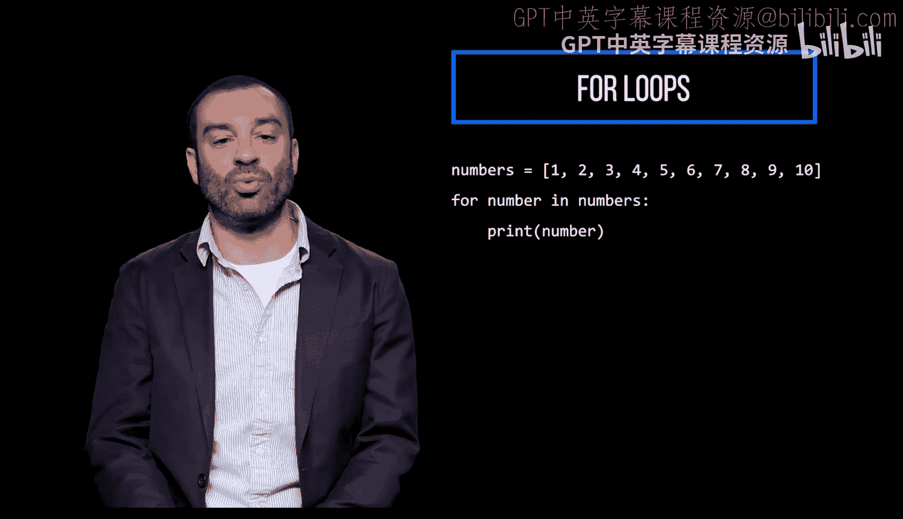
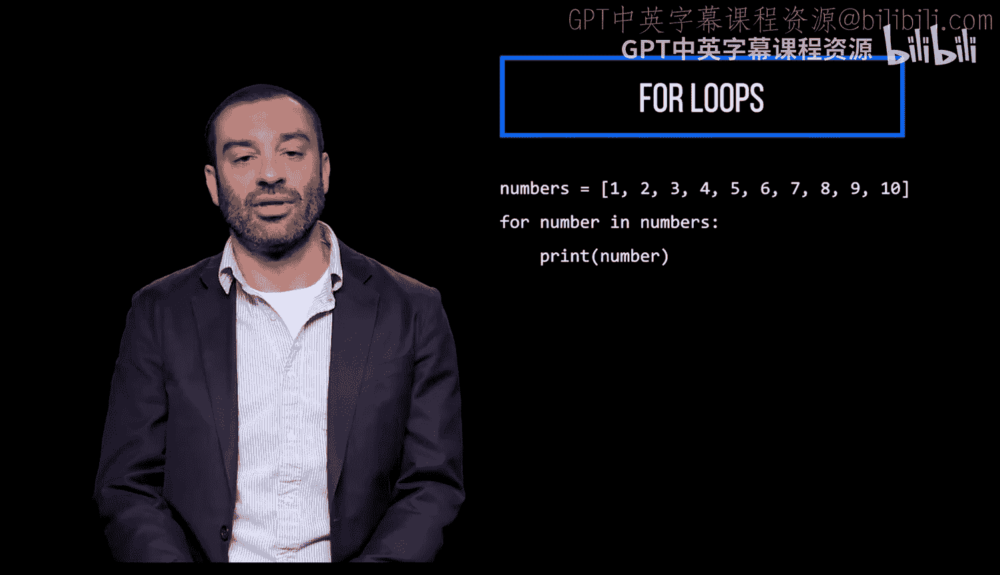
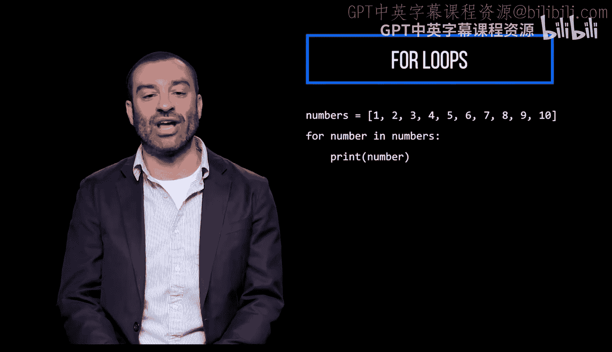
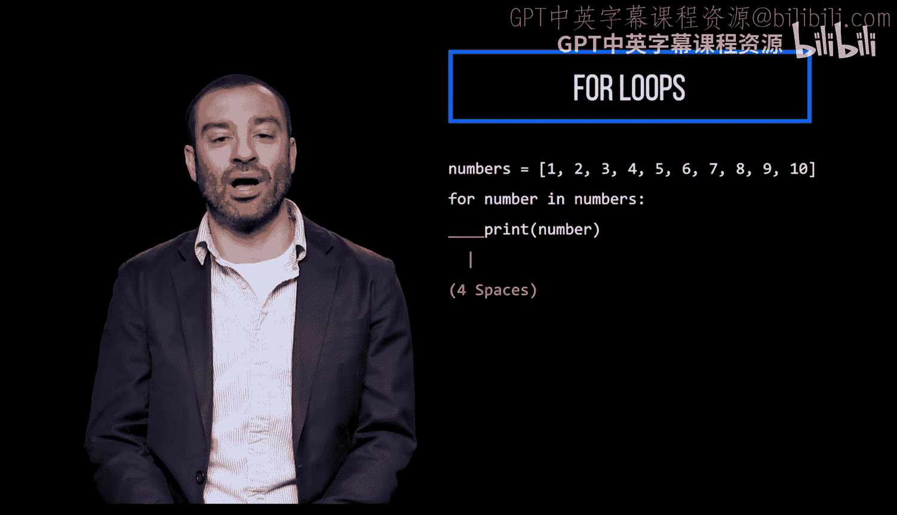
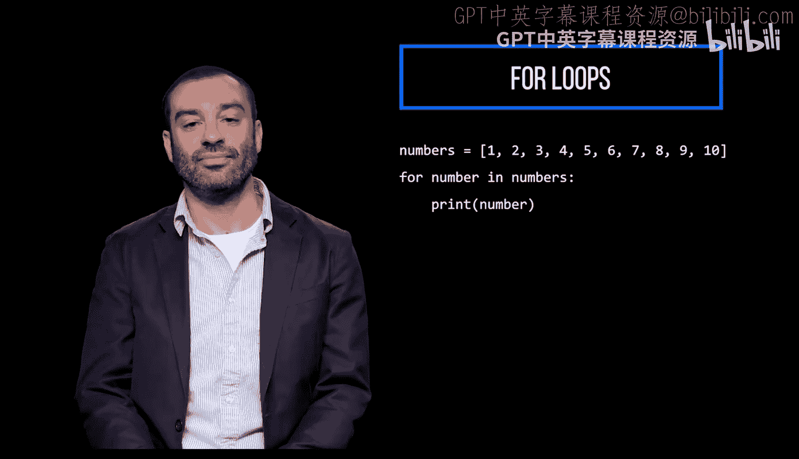
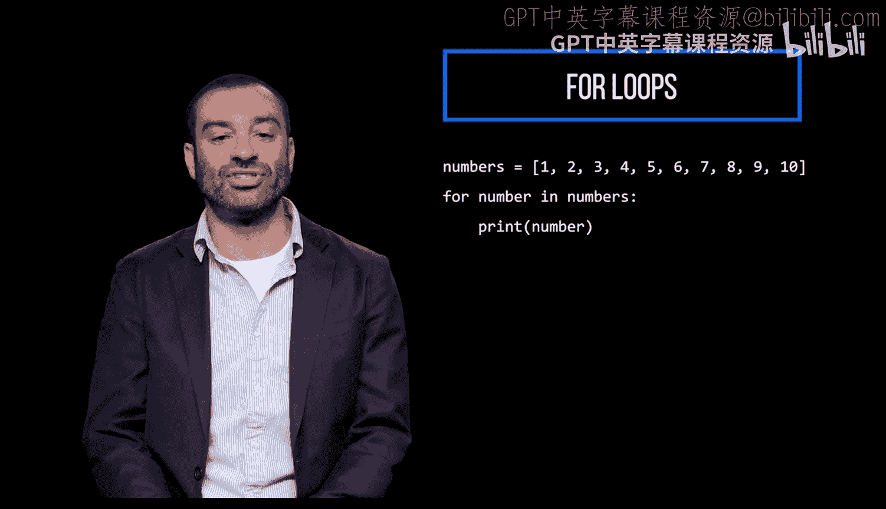
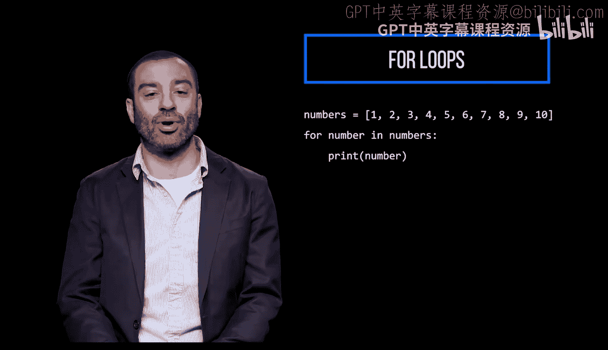
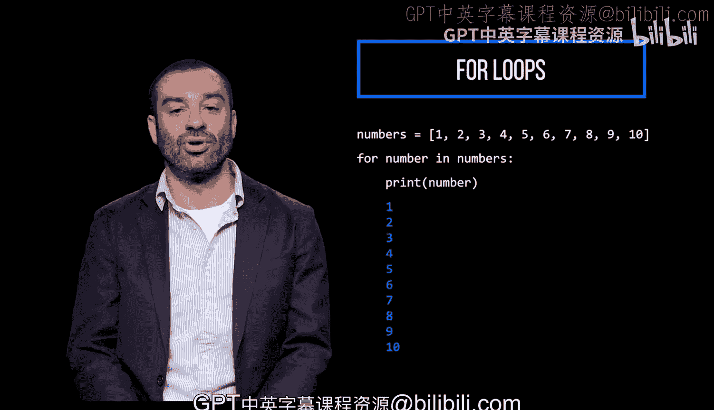

# Python和Java编程入门1-2：047_02_01：指定次数执行代码 🔄


在本节课中，我们将要学习如何使用 `for` 循环来让一段代码执行指定的次数。这是编程中实现重复任务的基础方法。

## 使用列表进行迭代


上一节我们介绍了循环的概念，本节中我们来看看如何具体使用 `for` 循环。一种常见的方法是迭代一个列表。



以下是一个定义数字列表并存储到变量中的例子：

```python
numbers = [1, 2, 3, 4, 5, 6, 7, 8, 9, 10]
```



## `for` 循环的结构



`for` 语句表明我们正在遍历列表，或者说，会依次处理列表中的每一个元素。

代码的逻辑可以理解为：对于列表中的每一个项目，执行缩进代码块中的操作。




以下是 `for` 循环的基本语法结构：



```python
for item in list:
    # 执行的操作
```

## 循环体与迭代变量



在这个例子中，我们执行的操作是打印出当前的项目本身。

在 `for` 语句中，我们使用 `number` 来指代列表中的每一个项目，这被称为**迭代变量**或**哑变量**。



这是一种指代我们当前正在处理的列表元素的方式。需要注意的是，这个迭代变量的名称可以是任何有效的标识符，例如 `nu` 或 `n`。


```python
for nu in numbers:
    print(nu)
```

## 循环的执行过程


这个循环会遍历整个列表，并运行其内部的代码块10次（因为列表有10个元素）。如果我们运行这段代码，将会看到它依次打印出列表中的每一个数字。



本节课中我们一起学习了如何使用 `for` 循环遍历列表来执行指定次数的代码。我们了解了循环的基本结构、迭代变量的作用，以及如何通过遍历列表元素来控制代码的执行次数。这是自动化重复任务的第一步。